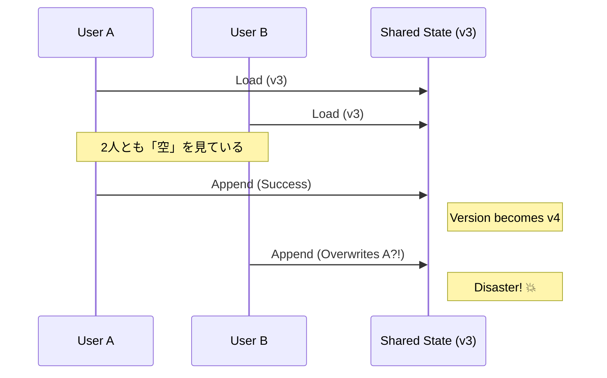

# 第22章：競合って何？（同時更新を体験）⚔️😵

## この章でできるようになること🎯✨

* 「同時に更新すると壊れる」ってどういうことか、**手を動かして体感**できる🧪💥
* イベントソーシングで競合が起きる“場所”がわかる（どこでズレる？）👀🔎
* 次の章（expectedVersion）に向けて「何を守ればいいか」がスッキリする🔒✅

---

## 1) 競合（concurrency conflict）ってなに？🤔⚔️

**同じ集約（同じストリーム）に対して、ほぼ同時に2つ以上の更新が走る**と起きる事故だよ💥

イメージはこんな感じ🍰💨

* ケーキ残り1個🎂
* Aさん「まだある！買う！」
* Bさん「まだある！買う！」
* 2人とも“見た時点では”残ってたから買えると思っちゃう
* 結果：**在庫がマイナス**とか、**席が二重予約**とか起きる😇

---

## 2) イベントソーシングだと、どこで壊れやすいの？🧠🔁

イベントソーシングの基本の流れ（前の章の型）📮✅

1. **Load**：過去イベントを読む📚
2. **Decide**：不変条件をチェックして、起こすイベントを決める🛡️
3. **Append**：イベントを保存する📦

ここで大事ポイント⚠️
**壊れやすいのは Append の瞬間というより「Decide が古い情報で走る」こと**なんだよね😵‍💫

---

## 3) タイムラインで見る「負けパターン」⏳💥

座席が1つだけの予約（capacity=1）を例にするね🎫✨

```text
t0: ストリームversion=3（まだ空きあり）
t1: AがLoad（version=3）→「空きある！」😺
t2: BもLoad（version=3）→「空きある！」😺
t3: AがDecide→SeatReserved(A) をAppend
t4: BもDecide→SeatReserved(B) をAppend（でもBの判断は t2 のまま）
結果：予約が2件入って capacity=1 を破壊😇
```




---

## 4) ハンズオン：わざと競合を起こして“壊す”🧪💥🎫

## 4.1 今日使う道具（バージョンの目安）🧰✨

* TypeScript は現時点の最新が **5.9.3**（GitHub Releases上の Latest）だよ📌 ([GitHub][1])
* Node.js は **v24 が Active LTS**、v25 が Current（公式の一覧にあるよ）🟢 ([Node.js][2])
* `tsc --init` まわりは TypeScript 5.9 で Node向けオプションが整理されてる（`--module node20` など）🧩 ([TypeScript][3])

---

## 4.2 プロジェクト作成（最小）📦✨

PowerShell でOKだよ🪟💻

```bash
mkdir ch22-concurrency && cd ch22-concurrency
npm init -y
npm i -D typescript tsx vitest
npx tsc --init --target ES2023 --module node20 --strict
```

> `--module node20` は TypeScript 側が Node 実行環境の挙動を安定的に扱うための選択肢だよ🧠 ([TypeScript][3])

---

## 4.3 ファイル構成📁✨

```text
ch22-concurrency
 ├─ src
 │   ├─ eventTypes.ts
 │   ├─ inMemoryEventStore.ts
 │   ├─ ticketAggregate.ts
 │   ├─ handler.ts
 │   └─ raceDemo.ts
 └─ test
     └─ race.test.ts
```

---

## 5) 実装：イベントストア（競合チェック無しの危険版）😈📦

## 5.1 イベント型（超シンプル）🧾✨

`src/eventTypes.ts`

```ts
export type EventEnvelope<TType extends string, TData> = {
  type: TType;
  data: TData;
  meta: {
    eventId: string;
    occurredAt: string; // ISO
  };
};

export type StreamReadResult = {
  events: Array<EventEnvelope<string, unknown>>;
  version: number; // 最後のイベント番号（0始まりにする）
};

export class DomainError extends Error {
  constructor(message: string) {
    super(message);
    this.name = "DomainError";
  }
}

export const newEventId = () =>
  crypto.randomUUID(); // Node でも使えるよ✨
```

---

## 5.2 インメモリ EventStore（ここがワナ！）🪤😵

`src/inMemoryEventStore.ts`

```ts
import { EventEnvelope, StreamReadResult } from "./eventTypes.js";

export class InMemoryEventStore {
  private readonly streams = new Map<string, Array<EventEnvelope<string, unknown>>>();

  async readStream(streamId: string): Promise<StreamReadResult> {
    const events = this.streams.get(streamId) ?? [];
    const version = events.length === 0 ? -1 : events.length - 1;
    return { events: [...events], version };
  }

  // ⚠️ 危険：expectedVersion を受け取らない（＝競合を検知できない）
  async append(streamId: string, newEvents: Array<EventEnvelope<string, unknown>>): Promise<void> {
    const current = this.streams.get(streamId) ?? [];
    this.streams.set(streamId, [...current, ...newEvents]);
  }
}
```

---

## 6) ドメイン：席が1つの「チケット予約」🎫💓

## 6.1 イベント & 状態復元（Apply）🔁🧠

`src/ticketAggregate.ts`

```ts
import { DomainError, EventEnvelope, newEventId } from "./eventTypes.js";

export type TicketState = {
  capacity: number;
  reservedBy: Set<string>;
};

export type TicketEvent =
  | EventEnvelope<"TicketCreated", { capacity: number }>
  | EventEnvelope<"SeatReserved", { userId: string }>;

export class TicketAggregate {
  private state: TicketState = { capacity: 0, reservedBy: new Set() };
  private version = -1;

  static rehydrate(history: TicketEvent[], version: number): TicketAggregate {
    const agg = new TicketAggregate();
    for (const e of history) agg.apply(e);
    agg.version = version;
    return agg;
  }

  get currentVersion(): number {
    return this.version;
  }

  get reservedCount(): number {
    return this.state.reservedBy.size;
  }

  // コマンド相当：予約したい！
  reserveSeat(userId: string): TicketEvent[] {
    if (this.state.capacity === 0) {
      throw new DomainError("まだチケットが作成されてないよ😵");
    }

    // 不変条件：capacity を超えない
    if (this.reservedCount >= this.state.capacity) {
      throw new DomainError("満席だよ〜！ごめんね🥺");
    }

    // 不変条件：同じ人が二重予約しない（今回は例として）
    if (this.state.reservedBy.has(userId)) {
      throw new DomainError("同じ人の二重予約はできないよ🙅‍♀️");
    }

    return [
      {
        type: "SeatReserved",
        data: { userId },
        meta: { eventId: newEventId(), occurredAt: new Date().toISOString() },
      },
    ];
  }

  // 初期イベント作成（教材用）
  static create(capacity: number): TicketEvent {
    return {
      type: "TicketCreated",
      data: { capacity },
      meta: { eventId: newEventId(), occurredAt: new Date().toISOString() },
    };
  }

  private apply(e: TicketEvent): void {
    switch (e.type) {
      case "TicketCreated":
        this.state.capacity = e.data.capacity;
        break;
      case "SeatReserved":
        this.state.reservedBy.add(e.data.userId);
        break;
    }
  }
}
```

---

## 7) ハンドラ：Load → Decide → Append（競合しやすい形）📮⚔️

`src/handler.ts`

```ts
import { InMemoryEventStore } from "./inMemoryEventStore.js";
import { TicketAggregate, TicketEvent } from "./ticketAggregate.js";

const sleep = (ms: number) => new Promise((r) => setTimeout(r, ms));

export async function reserveSeatHandler(args: {
  store: InMemoryEventStore;
  streamId: string;
  userId: string;
  // 競合を起こしやすくするための遅延（教材用）
  artificialDelayMs?: number;
}): Promise<void> {
  const { store, streamId, userId, artificialDelayMs = 0 } = args;

  // 1) Load
  const { events, version } = await store.readStream(streamId);
  const history = events as TicketEvent[];
  const ticket = TicketAggregate.rehydrate(history, version);

  // 👇 ここで時間が空くと「読み取りが古くなる」💥
  if (artificialDelayMs > 0) await sleep(artificialDelayMs);

  // 2) Decide
  const newEvents = ticket.reserveSeat(userId);

  // 3) Append（⚠️ 競合チェックなし）
  await store.append(streamId, newEvents);
}
```

---

## 8) 実行：Promise.all で“同時予約”を再現する💨💥

`src/raceDemo.ts`

```ts
import { InMemoryEventStore } from "./inMemoryEventStore.js";
import { TicketAggregate } from "./ticketAggregate.js";
import { reserveSeatHandler } from "./handler.js";

const streamId = "ticket-001";

const store = new InMemoryEventStore();

// チケット作成（capacity=1）
await store.append(streamId, [TicketAggregate.create(1)]);

// ほぼ同時に2人が予約する（わざと遅延を入れて競合しやすくする）
await Promise.all([
  reserveSeatHandler({ store, streamId, userId: "A", artificialDelayMs: 50 }),
  reserveSeatHandler({ store, streamId, userId: "B", artificialDelayMs: 50 }),
]);

const result = await store.readStream(streamId);
console.log("events:", result.events.map((e) => e.type));
console.log("version:", result.version);

// 復元してみる
// （本来なら capacity=1 だから予約は1件で止まってほしいのに…？😵）
```

実行してみよう🏃‍♀️💨

```bash
npx tsx src/raceDemo.ts
```

期待できる出力イメージ（例）😇

* events に `SeatReserved` が **2個** 入っちゃう
* version が増えていく
* つまり「満席なのに予約が2件」💥

---

## 9) テストでも“壊れた”を確認🧪💔

`test/race.test.ts`

```ts
import { describe, expect, test } from "vitest";
import { InMemoryEventStore } from "../src/inMemoryEventStore.js";
import { TicketAggregate, TicketEvent } from "../src/ticketAggregate.js";
import { reserveSeatHandler } from "../src/handler.js";

describe("Chapter 22 - concurrency demo", () => {
  test("競合チェックが無いと capacity=1 を破壊できてしまう😇", async () => {
    const store = new InMemoryEventStore();
    const streamId = "ticket-001";

    await store.append(streamId, [TicketAggregate.create(1)]);

    await Promise.all([
      reserveSeatHandler({ store, streamId, userId: "A", artificialDelayMs: 30 }),
      reserveSeatHandler({ store, streamId, userId: "B", artificialDelayMs: 30 }),
    ]);

    const { events, version } = await store.readStream(streamId);
    const agg = TicketAggregate.rehydrate(events as TicketEvent[], version);

    // capacity=1 なのに 2 になってたら事故💥
    expect(agg.reservedCount).toBe(2);
  });
});
```

実行✨

```bash
npx vitest
```

---

## 10) どうして「例外が出ずに」壊れるの？😵‍💫🧨

今回の事故はこう👇

* AもBも **同じ過去（version=3）の世界**で判断してる
* 不変条件チェックは、**その時点では両方ともOK**
* そのまま両方 Append できちゃう（止める仕組みが無い）

だから怖いのは、**エラーにならずにデータだけ壊れる**こと😇💔
（後から気付くのが一番つらい…！😭）

---

## 11) じゃあどう守るの？（次章の前フリ）🔒✨

イベントストア界隈でよく使う考え方が **expectedVersion**（楽観ロック）だよ🔢✅
「**あなたが読んだ時のversionのままなら書いていいよ**。違ってたら失敗にするね」っていう仕組み。

こういう動きになる👇

* AとBが version=3 を読んだ
* Aが expectedVersion=3 で Append ✅
* Bも expectedVersion=3 で Append ❌（もう version は 4 だから）

この “expectedVersion で同時書き込みを1つに絞る” って説明は、イベントストア系のドキュメントでも定番の考え方だよ📚🔒 ([Rails Event Store][4])

（次の第23章で、これをちゃんと実装するよ〜！🥳）

---

## 12) ミニ演習（できたら強い💪✨）🧩🧪

## 演習A：競合の再現率を上げる🎯💥

* `artificialDelayMs` を 5 / 50 / 200 に変えてみて、壊れやすさを比べてね📈😵

## 演習B：別のドメインで競合を作る🍔🛒

* 「在庫1の限定グッズ」
* 「残高1,000円の口座から同時に600円引き出し」💸💥
  同じように “Load→待つ→Decide→Append” で事故を起こせるよ😇

---

## 13) AI活用（短い型だけ渡すと楽！）🤖✨

* 「**競合を再現するテストケース**をもう2つ作って」🧪
* 「このコードの“競合が起きるポイント”をコメントで説明して」📝
* 「expectedVersion を入れるなら、EventStoreのメソッド署名はどうする？」🔒

👉 ただし注意⚠️：AIが“都合よく”ロックを入れて、教材の意図（壊して体感）が消えることあるから、**Chapter 22 はまず壊す！**が大事だよ💥😺

---

## まとめ🌸✅

* 競合は「同時更新」そのものというより、**古い状態でDecideしてしまう**のが本質⚔️😵
* 競合チェックが無いと、**不変条件が“黙って”破壊**されることがある😇💔
* 次章の expectedVersion（楽観ロック）で、**“古い読み取り”を検知して止める**流れに入るよ🔒✨

[1]: https://github.com/microsoft/typescript/releases "Releases · microsoft/TypeScript · GitHub"
[2]: https://nodejs.org/en/about/previous-releases "Node.js — Node.js Releases"
[3]: https://www.typescriptlang.org/docs/handbook/release-notes/typescript-5-9.html?utm_source=chatgpt.com "Documentation - TypeScript 5.9"
[4]: https://railseventstore.org/docs/core-concepts/expected-version?utm_source=chatgpt.com "Expected Version explained"
