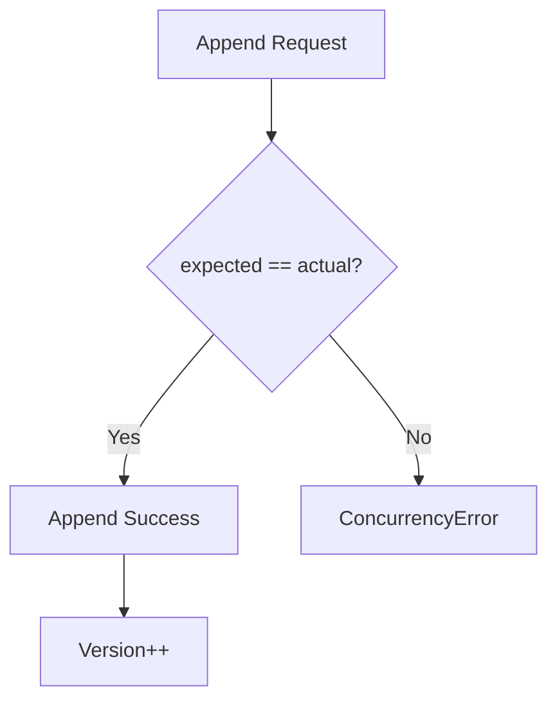

# 第23章：楽観ロック（expectedVersion）で守る🔒✅

## この章でできるようになること🎯✨

* 同時更新で起きる「上書き事故（ロストアップデート）」を説明できる🧠💥
* EventStore の `append()` に **expectedVersion** を追加して、競合を検知できる🔍✅
* 競合したときに「保存を止める」動きを **テスト** で確認できる🧪🎉
* 競合時のユーザー体験（再読み込み・再試行）を、最小の方針として言える💬🔁

---

## まずは感覚：なにが「楽観」なの？🙂🪄





楽観ロック（Optimistic Concurrency）は、ざっくり言うとこう👇

* 「同時に同じデータを更新することは **たまにしか起きない**」と“楽観”する😊
* だから **ロックで縛らない**（＝誰かが編集してても、いったん作業は進めてOK）🕊️
* でも保存するときにだけ、
  **“自分が見てたバージョンのまま？”** をチェックする🔎✅
* 違ってたら「ごめん！誰かが先に更新してた！」って **保存を失敗させる**🛑💥

イベントソーシングだと、このチェックを **イベントストリームの version** でやるのが定番だよ📚✨
（EventStoreDB/Kurrent のドキュメントでも、append 時に期待バージョンを指定して競合検知できるって説明されてるよ）([Kurrent Docs][1])

---

## expectedVersion ってなに？🔢🧩

イベントストリームは「出来事の列」📜で、だいたいこういう番号が付くよ👇

* 1本のストリーム（例：`cart-123`）にイベントが 0個なら、最後の番号は **-1**（空っぽ）みたいに扱う
* イベントが追加されるたびに、`0, 1, 2, 3...` と増える📈

そこで `append(streamId, expectedVersion, newEvents)` みたいにして：

* 「私は **version=2** の状態を見て判断したから、保存も version=2 の続きとして書きたい！」
* もし保存時にストリームが version=3 になってたら、もう前提が崩れてるので **失敗**🛑

この「保存の直前にする一致確認」が expectedVersion だよ🔒✨

---

## 競合のミニドラマ（超わかる版）🎬😵‍💫

同じカートを、2つの画面で同時に更新すると…👇

| タイミング  | 画面A                          | 画面B                               | ストリームの最後のversion |
| ------ | ---------------------------- | --------------------------------- | ---------------- |
| ① 読み込み | version=2 を読む                | version=2 を読む                     | 2                |
| ② Aが保存 | expectedVersion=2 で append ✅ |                                   | 3                |
| ③ Bが保存 |                              | expectedVersion=2 で append ❌（ズレた） | 3                |

この③で「Bの更新がAを上書きして消す」みたいな事故を防げるのが、楽観ロックの勝ちポイント🏆✨

---

## 最小実装：EventStore に expectedVersion を足す🧱✨

ここでは **インメモリ EventStore** を想定して、いちばん小さい形で実装するよ😊
（第13〜16章で作った “Append/Read + version” がある前提で進める感じ！）

## 1) 型とエラーを用意する🧰🧡

```ts
// version の扱い：空ストリームは -1（NoStream）
export const NO_STREAM = -1 as const;
// 「競合チェックしない」を明示したいとき用（章によって使い分けOK）
export const ANY_VERSION = Symbol("ANY_VERSION");
export type ExpectedVersion = number | typeof ANY_VERSION;

export type EventEnvelope<TEvent = unknown> = {
  streamId: string;
  version: number;          // ストリーム内の通し番号
  type: string;             // "ItemAdded" など
  data: TEvent;             // payload
  meta: {
    eventId: string;
    occurredAt: string;     // ISO文字列でOK
  };
};

export class ConcurrencyError extends Error {
  constructor(
    public readonly streamId: string,
    public readonly expected: number,
    public readonly actual: number,
  ) {
    super(`Concurrency conflict on ${streamId}: expected ${expected}, actual ${actual}`);
    this.name = "ConcurrencyError";
  }
}
```

ポイント💡

* `NO_STREAM = -1` は「イベント0件」を表す定番パターンだよ🫶
* `ANY_VERSION` は「競合チェックしない」モード。学習中は使いすぎ注意だけど、比較用にあると便利🧪✨

---

## 2) readStream は「events と currentVersion」を返す📤📥

```ts
export interface EventStore {
  readStream(streamId: string): Promise<{ events: EventEnvelope[]; currentVersion: number }>;

  appendToStream(
    streamId: string,
    expectedVersion: ExpectedVersion,
    events: Omit<EventEnvelope, "streamId" | "version">[],
  ): Promise<{ nextVersion: number }>;
}
```

* 読み込みで **currentVersion** が返るようにしておくと、Command 処理がすごく書きやすいよ😊✅

---

## 3) appendToStream で expectedVersion チェックをする🔒🔍

```ts
import { randomUUID } from "node:crypto";

export class InMemoryEventStore implements EventStore {
  private readonly streams = new Map<string, EventEnvelope[]>();

  async readStream(streamId: string) {
    const events = this.streams.get(streamId) ?? [];
    const currentVersion = events.length === 0 ? NO_STREAM : events[events.length - 1].version;
    return { events: [...events], currentVersion };
  }

  async appendToStream(
    streamId: string,
    expectedVersion: ExpectedVersion,
    newEvents: Omit<EventEnvelope, "streamId" | "version">[],
  ) {
    const current = this.streams.get(streamId) ?? [];
    const actualVersion = current.length === 0 ? NO_STREAM : current[current.length - 1].version;

    // ✅ ここが第23章の主役：期待version一致チェック
    if (expectedVersion !== ANY_VERSION && expectedVersion !== actualVersion) {
      throw new ConcurrencyError(streamId, expectedVersion, actualVersion);
    }

    let next = actualVersion;
    const appended: EventEnvelope[] = newEvents.map((e) => {
      next += 1;
      return {
        ...e,
        streamId,
        version: next,
        meta: {
          eventId: e.meta?.eventId ?? randomUUID(),
          occurredAt: e.meta?.occurredAt ?? new Date().toISOString(),
        },
      };
    });

    const updated = [...current, ...appended];
    this.streams.set(streamId, updated);

    return { nextVersion: next };
  }
}
```

これで、EventStore 側が「ズレてたら止める🛑」を保証してくれるようになったよ🎉

Kurrent/EventStoreDB などでも「append 時に期待バージョンを指定して、合わなければ失敗」という仕組みが用意されているよ📚([Kurrent Docs][1])

---

## Command処理に expectedVersion を通す📮✅

## コマンド処理の型（復習）🔁

1. Load（イベント読む）📥
2. Decide（不変条件チェックして新イベントを作る）🧠
3. Append（expectedVersion 付きで保存）📝🔒

## 例：AddItem コマンド（イメージ）🛒✨

```ts
type AddItem = { sku: string; quantity: number };

type ItemAdded = { sku: string; quantity: number };

export async function handleAddItem(
  store: EventStore,
  cartId: string,
  cmd: AddItem,
) {
  const streamId = `cart-${cartId}`;

  const { events, currentVersion } = await store.readStream(streamId);

  // ここで rehydrate(events) して状態を作り、ルールチェックする想定だよ🙂
  // 例）quantity > 0 など

  const toAppend = [
    {
      type: "ItemAdded",
      data: { sku: cmd.sku, quantity: cmd.quantity } satisfies ItemAdded,
      meta: { eventId: crypto.randomUUID(), occurredAt: new Date().toISOString() },
    },
  ] as const;

  // ✅ currentVersion を expectedVersion として渡す
  await store.appendToStream(streamId, currentVersion, toAppend);
}
```

この `currentVersion` が、まさに「私はこの状態を見て判断したよ」っていう証拠だよ🧾✨
保存前にズレたら `ConcurrencyError` になる💥

---

## 競合テスト：ちゃんと止まる？🧪🔒

この章では **Vitest** を例にするよ（最近のJS/TS界隈で使われることが多いテストランナーのひとつだよ）([Vitest][2])

## テスト：同時更新を再現する🧨😵

```ts
import { describe, it, expect } from "vitest";
import {
  InMemoryEventStore,
  ConcurrencyError,
  NO_STREAM,
} from "./InMemoryEventStore";

describe("Chapter23 optimistic concurrency", () => {
  it("same expectedVersion: first wins, second fails", async () => {
    const store = new InMemoryEventStore();
    const streamId = "cart-1";

    // 初期イベントを1個入れて version=0 にする
    await store.appendToStream(streamId, NO_STREAM, [
      { type: "CartCreated", data: {}, meta: { eventId: "e1", occurredAt: new Date().toISOString() } },
    ]);

    // AとBが同時に読む（どっちも version=0 を見る）
    const a = await store.readStream(streamId);
    const b = await store.readStream(streamId);

    // Aが先に保存（expected=0 → OK）
    await store.appendToStream(streamId, a.currentVersion, [
      { type: "ItemAdded", data: { sku: "apple", quantity: 1 }, meta: { eventId: "e2", occurredAt: new Date().toISOString() } },
    ]);

    // Bが保存（expected=0 だけど actual は 1 になってるので NG）
    await expect(
      store.appendToStream(streamId, b.currentVersion, [
        { type: "ItemAdded", data: { sku: "banana", quantity: 1 }, meta: { eventId: "e3", occurredAt: new Date().toISOString() } },
      ]),
    ).rejects.toBeInstanceOf(ConcurrencyError);
  });
});
```

テストの見どころ👀✨

* **A と B が同じ version を見ている**のがポイント
* Aが保存した瞬間に version が進む
* Bは古い expectedVersion のまま保存しようとして **止められる**🛑

---

## 競合したときの最小UX（現場っぽい話）🧯🙂

`ConcurrencyError` が出たら、最小の現実的な対応はこれ👇

1. いったん最新を読み直す（reload）📥🔁
2. ユーザーに「更新がありました。もう一度お願いします🙏」と見せる💬
3. 可能なら入力内容を保持して、再試行しやすくする🫶✨

この「保存は正しく止める」「体験はやさしく戻す」がセットだよ🌸

（楽観ロック自体の一般的な考え方は、たとえば Martin Fowler の Optimistic Offline Lock でも“競合を検知してロールバック/失敗させる”という方針として説明されてるよ）([martinfowler.com][3])

---

## よくある落とし穴🕳️😵‍💫

## 落とし穴1：version の定義がブレる（-1？0？）🔢🌀

* 「空なら -1」なのか「空なら 0」なのかで、`expectedVersion` がズレてバグりやすい💥
* この章の実装は **空 = -1（NO_STREAM）** で統一してるよ✅

## 落とし穴2：読み込み時点の version を使ってない😇

* `appendToStream(streamId, ANY_VERSION, ...)` ばっかりだと、競合は検知できない🙅‍♀️
* 学習中は **必ず currentVersion を渡す** クセをつけよう💪✨

## 落とし穴3：競合＝例外で雑に落ちる😵

* 競合は「よくある業務エラー」寄り（ユーザーが同時編集しただけ）
* だから **丁寧なメッセージ** と **再試行導線** が大事だよ🫶💬

---

## AI活用（Copilot / Codex）で爆速にする🤖⚡

## 1) 競合シナリオを増やす🎭

**プロンプト例**（そのまま貼ってOK）👇

* 「expectedVersion を使った競合のテストケースを 5個考えて。成功/失敗が混ざるように。Given-When-Then で」

## 2) エラーメッセージ案を作る🗣️✨

* 「ConcurrencyError をユーザー向けに言い換えた短文を3案。怖くない口調で。再試行を促す文も入れて」

## 3) 境界のレビューをさせる🔍

* 「expectedVersion を渡し忘れる危険箇所を、Command Handler の流れ（Load→Decide→Append）で指摘してチェックリスト化して」

---

## この章のまとめ🎀✅

* **expectedVersion は“見てた状態の証拠”**🧾✨
* append 時に **expected と actual が一致しなければ止める**🛑
* これで「同時更新で上書きして消える事故」を防げる🔒🎉
* 競合は「バグ」じゃなく「起きうる現象」だから、UXでやさしく戻す🌸🔁

（補足：この章の周辺ツール事情として、Node.js の現行/Active LTS 系列や更新状況は公式のリリース情報で追えるよ）([nodejs.org][4])

[1]: https://docs.kurrent.io/clients/tcp/dotnet/21.2/appending?utm_source=chatgpt.com "Appending events - Kurrent Docs"
[2]: https://vitest.dev/blog/vitest-4?utm_source=chatgpt.com "Vitest 4.0 is out!"
[3]: https://martinfowler.com/eaaCatalog/optimisticOfflineLock.html?utm_source=chatgpt.com "Optimistic Offline Lock"
[4]: https://nodejs.org/en/about/previous-releases?utm_source=chatgpt.com "Node.js Releases"
