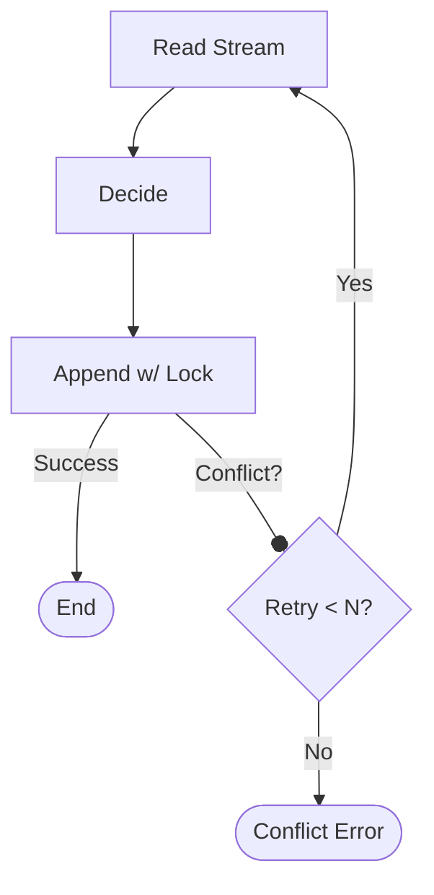

# 第24章：競合したとき、どうする？（方針だけ）🧯🧠

## この章でできるようになること🎯✨

* 「競合（同時更新）」が起きたときに **何が起きてるのか** を説明できる🗣️💡
* 実務でよく使う **3つの対応方針**（リトライ／再入力促し／マージ）を使い分けられる🧰✅
* まずは最小で「リトライ方針」を **TypeScriptで実装** できる🔁🧑‍💻

---

## まず結論：競合対応は “この3択” が基本だよ🧡

競合は、前章の **expectedVersion（楽観ロック）** で検知できるようになったよね🔒
イベントストア側で「**そのversionのはず**」って指定してAppendして、ズレてたら失敗にするやつ！([Kurrent Docs][1])

その「失敗」になったあと、現場ではだいたい次の3パターンに落ちるよ👇✨

1. **自動リトライ（再読み込み→再判断→再Append）** 🔁
2. **ユーザーに“最新でやり直し”してもらう（再入力促し）** 🧑‍💻🌀
3. **マージ（両方の変更をいい感じに合体）** 🧩✨（ただし難しめ！）

---

## 競合って何が起きてるの？😵‍💫（30秒で理解）

たとえば同じカート🛒を、AさんとBさんがほぼ同時に更新したとするね。

* Aさん：カートを読み込んだ（version=10）📖
* Bさん：カートを読み込んだ（version=10）📖
* Bさん：先に保存した → versionが11になった✅
* Aさん：version=10のつもりで保存 → **ズレてるから失敗（競合）** 💥

ここで大事なのは、**「誰が悪い」じゃなくて**
“同時に起きただけ” ってこと😊🌸

---

## 方針の選び方：迷ったらこのルールでOK🧭✨

## ① 自動リトライが向いてるケース🔁✅

* コマンドが **“足し算系”**（AddとかIncrementとか）で、
  最新状態に対してもう一回判断し直せば自然に通るやつ💡
* 例：`AddItem` / `IncreaseQuantity` / `AddTag` など🧺➕
* リトライで再度「最新のイベント列から状態を復元してやり直す」は、一般的な楽観ロックの定番対応でもあるよ🔁([Microsoft Learn][2])

👉 **初心者が最初に採用するならコレが一番安全** 🧸✨

## ② 再入力促し（ユーザーにやり直してもらう）が向いてるケース🧑‍💻🌀

* “編集系” で **意図が大事** なやつ（上書き・文章編集・住所編集…）✍️🏠
* 例：`ChangeShippingAddress` / `EditProfile` / `SetMemoText`
* 自動リトライで通してしまうと、ユーザーの意図とズレることがある😣

👉 **409 Conflictにして、最新を見せて「もう一回やってね」** が王道🙆‍♀️✨

## ③ マージが向いてるケース🧩✨（ただし条件つき）

* 両方の変更が **衝突しにくい** or **合体ルールが明確** なとき
* 例：タグ追加同士は合体できる🏷️＋🏷️、数量変更はルール次第🔢

👉 マージはできると気持ちいいけど、**ドメイン知識が要る**（＝設計が要る）ので、最初は小さくやるのがおすすめ😊

---

## “やっちゃダメ寄り”の対応も知っておこう🙅‍♀️💦

## ❌ Last Writer Wins（最後に来た人が勝つ）🏁

状態保存の世界だとやりがちだけど、**更新が消える（ロストアップデート）** 事故につながりやすい😱
イベントソーシングでも「衝突を無視する」設定にすると危険なので、まずは避けようね⚠️([Kurrent Docs][1])

---

## ミニ演習：方針を1つ選んで実装する（最小）✅🧪

ここでは **① 自動リトライ** を実装するよ🔁✨
（いちばん採用率が高くて、学習にもピッタリ💛）

## 目標🎯

* 競合でAppend失敗したら、最大N回まで **読み直して再挑戦** する
* それでもダメなら **Conflictエラー** を返す

---

## 実装イメージ図🧠🗺️




1. ReadStream（イベント読む）📖
2. Rehydrate（状態復元）🔁
3. Decide（新イベント作る）🧠✨
4. Append（expectedVersion付き）📌
5. 競合なら 1 に戻る🔁

---

## TypeScriptコード例（最小リトライ版）🧑‍💻✨

```ts
// 競合エラー（expectedVersion mismatch）を表す専用エラー
export class ConcurrencyError extends Error {
  constructor(message = "Concurrency conflict") {
    super(message);
    this.name = "ConcurrencyError";
  }
}

export type StoredEvent = {
  type: string;
  data: unknown;
  meta: { occurredAt: string; eventId: string };
};

export interface EventStore {
  readStream(streamId: string): Promise<{ events: StoredEvent[]; version: number }>;
  appendToStream(
    streamId: string,
    expectedVersion: number,
    newEvents: StoredEvent[]
  ): Promise<{ newVersion: number }>;
}

// ドメイン状態（例：カート）
export type CartState = {
  items: Record<string, number>; // sku -> qty
  isClosed: boolean;
};

// Rehydrate（イベント列から状態を作る）
export function rehydrateCart(events: StoredEvent[]): CartState {
  const state: CartState = { items: {}, isClosed: false };

  for (const ev of events) {
    switch (ev.type) {
      case "CartCreated":
        // no-op (初期状態はすでに用意)
        break;

      case "ItemAdded": {
        const { sku, qty } = ev.data as { sku: string; qty: number };
        state.items[sku] = (state.items[sku] ?? 0) + qty;
        break;
      }

      case "CartClosed":
        state.isClosed = true;
        break;

      default:
        // 未知イベントは無視せず、開発中は気づけるようにするのが安全✨
        throw new Error(`Unknown event type: ${ev.type}`);
    }
  }

  return state;
}

// Decide（コマンド→新イベント）
// ※ここでは超シンプルな例：AddItemコマンドだけ
export type AddItemCommand = { kind: "AddItem"; cartId: string; sku: string; qty: number };

export function decideCart(state: CartState, cmd: AddItemCommand): StoredEvent[] {
  if (state.isClosed) {
    // 本当は第21章のResult型っぽく返すのが綺麗だけど、ここでは最小でthrow例
    throw new Error("Cart is closed");
  }
  if (cmd.qty <= 0) throw new Error("qty must be positive");

  return [
    {
      type: "ItemAdded",
      data: { sku: cmd.sku, qty: cmd.qty },
      meta: { occurredAt: new Date().toISOString(), eventId: crypto.randomUUID() },
    },
  ];
}

// ✅ 競合対応：自動リトライ（最大maxRetries回）
export async function handleAddItemWithRetry(
  store: EventStore,
  cmd: AddItemCommand,
  maxRetries = 3
): Promise<{ ok: true } | { ok: false; reason: "conflict" }> {
  for (let attempt = 1; attempt <= maxRetries; attempt++) {
    const { events, version } = await store.readStream(cmd.cartId);
    const state = rehydrateCart(events);

    const newEvents = decideCart(state, cmd);

    try {
      await store.appendToStream(cmd.cartId, version, newEvents);
      return { ok: true };
    } catch (e) {
      if (e instanceof ConcurrencyError) {
        // 競合！→ 読み直して再挑戦🔁
        continue;
      }
      // 競合以外は上に投げる（インフラ障害など）
      throw e;
    }
  }

  // 何回やっても競合するなら、呼び出し元へ「衝突したよ」を返す🧯
  return { ok: false, reason: "conflict" };
}
```

## ここがポイントだよ💡✨

* **リトライ回数は必ず上限を決める**（無限ループ防止）🌀🚫
* リトライは「**読み直し→再判断**」が基本（古いstateで再Appendしない）🔁
* “足し算系コマンド” ならこの方式がかなり強い💪😊

---

## APIにしたときの返し方（超ミニ）🌐✨

リトライしてもダメだったら、だいたいはこうするよ👇

* HTTPなら **409 Conflict** を返す🛑
* 画面には
  「他の人が先に更新したみたい🙏 最新を読み込んでもう一回お願い！」
  みたいに出す📣💞

---

## マージ方針を “ちょっとだけ” 現実寄せで語る🧩✨

イベントソーシングでの「マージ」って、基本はこういう発想だよ👇

* イベント履歴は **改ざんしない**（Append-only）📜✨
* だから「衝突した2つのイベントを混ぜる」よりも、
  **最新状態に対して、もう一回コマンドを解釈し直す**（＝再判断）が多い🔁

たとえば `AddItem` 同士の衝突は、再判断で自然に合体できることが多いよ🛒➕🛒

---

## よくある落とし穴🕳️😵

## 落とし穴1：リトライで “ユーザーの意図” がズレる🌀

* “上書き系”は特に危険⚠️
* その場合は **再入力促し** が素直で安全🧑‍💻✨

## 落とし穴2：リトライが多すぎて重い🐢

* リトライは最大2〜3回くらいが目安
* それ以上は設計を見直すサインかも👀🔍

---

## AI活用（Copilot / Codex想定）🤖💖

## 1) 方針選択のための質問テンプレ🧠

```text
このコマンドは「自動リトライ」「ユーザーに再入力促し」「マージ」のどれが適切？
ドメインは〇〇。コマンドは〇〇で、ユーザーの意図が重要か、足し算系か、衝突時に何が困るかを整理して表にして。
```

## 2) 409 Conflictのメッセージ案づくり📣

```text
409 Conflict時にユーザーに出すメッセージを、やさしく・短く・不安を煽らずに3案ください（絵文字多め）。
```

---

## 最新事情メモ（2026っぽい視点）🗓️✨

* Node.jsは **v24がActive LTS**、v22はMaintenance LTSに入ってるよ📦([Node.js][3])
* Nodeには `node:sqlite` が入ってきていて、v22.5.0以降で使える（ただし “まだexperimental” 扱い）🧪([Node.js][4])
* TypeScriptは2025年秋に **5.9系** が出てるよ🧡([GitHub][5])
* VS Codeの更新は **1.108（December 2025）** が2026年1月に出てる📌([Visual Studio Code][6])

---

## この章のチェックリスト✅📝

* [ ] 競合が「expectedVersionのズレ」だと説明できる🔒
* [ ] リトライ／再入力促し／マージ の使い分けが言える🧭
* [ ] リトライ実装に「上限回数」が入ってる🔁🚫
* [ ] それでもダメなら “Conflictとして返す” 方針になってる🧯

[1]: https://docs.kurrent.io/clients/tcp/dotnet/21.2/appending?utm_source=chatgpt.com "Appending events - Kurrent Docs"
[2]: https://learn.microsoft.com/en-us/ef/core/saving/concurrency?utm_source=chatgpt.com "Handling Concurrency Conflicts - EF Core"
[3]: https://nodejs.org/en/about/previous-releases?utm_source=chatgpt.com "Node.js Releases"
[4]: https://nodejs.org/api/sqlite.html?utm_source=chatgpt.com "SQLite | Node.js v25.5.0 Documentation"
[5]: https://github.com/microsoft/typescript/releases?utm_source=chatgpt.com "Releases · microsoft/TypeScript"
[6]: https://code.visualstudio.com/updates?utm_source=chatgpt.com "December 2025 (version 1.108)"
