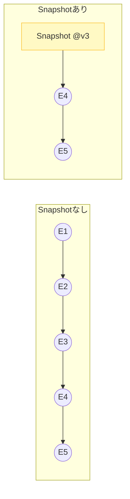

# 第25章：スナップショット概念（なぜ必要？）📸⚡

## 1. 今日のゴール🎯✨

この章が終わったら、こんなことが「わかる＆説明できる」ようになります😊🫶

* スナップショットって何？（一言で言える）📸
* どうして必要になるの？（つらみの正体がわかる）😵‍💫
* いつ取るのが多い？（代表パターンを知る）🗓️
* 何を取る？ 何を取らない？（事故らない）🚧

---

## 2. スナップショットって何？📸

**スナップショット =「ある時点の集約（Aggregate）の状態を丸ごと保存した“途中セーブ”」**です🎮✨
イベントソーシングでは、本来 **イベント列を最初から順に適用（Apply）して現在の状態を作る**よね🔁




でもイベントが増えると、それがだんだん重くなってきます🐢💦

スナップショットがあると、こうできます👇

* **最新スナップショットまで一気にワープ**🚀
* そこから先のイベントだけをApplyすればOK✅

※大事：スナップショットは「真実」じゃなくて、**あくまで高速化のためのキャッシュ**だよ🧊✨（イベントが真実）([martinfowler.com][1])

---

## 3. 何がつらいと、スナップショットが欲しくなるの？😵‍💫

### 3.1 Rehydrate（復元）が遅くなる🐢


イベントが少ないうちは、復元は余裕です😊
でも、運用が進むとこうなる👇

* 1集約につきイベントが数百〜数万…📈
* **コマンド処理のたびに Rehydrate**（Load→Decide→Append の Load）🔁
* そのたびにイベントを何百回もApply…😇💥

結果：

* 体感がモッサリする😿
* テストが遅くなる🧪🐢
* コマンド処理がタイムアウトしやすくなる⏱️💦

スナップショットは **「集約の復元コスト」を下げるための手段**だよ📸⚡([EventSourcingDB][2])

### 3.2 でも、最初から入れなくていい🙅‍♀️

スナップショットは“性能最適化”なので、基本はこう考えるのが安全です👇

* **計測して、必要になったら入れる**⏱️✅
* 先に入れると、設計がややこしくなりがち🧩💦

「最初のルール：やらない」「次のルール：ほんとに必要か確認する」みたいな空気感、現場でもよくあります😂([Stack Overflow][3])

---

## 4. スナップショットは“何を”保存するの？🍱🏷️


**保存するもの（おすすめ）**👇

* 集約の状態（例：Cartの中身、合計金額、ステータスなど）🛒
* そのスナップショットが対応する **version（どこまでのイベントを反映したか）**🔢
* 作成日時などのメタ情報🕒

**保存しないほうがいいもの（ありがち事故）**👇

* 画面表示用に都合の良い形に整形しすぎたもの🖥️💦

  * それは Projection の役目になりやすいよ🔎
* 「本来イベントから導けるのに、別ルールで作った値」🤯

  * いつかズレる🧨

---

## 5. スナップショットは“何に効く”の？何に効かない？🎯


### 5.1 効く✅：集約の復元（Rehydrate）

コマンド処理で集約をロードするとき、速くなる📮⚡

* **スナップショット + 追加分イベントだけApply**
  → Apply回数が減る✨

### 5.2 効かない❌：Projectionの再構築（リプレイ）

「Projectionを最初から作り直す」時は、基本ぜんぶのイベントを処理します🔁
スナップショットは **Projectionの再構築を速くする道具じゃない**（ここ勘違い多い！）😵‍💫([EventSourcingDB][4])

---

## 6. どこに保存するの？📦


よくある保存先は2つ👇

### パターンA：イベントストアとは別の場所に置く（“別テーブル/別ストア/別ストリーム”）📦✨

* イベントはイベントのまま、純度を保つ🧼
* スナップショットは “キャッシュ” として管理しやすい🧊

「スナップショットはイベントとは別に保持する」方針は一般的におすすめされがちだよ🗃️([AlgoMaster][5])

### パターンB：スナップショットも“イベントっぽく”扱って同じ仕組みで保存する📜

* 「スナップショット専用のイベント型」を作って、同じAppendの仕組みで保存する感じ🎬
* 例：`foo` のイベントとは別に `foo-snapshot` ストリームを作る、みたいな運用例もあります📼([Stack Overflow][6])

---

## 7. いつ取るの？（代表パターン）🗓️📸


“正解”は1つじゃないけど、よくあるのはこのへん👇

1. **N件ごと**（例：100件ごと）🔢

* 実装しやすい
* 最悪でも「最後の100件だけApply」になる
* 目安として **100〜500件ごと**が語られることが多いよ📈([AlgoMaster][5])

2. **時間ごと**（例：1時間ごと、1日1回）🕒

* 長期運用で扱いやすい
* 日次バッチみたいなノリにも合う☀️🌙([martinfowler.com][1])

3. **読み込み時（On read）**📖

* 「最後のスナップショットからイベントが増えすぎてたら作る」
* ただし読み込みが重いタイミングで追加作業が入るので注意⚠️([AlgoMaster][5])

4. **特定コマンド時（On command）**📮

* 「重い処理の後だけ取る」みたいなルール
* ドメインに意味があるタイミングに合わせやすい🎀([EventSourcingDB][2])

---

## 8. “スナップショットあり”の復元の流れ（イメージ）🔁✨


スナップショットなし👇

1. イベントを最初から読む📜
2. ぜんぶApplyする🔁
3. 現在の状態ができる✅

スナップショットあり👇

1. 最新スナップショットを読む📸
2. そのスナップショットの version より後のイベントだけ読む📜
3. それだけApplyする🔁
4. 現在の状態ができる✅

---

## 9. ちいさなTypeScript例（超イメージ）🧸💻

※ここでは「概念が伝わる」ことが目的だよ📸✨（実装は次章でガッツリ！）

```ts
type Version = number;

type CartState = {
  items: { sku: string; qty: number }[];
  // ...他にも合計金額など
};

type Snapshot<T> = {
  streamId: string;
  version: Version;     // ここまでのイベントを反映済み
  state: T;             // 集約の状態（途中セーブ）
  createdAt: string;    // ISO文字列など
};

type EventEnvelope = {
  streamId: string;
  version: Version;
  type: string;
  data: unknown;
};

async function rehydrateCart(
  streamId: string,
  loadLatestSnapshot: (streamId: string) => Promise<Snapshot<CartState> | null>,
  loadEventsAfter: (streamId: string, afterVersion: Version) => Promise<EventEnvelope[]>,
  apply: (state: CartState, e: EventEnvelope) => CartState,
  emptyState: () => CartState
): Promise<{ state: CartState; version: Version }> {
  const snap = await loadLatestSnapshot(streamId);

  const baseState = snap?.state ?? emptyState();
  const baseVersion = snap?.version ?? 0;

  const events = await loadEventsAfter(streamId, baseVersion);

  const finalState = events.reduce((s, e) => apply(s, e), baseState);
  const finalVersion = events.length ? events[events.length - 1].version : baseVersion;

  return { state: finalState, version: finalVersion };
}
```

ポイントはこれだけ覚えてね😊🫶

* スナップショットには **state と version** が必須級📸🔢
* そこから後ろのイベントだけApplyすればいい🔁✨

---

## 10. よくある落とし穴集🧨（ここ超大事！）

### 落とし穴①：スナップショットを最初から入れて複雑化😵‍💫

* まずは計測→必要なら導入が安全⏱️✅([EventSourcingDB][2])

### 落とし穴②：Projectionが速くなると思い込む😇

* **集約の復元が速くなる**もの
* **Projection再構築のショートカットにはならない**（原則）🔎❌([EventSourcingDB][4])

### 落とし穴③：スナップショットが古くてズレる🧊💥

* version を必ず持たせて「どこまで反映済みか」を明確にする🔢
* スナップショット生成ロジックが壊れても、イベントから作り直せる設計にする🔁✨([martinfowler.com][1])

### 落とし穴④：スナップショットを頻繁に取りすぎる📸📸📸

* 書き込みが増えて逆に重くなることもある🧱💦
* “ほどほど”に（N件ごと、時間ごと…）が無難🌸([AlgoMaster][5])

---

## 11. ミニ演習（手と頭でわかる）✍️🧠📸

### 演習A：Apply回数を数えて「つらみ」を体感する😵‍💫

1. 集約のイベントを **100件**ある想定にする📜
2. 「復元に必要なApply回数 = 100回」って数える🔁
3. スナップショットを version=80 に置いたとする📸
4. すると Apply回数は **残り20回**✨

→ これだけで「効いてる！」ってなるよね😊⚡

### 演習B：スナップショットの“タイミング”を考える🗓️

次の質問に答えてみよう👇

* 100件ごと？ 200件ごと？ それとも時間ごと？🤔
* 「コマンドが多い集約」だけ取る？ 全部取る？📮
* “取るコスト”もあるけど、どこで得する？💰

---

## 12. AI活用（Copilot / Codexでやると超はかどる）🤖✨

そのまま貼って使えるプロンプト例だよ📌💕

1. **スナップショット戦略案を出してもらう**📸

* 「この集約は更新頻度が高いです。N件ごと/時間ごとの候補と、メリデメ、採用基準（計測観点）を箇条書きで出して」

2. **落とし穴レビュー**🧯

* 「スナップショット導入で起きがちなバグや運用事故を列挙して、TypeScript実装での予防策も添えて」

3. **計測の設計（次章につながる）**⏱️

* 「rehydrateの処理時間とApply回数を計測する仕組みを提案して。console出力でOK。計測ポイントも教えて」

---

## まとめ📌✨

* スナップショットは **途中セーブ（高速化のキャッシュ）**📸
* 効くのは **集約の復元（Rehydrate）**⚡
* **Projection再構築を速くするものじゃない**🔎❌([EventSourcingDB][4])
* まずは計測して、必要になったら導入が安全😊⏱️([EventSourcingDB][2])

次の章では、このスナップショットを **最小の形で実装**して「ほんとに速くなる！」を体験します📸🧪🚀

[1]: https://martinfowler.com/eaaDev/EventSourcing.html?utm_source=chatgpt.com "Event Sourcing"
[2]: https://docs.eventsourcingdb.io/fundamentals/snapshots/?utm_source=chatgpt.com "Snapshots - EventSourcingDB"
[3]: https://stackoverflow.com/questions/38021748/snapshot-taking-and-restore-strategies?utm_source=chatgpt.com "Snapshot taking and restore strategies - cqrs"
[4]: https://docs.eventsourcingdb.io/best-practices/common-issues/?utm_source=chatgpt.com "Common Issues - EventSourcingDB"
[5]: https://algomaster.io/learn/system-design/event-sourcing?utm_source=chatgpt.com "Event Sourcing | System Design"
[6]: https://stackoverflow.com/questions/16359330/are-snapshots-supported-in-eventstoredb?utm_source=chatgpt.com "Are snapshots supported in EventStoreDB?"
