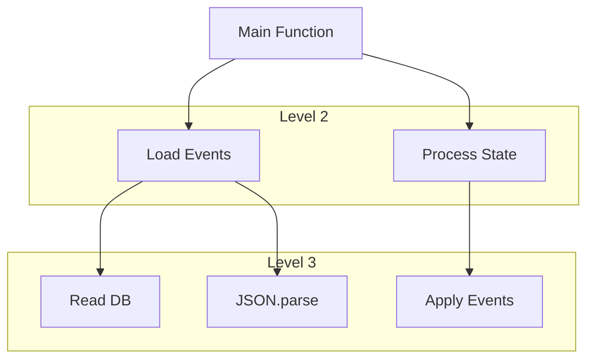

# 第27章：性能の超入門（計測のしかた）⏱️🔧

## この章でできるようになること🎯✨

* 「遅い…気がする😵‍💫」をやめて、数字で話せるようになる📏✨
* イベントソーシングで重くなりがちな場所（復元・保存・投影）をサクッと測れる🔎⚡
* VS Codeのプロファイルで「どの関数が時間を食ってるか」を見つけられる👀🔥
* “改善する前にまず計測！”のクセがつく🐣✅

---

## 1. そもそも「性能」って何の話？🧠💭


性能って、ざっくり言うとこの3つだよ😊

1. **待ち時間（レイテンシ）**：1回のコマンドが完了するまで何ms？⌛
2. **さばける量（スループット）**：1秒に何件処理できる？🚚💨
3. **重さ（コスト）**：CPUやメモリ、I/Oがどれくらい？🧯

そして一番大事なのがこれ👇
**「計測してない最適化は、だいたい外す」**😇🔫
（がんばって速くしたのに、実は別の場所が遅かった…あるある🥲）

---

## 2. イベントソーシングで“遅くなりがち”トップ3🥇🥈🥉


この章では、次の3つに絞って測るよ！🔎✨

1. **復元（Rehydrate）**：イベント列を読んで状態を作る🔁🧠
2. **保存（Append）**：イベントをシリアライズして永続化する💾📦
3. **投影（Projection）**：画面用データを更新・再構築する🪞📋

イベント数が増えるほど、特に①が効いてくるよ〜😵‍💫📈

---

## 3. 計測は「3段階」でOK🪜✨


## レベル1：最速で測る（ざっくり）⏱️🙂

「console.time / console.timeEnd」でOK！
ラベルを同じにすると、区間の時間が出るよ📌 ([Node.js][1])

```ts
// ざっくり計測（すぐ使える！）
console.time("rehydrate");

rehydrateFromEvents(events);

console.timeEnd("rehydrate");
```

✅ まずはこれで「どこが怪しいか」を当てにいくのが正解🙆‍♀️✨

---

## レベル2：ちゃんと測る（高精度タイマー）🧪✨

Nodeには「WebのPerformance APIっぽい計測」があるよ！
「node:perf_hooks」の performance を使うのが定番👌 ([Node.js][2])

```ts
import { performance } from "node:perf_hooks";

// 高精度にmsで測れる
const t0 = performance.now();
rehydrateFromEvents(events);
const t1 = performance.now();

console.log(`rehydrate: ${(t1 - t0).toFixed(3)}ms`);
```

✅ console.timeよりも「自分で数字を扱える」から、統計（中央値とか）も作りやすいよ📊💕

---

## レベル3：ガチ測定（ナノ秒＋プロファイル）🔥🧨

さらに精密にしたいときは「process.hrtime.bigint()」が強い！
ナノ秒で差分を取れるよ🧠⚡ ([Node.js][3])

```ts
import { hrtime } from "node:process";

const start = hrtime.bigint();
rehydrateFromEvents(events);
const end = hrtime.bigint();

const ns = end - start;
const ms = Number(ns) / 1_000_000;
console.log(`rehydrate: ${ms.toFixed(3)}ms`);
```

---

## 4. “1回だけ計測”は危険⚠️（必ず複数回やろう）🔁😊


同じ処理でも、毎回ちょっと揺れるよ〜📉📈
理由はだいたいこれ👇

* JIT最適化が効くまで時間がかかる（最初だけ遅い）🧠💤
* GCが走るタイミングが違う🗑️
* PCの他アプリが重い😇

なので、基本形はこう！✨

* まず **ウォームアップ5回**（捨てる）🔥
* 本番 **30回** 測る🔁
* **平均より「中央値（p50）」** を見る📌
* 余裕があれば **p95**（悪い時の値）も見る😵‍💫

---

## 5. ミニ演習：復元（Rehydrate）の時間をイベント数で見てみよう🔁⏱️


## やること📝✨

イベント数を増やして、復元がどれくらい伸びるか観察するよ👀📈
「雰囲気」じゃなくて「数字」で体感するのが目的！😊

### ① 計測ヘルパー（統計つき）を作る📦📊

```ts
import { performance } from "node:perf_hooks";

export async function bench(label: string, runs: number, fn: () => unknown) {
  // warmup
  for (let i = 0; i < 5; i++) fn();

  const times: number[] = [];
  for (let i = 0; i < runs; i++) {
    const t0 = performance.now();
    fn();
    const t1 = performance.now();
    times.push(t1 - t0);
  }

  times.sort((a, b) => a - b);
  const p50 = times[Math.floor(times.length * 0.50)];
  const p95 = times[Math.floor(times.length * 0.95)];
  const avg = times.reduce((a, b) => a + b, 0) / times.length;

  console.log(
    `${label} | avg=${avg.toFixed(3)}ms p50=${p50.toFixed(3)}ms p95=${p95.toFixed(3)}ms`
  );
}
```

### ② 復元対象イベントを増やして測る🔁📈

（イベントの中身は、今の題材の「よく起きる更新」っぽいものでOKだよ😊）

```ts
import { bench } from "./bench.js";

// 例：イベント生成（ダミー）
type Event = { type: "ItemAdded"; itemId: string; qty: number };

function makeEvents(n: number): Event[] {
  const events: Event[] = [];
  for (let i = 0; i < n; i++) {
    events.push({ type: "ItemAdded", itemId: `item-${i % 50}`, qty: 1 });
  }
  return events;
}

// 例：復元（超ミニ）
function rehydrateFromEvents(events: Event[]) {
  const state = new Map<string, number>();
  for (const e of events) {
    if (e.type === "ItemAdded") {
      state.set(e.itemId, (state.get(e.itemId) ?? 0) + e.qty);
    }
  }
  return state;
}

for (const n of [100, 1000, 10_000, 50_000]) {
  const events = makeEvents(n);
  await bench(`rehydrate n=${n}`, 30, () => rehydrateFromEvents(events));
}
```

## 観察ポイント👀✨

* nが10倍になると、時間もほぼ10倍？それとも違う？🤔
* p95がやたら大きいとき、何が起きてそう？（GCとか）🗑️💥

---

## 6. “どこが重いか”を分解して測ろう🧩🔍


イベント保存が遅いとき、いきなり「DBが遅い！」って言いがちなんだけど…😇
だいたい混ざってるのはこの3つ👇

* JSON変換（stringify/parse）🧾
* 圧縮や暗号化（やってたら）🧊🔐
* 実際のI/O（SQLite/ファイル/ネット）💾🌐

✅ 分解例（超重要！）

* 「シリアライズだけ」
* 「書き込みだけ」
* 「両方」
  を別々に測ると、犯人が一気に見えるよ🕵️‍♀️✨

---

## 7. VS Codeで“犯人の関数”を見つける（CPUプロファイル）🔥👀




「どこが遅いか分からない😵‍💫」ってときは、時間を食ってる関数を見に行こ！
VS CodeにはCPUプロファイル機能があるよ📌 ([Visual Studio Code][4])

## 手順（超ざっくり）🧭✨

1. デバッグ開始▶️
2. コールスタック付近の「Profile」や、コマンドの「Take Performance Profile」を使う🎥
3. 記録中に“遅い操作”を実行する🧨
4. 止めると結果が開く📂🔥 ([Visual Studio Code][4])

## 見方（ここだけ覚えればOK）👀✅

* **Bottom-Up（下から）**：時間を食ってる関数ランキング🏆
* **Call Tree（木）**：どのルートでそこに到達したか🌳
* **Flame Chart（炎）**：横に長いほど重い🔥

---

## 8. Nodeの「--cpu-prof」でプロファイルを取る（コマンド一発）🧨📄

Nodeには起動時にCPUプロファイルを取るオプションがあるよ！
「--cpu-prof」系のフラグはCLIドキュメントにまとまってる📌 ([Node.js][5])

## 例：プロファイルをファイルに出す（Windows）🪟📁

```text
node --cpu-prof --cpu-prof-dir .\profiles dist\app.js
```

* 実行が終わると「.cpuprofile」ファイルが出るよ📄✨
* それをVS Codeで開くと、可視化できる（炎のやつ🔥）

---

## 9. ありがちな落とし穴あるある😇🕳️（回避法つき）

* ログを出しすぎて測定が壊れる📣💥 → ログは一旦減らす
* 1回だけ測って結論を出す🎲 → 30回＋p50を見る
* “本番と違うデータ量”で安心する😺 → イベント数を段階的に増やす（100→1,000→10,000…）
* いきなり高速化しようとして迷子🧭 → まずプロファイルで上位だけ見る🏆

---

## 10. AI活用（この章での使いどころ）🤖💕

## ① 計測ポイント案を出してもらう🗺️

* 「復元・保存・投影のどこを区切って測るべき？」を聞く

## ② ベンチコードの土台を作ってもらう🧱

* ただし！生成されたコードは、**ログの量**と**測定回数**だけは必ずあなたがチェック✅😇

## ③ プロファイル結果の読み方を手伝わせる👀

* 「このBottom-Upの上位3つ、何が原因っぽい？」みたいに聞くと早いよ⚡

（GitHub Copilot や OpenAI 系の支援ツールを使う前提でOK😊）

---

## まとめチェックリスト✅✨

* [ ] 測りたい対象を「復元 / 保存 / 投影」に分けた？🧩
* [ ] ウォームアップしてから30回測った？🔥🔁
* [ ] 平均じゃなくp50（中央値）を見た？📌
* [ ] 分からなければVS Codeか --cpu-prof で犯人を見た？🔥👀

---

## 次に向けて🌸

この章で「計測の型」ができたら、次のProjectionパートで「読みモデル」を作ったときにも、ちゃんと数字で品質を守れるようになるよ😊🔎📚

（参考：Nodeのリリース状況では偶数系LTS（例：v24がActive LTS）を使うのが基本だよ📌 ([Node.js][6])／TypeScriptの配布状況（npm）も確認できるよ📌 ([npmjs.com][7])）

[1]: https://nodejs.org/api/console.html?utm_source=chatgpt.com "Console | Node.js v25.2.1 Documentation"
[2]: https://nodejs.org/api/perf_hooks.html?utm_source=chatgpt.com "Performance measurement APIs | Node.js v25.5.0 ..."
[3]: https://nodejs.org/api/process.html?utm_source=chatgpt.com "Process | Node.js v25.5.0 Documentation"
[4]: https://code.visualstudio.com/docs/nodejs/profiling?utm_source=chatgpt.com "Performance Profiling JavaScript"
[5]: https://nodejs.org/api/cli.html?utm_source=chatgpt.com "Command-line API | Node.js v25.5.0 Documentation"
[6]: https://nodejs.org/en/about/previous-releases?utm_source=chatgpt.com "Node.js Releases"
[7]: https://www.npmjs.com/package/typescript?utm_source=chatgpt.com "typescript"
