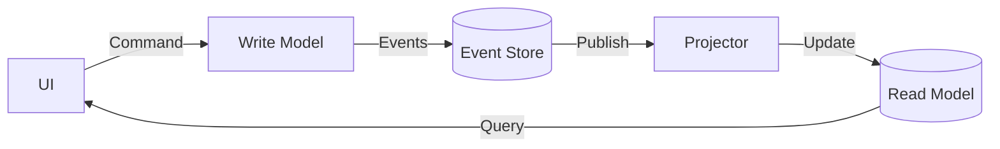

# 第28章：Projectionって何？（読みやすい形を別で作る）🔎✨

---

## 1) Projectionは「表示しやすい形の別データ」だよ😊🧺


イベントソーシングでは、真実（ソース・オブ・トゥルース）は **イベントの列（出来事の履歴）** です📜✨
でも画面や検索で「毎回イベント全部を読んで計算」するのは、だんだんキツくなります😵‍💫

そこで登場するのが **Projection（投影 / 読みモデル / Read Model）** 🎀
イベントを材料にして、**画面・検索・一覧にちょうどいい形のデータ** を別で作っておく考え方です🍱🔎

> ざっくり一言：
> **書く側は“正しさ重視” / 読む側は“見やすさ・速さ重視”** 💪✨

この「読みと書きを分けようね」という発想は、CQRS（Command と Query を分ける）としてもよく説明されます📮👀 ([martinfowler.com][1])

---

## 2) まず超イメージ図（頭の中にこれを置く）🧠✨





* **Command（書き込み）**：ルール（不変条件）を守って、イベントを追加する📮✅
* **Event（出来事）**：追加された事実のログ（変更履歴）📜🧷
* **Projection（読みモデル）**：イベントを受け取って、表示用に整えたデータを更新する🔎🧱

イベント→読みモデル更新のイメージは「イベントを受け取ったProjectionが、読みモデルDB（何でもOK）を普通にCRUDする」みたいに説明されます📦🛠️ ([Kurrent - event-native data platform][2])

---

## 3) なんでProjectionが必要になるの？（嬉しさ）🎁😊


## ① 画面がラクになる🖥️✨

画面って「一覧」「検索」「集計」みたいな **読みやすさ優先** が多いよね📋🔎
Projectionで **表示に必要な形に“先に整形”** しておくと、UI側がめっちゃ単純になります😺

## ② 読み取りが速くなる⚡

読みと書きを分けると、読み側は読み側で最適化できる🌟
「読む回数が多い」「一覧が重い」みたいなときに効くよ〜📈 ([martinfowler.com][1])

## ③ 追加の画面・集計が増えても“作り足せる”🔁✨


イベントは「履歴」なので、あとから「新しい読みモデル」を作りたくなったら
**イベントを最初から流して（リプレイして）作り直せる** のが強いです🔁🧹
そもそもイベントソーシングは、変更をイベント列として保存し、必要ならそこから状態を再構成できる、という考え方です📜🧠 ([martinfowler.com][3])

---

## 4) ここでありがちな勘違い（先に潰す）🧯😆


## ❌ 勘違いA：Projection = “DBのVIEW” でしょ？

違うよ〜🙅‍♀️
Projectionは **イベントを材料にして作る「表示用データ」そのもの**（またはそれを作る処理）だよ🔎🧱

## ❌ 勘違いB：読みモデルにも“ビジネスルール”を入れる？

基本は入れないよ〜🙅‍♀️
ルール（不変条件）で守るのは **書き込み側（Command側）** がメイン✅
読み側は **表示に必要な整形・集計** に寄せるのがコツ🍱✨

## ❌ 勘違いC：読みモデルは1個だけ作るもの？

むしろ逆！😳
**画面ごとに作ってOK**（むしろその方がラク）📋📄📊
「1画面 = 1Projection」くらいの気持ちで始めると迷子になりにくいよ🧭✨

---

## 5) Projection設計のいちばん簡単な手順（迷ったらコレ）🧩😊


## Step 1：まず“画面で欲しいもの”を箇条書き📝🖥️

例（カート画面だと…）🛒✨

* 商品一覧（名前・単価・数量）📦
* 合計金額💰
* 合計点数🔢
* 最終更新日時🕒

## Step 2：それを“イベントから作れる？”でチェック✅🔍

* 合計点数 → `ItemAdded` / `ItemRemoved` で増減できる🔢
* 合計金額 → 単価×数量の積み上げ、またはイベントに単価を入れておく💰
* 商品名 → どこから来る？（商品マスタ参照？イベントにスナップを持つ？）🤔

ここで「イベントのpayloadに何を入れるべきか」が見えてくるよ🍱✨

## Step 3：読みモデルの形（DTO）を決める📦🧾

読みモデルは **“問い合わせに最適な形”** が正義🏆
正規化とか気にしすぎなくてOK（表示が楽なら勝ち）😺✨

## Step 4：更新ルールは“単純”にする🧼

読みモデル更新は、だいたい次のどれかでOK👇

* **加算 / 減算**（カウント、合計など）➕➖
* **置き換え**（最新の名前、ステータスなど）🪄
* **配列に追加 / 削除**（一覧用）🧺

---

## 6) “畳み込み（reduce）”で理解するProjection（ミニコード）🧠🔁


イベントが並んでいて、それを左から順に適用して「表示用の状態」を作る…
これは **reduce（畳み込み）** のノリです✨

```ts
// 例：超ミニ「カート概要」Projection（教材用にかなり簡略）
type CartEvent =
  | { type: "ItemAdded"; itemId: string; price: number; quantity: number; occurredAt: string }
  | { type: "ItemRemoved"; itemId: string; price: number; quantity: number; occurredAt: string };

type CartSummary = {
  itemCount: number;
  totalPrice: number;
  updatedAt: string | null;
};

const emptySummary = (): CartSummary => ({
  itemCount: 0,
  totalPrice: 0,
  updatedAt: null,
});

const applyToSummary = (s: CartSummary, e: CartEvent): CartSummary => {
  switch (e.type) {
    case "ItemAdded":
      return {
        itemCount: s.itemCount + e.quantity,
        totalPrice: s.totalPrice + e.price * e.quantity,
        updatedAt: e.occurredAt,
      };
    case "ItemRemoved":
      return {
        itemCount: s.itemCount - e.quantity,
        totalPrice: s.totalPrice - e.price * e.quantity,
        updatedAt: e.occurredAt,
      };
  }
};

export const projectCartSummary = (events: CartEvent[]): CartSummary =>
  events.reduce(applyToSummary, emptySummary());
```

ポイントはこれだけ👇😊

* Projectionは「イベント列 → 表示用の形」へ変換する処理🔁
* ルールの厳密さより「表示が楽」「速い」を優先してOK🔎⚡
* 壊れたら作り直せる発想（あとで第32章でやるよ）🧹🔁

---

## 7) ミニ演習（この章のゴール）🧪🎀

## 演習A：画面に必要な項目を列挙しよう📝✨

あなたの題材（カート / ToDo / 家計簿など）で、次を3つの画面に対して書いてね👇

1. 一覧画面📋
2. 詳細画面🔎
3. ちょい集計画面📊

それぞれ「欲しい表示項目」を10個以内でOK😺✨

## 演習B：その項目、イベントだけで作れる？チェック✅🔍

各項目に「材料」を書き添えてね👇

* 例）合計金額 → `ItemAdded/Removed` の price と quantity から作る💰
* 例）最終更新 → eventの occurredAt を最後に見たらOK🕒

---

## 8) AI活用（Projectionで迷わないための“型”）🤖✨

## ① 画面要件 → Projection案を出してもらう🧾🔎

プロンプト例（コピペOK）👇

* 「この画面に必要な表示項目を10個以内で」
* 「それぞれを“イベントから作れるか”も一言で」
* 「Projectionを1つにまとめず、画面ごとに分けて」

## ② “イベントpayloadに入れるべき情報”の漏れチェック🕵️‍♀️🍱

プロンプト例👇

* 「この表示項目をProjectionで作るために、イベント側に必要なデータは？」
* 「イベントに入れすぎ注意：本当に必要なものだけに絞って」

## ③ reduce（apply）関数の叩き台を作らせる✍️🧠

プロンプト例👇

* 「CartSummaryの型はこれ。イベント型はこれ。apply関数とproject関数を書いて」
* 「境界条件（0未満になる、など）の注意点もコメントで」

---

## 9) 今日のチェックポイント（3つだけ覚えて帰ろう）🏁😊

* Projectionは **“表示しやすい形を別で作る”** こと🔎✨
* **書く側＝正しさ** / **読む側＝見やすさ・速さ** に寄せる🍱⚡ ([martinfowler.com][1])
* イベント列を **reduceで畳み込む** イメージを持つと一気にわかる🔁🧠

---

## おまけ：2026/02/01時点の関連“最新メモ”🧷🗞️

* TypeScriptのnpm最新安定版は **5.9.3**（npmのLatest表示）です📌 ([npm][4])
* TypeScriptチームは、ネイティブ移植（Project Corsa）に向けた更新を継続して公開中で、6.0は“橋渡し”になる予定と説明されています（Microsoft公式ブログ）🧠⚡ ([Microsoft for Developers][5])
* ネイティブ版のプレビューは npm や VS Code 向けにも案内されています🔧✨ ([Microsoft for Developers][6])
* VS Codeは 2026年1月のリリース（1.108）と、Insiders（1.109）の更新が公開されています🛠️✨ ([code.visualstudio.com][7])

[1]: https://martinfowler.com/bliki/CQRS.html?utm_source=chatgpt.com "CQRS"
[2]: https://www.kurrent.io/blog/event-sourcing-and-cqrs?utm_source=chatgpt.com "Event Sourcing and CQRS - Event Store Blog - Kurrent.io"
[3]: https://martinfowler.com/eaaDev/EventSourcing.html?utm_source=chatgpt.com "Event Sourcing"
[4]: https://www.npmjs.com/package/typescript?utm_source=chatgpt.com "TypeScript"
[5]: https://devblogs.microsoft.com/typescript/progress-on-typescript-7-december-2025/?utm_source=chatgpt.com "Progress on TypeScript 7 - December 2025"
[6]: https://devblogs.microsoft.com/typescript/announcing-typescript-native-previews/?utm_source=chatgpt.com "Announcing TypeScript Native Previews"
[7]: https://code.visualstudio.com/updates?utm_source=chatgpt.com "December 2025 (version 1.108)"
