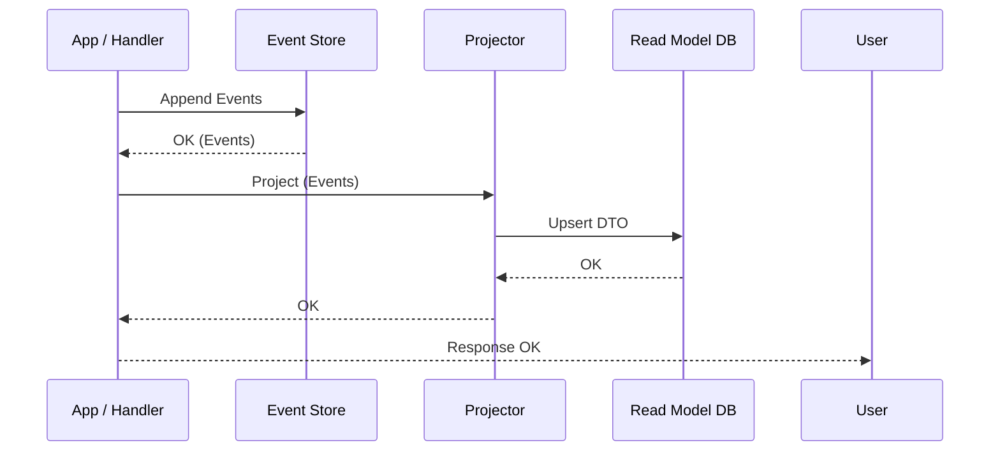

# 第29章：Projection実装①（同期で更新）⚡🧱

## この章でできるようになること 🎯✨

* 「イベントが保存された直後」に、画面用の読みモデル（Projection）を同じ流れで更新できるようになるよ😊
* Projectionが「壊れてもイベントから作り直せる」前提で、**まずは最小の形**を作るよ🧰
* ついでに「同期Projectionの落とし穴（デュアルライト問題）」も“怖くない範囲”で知っておくよ🧨

---

## 1. Projectionって何をするもの？🔎📚

イベントソーシングでは、基本は「出来事（イベント）」をずーっと保存して、必要ならそこから状態を復元するよね🔁
でも画面って「毎回イベント全部読み直して復元」だとしんどい…😵‍💫

そこで **Projection（読みモデル）** の出番！✨
イベントの流れを材料にして、「一覧表示しやすい形」「検索しやすい形」に **別のデータ** を作っておく考え方だよ😊 ([Event-Driven][1])

たとえばショッピングカートなら👇

* 書き込み側（厳密）🛡️：イベント（CartCreated / ItemAdded …）
* 読み取り側（表示最適）🖥️：カート一覧用の「合計点数」「更新日時」だけ持つデータ

---

## 2. 同期で更新ってどういう意味？⚡




**同期Projection** はめちゃ素直で、こういう流れだよ👇

1. Commandを処理する📮
2. EventStoreにイベントをAppendする📦
3. **その直後に** Projectionを更新する🔎✨
4. レスポンスを返す✅

なので「コマンド成功したのに一覧に反映されない😢」みたいな体験が起きにくい！
学習にも小さなアプリにも向いてるよ😊

---

## 3. ただし注意！デュアルライト問題 🧨✍️


同期更新はラクなんだけど、現実では「イベント保存」と「Projection保存」が**別の保存先**になりがち。
このとき **片方だけ成功** すると、データがズレる事故が起きるよ😱

* イベントは保存できた✅
* でもProjection更新でエラー💥
* 画面が古いままになる…😵

この“二重書き込みのリスク”はよく知られていて、対策（例：Outboxなど）が必要になることが多いよ🧯 ([Debezium][2])

この章ではまず **インメモリ** で作って「仕組みを身体で理解」するのが目的だよ🧠✨
（後の章で「再構築」や「非同期」へ進むと、もっと現実寄りになるよ🔁）

---

## 4. 今回作るProjectionの例 🛒📋


「カート一覧用Projection」を作るね😊
カートIDごとに、こんな情報が欲しいとするよ👇

* `cartId`：カートのID
* `itemKinds`：商品種類数（例：りんご＋みかん＝2）🍎🍊
* `totalQty`：合計数量（例：りんご2＋みかん3＝5）🔢
* `updatedAt`：更新日時⏰
* `lastProcessedVersion`：どこまでイベントを反映したか（重複防止）🧷

この `lastProcessedVersion` が地味に大事で、同じイベントを2回食べても太らない（=二重反映しない）仕組みにするよ😺🍰❌

---

## 5. 実装の全体像 🧩🗺️


ざっくり構造はこう👇

* **EventStore**：イベントを保存・読み出し📦
* **Projector**：イベントを受けてProjectionを更新🔎
* **ProjectionRepo**：Projectionを保存（今回はMap）🗂️
* **CommandHandler**：AppendできたらProjectorを呼ぶ📮⚡

---

## 6. コードで作るよ 👩‍💻✨

> ここでは「必要最小限」を一気に置くね！
> ファイル分割してもOKだよ📁😊

## 6.1 Eventの封筒（Envelope）を用意する 📩

イベント本体に「ストリームID」「順番」「時刻」などを付けるよ🧷

```ts
export type StreamId = string;

export type EventEnvelope<E> = {
  streamId: StreamId;
  version: number;          // 1,2,3... と増える
  type: string;             // "CartCreated" みたいな識別子
  data: E;                  // payload
  occurredAt: string;       // ISO文字列
};
```

---

## 6.2 カートイベントを定義する 🛒✨

```ts
export type CartCreated = {
  cartId: string;
};

export type ItemAdded = {
  cartId: string;
  sku: string;
  qty: number;
};

export type ItemRemoved = {
  cartId: string;
  sku: string;
};

export type CartEvent = CartCreated | ItemAdded | ItemRemoved;

export const CartEventTypes = {
  CartCreated: "CartCreated",
  ItemAdded: "ItemAdded",
  ItemRemoved: "ItemRemoved",
} as const;
```

---

## 6.3 超ミニEventStore（AppendしたらEnvelopeで返す）📦✅

`expectedVersion`（楽観ロック）は前の章でやってる想定だけど、ここでも最小で入れておくね🔒

```ts
type AppendResult<E> = { appended: Array<EventEnvelope<E>> };

export class InMemoryEventStore<E> {
  private streams = new Map<StreamId, Array<EventEnvelope<E>>>();

  readStream(streamId: StreamId): Array<EventEnvelope<E>> {
    return this.streams.get(streamId) ?? [];
  }

  appendToStream(
    streamId: StreamId,
    events: Array<{ type: string; data: E }>,
    expectedVersion: number
  ): AppendResult<E> {
    const current = this.readStream(streamId);
    const currentVersion = current.length;

    if (currentVersion !== expectedVersion) {
      throw new Error(`ConcurrencyError: expected=${expectedVersion}, actual=${currentVersion}`);
    }

    const appended: Array<EventEnvelope<E>> = events.map((ev, i) => ({
      streamId,
      version: currentVersion + i + 1,
      type: ev.type,
      data: ev.data,
      occurredAt: new Date().toISOString(),
    }));

    this.streams.set(streamId, [...current, ...appended]);
    return { appended };
  }
}
```

---

## 7. Projectionを作る 🔎📋

## 7.1 Projectionの形（一覧用）🧾

```ts
export type CartSummary = {
  cartId: string;
  itemKinds: number;
  totalQty: number;
  updatedAt: string;
  lastProcessedVersion: number; // ここが超大事🧷
};
```

---

## 7.2 ProjectionRepo（今回はMapでOK）🗂️

```ts
export class InMemoryCartSummaryRepo {
  private map = new Map<string, CartSummary>();

  get(cartId: string): CartSummary | undefined {
    return this.map.get(cartId);
  }

  upsert(summary: CartSummary): void {
    this.map.set(summary.cartId, summary);
  }

  list(): CartSummary[] {
    return [...this.map.values()].sort((a, b) => a.cartId.localeCompare(b.cartId));
  }
}
```

---

## 7.3 Projector（イベントを食べてProjectionを更新）🍴🔎


ポイントは2つだよ😊

* **イベントの順番（version）通りに反映**する
* **lastProcessedVersion以下は無視**して二重反映を防ぐ🧷

```ts
import { CartEventTypes, type CartEvent, type ItemAdded, type ItemRemoved } from "./events";
import type { EventEnvelope } from "./eventEnvelope";
import type { CartSummary } from "./projectionTypes";
import { InMemoryCartSummaryRepo } from "./projectionRepo";

export class CartSummaryProjector {
  constructor(private repo: InMemoryCartSummaryRepo) {}

  project(envelopes: Array<EventEnvelope<CartEvent>>): void {
    // 念のため順番に並べる（保存側が保証してても安全に）🧷
    const sorted = [...envelopes].sort((a, b) => a.version - b.version);

    for (const env of sorted) {
      const cartId = (env.data as any).cartId; // この章では最小でいくよ🙏
      const current = this.repo.get(cartId);

      const last = current?.lastProcessedVersion ?? 0;
      if (env.version <= last) continue; // 二重反映しない💪

      const next = this.applyOne(current, env);
      this.repo.upsert(next);
    }
  }

  private applyOne(
    current: CartSummary | undefined,
    env: EventEnvelope<CartEvent>
  ): CartSummary {
    const now = env.occurredAt;

    if (env.type === CartEventTypes.CartCreated) {
      return {
        cartId: (env.data as any).cartId,
        itemKinds: 0,
        totalQty: 0,
        updatedAt: now,
        lastProcessedVersion: env.version,
      };
    }

    // CartCreatedがまだなら最小の初期値を作る（学習用の保険）🧯
    const base: CartSummary =
      current ??
      ({
        cartId: (env.data as any).cartId,
        itemKinds: 0,
        totalQty: 0,
        updatedAt: now,
        lastProcessedVersion: 0,
      } satisfies CartSummary);

    if (env.type === CartEventTypes.ItemAdded) {
      const e = env.data as ItemAdded;

      // 本当はSKU別に種類数を管理したいけど、この章は“最小”なので簡略化😊
      // itemKindsは「追加が来たら+1」とせず、次の演習でちゃんとやろうね📌
      return {
        ...base,
        totalQty: base.totalQty + e.qty,
        updatedAt: now,
        lastProcessedVersion: env.version,
      };
    }

    if (env.type === CartEventTypes.ItemRemoved) {
      const _e = env.data as ItemRemoved;

      // 簡略化：数量は減らさない（ここも演習で改善できる✨）
      return {
        ...base,
        updatedAt: now,
        lastProcessedVersion: env.version,
      };
    }

    return { ...base, updatedAt: now, lastProcessedVersion: env.version };
  }
}
```

> 「え、itemKindsとかちゃんと計算しないの？😳」
> うん！この章は“同期更新の仕組み”が主役だから、計算の精密さは演習で育てるよ🌱😊

---

## 8. CommandHandlerに同期Projection更新を組み込む 📮⚡


超大事ルール👇
**Appendが成功した後**に、**Appendされたイベントだけ**をProjectorへ渡すよ✅

```ts
import { InMemoryEventStore } from "./eventStore";
import { CartEventTypes, type CartEvent } from "./events";
import { CartSummaryProjector } from "./projector";

export class AddItemToCartHandler {
  constructor(
    private eventStore: InMemoryEventStore<CartEvent>,
    private projector: CartSummaryProjector
  ) {}

  execute(input: { cartId: string; sku: string; qty: number }): void {
    const streamId = input.cartId;

    // 1) Load（過去イベント読む）📼
    const past = this.eventStore.readStream(streamId);
    const expectedVersion = past.length;

    // 2) Decide（本当は不変条件チェックする）🛡️
    if (input.qty <= 0) throw new Error("qty must be positive");

    const newEvents = [
      {
        type: CartEventTypes.ItemAdded,
        data: { cartId: input.cartId, sku: input.sku, qty: input.qty } satisfies CartEvent,
      },
    ];

    // 3) Append（保存）📦
    const { appended } = this.eventStore.appendToStream(streamId, newEvents, expectedVersion);

    // 4) Projection更新（同期）🔎⚡
    this.projector.project(appended);
  }
}
```

ここまでで「コマンド成功 → Projectionも最新」になったよ😊✨

---

## 9. 動作チェック用のミニテスト 🧪🌸

テストは “Given-When-Then” の気持ちでいこうね😊
（テスト環境は何でもいいけど、ここでは雰囲気が伝わる最小にするよ🧁）

```ts
import { describe, it, expect } from "vitest";
import { InMemoryEventStore } from "./eventStore";
import { InMemoryCartSummaryRepo } from "./projectionRepo";
import { CartSummaryProjector } from "./projector";
import { AddItemToCartHandler } from "./handler";
import { CartEventTypes, type CartEvent } from "./events";

describe("同期Projection", () => {
  it("ItemAddedしたら一覧用Projectionが更新される", () => {
    const store = new InMemoryEventStore<CartEvent>();
    const repo = new InMemoryCartSummaryRepo();
    const projector = new CartSummaryProjector(repo);
    const handler = new AddItemToCartHandler(store, projector);

    // Given: カート作成イベントが既にある
    store.appendToStream(
      "cart-1",
      [{ type: CartEventTypes.CartCreated, data: { cartId: "cart-1" } }],
      0
    );

    // When: 商品追加
    handler.execute({ cartId: "cart-1", sku: "apple", qty: 2 });

    // Then: Projectionが更新されている
    const summary = repo.get("cart-1")!;
    expect(summary.totalQty).toBe(2);
    expect(summary.lastProcessedVersion).toBe(2); // Created=1, Added=2
  });
});
```

---

## 10. ミニ演習 ✍️😊


## 演習A：itemKindsをちゃんと計算しよう🍎🍊

今は `totalQty` だけ足してるけど、一覧では「種類数」も欲しいよね！
やり方のヒント👇

* `CartSummary` に `skuSet: string[]` みたいな内部用フィールドを追加してもOK🧺
* もしくは `CartSummaryRepo` 側に「cartId→skuの集合」を別Mapで持ってもOK🗂️

ゴール🎯

* appleを2回追加しても **種類数は1のまま**😊
* apple + orangeなら **種類数2**✨

---

## 演習B：ItemRemovedで種類数と数量を減らそう➖🧮

削除イベントが来たら、Projectionもちゃんと減ってほしいよね😊

* `ItemRemoved` が来たら SKUを集合から外す
* 合計数量も減らす（そのためには「SKUごとの数量」も持つ必要があるかも！）

---

## 11. AI活用プロンプト例 🤖✨

## 11.1 実装を早く進める（叩き台）🚀

* 「`CartSummaryProjector` を、SKU別数量を持って `itemKinds` と `totalQty` を正確に出す形にして。重複イベント（同じversion）が来たら無視する実装も入れて。」

## 11.2 レビューで事故を減らす👀🧯

* 「この同期Projection設計で、二重反映・順序崩れ・例外時の不整合が起きるポイントをチェックして。改善案も箇条書きで。」

## 11.3 テスト追加で守りを固める🧪🛡️

* 「Given-When-Thenで、(1) qty<=0で失敗、(2) 同じイベントを2回projectしても結果が変わらない、(3) versionが飛んだときの扱い、のテストを追加して。」

---

## 12. まとめ 🧁✨

* Projectionは「画面で使いやすい形」にイベントから作る読みモデルだよ🔎 ([Event-Driven][1])
* 同期Projectionは「Append成功の直後に更新」するから、学習にも小規模にも向いてる⚡
* でも現実では二重書き込みの不整合リスクがあるから、知識として“ここが危ない”を押さえるのが大事🧨 ([Debezium][2])
* ちなみにTypeScriptは最近の版で `tsc --init` の初期設定も見直されてたりして、モジュール周りのデフォルトがより実戦寄りになってるよ🧰 ([TypeScript][3])
* Node.jsは偶数版がLTSになっていくルールで、2026年初の時点では v24 が Active LTS として案内されてるよ📌 ([nodejs.org][4])

[1]: https://event-driven.io/en/projections_and_read_models_in_event_driven_architecture/?utm_source=chatgpt.com "Guide to Projections and Read Models in Event-Driven ..."
[2]: https://debezium.io/blog/2020/02/10/event-sourcing-vs-cdc/?utm_source=chatgpt.com "Distributed Data for Microservices — Event Sourcing vs. ..."
[3]: https://www.typescriptlang.org/docs/handbook/release-notes/typescript-5-9.html "TypeScript: Documentation - TypeScript 5.9"
[4]: https://nodejs.org/en/about/previous-releases "Node.js — Node.js Releases"
