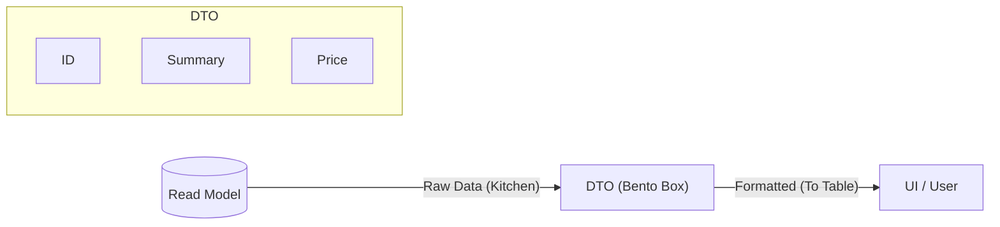

# 第30章：Query API（読むためのAPI/画面）を作る📮👀

## この章でできるようになること🎯✨

* 「読み取り専用」のAPIを作って、画面（一覧・詳細）が欲しいデータをサクッと取れるようにする🖥️💖
* Projection（読みモデル）を **DTO** に整形して返せるようにする🍱✨
* 「入れすぎDTO」「漏れDTO」を避けて、読みやすいAPI設計の型を作る🧠✅

---

## 1) まず“読み側API”って何？🔎✨

イベントソーシングでは、**書き込み（Command）**と**読み取り（Query）**の役割を分けるのが超大事だよ😊🌸

* **Command側**：ルール（不変条件）を守る🛡️ → Eventを生む📜
* **Query側**：画面に必要な形で“読みやすく”返す🧾 → 変更はしない🙅‍♀️

この章は **Query側だけ** を作ります📮👀
（なので、ここで在庫チェックとかの不変条件は基本やらないよ！読み側の責任じゃないからね😉）

---

## 2) いまどきの土台（2026目線の“安心セット”）🧰✨

* TypeScriptは「最新は 5.9」扱いで進めるよ🧡 ([TypeScript][1])
* Node.jsは **v24 がActive LTS** として案内されていて、学習・運用の両面で選びやすいよ🟢 ([Node.js][2])
* Expressは **v5.1.0 が npm のデフォルト（latest）** になってるよ🚀 ([expressjs.com][3])

> ここでは「Express 5 + TypeScript」で、分かりやすく最小のQuery APIを作るね😊✨
> Express 5移行ガイド（codemodもあるよ）も公式にあるよ🧼 ([expressjs.com][4])

---

## 3) まず“APIの形”を決めよう📐🧠✨

今回は例として「カート🛒」で説明するけど、ToDoでも家計簿でも同じ考え方でOKだよ😊🌷

## 作るエンドポイント（最小セット）📮

* `GET /api/carts` … 一覧（画面のリスト用）📋
* `GET /api/carts/:id` … 詳細（画面の詳細用）🔎

## ここでの大切ポイント💡

* **Projectionの内部構造をそのまま返さない**（＝DTOに整形する）🍱✨
* **一覧DTO** と **詳細DTO** は、同じにしなくてOK（むしろ分けた方が親切）🫶

---

## 4) DTO設計のコツ（入れすぎ注意🍱⚠️）




DTOは「画面が欲しいものだけ」入れればOK😊✨
ありがちな事故はこの2つ👇

* **入れすぎDTO**：全部返してしまって、変更に弱くなる😵‍💫
* **漏れDTO**：画面が追加情報を取るためにAPIを何回も叩く羽目になる😇

なので、まず画面を想像して「一覧に必要」「詳細に必要」を分けるよ📋🔎✨

---

## 5) 実装：Projection → DTO → Expressで返す🧱🚀

## フォルダ例（迷子防止🧭）

* `src/readmodel/` … Projection（読みモデル）置き場🔎
* `src/api/` … ExpressとDTO置き場📮
* `src/server.ts` … 起動用🟢

---

## 5-1) DTOを作る🍱✨（一覧用・詳細用）

```ts
// src/api/dto.ts

export type CartSummaryDto = {
  id: string;
  itemCount: number;
  totalYen: number;
  updatedAt: string; // ISO文字列にしておくと画面が扱いやすいよ🧡
};

export type CartDetailDto = CartSummaryDto & {
  items: Array<{
    sku: string;
    name: string;
    unitYen: number;
    qty: number;
  }>;
};
```

ポイント😊💡

* `Date` をそのまま返すより、`updatedAt: string`（ISO）にすると安定しやすいよ✨
* “画面が使う形”に寄せるのがDTOの役目だよ📺💕

---

## 5-2) ReadModel（Projectionの取り出し口）をインターフェース化する🔌✨

「APIがProjectionの内部にベッタリ依存」しないように、**読み取りサービス（QueryService）** を挟むのがきれいだよ🧼💕

```ts
// src/readmodel/cartReadModel.ts
import { CartDetailDto, CartSummaryDto } from "../api/dto.js";

export interface CartReadModel {
  list(params: { limit: number; offset: number }): Promise<CartSummaryDto[]>;
  get(id: string): Promise<CartDetailDto | null>;
}
```

ここでDTOを返してしまう設計にすると、API層がさらに薄くなるよ😊✨
（もちろん「内部型→DTO変換」をAPI層でやってもOK！好みで選べるよ🫶）

---

## 5-3) 例：インメモリProjectionから読む実装（最小）📦✨

「第29章の同期Projection」が `Map` に入ってる想定の、超ミニ版だよ😊
（あなたの題材に合わせて、`items` や計算は自由に変えてね🛒）

```ts
// src/readmodel/inMemoryCartReadModel.ts
import { CartReadModel } from "./cartReadModel.js";
import { CartDetailDto, CartSummaryDto } from "../api/dto.js";

type CartView = {
  id: string;
  items: Array<{ sku: string; name: string; unitYen: number; qty: number }>;
  updatedAt: Date;
};

export class InMemoryCartReadModel implements CartReadModel {
  constructor(private readonly store: Map<string, CartView>) {}

  async list(params: { limit: number; offset: number }): Promise<CartSummaryDto[]> {
    const { limit, offset } = params;

    const all = Array.from(this.store.values())
      .sort((a, b) => b.updatedAt.getTime() - a.updatedAt.getTime());

    return all.slice(offset, offset + limit).map((v) => {
      const itemCount = v.items.reduce((sum, it) => sum + it.qty, 0);
      const totalYen = v.items.reduce((sum, it) => sum + it.unitYen * it.qty, 0);

      return {
        id: v.id,
        itemCount,
        totalYen,
        updatedAt: v.updatedAt.toISOString(),
      };
    });
  }

  async get(id: string): Promise<CartDetailDto | null> {
    const v = this.store.get(id);
    if (!v) return null;

    const itemCount = v.items.reduce((sum, it) => sum + it.qty, 0);
    const totalYen = v.items.reduce((sum, it) => sum + it.unitYen * it.qty, 0);

    return {
      id: v.id,
      itemCount,
      totalYen,
      updatedAt: v.updatedAt.toISOString(),
      items: v.items,
    };
  }
}
```

---

## 5-4) ExpressでQuery APIを作る📮👀✨

### エラーの返し方（小さく統一）🚦

「失敗時の形」がバラバラだと画面が泣くので、最小でいいから統一するよ😊

```ts
// src/api/errors.ts
export type ApiErrorBody = {
  code: "bad_request" | "not_found" | "internal_error";
  message: string;
  details?: unknown;
};
```

### ルーター実装（一覧・詳細）📋🔎

```ts
// src/api/cartQueryRoutes.ts
import express from "express";
import type { Request, Response } from "express";
import type { CartReadModel } from "../readmodel/cartReadModel.js";
import type { ApiErrorBody } from "./errors.js";

export function createCartQueryRouter(readModel: CartReadModel) {
  const router = express.Router();

  // GET /api/carts?limit=20&offset=0
  router.get("/carts", async (req: Request, res: Response) => {
    const limitRaw = req.query.limit ?? "20";
    const offsetRaw = req.query.offset ?? "0";

    const limit = Number(limitRaw);
    const offset = Number(offsetRaw);

    // ゆるっとバリデーション😊（最小でOK）
    if (!Number.isInteger(limit) || limit < 1 || limit > 100) {
      const body: ApiErrorBody = {
        code: "bad_request",
        message: "limit は 1〜100 の整数にしてね😊",
      };
      return res.status(400).json(body);
    }
    if (!Number.isInteger(offset) || offset < 0) {
      const body: ApiErrorBody = {
        code: "bad_request",
        message: "offset は 0以上の整数にしてね😊",
      };
      return res.status(400).json(body);
    }

    const list = await readModel.list({ limit, offset });
    return res.json(list);
  });

  // GET /api/carts/:id
  router.get("/carts/:id", async (req: Request, res: Response) => {
    const id = req.params.id;

    const detail = await readModel.get(id);
    if (!detail) {
      const body: ApiErrorBody = {
        code: "not_found",
        message: `cart ${id} が見つからないよ🥲`,
      };
      return res.status(404).json(body);
    }

    return res.json(detail);
  });

  return router;
}
```

---

## 5-5) アプリ起動（server）🟢✨

```ts
// src/server.ts
import express from "express";
import { createCartQueryRouter } from "./api/cartQueryRoutes.js";
import { InMemoryCartReadModel } from "./readmodel/inMemoryCartReadModel.js";

// 仮のProjection（本当は第29章のProjectionがここに来る想定だよ😊）
const cartStore = new Map();
const readModel = new InMemoryCartReadModel(cartStore);

const app = express();
app.use(express.json());

app.get("/health", (_req, res) => res.json({ ok: true }));

app.use("/api", createCartQueryRouter(readModel));

app.use((err: unknown, _req: express.Request, res: express.Response, _next: express.NextFunction) => {
  console.error(err);
  return res.status(500).json({ code: "internal_error", message: "サーバーでエラーが起きたよ🥲" });
});

app.listen(3000, () => {
  console.log("Query API listening on http://localhost:3000 🥳");
});
```

---

## 6) 動作確認（画面から使うつもりで試す🖥️✨）

ブラウザやREST Clientで叩いてOKだよ😊

* `GET http://localhost:3000/api/carts?limit=20&offset=0` 📋
* `GET http://localhost:3000/api/carts/xxxx` 🔎
* `GET http://localhost:3000/health` 💚

## チェック観点✅

* 一覧は「画面に必要な項目」だけ返ってる？📋
* 詳細は「必要十分」になってる？🔎
* エラー時（400/404）の形は同じ？🚦

---

## 7) ミニ演習🧪✨（2つだけでOK）

## 演習①：一覧に `sort` を追加してみよう🔃😊

* `?sort=updatedAtDesc` / `updatedAtAsc` を受け取って並び替えを切り替える🎛️

## 演習②：詳細に “表示用の合計行” を足してみよう🧾✨

* `items` とは別に `totalYen` があると画面がラクだよね？😉
  （すでに返してるなら、逆に「画面で計算しなくて良い」って価値を味わってね💖）

---

## 8) AI活用（DTOレビューの最強ムーブ🤖💖）

## 使えるプロンプト例✨

* 「この画面（一覧/詳細）に必要な項目だけでDTO案を作って。入れすぎになりそうな項目も指摘して」🍱👀
* 「このDTO、将来変更に弱いところある？“UI都合の変化”に耐える形にして」🧠🔧
* 「エラーの返却形式を統一したい。400/404/500のJSON例を作って」🚦📮

> TypeScriptの型推論や型引数の挙動はバージョンで改善されていくので、型エラーが出たら“型の明示”で直ることも多いよ😊 ([TypeScript][5])

---

## 9) まとめ🎀✨

* Query APIは **Projectionを“画面向けに整形して返す”** のが仕事📮👀
* DTOは「画面が欲しいぶんだけ」🍱（入れすぎ注意⚠️）
* エラー形式を揃えると、フロントがすごく優しくなる🫶✨

次の章では、Projectionを**非同期更新**して「ちょい遅れて反映される世界」も体験していくよ📬⏳

[1]: https://www.typescriptlang.org/download/?utm_source=chatgpt.com "How to set up TypeScript"
[2]: https://nodejs.org/en/about/previous-releases?utm_source=chatgpt.com "Node.js Releases"
[3]: https://expressjs.com/2025/03/31/v5-1-latest-release.html?utm_source=chatgpt.com "Express@5.1.0: Now the Default on npm with LTS Timeline"
[4]: https://expressjs.com/en/guide/migrating-5.html?utm_source=chatgpt.com "Migrating to Express 5"
[5]: https://www.typescriptlang.org/docs/handbook/release-notes/typescript-5-9.html?utm_source=chatgpt.com "Documentation - TypeScript 5.9"
