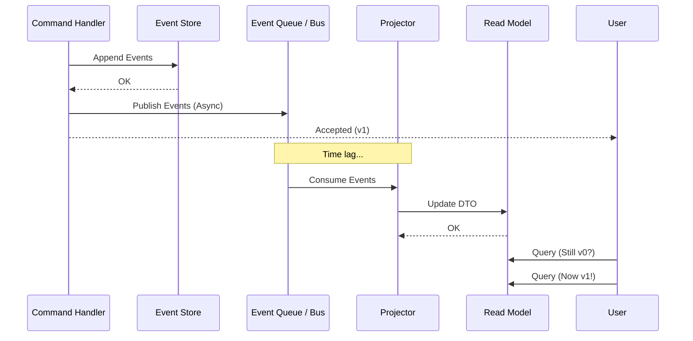

# 第31章：Projection実装②（非同期更新の入口）📬⏳

## この章でできるようになること🎯

* 「書いた直後に読んだら、まだ反映されてない…😳」を**わざと再現**できる
* **疑似キュー＋バックグラウンド更新**で、非同期Projectionの最小形を作れる📦🔁
* 最終的整合性（Eventual Consistency）を**UXとしてどう見せるか**の入口が分かる🖥️🫶

---

## 1. まずは“同期Projection”の限界を思い出そ〜😺🧱

前章（29〜30章）では、イベントをAppendした直後にProjectionも更新してましたよね⚡

でも同期更新って、地味にツラいことがあるの👇

* Projection更新が重いと、**書き込み（Command）が遅くなる**🐢💦
* 画面用の読みモデルが増えるほど、**書き込みがどんどん重くなる**📚📚📚
* 「一覧用」「検索用」「分析用」…全部同期で更新すると地獄😇🔥

なので現実では、Projectionは **非同期（後から）** 更新が多いです📬⏳

---

## 2. 非同期Projectionの全体像🔁📦

イメージはこれ👇（超ざっくり図）





```text
Command → EventStoreにAppend ✅
              │
              ├─（イベントをキューへ）📬
              │
              ▼
     Projector（バックグラウンド）🔁
              │
              ▼
      Projection（読みモデル）🔎
              │
              ▼
         Query API / 画面 👀
```

ポイントはここ👇✨
**Commandは「イベントを積む」までで仕事終了**✅
Projection更新は **別ルート**（キュー＋Projector）で追いかける📬🔁

---

## 3. 最終的整合性ってなに？😳🔁

非同期にするとこうなります👇

* 書いた直後：Queryが古いデータを返すことがある🙈（まだ投影が追いついてない）
* 少し待つと：Queryが新しいデータに追いつく😊（最終的に整合する）

この「**ズレ**」が、最終的整合性（Eventual Consistency）です⏳✨

---

## 4. 今どきの基準バージョン（この章のコードが気持ちよく動くやつ）🧰✨

* Node.js は **v24 系が Active LTS**（安定運用向き）で、LTSの最新版として v24.13.0 が案内されています🟢 ([Node.js][1])
* TypeScript の安定版は **5.9.3 が Latest** として出ています🧡 ([GitHub][2])
* VS Code は 2026/01/08 に 1.108 がリリースされています🪟✨ ([Visual Studio Code][3])

（※TypeScriptは次世代の話題もあるけど、まずは安定版で学ぶのが安心だよ〜😊）

---

## 5. ミニ演習：疑似キューで“遅延Projection”を作る⌛📬🧪

## ゴール🎯

1. CommandでイベントをAppend
2. そのイベントを「疑似キュー」に積む
3. Projectorがちょっと遅れてProjectionを更新する
4. **直後にQueryすると古い** → **待つと新しい** を体験😆✨

---

## 5-1. まずはファイル構成📁

（最小で分けると読みやすいよ〜）

```text
src/
  projection/
    asyncQueue.ts
    projector.ts
    cartSummaryProjection.ts
  demo.ts
```

> ここでは「イベント自体」や「EventStore」は、前の章で作ったものがある前提でOK👌
> この章は **非同期Projectionの仕組み**に集中するよ📬✨

---

## 5-2. 疑似キュー（AsyncQueue）を作る📬🧺

「入れる（enqueue）」と「取り出す（dequeue）」だけの最小キューです😊
取り出しは「無ければ待つ」方式にします⏳

```ts
// src/projection/asyncQueue.ts
export class AsyncQueue<T> {
  private items: T[] = [];
  private waiters: Array<(value: T) => void> = [];

  enqueue(item: T) {
    const waiter = this.waiters.shift();
    if (waiter) {
      waiter(item);
      return;
    }
    this.items.push(item);
  }

  async dequeue(): Promise<T> {
    const item = this.items.shift();
    if (item !== undefined) return item;

    return new Promise<T>((resolve) => {
      this.waiters.push(resolve);
    });
  }

  get length() {
    return this.items.length;
  }
}
```

---

## 5-3. Projection（読みモデル）を“インメモリ”で用意🔎🧠

例として「カートのサマリー」を持つProjectionを用意します🛒✨
（実際はDBだけど、まずはMapでOK👌）

```ts
// src/projection/cartSummaryProjection.ts
export type CartSummary = {
  cartId: string;
  itemCount: number;
  lastEventVersion: number; // どこまで投影したか（超大事！）
  updatedAt: string;        // ISO文字列
};

export class CartSummaryProjection {
  private store = new Map<string, CartSummary>();

  get(cartId: string): CartSummary | undefined {
    return this.store.get(cartId);
  }

  upsert(summary: CartSummary) {
    this.store.set(summary.cartId, summary);
  }
}
```

---

## 5-4. Projector（バックグラウンド更新係）を作る🔁🧑‍🔧

ここが本章のメイン💖
キューからイベントを受け取って、Projectionを更新します。

今回の“体験のための仕掛け”👇

* **わざと遅延（sleep）** を入れて、反映が遅れるのを見せる⌛
* **version順**を守る（順番が壊れると読みモデルが壊れる😵）

```ts
// src/projection/projector.ts
import { AsyncQueue } from "./asyncQueue.js";
import { CartSummaryProjection } from "./cartSummaryProjection.js";

export type EventEnvelope = {
  streamId: string;     // 例: cart-123
  version: number;      // 1,2,3... の通し番号
  type: string;         // 例: "ItemAdded"
  data: any;            // payload（ここでは雑にanyでOK）
  occurredAt: string;   // ISO
  eventId: string;      // 重複対策の入口（後で効いてくる）
};

const sleep = (ms: number) => new Promise((r) => setTimeout(r, ms));

export class CartProjector {
  private processedEventIds = new Set<string>(); // 超簡易な重複排除（入口）
  private running = false;

  constructor(
    private queue: AsyncQueue<EventEnvelope>,
    private projection: CartSummaryProjection
  ) {}

  start() {
    if (this.running) return;
    this.running = true;
    void this.loop();
  }

  stop() {
    this.running = false;
  }

  private async loop() {
    while (this.running) {
      const env = await this.queue.dequeue();

      // 体験用：わざと遅くする⌛
      await sleep(800);

      // 超簡易：重複排除（本格は35章あたりで！）
      if (this.processedEventIds.has(env.eventId)) {
        continue;
      }
      this.processedEventIds.add(env.eventId);

      // version順チェック（順番壊れたら止めるのが第一歩）
      const current = this.projection.get(env.streamId);
      const last = current?.lastEventVersion ?? 0;
      if (env.version !== last + 1) {
        // 本当はDLQに送ったりアラートしたり…（運用の入口）
        throw new Error(
          `Projection out-of-order! stream=${env.streamId}, expected=${last + 1}, got=${env.version}`
        );
      }

      // 投影ロジック（例として ItemAdded / ItemRemoved のみ）
      const itemCountBefore = current?.itemCount ?? 0;

      let itemCountAfter = itemCountBefore;
      if (env.type === "ItemAdded") itemCountAfter += 1;
      if (env.type === "ItemRemoved") itemCountAfter = Math.max(0, itemCountAfter - 1);

      this.projection.upsert({
        cartId: env.streamId,
        itemCount: itemCountAfter,
        lastEventVersion: env.version,
        updatedAt: new Date().toISOString(),
      });
    }
  }
}
```

> ✅ ここで「streamIdをcartIdとして使ってる」けど、学習ではこれで十分だよ〜🫶
> ✅ version順チェックが入るだけで、事故の早期発見力が爆上がりします⚡

---

## 5-5. “古い→待つ→新しい”を体験するデモ🎬😆

demo.ts で体験しよう〜📣

```ts
// src/demo.ts
import { AsyncQueue } from "./projection/asyncQueue.js";
import { CartSummaryProjection } from "./projection/cartSummaryProjection.js";
import { CartProjector, EventEnvelope } from "./projection/projector.js";

const sleep = (ms: number) => new Promise((r) => setTimeout(r, ms));

const queue = new AsyncQueue<EventEnvelope>();
const projection = new CartSummaryProjection();
const projector = new CartProjector(queue, projection);

projector.start();

const cartId = "cart-123";

// Commandの結果として「Append済みイベント」が返ってくる想定で、キューに積む📬
const appendAndEnqueue = (env: EventEnvelope) => {
  queue.enqueue(env);
};

console.log("✅ ItemAdded を投げるよ〜🛒✨");
appendAndEnqueue({
  streamId: cartId,
  version: 1,
  type: "ItemAdded",
  data: { sku: "AAA" },
  occurredAt: new Date().toISOString(),
  eventId: crypto.randomUUID(),
});

// 直後に読む（まだ反映されてないかも😳）
console.log("👀 すぐ読む（たぶん古い）:", projection.get(cartId));

// 少し待って読む（追いつく😊）
await sleep(1000);
console.log("👀 1秒後に読む（追いつく）:", projection.get(cartId));

// もう1個投げて、また体験
console.log("✅ もう1回 ItemAdded 🛒✨");
appendAndEnqueue({
  streamId: cartId,
  version: 2,
  type: "ItemAdded",
  data: { sku: "BBB" },
  occurredAt: new Date().toISOString(),
  eventId: crypto.randomUUID(),
});

console.log("👀 すぐ読む（まだ前のままの可能性）:", projection.get(cartId));
await sleep(1000);
console.log("👀 1秒後に読む（更新される）:", projection.get(cartId));

projector.stop();
```

---

## 6. ここが“肌感覚”ポイント！🫶⏳

「すぐ読む」が古いのは、バグじゃなくて仕様です😊

だから大事なのは👇

## **ズレを“UXとしてどう扱うか”** 🖥️💬

---

## 7. 遅延を“いい感じ”に見せる定番アイデア集✨🧠

## 7-1. 「更新中…」を出す🔄🫧

* 画面のどこかに「最終更新: 12:34:56」みたいに出す⏱️
* 反映が遅れてる間は「更新中」バッジを出す🟡

## 7-2. Commandは「受付ID」を返して、反映完了を待てるようにする🧾✅

* Command結果：`{ accepted: true, operationId: "..." }`
* 画面は `GET /operations/:id` をポーリングして「反映完了」を待つ📡👀

## 7-3. 「自分が書いた結果だけは即見える」ルートを作る🪞✨

* 詳細画面だけは、Projectionじゃなく**イベント列から一時的に再計算**して表示
* 一覧や検索はProjection（非同期）でOK👌

（このへんは実務でもめっちゃ使われるよ〜！）

---

## 8. 非同期Projectionで起きがちな事故あるある😵‍💫⚠️

## 8-1. 順番が崩れる（Out-of-order）📼💥

* **version順チェック**は最低ライン✅（今回入れたやつ）
* 実際のキューでも「同じstreamIdは順番が守られる設計」に寄せるのが大事🧠

## 8-2. 重複が来る（At-least-once）🔁😳

* キューは「たまに同じメッセージが複数回届く」前提になりがち
* だから投影側は**冪等（同じのが来ても大丈夫）**が必要
* 今回は `eventId` のSetで“入口”だけ体験したよ🧷✨

## 8-3. 失敗イベント（Poison）☠️📩

* 1件が失敗すると、その先が詰まる…が起きがち
* だから現実は「隔離（DLQ）」や「リトライ回数制限」などを入れる🧯

---

## 9. 🤖 AI拡張に投げると便利なプロンプト（コピペ用）💬✨

## 9-1. 投影ロジックの抜け漏れチェック👀✅

```text
イベント種別: ItemAdded, ItemRemoved, QuantityChanged がある前提で、
CartSummaryProjection の itemCount を更新するロジックの抜け漏れや矛盾を指摘して。
「どのイベントで何が起きるべきか」を箇条書きで。
```

## 9-2. テスト観点を増やす🧪🌸

```text
非同期Projection（キュー＋Projector）のテスト観点を10個出して。
特に「順番」「重複」「失敗」「遅延」「停止/再開」を厚めに。
```

## 9-3. “UXの見せ方”案を出す🖥️💡

```text
最終的整合性がある画面で、ユーザーが不安にならないUI案を8個出して。
「更新中表示」「最終更新時刻」「再読み込み」なども含めて。
```

---

## 10. まとめ🧁✨

* 非同期Projectionは「**書き込みを軽くする**」ための超重要テクです📬✅
* その代わり「**読みにズレが出る**」＝最終的整合性が発生します⏳
* だから、設計としては

  * **順番（version）**
  * **重複（冪等）**
  * **失敗（隔離/リトライ）**
    を意識しつつ、UXで不安を消すのがコツだよ〜😊🫶

次の章では、Projectionを「壊しても作り直せる」最強技、**リプレイ再構築**に進むよ！🔁🧹✨

[1]: https://nodejs.org/en/about/previous-releases "Node.js — Node.js Releases"
[2]: https://github.com/microsoft/typescript/releases "Releases · microsoft/TypeScript · GitHub"
[3]: https://code.visualstudio.com/updates "December 2025 (version 1.108)"
