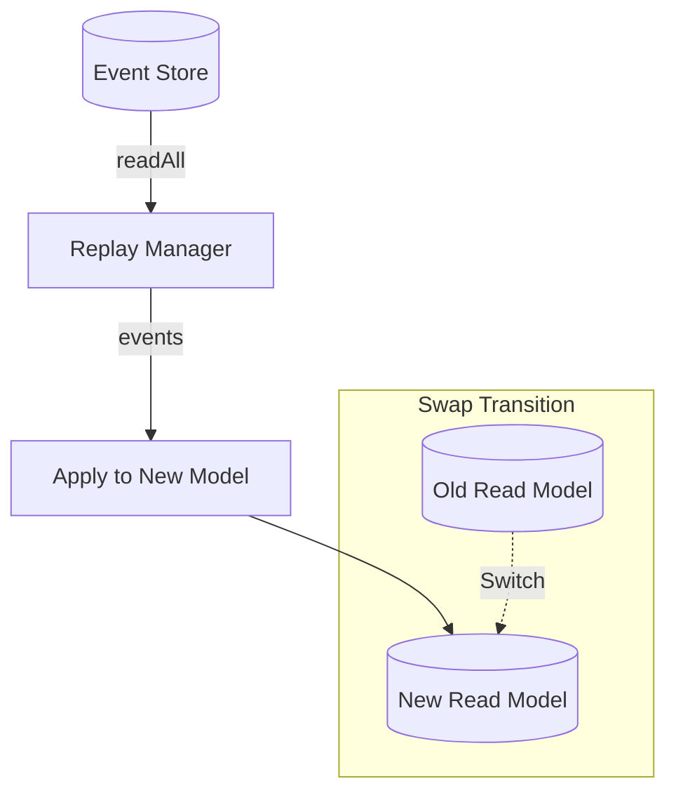

# 第32章：Projection再構築（リプレイ）🔁🧹

## この章でできるようになること 🎯✨

* 壊れた（または古くなった）Projection（読みモデル）を **イベントの履歴から作り直す** 仕組みが作れる🔁
* 「作り直しの安全なやり方（止める？並行で作る？切り替える？）」を選べる🧯
* 「速く・安全に・失敗しにくく」リプレイするためのコツがわかる⚡🧠

---

## 1. まず確認：Projection再構築ってなに？🤔🔎

Projection（読みモデル）は、**画面表示・検索・一覧**をラクにするための“表示用データ”だったよね📋✨
でも、Projectionは **イベントの“正本”ではない** ので、こんなことが起きがち👇

* バグで間違った集計になった😵‍💫
* 表示項目を増やしたくてProjectionの形を変えた🛠️
* 非同期更新で途中からズレた（いわゆるドリフト）🌀
* 新しいProjectionを追加したい（過去分も全部作りたい）🌱

ここで効いてくるのが **リプレイ（Replay）**！
イベントを最初から流して、Projectionを **ゼロから再生成** するよ🔁🧹




「読みモデルを作り直せる」ことは、イベント駆動でよく語られる大きな強みの1つだよ。([Architecture Weekly][1])

---

## 2. 「Rehydrate」との違い⚠️（ここ超大事！）🧠


* **Rehydrate（復元）**：1つの集約（1ストリーム）をイベント数個〜数十個で復元🔁
* **Projection再構築（リプレイ）**：**全ストリームの大量イベント**を流して読みモデルを作り直す🔁🔁🔁

「10件の復元」と「1000万件の再構築」は別ゲーム🎮💦
だから、再構築では **速度・安全性・途中再開** が超重要になるよ。([EventSourcingDB][2])

---

## 3. 再構築のやり方は2つある🧯✨

### A) 破壊的リビルド（いったん消して作り直す）🧨

1. Projectionを全削除🗑️
2. イベントを最初からリプレイ🔁
3. Projection完成✅

**メリット**：実装が簡単😊
**デメリット**：作り直し中、読めない/古い/不安定になりがち😵

### B) シャドーリビルド（別場所で作って切り替える）👻➡️✅


1. 新Projection（影）を別テーブル/別DB/別コレクションに作る🧪
2. 影にイベントをリプレイ🔁
3. 完成したら切り替え（スワップ）🔄

**メリット**：本番の読み取りを止めにくい✨
**デメリット**：切り替え設計が少し必要🧠

「大きめのサービスほどBが好まれがち」だよ。リビルド中のロックや切り替え、バックフィル（過去分の埋め戻し）をどう安全にやるかが論点になりやすい。([Architecture Weekly][1])

---

## 4. 今回つくるもの（最小だけど実戦っぽい）🧱✨

題材：ショッピングカート🛒

* イベント（例）：`CartCreated`, `ItemAdded`, `QtyChanged`, `ItemRemoved`, `CartCheckedOut`
* Projection：`CartSummary`（カート一覧用の集計）

そして、この章の主役👇

* `rebuildCartSummaryProjection()`：イベントを全部読んで、Projectionを作り直す🔁

テストは Vitest を使うよ🧪（スナップショットも便利！）([Vitest][3])

---

## 5. 実装していこう！💻✨（TypeScript）

### 5.1 イベント型を「迷子にならない形」にする🧠📦

ポイントは2つだよ👇

* `type` を持つ **判別可能Union** にする（switchが強い！）🔀
* Payloadは「事実」だけ（派手な計算結果は入れない）🍱

```ts
// src/domain/cartEvents.ts
export type CartEvent =
  | { type: "CartCreated"; cartId: string; createdAt: string }
  | { type: "ItemAdded"; cartId: string; sku: string; qty: number }
  | { type: "QtyChanged"; cartId: string; sku: string; qty: number }
  | { type: "ItemRemoved"; cartId: string; sku: string }
  | { type: "CartCheckedOut"; cartId: string; orderId: string; checkedOutAt: string };

// イベントストアに入る形（メタ付き）
export type StoredEvent<E> = {
  position: bigint;     // 全体で単調増加の通し番号（再構築の命！）
  streamId: string;     // 例: cart-<cartId>
  version: number;      // ストリーム内の通し番号
  id: string;           // 重複排除にも使える（UUID想定）
  occurredAt: string;   // ISO文字列
  event: E;
};
```

💡`position` があると「どこまで処理した？」が一発でわかるので、再構築にめちゃ強いよ🔥
（本物のイベントストアやログでも、だいたい“グローバル位置”みたいな概念があることが多いよ📼）

---

### 5.2 最小EventStore（全件読み＝readAllを追加）📚🔁

再構築は **全イベントを読む** ので `readAll` が欲しい！


```ts
// src/es/inMemoryEventStore.ts
import { StoredEvent } from "../domain/cartEvents.js";

type AppendResult = { nextVersion: number };

export class InMemoryEventStore<E> {
  private all: StoredEvent<E>[] = [];
  private streams = new Map<string, StoredEvent<E>[]>();
  private nextPos = 1n;

  appendToStream(streamId: string, expectedVersion: number, events: Omit<StoredEvent<E>, "position" | "streamId" | "version">[]): AppendResult {
    const stream = this.streams.get(streamId) ?? [];
    const currentVersion = stream.length;

    if (expectedVersion !== currentVersion) {
      throw new Error(`CONCURRENCY_CONFLICT expected=${expectedVersion} actual=${currentVersion}`);
    }

    for (const e of events) {
      const stored: StoredEvent<E> = {
        position: this.nextPos++,
        streamId,
        version: stream.length,
        id: e.id,
        occurredAt: e.occurredAt,
        event: e.event,
      };
      stream.push(stored);
      this.all.push(stored);
    }

    this.streams.set(streamId, stream);
    return { nextVersion: stream.length };
  }

  readStream(streamId: string): StoredEvent<E>[] {
    return [...(this.streams.get(streamId) ?? [])];
  }

  // ✅ 再構築用：positionでページングできる全体読み
  readAll(fromExclusivePosition: bigint, maxCount: number): StoredEvent<E>[] {
    const result: StoredEvent<E>[] = [];
    for (const e of this.all) {
      if (e.position > fromExclusivePosition) {
        result.push(e);
        if (result.length >= maxCount) break;
      }
    }
    return result;
  }
}
```

---

### 5.3 Projection（CartSummary）を作る📋✨

Projectionは **イベントを受けたら更新**、が基本だよ⚡
ここでは「一覧に必要な最小集計」を持つね👇

```ts
// src/projections/cartSummary.ts
import { CartEvent } from "../domain/cartEvents.js";

export type CartSummary = {
  cartId: string;
  distinctItems: number; // SKUの種類数
  totalQty: number;      // 合計個数
  checkedOut: boolean;
};

export class CartSummaryStore {
  private byId = new Map<string, CartSummary>();

  reset() {
    this.byId.clear();
  }

  get(cartId: string): CartSummary | undefined {
    return this.byId.get(cartId);
  }

  getAll(): CartSummary[] {
    return [...this.byId.values()].sort((a, b) => a.cartId.localeCompare(b.cartId));
  }

  // Upsertだけあれば最小で回せる👍
  upsert(summary: CartSummary) {
    this.byId.set(summary.cartId, summary);
  }
}

type CartWorking = {
  cartId: string;
  qtyBySku: Map<string, number>;
  checkedOut: boolean;
};

export function applyEventToCartWorking(state: CartWorking | undefined, ev: CartEvent): CartWorking {
  const getOrCreate = (): CartWorking => ({
    cartId: ev.cartId,
    qtyBySku: new Map<string, number>(),
    checkedOut: false,
  });

  const s = state ?? getOrCreate();

  switch (ev.type) {
    case "CartCreated":
      return getOrCreate();

    case "ItemAdded": {
      const prev = s.qtyBySku.get(ev.sku) ?? 0;
      s.qtyBySku.set(ev.sku, prev + ev.qty);
      return s;
    }

    case "QtyChanged": {
      s.qtyBySku.set(ev.sku, Math.max(0, ev.qty));
      if ((s.qtyBySku.get(ev.sku) ?? 0) === 0) s.qtyBySku.delete(ev.sku);
      return s;
    }

    case "ItemRemoved":
      s.qtyBySku.delete(ev.sku);
      return s;

    case "CartCheckedOut":
      s.checkedOut = true;
      return s;
  }
}

export function toSummary(s: CartWorking): CartSummary {
  let totalQty = 0;
  for (const qty of s.qtyBySku.values()) totalQty += qty;

  return {
    cartId: s.cartId,
    distinctItems: s.qtyBySku.size,
    totalQty,
    checkedOut: s.checkedOut,
  };
}
```

📝ここは「**イベントの適用漏れ**」が起きやすい場所！
イベントを追加したら、Projection側の `switch` も必ず更新だよ🚨

---

### 5.4 いよいよ再構築（リプレイ）本体！🔁🧹


再構築の手順はシンプル👇

1. Projectionを初期化（Aなら削除、Bなら影ストアを新規）🧽
2. イベントを `readAll` で少しずつ読む（ページング）📦
3. 1件ずつ適用してProjectionを更新🔁
4. 最後まで行ったら完成✅

```ts
// src/projections/rebuildCartSummary.ts
import { InMemoryEventStore } from "../es/inMemoryEventStore.js";
import { CartEvent, StoredEvent } from "../domain/cartEvents.js";
import { CartSummaryStore, applyEventToCartWorking, toSummary } from "./cartSummary.js";

export type RebuildResult = {
  processed: number;
  lastPosition: bigint;
};

export async function rebuildCartSummaryProjection(
  eventStore: InMemoryEventStore<CartEvent>,
  targetStore: CartSummaryStore,
  opts?: { batchSize?: number; fromExclusivePosition?: bigint }
): Promise<RebuildResult> {
  const batchSize = opts?.batchSize ?? 500;
  let from = opts?.fromExclusivePosition ?? 0n;

  // A) 破壊的リビルドなら reset（Bなら影ストアを渡せばOK）
  targetStore.reset();

  // Projection作成用の作業状態（本当は永続化してもOK）
  const workingByCartId = new Map<string, ReturnType<typeof applyEventToCartWorking>>();

  let processed = 0;

  while (true) {
    const batch: StoredEvent<CartEvent>[] = eventStore.readAll(from, batchSize);
    if (batch.length === 0) break;

    for (const e of batch) {
      const cartId = e.event.cartId;
      const prev = workingByCartId.get(cartId);
      const next = applyEventToCartWorking(prev, e.event);
      workingByCartId.set(cartId, next);

      // ✅ ここで都度Projection更新（最小）
      targetStore.upsert(toSummary(next));

      processed++;
      from = e.position;
    }
  }

  return { processed, lastPosition: from };
}
```

💡`batchSize` があると大量イベントでもメモリが破裂しにくいよ💥回避！
「再構築は大量イベントを処理することがある」前提で、最初からページングしとくのがいいよ。([EventSourcingDB][2])

---

## 6. シャドーリビルド版（安全寄り）👻🔄

本番の読み取りを安定させたいなら、ざっくりこんな流れ👇

* 影ストア `shadowStore` を作る
* `rebuild(..., shadowStore)` で影だけ育てる🌱
* 完成したら **切り替え（swap）** 🔄

```ts
// src/projections/swapExample.ts
import { CartSummaryStore } from "./cartSummary.js";

export class SwappableCartSummary {
  private active = new CartSummaryStore();

  readOnly(): CartSummaryStore {
    return this.active;
  }

  swapFrom(shadow: CartSummaryStore) {
    // ここでは“中身を移す”ことで疑似swap（本番はテーブル切替などが多い）
    const next = new CartSummaryStore();
    for (const s of shadow.getAll()) next.upsert(s);
    this.active = next;
  }
}
```

「切り替え時に書き込みが走ってたらどうする？」みたいな話が出てくるので、実務ではロックや切り替え手順（短時間停止、二重書き、差分追いかけ）をちゃんと決めるよ🧯([Architecture Weekly][1])

---

## 7. ミニ演習：Projectionを壊して、リプレイで直す🧪💥➡️✅

### お題🎯

1. `CartSummaryStore` の中身をわざと消す🗑️
2. `rebuildCartSummaryProjection()` を実行🔁
3. 一覧が復活するのを確認👀✨

### ありがちな“壊し方”例😈

* `distinctItems` を間違えて `totalQty` と同じにしてしまう
* `ItemRemoved` の処理を書き忘れる
* `QtyChanged` で0になったSKUを消し忘れる

直す時は、イベントを1件ずつ追うより「リプレイして結果を見て、差分を確認」が早いよ🚀

---

## 8. テスト（Given-When-Thenっぽく）🧪🌸


Projection再構築は「入力＝イベント列、出力＝読みモデル」だから、テストがめちゃやりやすい！✨
Node.js のLTS状況はこまめに変わるけど、最近のラインではLTSの運用が前提になりやすいよ。([Node.js][4])
（TypeScript本体の安定版は 5.9.3 が “Latest” として配布されているよ。([npm][5])）

```ts
// tests/rebuildCartSummary.test.ts
import { describe, it, expect } from "vitest";
import { InMemoryEventStore } from "../src/es/inMemoryEventStore.js";
import { CartEvent } from "../src/domain/cartEvents.js";
import { CartSummaryStore } from "../src/projections/cartSummary.js";
import { rebuildCartSummaryProjection } from "../src/projections/rebuildCartSummary.js";

const iso = (d: string) => new Date(d).toISOString();

describe("Projection rebuild (replay)", () => {
  it("rebuilds CartSummary from all events", async () => {
    const store = new InMemoryEventStore<CartEvent>();
    const proj = new CartSummaryStore();

    // Given（過去イベント）
    store.appendToStream("cart-A", 0, [
      { id: "e1", occurredAt: iso("2026-01-01"), event: { type: "CartCreated", cartId: "A", createdAt: iso("2026-01-01") } },
      { id: "e2", occurredAt: iso("2026-01-01"), event: { type: "ItemAdded", cartId: "A", sku: "SKU-1", qty: 2 } },
      { id: "e3", occurredAt: iso("2026-01-01"), event: { type: "ItemAdded", cartId: "A", sku: "SKU-2", qty: 1 } },
      { id: "e4", occurredAt: iso("2026-01-01"), event: { type: "QtyChanged", cartId: "A", sku: "SKU-1", qty: 5 } },
    ]);

    store.appendToStream("cart-B", 0, [
      { id: "e5", occurredAt: iso("2026-01-02"), event: { type: "CartCreated", cartId: "B", createdAt: iso("2026-01-02") } },
      { id: "e6", occurredAt: iso("2026-01-02"), event: { type: "ItemAdded", cartId: "B", sku: "SKU-9", qty: 1 } },
      { id: "e7", occurredAt: iso("2026-01-02"), event: { type: "ItemRemoved", cartId: "B", sku: "SKU-9" } },
    ]);

    // When（再構築）
    const result = await rebuildCartSummaryProjection(store, proj, { batchSize: 2 });

    // Then（読みモデルが正しい）
    expect(result.processed).toBe(7);
    expect(proj.get("A")).toEqual({ cartId: "A", distinctItems: 2, totalQty: 6, checkedOut: false });
    expect(proj.get("B")).toEqual({ cartId: "B", distinctItems: 0, totalQty: 0, checkedOut: false });

    // おまけ：スナップショット（差分が見やすい）
    expect(proj.getAll()).toMatchSnapshot();
  });
});
```

スナップショットは「Projectionの形が変わった時の差分確認」に強いよ📸🧪([Vitest][3])

---

## 9. 速く・安全にリプレイするコツ集⚡🧯

### 9.1 パフォーマンスのコツ⚡

* **ページング**（今回の `batchSize`）は最初から入れる📦
* 重い計算は避ける（Projectionは“表示用”なので簡潔に）🍱
* 大量再構築は「10件の復元」と違うので、処理量前提で考える🔁💦([EventSourcingDB][2])

### 9.2 安全運用のコツ🧯

* 「破壊的リビルド」中に読まれると事故りがち💥
* 本番は **シャドーリビルド→切り替え** が安心寄り👻🔄
* ロック/切替/バックフィルなどの“手順”が超重要になる🧠🧯([Architecture Weekly][1])

### 9.3 途中再開（チェックポイント）🪜

実務では「何時間もかかる再構築」があるので👇

* `lastPosition` を保存して、落ちても続きから再開できるようにする🔁
* 影ストア方式なら「完成するまで表に出さない」もやりやすい😊

---

## 10. AI活用（超おすすめ）🤖✨

### 10.1 GitHub Copilot でやると速いこと⚡

* `switch(ev.type)` の分岐をイベント型から自動生成してもらう🔀
* 「イベント追加したのにProjection更新忘れ」をレビューで検出してもらう👀

### 10.2 OpenAI Codex に投げると強い質問例💬

* 「このProjectionはリプレイで決定的（deterministic）になる？不安点を指摘して」🕵️‍♀️
* 「シャドーリビルドの切り替え手順を、落とし穴込みでチェックリスト化して」📋
* 「バッチ処理でメモリが増えない書き方になってる？改善案ちょうだい」🧠⚡

---

## まとめ🎀

* Projectionは **壊れても作り直せる**（イベントが正本）🔁✨
* 再構築は「大量イベント前提」だから、**ページング・安全な切替・途中再開** がカギ🗝️
* テストは「イベント列→読みモデル」で超書きやすい🧪🌸（スナップショットも便利📸）([Vitest][3])

[1]: https://www.architecture-weekly.com/p/rebuilding-event-driven-read-models?utm_source=chatgpt.com "Rebuilding Event-Driven Read Models in a safe and ..."
[2]: https://docs.eventsourcingdb.io/best-practices/optimizing-event-replays/?utm_source=chatgpt.com "Optimizing Event Replays - EventSourcingDB"
[3]: https://vitest.dev/guide/snapshot?utm_source=chatgpt.com "Snapshot | Guide"
[4]: https://nodejs.org/en/about/previous-releases?utm_source=chatgpt.com "Node.js Releases"
[5]: https://www.npmjs.com/package/typescript?activeTab=versions&utm_source=chatgpt.com "typescript"
