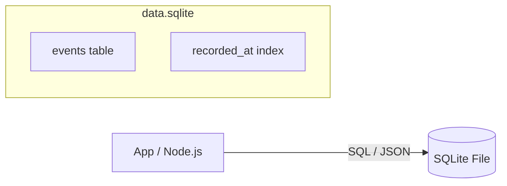

# 第33章：イベント永続化（まずはSQLiteでOK）🗄️✨

## この章でできるようになること 🎯😊

* イベントを **SQLiteに保存** できるようになる 🧾➡️🗄️
* **インメモリEventStore** を **SQLite版に差し替え** できる 🔁✨
* `streamId + version` で **順番を守って保存** できる（壊れない！）🔢🔒
* ついでに「後で困らない」**テーブル設計のコツ**がわかる 🧠💡

---

## まず感覚づくり：イベント永続化って何が嬉しいの？ 🌸

インメモリだけだと…

* アプリ落ちたら **履歴が全部消える** 😱💥
* 再起動したら **復元できない** 🔁❌
* 「監査ログ」「いつ何が起きた？」が **本番だと必須** になりがち 🕵️‍♀️📜

なので、この章では **イベント（事実）をDBに積む** ようにします🧺✨

---

## どのSQLiteの使い方にする？（2026の“今どき”事情）🧭✨

### ✅いちばんラク：`node:sqlite`（Node標準）🧰

Node本体に **SQLiteモジュールが入ってる** ので、外部ライブラリ無しで使えます。しかも `DatabaseSync` で **同期API** が用意されています。([Node.js][1])
※ただし「実験的（Active development）」扱いは続いています。([Node.js][1])

### ✅本番寄りで人気：`better-sqlite3` 🚀

速くて使いやすい（同期API）で人気が高いです。([GitHub][2])
ただしネイティブ拡張なので、Node更新と相性でビルドがコケる話も時々あります（環境で差が出やすい）😵‍💫🧱([GitHub][3])

### ✅クラウド寄りも視野：`@libsql/client` ☁️

ローカルSQLiteファイルも扱えて、将来リモートDB（libSQL/Turso系）も視野に入ります。2026年1月にも更新されています。([NPM][4])

### ⚠️注意：昔ながらの `sqlite3`（npm）📦

npmの `sqlite3` は「最終更新がかなり前」になってきています。([NPM][5])

👉 この教材では **まずラクに進めるために `node:sqlite` を採用** して進めます🧁✨
（あとで `better-sqlite3` に差し替えるのも超カンタンな構成にします👍）

---

## 1. Eventsテーブル設計：最小で強い形にする 💪🗄️




イベント保存で最重要なのはここ👇
|:---|:---|
**「同じstreamIdの中で、versionが1,2,3…と絶対に並ぶ」** 🔢✨

## テーブル案（最小）🧾

* `stream_id`：どの集約のイベント列？（＝1集約 = 1ストリーム）🧺
* `version`：そのストリーム内の連番（順番）📼
* `type`：イベント種類（例：`ItemAdded`）🏷️
* `data`：payload（JSON文字列）🍱
* `meta`：metadata（JSON文字列）🏷️🍱
* `recorded_at`：保存時刻（ISO文字列でOK）⏰

💡ポイント：

* **主キーは `(stream_id, version)`** にする（順番の重複を物理的に禁止）🔒✨
* 読み取りは `ORDER BY version`（これが命）❤️

---

## 2. スキーマを作るSQL 🧱✨

```sql
CREATE TABLE IF NOT EXISTS events (
  stream_id   TEXT    NOT NULL,
  version     INTEGER NOT NULL,
  type        TEXT    NOT NULL,
  data        TEXT    NOT NULL,
  meta        TEXT    NOT NULL,
  recorded_at TEXT    NOT NULL,
  PRIMARY KEY (stream_id, version)
) WITHOUT ROWID;

CREATE INDEX IF NOT EXISTS idx_events_recorded_at
ON events (recorded_at);
```

* `WITHOUT ROWID` は軽量化テク（必須じゃないけど、気持ちいい）🪶✨
* `recorded_at` のINDEXは、後で「全イベントを流してProjection再構築」みたいな時に役立つことが多いよ🔁🔎

---

## 3. まずは“SQLite版EventStore”を作ろう 🧩🗄️

ここからは「前の章で作ったEventStore」を **差し替えできる形** にします🔁✨
（インターフェースを守れば勝ち！🏆）

---

## 3.1 型（イベントの形）🧠🧾

```ts
export type JsonObject = Record<string, unknown>;

export type StoredEvent = {
  streamId: string;
  version: number;
  type: string;
  data: JsonObject;
  meta: JsonObject;
  recordedAt: string; // ISO
};

export type NewEvent = {
  type: string;
  data: JsonObject;
  meta?: JsonObject;
};

export class ConcurrencyError extends Error {
  constructor(
    public readonly streamId: string,
    public readonly expectedVersion: number,
    public readonly actualVersion: number,
  ) {
    super(
      `ConcurrencyError: stream=${streamId} expected=${expectedVersion} actual=${actualVersion}`,
    );
  }
}
```

---

## 3.2 `node:sqlite` でDBを開いて、スキーマ作る 🗄️🛠️

Node標準の `node:sqlite` は `DatabaseSync` が使えます。([Node.js][1])

```ts
import { DatabaseSync } from "node:sqlite";
import { randomUUID } from "node:crypto";

export class SqliteEventStore {
  private db: DatabaseSync;

  constructor(dbPath: string) {
    this.db = new DatabaseSync(dbPath);

    // ちょい快適設定（安全寄り）
    this.db.exec(`PRAGMA journal_mode = WAL;`);
    this.db.exec(`PRAGMA synchronous = NORMAL;`);

    this.db.exec(`
      CREATE TABLE IF NOT EXISTS events (
        stream_id   TEXT    NOT NULL,
        version     INTEGER NOT NULL,
        type        TEXT    NOT NULL,
        data        TEXT    NOT NULL,
        meta        TEXT    NOT NULL,
        recorded_at TEXT    NOT NULL,
        PRIMARY KEY (stream_id, version)
      ) WITHOUT ROWID;

      CREATE INDEX IF NOT EXISTS idx_events_recorded_at
      ON events (recorded_at);
    `);
  }

  close() {
    this.db.close();
  }

  // ストリームの最新versionを取る
  private getCurrentVersion(streamId: string): number {
    const stmt = this.db.prepare(
      `SELECT version
       FROM events
       WHERE stream_id = ?
       ORDER BY version DESC
       LIMIT 1`,
    );
    const row = stmt.get(streamId) as { version?: number } | undefined;
    return row?.version ?? 0;
  }

  // ストリームを読む
  readStream(streamId: string): StoredEvent[] {
    const stmt = this.db.prepare(
      `SELECT stream_id, version, type, data, meta, recorded_at
       FROM events
       WHERE stream_id = ?
       ORDER BY version ASC`,
    );

    const rows = stmt.all(streamId) as Array<{
      stream_id: string;
      version: number;
      type: string;
      data: string;
      meta: string;
      recorded_at: string;
    }>;

    return rows.map((r) => ({
      streamId: r.stream_id,
      version: r.version,
      type: r.type,
      data: JSON.parse(r.data) as JsonObject,
      meta: JSON.parse(r.meta) as JsonObject,
      recordedAt: r.recorded_at,
    }));
  }

  // Append（expectedVersion付き）
  appendToStream(streamId: string, expectedVersion: number, events: NewEvent[]) {
    if (events.length === 0) return;

    // 1つの塊で保存しないと壊れるのでトランザクション！
    this.db.exec("BEGIN IMMEDIATE TRANSACTION;");
    try {
      const actualVersion = this.getCurrentVersion(streamId);
      if (actualVersion !== expectedVersion) {
        throw new ConcurrencyError(streamId, expectedVersion, actualVersion);
      }

      const insert = this.db.prepare(
        `INSERT INTO events (stream_id, version, type, data, meta, recorded_at)
         VALUES (?, ?, ?, ?, ?, ?)`,
      );

      const recordedAt = new Date().toISOString();

      for (let i = 0; i < events.length; i++) {
        const version = expectedVersion + i + 1;
        const e = events[i];

        const meta = {
          eventId: randomUUID(),
          recordedAt,
          ...e.meta,
        };

        insert.run(
          streamId,
          version,
          e.type,
          JSON.stringify(e.data),
          JSON.stringify(meta),
          recordedAt,
        );
      }

      this.db.exec("COMMIT;");
    } catch (err) {
      this.db.exec("ROLLBACK;");
      throw err;
    }
  }
}
```

### ここ、超重要ポイントだよ〜！🥺✨

* `BEGIN IMMEDIATE` にすることで「書き込み開始」を先に確保しやすくなる🧯
* `expectedVersion` と `actualVersion` を比べて **競合を検知** する🔒
* 保存は **必ずトランザクション** でまとめる（途中で落ちたら泣く😭）

---

## 4. 既存のユースケースに差し替える 🔁🧩

前の章までが「インメモリEventStore」だったとしたら、やることはこれだけ👇

## 4.1 置き換え例 🪄

```ts
// before: const eventStore = new InMemoryEventStore();
const eventStore = new SqliteEventStore("./data/app.db");
```

あとは、ユースケース側が

* `readStream(streamId)` でイベント列を読み🔎
* `rehydrate` で状態復元して🔁
* `decide` で新イベント作って📮
* `appendToStream(streamId, expectedVersion, newEvents)` で保存🗄️

…って流れなら、そのまま動くはずだよ😊✨

---

## 5. ミニ演習：Append/Readが永続化できたか確認 ✅🧪

## 演習A：保存して、プロセス再起動して、読める？🔁🗄️

1. 何かコマンドを1回実行してイベントを保存📮
2. アプリ終了（Ctrl+C）🛑
3. 再起動して同じ集約を読む🔁
4. イベントが残ってたら勝ち〜！🎉✨

## 演習B：わざと競合させてみる ⚔️😵

* 同じ `expectedVersion` のまま2回 `appendToStream` すると…
  → 片方が `ConcurrencyError` で止まるはず！🛑🔒

---

## 6. テスト：`:memory:` を使うと爆速で気持ちいい 🧪⚡

```ts
import { describe, it } from "node:test";
import assert from "node:assert/strict";

describe("SqliteEventStore", () => {
  it("appendしてreadできる", () => {
    const store = new SqliteEventStore(":memory:");

    store.appendToStream("cart-1", 0, [
      { type: "CartCreated", data: { cartId: "cart-1" } },
      { type: "ItemAdded", data: { sku: "A001", qty: 1 } },
    ]);

    const events = store.readStream("cart-1");
    assert.equal(events.length, 2);
    assert.equal(events[0].version, 1);
    assert.equal(events[1].version, 2);
    assert.equal(events[1].type, "ItemAdded");

    store.close();
  });

  it("expectedVersionが違うと競合エラー", () => {
    const store = new SqliteEventStore(":memory:");

    store.appendToStream("cart-1", 0, [
      { type: "CartCreated", data: { cartId: "cart-1" } },
    ]);

    assert.throws(() => {
      store.appendToStream("cart-1", 0, [
        { type: "ItemAdded", data: { sku: "A001", qty: 1 } },
      ]);
    });

    store.close();
  });
});
```

---

## 7. ありがち落とし穴まとめ（ここだけ読んでも助かる）🧯✨

## 7.1 「versionの重複」＝事故 💥

* だから **主キー `(stream_id, version)`** が効く！🔒
* 競合が起きても **DBが守ってくれる** のが最高🛡️

## 7.2 JSONは“文字列で保存”がいちばん簡単 🍱

* `data` と `meta` は `TEXT` にして `JSON.stringify` / `JSON.parse` でOK🙆‍♀️✨
* 後で必要なら「JSON関数」や「検索用Projection」で強化できるよ🔎

## 7.3 WALはだいたい嬉しい 📈

`PRAGMA journal_mode = WAL;` は、読み取りが多い構成だと体感よくなることが多いよ😊
（もちろん、全部のケースで魔法ってわけじゃないけど🪄）

---

## 8. AI活用コーナー🤖✨（コピペで使える）

## 8.1 スキーマレビューを頼む 🧾👀

* 例：OpenAI系のAI拡張や、GitHub Copilotに👇

```text
イベントソーシングのEventStoreをSQLiteに永続化します。
events(stream_id, version, type, data_json, meta_json, recorded_at)の設計をレビューして、
不足しがちな制約・インデックス案を「理由つき」で提案して。
前提：stream_id + versionで順序保証したい。読みはstream単位が多い。
```

## 8.2 既存のインメモリ版から差分を作らせる 🔁🧩

```text
次のInMemoryEventStore(擬似コード)を、SQLite版に置き換えたい。
インターフェースはそのままにして、BEGIN/COMMIT/ROLLBACKも含めて実装案を出して。
競合はexpectedVersionで検知して例外にして。
```

---

## 9. この章のチェックリスト ✅😊

* [ ] イベントがSQLiteファイルに残る🗄️
* [ ] `readStream` が `version` 昇順で返す🔢
* [ ] `appendToStream` がトランザクションで保存する🧯
* [ ] `expectedVersion` がズレると競合エラーになる🔒
* [ ] テストが `:memory:` でサクッと回る🧪⚡

---

[1]: https://nodejs.org/api/sqlite.html "SQLite | Node.js v25.5.0 Documentation"
[2]: https://github.com/WiseLibs/better-sqlite3?utm_source=chatgpt.com "WiseLibs/better-sqlite3: The fastest and simplest library for ..."
[3]: https://github.com/ruvnet/claude-flow/issues/824?utm_source=chatgpt.com "Node.js v24 Compatibility Issue - better-sqlite3 Build Failure"
[4]: https://www.npmjs.com/package/%40libsql/client?utm_source=chatgpt.com "libsql/client"
[5]: https://www.npmjs.com/package/sqlite3?utm_source=chatgpt.com "sqlite3"
