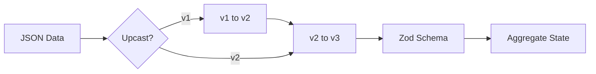

# 第34章：シリアライズ（JSON）と互換性の第一歩🧾🧊

## この章でやること（ゴール）🎯

イベントを **SQLiteに保存できるJSON** にして、あとから **安全に読み戻して復元（Rehydrate）** できるようにします🔁✨
そして「あとで仕様が変わっても壊れにくい」ための **互換性の入口** も押さえます🧷💕

---

## 1) なんで“シリアライズ”が超重要なの？🧠💡


イベントソーシングでは、イベントは「履歴」＝将来ずっと残り続ける前提📜✨
だからイベントのJSONは、いわば **未来の自分（or 別チーム）への手紙** 💌

ここで雑にすると…👇

* 「昔のイベントが読めない」→ 復元できない😱
* 「フィールド名変えたら全部壊れた」→ 詰み💥
* 「DateとかBigIntとか混ざっててJSON化で事故」→ あるある😵‍💫

---

## 2) まずは“イベント封筒（Envelope）”を決めよう📦🏷️


イベントは **dataだけ** じゃなく、周りに「メタ情報」を付けて保存するのが定番です✨

### ✅ 目標の形（おすすめ）

* `type`：イベントの種類（絶対に安定させたい名前）
* `data`：起きた事実（payload）
* `meta`：いつ起きた？誰の操作？関連IDは？など
* DB側で `streamId` と `version`（順番）も持つ（前章の続き🗄️）

---

## 3) JSONに“入れてOK/NG”を知っておこう🧾🚦


### ✅ JSONに入れて安全なもの

* `string` / `number`（整数推奨）/ `boolean`
* `null`
* 配列 / オブジェクト（中身もJSON安全なものだけ）

### ⚠️ 事故りやすいもの（おすすめ変換）

* `Date` → **ISO文字列**（`new Date().toISOString()`）🕰️
* `BigInt` → **文字列**（`"1234567890123"`）💰
* `undefined` → 消える（JSONに入らない）😵
* `NaN` / `Infinity` → JSONで表せない（変換で変になる）💥

---

## 4) 実装：イベント型・スキーマ・シリアライズ🛠️✨

ここでは例として「カート🛒」にします（題材は置き換えOKだよ😊）

### 4-1) イベントtypeは“文字列定数”で固定📌

**ポイント：クラス名やファイル名に依存しない！**（将来リネームで壊れるから）💣

```ts
// src/domain/cartEvents.ts
export const CartEventType = {
  CartCreated: "cart.created",
  ItemAdded: "cart.itemAdded",
  ItemRemoved: "cart.itemRemoved",
} as const;

export type CartEventType = typeof CartEventType[keyof typeof CartEventType];

export type CartCreated = {
  type: typeof CartEventType.CartCreated;
  data: {
    cartId: string;
    userId: string;
  };
};

export type ItemAdded = {
  type: typeof CartEventType.ItemAdded;
  data: {
    cartId: string;
    sku: string;
    quantity: number; // ✅ 小数は避けて整数に寄せるのが安心
  };
};

export type ItemRemoved = {
  type: typeof CartEventType.ItemRemoved;
  data: {
    cartId: string;
    sku: string;
  };
};

export type CartDomainEvent = CartCreated | ItemAdded | ItemRemoved;
```

---

### 4-2) “meta”を決める（まずは最小でOK）🏷️✨

```ts
// src/eventing/eventMeta.ts
export type EventMeta = {
  occurredAt: string;         // ISO文字列
  correlationId?: string;     // 1つの操作のまとまりID
  causationId?: string;       // 直前の原因イベントID
  schemaVersion: number;      // 互換性の第一歩✨（あとで効く）
};

export const createMeta = (): EventMeta => ({
  occurredAt: new Date().toISOString(),
  schemaVersion: 1,
});
```

---

### 4-3) バリデーション（Zod）で“壊れたJSON”をはじく🧪🛡️


イベントがDBから返ってきたとき、**型は保証されない**ので、入口でチェックします👀✨

```ts
// src/eventing/cartEventSchemas.ts
import { z } from "zod";
import { CartEventType } from "../domain/cartEvents";

export const CartCreatedSchema = z.object({
  cartId: z.string(),
  userId: z.string(),
});

export const ItemAddedSchema = z.object({
  cartId: z.string(),
  sku: z.string(),
  quantity: z.number().int().positive(),
});

export const ItemRemovedSchema = z.object({
  cartId: z.string(),
  sku: z.string(),
});

export const CartEventDataSchemas = {
  [CartEventType.CartCreated]: CartCreatedSchema,
  [CartEventType.ItemAdded]: ItemAddedSchema,
  [CartEventType.ItemRemoved]: ItemRemovedSchema,
} as const;
```

---

## 5) SQLiteへ保存：JSON文字列として入れる🗄️🧾

SQLiteドライバは2つの道があります👇

* ✅ **Node標準の `node:sqlite`**：Node v22.5.0で追加、今はフラグ不要になったけど **まだexperimental（Stability 1.1）** なのでそこだけ注意👀 ([Node.js][1])
* ✅ **`better-sqlite3`**：人気で高速、npmで継続メンテされてる（例：12.6.2が2026-01-17公開）([NPM][2])

どっちでも章の内容は同じです（保存するのは JSON 文字列だよ🧾）

---

### 5-1) EventStore（保存・読み取り）最小：`node:sqlite`版🧱

```ts
// src/infra/sqliteEventStore.ts
import { DatabaseSync } from "node:sqlite";
import { randomUUID } from "node:crypto";
import type { EventMeta } from "../eventing/eventMeta";

export type StoredEventRow = {
  streamId: string;
  version: number;
  id: string;
  type: string;
  dataJson: string;
  metaJson: string;
};

export class SqliteEventStore {
  private db: DatabaseSync;

  constructor(dbPath: string) {
    this.db = new DatabaseSync(dbPath);

    // STRICT は型がブレにくくて気持ちいい✨（SQLiteが対応してる環境なら）
    this.db.exec(`
      CREATE TABLE IF NOT EXISTS events(
        stream_id TEXT NOT NULL,
        version   INTEGER NOT NULL,
        id        TEXT NOT NULL,
        type      TEXT NOT NULL,
        data_json TEXT NOT NULL,
        meta_json TEXT NOT NULL,
        PRIMARY KEY(stream_id, version)
      ) STRICT
    `);
  }

  append(streamId: string, expectedVersion: number, events: { type: string; data: unknown; meta: EventMeta }[]) {
    const getMax = this.db.prepare(
      "SELECT COALESCE(MAX(version), -1) AS v FROM events WHERE stream_id = ?"
    );
    const cur = getMax.get(streamId) as { v: number };

    if (cur.v !== expectedVersion) {
      throw new Error(`ConcurrencyConflict: expected=${expectedVersion}, actual=${cur.v}`);
    }

    const insert = this.db.prepare(`
      INSERT INTO events(stream_id, version, id, type, data_json, meta_json)
      VALUES (?, ?, ?, ?, ?, ?)
    `);

    this.db.exec("BEGIN");
    try {
      let v = expectedVersion;
      for (const e of events) {
        v += 1;
        insert.run(
          streamId,
          v,
          randomUUID(),
          e.type,
          JSON.stringify(e.data),
          JSON.stringify(e.meta),
        );
      }
      this.db.exec("COMMIT");
      return v; // last version
    } catch (err) {
      this.db.exec("ROLLBACK");
      throw err;
    }
  }

  readStream(streamId: string): StoredEventRow[] {
    const stmt = this.db.prepare(`
      SELECT stream_id as streamId, version, id, type, data_json as dataJson, meta_json as metaJson
      FROM events
      WHERE stream_id = ?
      ORDER BY version
    `);
    return stmt.all(streamId) as StoredEventRow[];
  }
}
```

> `node:sqlite` はNode公式ドキュメントに載っていて、追加時期や実験扱い（Stability 1.1）も明記されています。([Node.js][1])
> ちなみにNodeの最新LTSは v24.13.0 と案内されています。([Node.js][3])

---

## 6) 読み戻し：JSONを“安全に”デシリアライズする🔁🛡️

### 6-1) まずはmetaも含めてパースする🧾

```ts
// src/eventing/deserializeCartEvent.ts
import { z } from "zod";
import type { StoredEventRow } from "../infra/sqliteEventStore";
import type { CartDomainEvent } from "../domain/cartEvents";
import { CartEventDataSchemas } from "./cartEventSchemas";

const EventMetaSchema = z.object({
  occurredAt: z.string(),
  correlationId: z.string().optional(),
  causationId: z.string().optional(),
  schemaVersion: z.number().int().positive(),
});

export type DeserializedEvent = {
  id: string;
  type: CartDomainEvent["type"];
  data: CartDomainEvent["data"];
  meta: z.infer<typeof EventMetaSchema>;
};

export function deserializeCartEvent(row: StoredEventRow): DeserializedEvent {
  const meta = EventMetaSchema.parse(JSON.parse(row.metaJson));

  // type が未知なら、ここで止める（復元の正しさを守る🛡️）
  const schema = (CartEventDataSchemas as Record<string, z.ZodTypeAny>)[row.type];
  if (!schema) throw new Error(`UnknownEventType: ${row.type}`);

  const data = schema.parse(JSON.parse(row.dataJson));

  return {
    id: row.id,
    type: row.type as DeserializedEvent["type"],
    data,
    meta,
  };
}
```

---

## 7) 復元（Rehydrate）：イベント列→状態を作る🔁🧠✨

```ts
// src/domain/cartAggregate.ts
import type { CartDomainEvent } from "./cartEvents";

export type CartState = {
  cartId: string;
  userId: string;
  items: Record<string, number>;
};

export function applyCartEvent(state: CartState | null, event: CartDomainEvent): CartState {
  switch (event.type) {
    case "cart.created":
      return {
        cartId: event.data.cartId,
        userId: event.data.userId,
        items: {},
      };

    case "cart.itemAdded": {
      if (!state) throw new Error("Invariant: cart must exist");
      const cur = state.items[event.data.sku] ?? 0;
      return {
        ...state,
        items: { ...state.items, [event.data.sku]: cur + event.data.quantity },
      };
    }

    case "cart.itemRemoved": {
      if (!state) throw new Error("Invariant: cart must exist");
      const { [event.data.sku]: _, ...rest } = state.items;
      return { ...state, items: rest };
    }
  }
}
```

---

## 8) 互換性の第一歩🧬🧷（この章のいちばん大事！）


“将来の変更”で壊さないために、ここだけは守ると強いよ💪✨

### ✅ ルール①：`type` は絶対に変えない（改名禁止）🚫

`"cart.itemAdded"` を `"cart.item_added"` に変えたら、古いイベントが復元不能😇
→ **新しいtypeを追加**するのが基本（次章で本格的にやるよ🧬）

### ✅ ルール②：`data` は「足す」は比較的安全、「消す/名前変える」は危険💥

* ✅ 追加：`discountCode?: string` みたいに **optionalで追加**✨
* ❌ 変更：`quantity` を `qty` にリネーム（古いイベントが読めない）💣

### ✅ ルール③：どうしても形が違うなら“Upcast（変換）”で救う🛟




「古いイベントを読み込むときだけ形を直す」テクです✨

#### 例：昔は `qty`、今は `quantity` になった…を救出

```ts
// src/eventing/upcast.ts
export function upcast(type: string, data: any, schemaVersion: number): any {
  // 例：schemaVersion 1 の itemAdded は qty だった…みたいな想定
  if (type === "cart.itemAdded" && schemaVersion === 1 && "qty" in data) {
    return {
      ...data,
      quantity: data.qty,
      // qty は残してもいいし消してもOK（消すならここで）
    };
  }
  return data;
}
```

デシリアライズ側でこうやって使う感じ👇

```ts
// deserializeCartEvent の中で…
const rawData = JSON.parse(row.dataJson);
const fixedData = upcast(row.type, rawData, meta.schemaVersion);
const data = schema.parse(fixedData);
```

---

## 9) ミニ演習（手を動かそう）✍️🧪✨

### 演習1：イベントを保存→読み戻し→復元🔁

1. `CartCreated` と `ItemAdded` を1回ずつappend🛒
2. `readStream` で取り出す📤
3. `deserializeCartEvent` で型チェック✅
4. `applyCartEvent` で state を作る🔁
5. 最後に `items` が期待通りか `console.log` で確認👀✨

---

### 演習2：わざと壊してみる（そして直す）💥➡️🛠️

1. `ItemAddedSchema` の `quantity` を `qty` に変えてみる（最悪の変更😇）
2. 過去イベントの読み込みが落ちるのを確認😱
3. 元に戻す
4. 「どうしても変えたいなら」upcastで救う実装にする🛟✨

---

## 10) AI活用（Copilot / Codex向けプロンプト）🤖💬✨

### ✅ ① “イベント封筒”を整える

```text
イベントソーシングのイベント保存用に、type/data/meta を分けた設計にしたいです。
- type は文字列定数（例: cart.itemAdded）
- data はJSON安全なプリミティブ中心
- meta は occurredAt(ISO), correlationId?, causationId?, schemaVersion(number)
TypeScriptで型定義と、serialize/deserialize関数の雛形を作ってください。
```

### ✅ ② “壊れたJSON”を検知する

```text
DBから取り出した dataJson/metaJson を JSON.parse したあと、Zodで検証して
UnknownEventType / InvalidPayload を区別できる実装例をください。
```

### ✅ ③ “互換性の事故”を事前に指摘してもらう

```text
このイベント定義（貼り付けます）を将来変更したとき、互換性が壊れる変更点を列挙して。
「安全な変更」「危険な変更」「代替案（新イベント/Upcast）」に分けて教えて。
```

---

## 11) まとめチェックリスト✅🧾

* [ ] `type` は **安定した文字列**（クラス名依存なし）📌
* [ ] `data` は **JSON安全**（Date/BigIntは文字列化）🧊
* [ ] `meta` に `occurredAt`（ISO）と `schemaVersion` を入れた🕰️🧬
* [ ] 読み戻し時に **parse + validation** してる🧪🛡️
* [ ] “変えたい”欲が出たら、まず **新イベント or Upcast** を検討🛟✨

---

### 🔎 ちょい最新トピック（おまけ）

* Nodeには `node:sqlite` があり、追加時期や実験扱いが公式に書かれています（Stability 1.1）。([Node.js][1])
* `better-sqlite3` も継続メンテ中で、2026年1月時点でも更新があります。([NPM][2])
* TypeScriptは `--module node20` みたいに “Node向け安定設定” を増やしていて、設定がブレにくくなってます。([TypeScript][4])
* さらに TypeScript 7 の “ネイティブ版プレビュー” も進行中で、ビルド高速化が話題です⚡ ([developer.microsoft.com][5])

[1]: https://nodejs.org/api/sqlite.html "SQLite | Node.js v25.5.0 Documentation"
[2]: https://www.npmjs.com/package/better-sqlite3?utm_source=chatgpt.com "better-sqlite3"
[3]: https://nodejs.org/en/about/eol "Node.js — End-Of-Life"
[4]: https://www.typescriptlang.org/docs/handbook/release-notes/typescript-5-9.html?utm_source=chatgpt.com "Documentation - TypeScript 5.9"
[5]: https://developer.microsoft.com/blog/typescript-7-native-preview-in-visual-studio-2026?utm_source=chatgpt.com "TypeScript 7 native preview in Visual Studio 2026"
