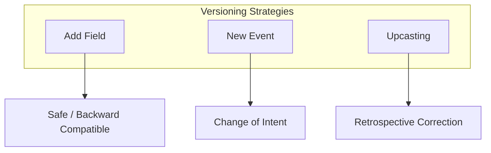

# 第35章：イベントの進化（バージョニング）＋冪等性（最小）🧬🧷

## 今日のゴール🎯

* イベントが将来「変更したくなった時」に、**壊さずに進化**させる方法がわかる🛠️
* 「同じリクエストが2回飛んできた😱」でも **1回分しか処理しない**（冪等性）を最小で入れられる🔁✅
* “現場でよくある事故”を避ける **安全ルール**が持ち帰れる🚧✨

---

## 1) まず結論：イベントは基本「書いたら変えない」📜🧊

イベントソーシングの世界では、イベントは「履歴」＝**過去の事実**だから、後から書き換えるのは基本NG🙅‍♀️
必要になったら、次のどれかで進化させるのが定番だよ✨ ([event-driven.io][1])

* ✅ **足す**（フィールド追加、optional追加）…いちばん安全💚
* ✅ **新イベントを追加**（別の出来事として表現）…意味が変わるならこっち
* ✅ **Upcast（読み出し時変換）**…古いイベントを“その場で”新しい形に変換して読む ([martendb.io][2])

---

## 2) 「進化」が必要になる瞬間あるある😺💥

たとえばこんな変更、いつか絶対来る…！

* 🧾 画面に表示するために `displayName` を追加したい
* 💰 金額に `currency` を追加したい（JPY固定じゃなくなる）
* 🔢 `quantity` を `count` に変えたい（命名変更）
* 🧠 意味が変わった（例：`price` が「税込」→「税抜」になった）←これは危険⚠️

**ポイント**：
「フィールドを増やす」みたいな変更はわりと安全。
でも「意味が変わる」変更は事故りやすいので、**新イベント**か **Upcast** が必要になりがちだよ🧯

---

## 3) 進化の3戦略（やさしい順）🥚➡️🐥➡️🦅





## 戦略A：足す（後方互換）➕✅

古いイベントにも新しいイベントにも対応できるようにする方法。
いちばん多用されるし、運用もラク✨（ストリームの過去がそのまま活きる）

* ✅ 例：`displayName?: string` を追加（無ければ既定値で表示）
* ✅ 例：`couponCode?: string` を追加（無ければ未適用）

**注意**：削除・型変更は避ける🙅‍♀️（後方互換が壊れやすい）

---

## 戦略B：新イベントを追加する🆕📮

「意味が変わる」なら、同じイベント名のまま継ぎ足すより、**別イベントとして表現**するのが安全✨

* 例：`ItemPriceChanged` を後から追加する
* 例：`TaxRuleApplied` を追加して、計算ルールをイベントで表現する

「過去の事実」と「新しいルール」を混ぜないのがコツだよ🧊✨

---

## 戦略C：Upcast（読み出し時に変換）🔁🧙‍♀️

古いイベントの形を、新しい形に“読み出すときだけ”変換する方法。
**保存データは書き換えない**のが大事✨ ([martendb.io][2])

この考え方はイベントのスキーマ進化の代表格としてよく出てくるよ📚 ([ScienceDirect][3])

---

## 4) バージョニングの持たせ方：2択＋おすすめ1つ🎛️✨

## 方式1：`type` にバージョンを含める（例：`CartItemAdded.v2`）🏷️

* 👍 イベントの種類だけ見ればバージョンがわかる
* 👎 型名が増えやすい（`v1` `v2`…）

## 方式2：メタデータに `schemaVersion` を入れる（おすすめ）🏷️✨


* 👍 `type` は変えず、`schemaVersion` で分岐できる
* 👍 Upcast チェーンが作りやすい

ここでは **方式2** で行くよ😊

---

## 5) イベントの“封筒（Envelope）”を固定しよう🍱📦

イベント本体（data）と、追跡用のメタ情報（meta）を分けると、進化と運用が超ラクになるよ✨

```ts
// イベントの“封筒”
export type EventEnvelope<TType extends string, TData> = {
  id: string;              // eventId（毎回ユニーク）
  type: TType;             // 例: "CartItemAdded"
  schemaVersion: number;   // 例: 1, 2, 3...
  occurredAt: string;       // ISO日時
  data: TData;

  meta?: {
    correlationId?: string;   // 一連の処理をまとめるID
    causationId?: string;     // “このイベントを生んだ直前”のID
    idempotencyKey?: string;  // 冪等性キー（後で使う！）
  };
};
```

---

## 6) Upcast の最小実装（TypeScript）🧙‍♀️🔁

## 例題：`CartItemAdded` が進化した📈

* v1：`{ productId, quantity }`
* v2：`{ productId, quantity, displayName }`（追加）
* v3：`{ productId, quantity, displayName, unitPrice }`（追加）

古いイベントを読むたび、v3 まで“持ち上げる（upcast）”よ✨

```ts
type CartItemAddedV1 = { productId: string; quantity: number };
type CartItemAddedV2 = { productId: string; quantity: number; displayName: string };
type CartItemAddedV3 = { productId: string; quantity: number; displayName: string; unitPrice: number };

type AnyCartItemAdded = CartItemAddedV1 | CartItemAddedV2 | CartItemAddedV3;

type CartItemAddedEnvelope = EventEnvelope<"CartItemAdded", AnyCartItemAdded>;

type Upcaster = (e: CartItemAddedEnvelope) => CartItemAddedEnvelope;

// v1 -> v2
const upcastCartItemAddedV1toV2: Upcaster = (e) => {
  if (e.type !== "CartItemAdded" || e.schemaVersion !== 1) return e;

  const v1 = e.data as CartItemAddedV1;
  const v2: CartItemAddedV2 = {
    productId: v1.productId,
    quantity: v1.quantity,
    displayName: "（名称未登録）", // 既定値で補う✨
  };

  return { ...e, schemaVersion: 2, data: v2 };
};

// v2 -> v3
const upcastCartItemAddedV2toV3: Upcaster = (e) => {
  if (e.type !== "CartItemAdded" || e.schemaVersion !== 2) return e;

  const v2 = e.data as CartItemAddedV2;
  const v3: CartItemAddedV3 = {
    ...v2,
    unitPrice: 0, // 既定値（後で別イベントで価格を適用する設計でもOK）
  };

  return { ...e, schemaVersion: 3, data: v3 };
};

const upcasters: Upcaster[] = [
  upcastCartItemAddedV1toV2,
  upcastCartItemAddedV2toV3,
];

export function upcastToLatest(e: CartItemAddedEnvelope): CartItemAddedEnvelope {
  // 何回でも通して“最新”へ持ち上げる🔁
  // 
  return upcasters.reduce((acc, fn) => fn(acc), e);
}
```

**Upcast は「読む時の変換レイヤ」**という考え方が王道だよ✨ ([martendb.io][2])

---

## 7) 互換性の最低ルール（これだけ守れば事故が減る）🚧✨

## セーフ寄り✅

* ➕ **フィールド追加**（無い時は既定値 or optional）
* ➕ **新イベント追加**（古いイベントはそのまま）

## 危険⚠️（やるならUpcastか新イベント）

* 🧨 フィールド削除
* 🧨 型変更（number→string など）
* 🧨 意味変更（単位や税計算ルールが変わる等）

データスキーマ進化の考え方は、後方互換を守るのが基本だよ📚 ([Confluent Documentation][4])

---

## 8) 冪等性（Idempotency）ってなに？🧷🔁


**同じ操作が2回届いても、結果が1回分になる**性質だよ✨
ネットワークは普通に失敗するし、クライアントもサーバも普通にリトライするから、冪等性は“ほぼ必須”になりがち😵‍💫

特に **POST / PATCH** の再送を安全にするために、`Idempotency-Key` というヘッダーを使う案が整理されているよ📮✨

* IETF のドラフト：`Idempotency-Key` ヘッダーの仕様案 ([IETF Datatracker][5])
* MDN Web Docs の解説もあるよ ([MDNウェブドキュメント][6])

さらに、API設計のベストプラクティスでも「リトライで重複を作らない」＝冪等性が強く推されてるよ🧯 ([Postman Blog][7])

---

## 9) イベントソーシングで冪等性を“最小”で入れる場所🧩✨

冪等性はだいたい **境界（外から入ってくるところ）**で守るのがいちばん効くよ💪

* 🌐 HTTP API（ボタン連打・タイムアウト再送）
* 📬 キュー/メッセージ（再配達が普通に起きる）

そして現実では「Outbox」などでイベント配信の信頼性を上げると、**消費側は冪等**が前提になりやすいよ🔁 ([james-carr.org][8])

---

## 10) 実装パターン：Idempotency テーブル（SQLite）🗄️🧷

いちばんわかりやすい最小解はこれ👇

* `idempotency_key` を保存するテーブルを作る
* **UNIQUE 制約**で「同じキーは2回入らない」をDBに守らせる
* すでに存在したら「前回の結果を返す」だけでOK✨

## テーブル例（最小）


```sql
-- すでに処理した “操作” の記録
CREATE TABLE IF NOT EXISTS idempotency (
  key TEXT PRIMARY KEY,          -- Idempotency-Key
  stream_id TEXT NOT NULL,
  result_json TEXT NOT NULL,     -- 前回返した結果（最小ならイベントID等でもOK）
  created_at TEXT NOT NULL
);
```

---

## 11) コマンド処理（Load → Decide → Append）に冪等性を差し込む🧠🔁

## “型”はこうなるよ📮✅

1. `idempotency_key` を見て **既処理なら即return**
2. 未処理なら普通に処理（Load→Decide→Append）
3. 最後に `idempotency` に結果を保存（次の重複に備える）

```ts
export type Command<TType extends string, TPayload> = {
  type: TType;
  payload: TPayload;
  idempotencyKey: string;   // ← 外から必ず渡される想定
};

export type CommandResult = {
  ok: true;
  appendedEventIds: string[];
} | {
  ok: false;
  error: string;
};

// DBっぽいインターフェース（中身はSQLite想定）
type IdempotencyRepo = {
  find(key: string): { streamId: string; resultJson: string } | null;
  tryInsert(key: string, streamId: string, resultJson: string): "inserted" | "duplicate";
};

// ここは既に作った EventStore（SQLite版）を想定
type EventStore = {
  readStream(streamId: string): Promise<EventEnvelope<string, any>[]>;
  appendToStream(streamId: string, expectedVersion: number, events: EventEnvelope<string, any>[]): Promise<string[]>;
};

export async function handleAddItem(
  cmd: Command<"AddItem", { cartId: string; productId: string; quantity: number }>,
  deps: { idempo: IdempotencyRepo; store: EventStore }
): Promise<CommandResult> {
  const streamId = `cart-${cmd.payload.cartId}`;

  // ① 既処理チェック（最速で返す！）
  // 
  const cached = deps.idempo.find(cmd.idempotencyKey);
  if (cached) {
    return JSON.parse(cached.resultJson) as CommandResult;
  }

  // ② ふつうにイベントソーシングの型で処理
  const past = await deps.store.readStream(streamId);
  const currentVersion = past.length; // 最小の例（実物はversionを持つ方が安全）

  // Decide（ここでは簡易に1イベント）
  const event: EventEnvelope<"CartItemAdded", CartItemAddedV3> = {
    id: crypto.randomUUID(),
    type: "CartItemAdded",
    schemaVersion: 3,
    occurredAt: new Date().toISOString(),
    data: {
      productId: cmd.payload.productId,
      quantity: cmd.payload.quantity,
      displayName: "（名称は後で）",
      unitPrice: 0,
    },
    meta: { idempotencyKey: cmd.idempotencyKey },
  };

  const appendedIds = await deps.store.appendToStream(streamId, currentVersion, [event]);

  const result: CommandResult = { ok: true, appendedEventIds: appendedIds };

  // ③ 結果を保存（次回、同じキーが来たら同じ結果を返す）
  // ここは本当は “Appendと同じトランザクション” に入れるのが理想✨
  const save = deps.idempo.tryInsert(cmd.idempotencyKey, streamId, JSON.stringify(result));
  if (save === "duplicate") {
    // ほぼ同時に二重実行が走ったケース（レース）⚔️
    const cached2 = deps.idempo.find(cmd.idempotencyKey);
    if (cached2) return JSON.parse(cached2.resultJson) as CommandResult;
  }

  return result;
}
```

> 💡 実務では「イベントAppend」と「idempotency保存」を**同一トランザクション**にするとより安全だよ（レースで二重Appendしにくい）🧯
> こういう“重複排除はDB制約に寄せる”考え方はよく使われる✨ ([Stack Overflow][9])

---

## 12) テストの型（Given-When-Then）🧪🌸

## テストA：Upcast が正しく最新に上がる？

```ts
import { test, expect } from "vitest";

test("upcast v1 -> v3", () => {
  const v1: CartItemAddedEnvelope = {
    id: "e1",
    type: "CartItemAdded",
    schemaVersion: 1,
    occurredAt: "2026-01-01T00:00:00.000Z",
    data: { productId: "p1", quantity: 2 },
  };

  const latest = upcastToLatest(v1);
  expect(latest.schemaVersion).toBe(3);

  const d = latest.data as CartItemAddedV3;
  expect(d.displayName).toBe("（名称未登録）");
  expect(d.unitPrice).toBe(0);
});
```

## テストB：同じコマンドを2回投げても、イベントは増えない？

* 1回目：Appendされる✅
* 2回目：キャッシュ結果が返って、Appendされない🔁✅

（ここは `IdempotencyRepo` をインメモリ実装して確認すると楽だよ😊）

---

## 13) ミニ演習（超おすすめ）✍️✨

## 演習1：イベントに項目追加しても壊さない➕🧬

1. `CartItemAdded` に `category?: string` を追加
2. v3 → v4 にして、Upcastで `category = "unknown"` を補う
3. Upcastテストを書いて合格させる✅

## 演習2：冪等性キーで「ボタン連打」耐性を作る🔁🧷

1. コマンドに `idempotencyKey` を必須にする
2. 2回連続で同じキーを投げるテストを書く
3. “イベント数が増えない”を検証する✅✅

## 演習3（おまけ⭐）：消費側の冪等性（イベント重複配信に備える）📬🔁

* `processed_event` テーブルを作って `eventId` を保存
* すでに見た `eventId` ならProjection更新をスキップ
  （Outbox/再配達で重要になるやつ！） ([james-carr.org][8])

---

## 14) AI活用（プロンプト例）🤖💭✨

## 進化の相談：どの戦略が安全？🧬

* 「このイベントにフィールド追加したい。既存データを壊さずに進化する戦略を、A:足す / B:新イベント / C:Upcast で比較して、推奨と理由を出して」

## Upcastレビュー：事故りそうな点を指摘して👀🧯

* 「このUpcasterの危険ポイント（意味変更、既定値の妥当性、欠損データの扱い）をチェックリストで」

## 冪等性レビュー：キー設計を確認🔑✨

* 「Idempotency-Key をどう生成すべきか、クライアント都合（ボタン連打・再送）とサーバ都合（保存期間・衝突・結果再利用）で整理して」

---

## 15) まとめチェックリスト✅🧾✨

## イベント進化🧬

* [ ] 過去イベントは書き換えない🧊
* [ ] まずは「足す」で済むか考える➕
* [ ] 意味が変わるなら新イベント or Upcast🆕🔁
* [ ] Upcastのテスト（v1→最新）を必ず用意🧪

## 冪等性🧷

* [ ] リトライは起きる前提（HTTP/キュー）🔁
* [ ] `Idempotency-Key` を境界で受け取る📮 ([IETF Datatracker][5])
* [ ] UNIQUE制約で重複排除をDBに任せる🗄️
* [ ] “同じキーなら同じ結果を返す”を守る✅ ([Postman Blog][7])

---

[1]: https://event-driven.io/en/simple_events_versioning_patterns/?utm_source=chatgpt.com "Simple patterns for events schema versioning"
[2]: https://martendb.io/events/versioning.html?utm_source=chatgpt.com "Events Versioning"
[3]: https://www.sciencedirect.com/science/article/pii/S0164121221000674?utm_source=chatgpt.com "An empirical characterization of event sourced systems ..."
[4]: https://docs.confluent.io/platform/current/schema-registry/fundamentals/schema-evolution.html?utm_source=chatgpt.com "Schema Evolution and Compatibility for Schema Registry ..."
[5]: https://datatracker.ietf.org/doc/draft-ietf-httpapi-idempotency-key-header/?utm_source=chatgpt.com "The Idempotency-Key HTTP Header Field - Datatracker - IETF"
[6]: https://developer.mozilla.org/en-US/docs/Web/HTTP/Reference/Headers/Idempotency-Key?utm_source=chatgpt.com "Idempotency-Key header - HTTP - MDN Web Docs"
[7]: https://blog.postman.com/rest-api-best-practices/?utm_source=chatgpt.com "REST API Best Practices: A Developer's Guide to Building ..."
[8]: https://james-carr.org/posts/2026-01-15-transactional-outbox-pattern/?utm_source=chatgpt.com "The Transactional Outbox Pattern: Reliable Event Publishing"
[9]: https://stackoverflow.com/questions/70822463/idempotent-record-creation-is-it-better-to-use-a-unique-constraint-or-check-for?utm_source=chatgpt.com "Idempotent record creation: is it better to use a unique ..."
