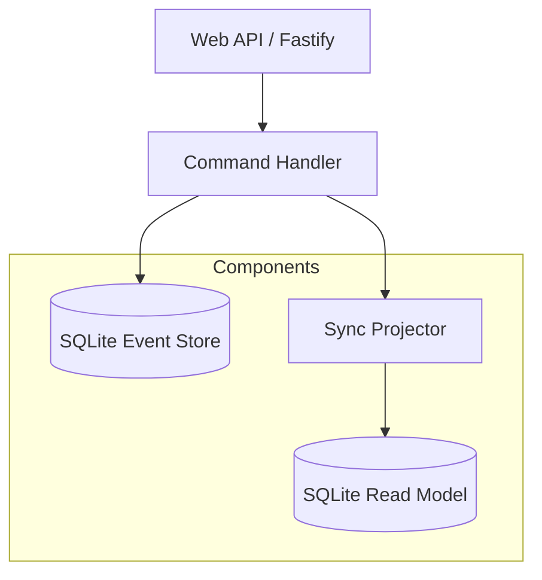

# 第36章：卒業制作（ミニプロダクト完成）🎓🎉

## ねらい🎯✨

ここまでの知識をぜ〜んぶ合体させて、**小さくても「筋が通ったイベントソーシング」**のミニプロダクトを完成させます😊💪
出来上がったら、もう“イベントソーシング初めて”から卒業です〜！🌸

---

## 1. 今回作るミニプロダクト：Eventful Cart 🛒✨




題材は「買い物カート（Cart）」にします😊
小さくて分かりやすくて、イベントも作りやすいからです👍

## できること（ユーザー視点）👀🧡

* カートを作る🆕
* 商品を追加する➕
* 数量を変更する🔁
* 商品を削除する🗑️
* チェックアウトする✅

## “イベントソーシングっぽい”嬉しさ体験🕰️✨

* **過去の状態にタイムトラベル**できる（v3の時点のカート…みたいに）🕰️
* **Projection**で一覧や詳細がサクッと出る🔎
* **冪等性（Idempotency）**で「同じコマンドを2回送っても壊れない」🔁

---

## 2. 完成条件チェックリスト✅✅✅

最低ライン（必須）👇

* [ ] イベント保存（SQLite永続化）🗄️
* [ ] 復元（Rehydrate）🔁
* [ ] Projection 1つ（一覧 or 詳細）🔎
* [ ] Given-When-Then テスト数本🧪
* [ ] **冪等性**（同じコマンドの二重送信に耐える）🔁🧷

追加チャレンジ（どれか好きに）⭐

* [ ] タイムトラベルAPI（version指定で復元）🕰️
* [ ] Projection再構築ボタン（リプレイ）🔁🧹
* [ ] 簡易メトリクス（append回数など）📊

---

## 3. 採用する“今どき”の土台（2026っぽく）🧰✨

* TypeScriptは **5.8** 系の改善が入った前提で進めます（ビルド/ウォッチ最適化など）✨ ([Microsoft for Developers][1])
* Nodeは **v24がActive LTS**（安定して使えるライン）として扱います🟩 ([Node.js][2])
* APIは **Fastify v5系**（2026-01-26時点で 5.7.2 が最新タグ）🚀 ([GitHub][3])
* テストは **Vitest v4系**（4.0は2025-10-22にリリース）🧪 ([vitest.dev][4])
* FastifyのTypeScript型付けは公式リファレンスに沿っていきます📘 ([Fastify][5])

---

## 4. 最終フォルダ構成（この形に着地させる）📁✨

こんな感じを目標にします😊

```text
es-cart/
  src/
    domain/
      cart.ts
      events.ts
      commands.ts
      errors.ts
    app/
      handleCommand.ts
    infra/
      sqlite/
        db.ts
        eventStoreSqlite.ts
        projectionSqlite.ts
        schema.sql
    web/
      server.ts
      routes.ts
  test/
    cart.spec.ts
    idempotency.spec.ts
  package.json
  tsconfig.json
```

---

## 5. API仕様（最小）📮✨

## Command（書き込み）側📝

* `POST /carts`（カート作成）
* `POST /carts/:id/items`（追加）
* `PUT  /carts/:id/items/:productId`（数量変更）
* `DELETE /carts/:id/items/:productId`（削除）
* `POST /carts/:id/checkout`（チェックアウト）

## Query（読み取り）側👀

* `GET /carts`（一覧：Projectionから）
* `GET /carts/:id`（詳細：Projectionから）

## 冪等性キー（超大事）🔁🧷

書き込み系リクエストは、ヘッダで **`Idempotency-Key`** を受け取ります✨
同じキーで2回呼ばれても「イベントが二重に積まれない」ようにします😊

---

## 6. SQLite スキーマ（Events + Idempotency + Projection）🗄️✨

`src/infra/sqlite/schema.sql` を用意します👇

```sql
-- events: 1 stream = 1 cart
CREATE TABLE IF NOT EXISTS events (
  stream_id TEXT NOT NULL,
  version   INTEGER NOT NULL,
  type      TEXT NOT NULL,
  data      TEXT NOT NULL,
  meta      TEXT NOT NULL,
  created_at INTEGER NOT NULL,
  PRIMARY KEY (stream_id, version)
);

-- idempotency: (stream_id, idem_key) をユニークにして二重実行を防ぐ
CREATE TABLE IF NOT EXISTS idempotency (
  stream_id TEXT NOT NULL,
  idem_key  TEXT NOT NULL,
  result_version INTEGER NOT NULL,
  created_at INTEGER NOT NULL,
  PRIMARY KEY (stream_id, idem_key)
);

-- projection: cart_list（一覧向け）
CREATE TABLE IF NOT EXISTS cart_list (
  cart_id TEXT PRIMARY KEY,
  status TEXT NOT NULL,
  total_qty INTEGER NOT NULL,
  updated_at INTEGER NOT NULL
);

-- projection: cart_items（詳細向け）
CREATE TABLE IF NOT EXISTS cart_items (
  cart_id TEXT NOT NULL,
  product_id TEXT NOT NULL,
  qty INTEGER NOT NULL,
  PRIMARY KEY (cart_id, product_id)
);
```

---

## 7. ドメイン：イベント設計（過去形）📜✨

## イベント型（事実だけ）🍱

`src/domain/events.ts`

```ts
export type CartEvent =
  | { type: "CartCreated"; data: { cartId: string }; meta: Meta }
  | { type: "ItemAdded"; data: { cartId: string; productId: string; qty: number }; meta: Meta }
  | { type: "ItemQuantityChanged"; data: { cartId: string; productId: string; qty: number }; meta: Meta }
  | { type: "ItemRemoved"; data: { cartId: string; productId: string }; meta: Meta }
  | { type: "CartCheckedOut"; data: { cartId: string }; meta: Meta };

export type Meta = {
  eventId: string;
  occurredAt: number; // epoch ms
  commandId?: string; // Idempotency-Key を入れて追跡できると便利✨
};
```

## 不変条件（この章で守るルール）🧷🛡️

* qty は 1以上じゃないとダメ🙅‍♀️
* Checkout後は変更できない🙅‍♀️
* カート未作成のまま操作できない🙅‍♀️

---

## 8. Aggregate：復元（Rehydrate）と Decide（イベント生成）🔁✨

`src/domain/cart.ts`

```ts
import { CartEvent } from "./events";

export type CartStatus = "none" | "open" | "checkedOut";

export type CartState = {
  cartId: string;
  status: CartStatus;
  items: Map<string, number>; // productId -> qty
};

export const emptyCart = (cartId: string): CartState => ({
  cartId,
  status: "none",
  items: new Map(),
});

export const apply = (state: CartState, event: CartEvent): CartState => {
  switch (event.type) {
    case "CartCreated":
      return { ...state, status: "open" };

    case "ItemAdded": {
      const next = new Map(state.items);
      next.set(event.data.productId, (next.get(event.data.productId) ?? 0) + event.data.qty);
      return { ...state, items: next };
    }

    case "ItemQuantityChanged": {
      const next = new Map(state.items);
      next.set(event.data.productId, event.data.qty);
      return { ...state, items: next };
    }

    case "ItemRemoved": {
      const next = new Map(state.items);
      next.delete(event.data.productId);
      return { ...state, items: next };
    }

    case "CartCheckedOut":
      return { ...state, status: "checkedOut" };
  }
};

export const rehydrate = (cartId: string, history: CartEvent[]): CartState =>
  history.reduce((s, e) => apply(s, e), emptyCart(cartId));

// Decide（コマンドを受けてイベントを返す）💡
export const decideCreate = (state: CartState, metaBase: (commandId?: string) => any, commandId?: string): CartEvent[] => {
  if (state.status !== "none") return []; // すでにあるなら何もしない（安全）🔁
  return [{ type: "CartCreated", data: { cartId: state.cartId }, meta: metaBase(commandId) }];
};

export const decideAddItem = (state: CartState, productId: string, qty: number, metaBase: (commandId?: string) => any, commandId?: string): CartEvent[] => {
  if (state.status !== "open") throw new Error("Cart is not open");
  if (qty < 1) throw new Error("qty must be >= 1");
  return [{ type: "ItemAdded", data: { cartId: state.cartId, productId, qty }, meta: metaBase(commandId) }];
};

export const decideChangeQty = (state: CartState, productId: string, qty: number, metaBase: (commandId?: string) => any, commandId?: string): CartEvent[] => {
  if (state.status !== "open") throw new Error("Cart is not open");
  if (qty < 1) throw new Error("qty must be >= 1");
  if (!state.items.has(productId)) throw new Error("item not found");
  return [{ type: "ItemQuantityChanged", data: { cartId: state.cartId, productId, qty }, meta: metaBase(commandId) }];
};

export const decideRemoveItem = (state: CartState, productId: string, metaBase: (commandId?: string) => any, commandId?: string): CartEvent[] => {
  if (state.status !== "open") throw new Error("Cart is not open");
  if (!state.items.has(productId)) return []; // ないなら何もしない（安全）🔁
  return [{ type: "ItemRemoved", data: { cartId: state.cartId, productId }, meta: metaBase(commandId) }];
};

export const decideCheckout = (state: CartState, metaBase: (commandId?: string) => any, commandId?: string): CartEvent[] => {
  if (state.status !== "open") throw new Error("Cart is not open");
  return [{ type: "CartCheckedOut", data: { cartId: state.cartId }, meta: metaBase(commandId) }];
};
```

💡ポイント😊

* **rehydrate = Applyの積み重ね**🔁
* Decideは「ルールチェック → 新イベント」を返すだけ📮
* 副作用（DB書き込み等）は外側でやる✨

---

## 9. EventStore：インターフェース（まず形を固定）📦✨

`src/app/handleCommand.ts` が迷子にならないよう、先にインターフェースを決めます😊

```ts
import { CartEvent } from "../domain/events";

export type StoredEvent = {
  streamId: string;
  version: number;
  event: CartEvent;
};

export interface EventStore {
  readStream(streamId: string): Promise<StoredEvent[]>;
  appendToStream(args: {
    streamId: string;
    idemKey: string;
    events: CartEvent[];
  }): Promise<{ newVersion: number; appended: boolean }>;
}
```

---

## 10. SQLite EventStore 実装（冪等性つき）🗄️🔁

## DB接続

`src/infra/sqlite/db.ts`

```ts
import sqlite3 from "sqlite3";
import { open, Database } from "sqlite";
import fs from "node:fs/promises";
import path from "node:path";

let db: Database<sqlite3.Database, sqlite3.Statement> | null = null;

export async function getDb() {
  if (db) return db;

  db = await open({
    filename: "data.sqlite",
    driver: sqlite3.Database,
  });

  const schemaPath = path.join(process.cwd(), "src/infra/sqlite/schema.sql");
  const schema = await fs.readFile(schemaPath, "utf-8");
  await db.exec(schema);

  return db;
}
```

## EventStore本体（超重要なトランザクション）🔥

`src/infra/sqlite/eventStoreSqlite.ts`

```ts
import { EventStore, StoredEvent } from "../../app/handleCommand";
import { CartEvent } from "../../domain/events";
import { getDb } from "./db";

export class SqliteEventStore implements EventStore {
  async readStream(streamId: string): Promise<StoredEvent[]> {
    const db = await getDb();
    const rows = await db.all<{
      stream_id: string; version: number; type: string; data: string; meta: string;
    }[]>(
      `SELECT stream_id, version, type, data, meta
       FROM events WHERE stream_id = ? ORDER BY version ASC`,
      streamId
    );

    return rows.map((r) => ({
      streamId: r.stream_id,
      version: r.version,
      event: {
        type: r.type as CartEvent["type"],
        data: JSON.parse(r.data),
        meta: JSON.parse(r.meta),
      } as CartEvent,
    }));
  }

  async appendToStream(args: {
    streamId: string;
    idemKey: string;
    events: CartEvent[];
  }): Promise<{ newVersion: number; appended: boolean }> {
    const { streamId, idemKey, events } = args;
    const db = await getDb();

    if (events.length === 0) {
      // 何も積まない場合でも、冪等性として「成功扱い」にしておくとAPIが優しい😊
      const current = await this.getCurrentVersion(streamId);
      return { newVersion: current, appended: false };
    }

    return db.exec("BEGIN IMMEDIATE TRANSACTION").then(async () => {
      try {
        // 1) idemチェック（同じコマンドの二重実行を止める）🔁
        const idem = await db.get<{ result_version: number }>(
          `SELECT result_version FROM idempotency WHERE stream_id = ? AND idem_key = ?`,
          streamId,
          idemKey
        );
        if (idem) {
          await db.exec("COMMIT");
          return { newVersion: idem.result_version, appended: false };
        }

        // 2) 現在versionを取得して、続きに追記📌
        const current = await this.getCurrentVersion(streamId);
        let nextVersion = current;

        const now = Date.now();
        for (const ev of events) {
          nextVersion += 1;
          await db.run(
            `INSERT INTO events (stream_id, version, type, data, meta, created_at)
             VALUES (?, ?, ?, ?, ?, ?)`,
            streamId,
            nextVersion,
            ev.type,
            JSON.stringify(ev.data),
            JSON.stringify(ev.meta),
            now
          );
        }

        // 3) idem記録（「このキーはこのversionまで反映済み」）🧷
        await db.run(
          `INSERT INTO idempotency (stream_id, idem_key, result_version, created_at)
           VALUES (?, ?, ?, ?)`,
          streamId,
          idemKey,
          nextVersion,
          now
        );

        await db.exec("COMMIT");
        return { newVersion: nextVersion, appended: true };
      } catch (e) {
        await db.exec("ROLLBACK");
        throw e;
      }
    });
  }

  private async getCurrentVersion(streamId: string) {
    const db = await getDb();
    const row = await db.get<{ v: number }>(
      `SELECT COALESCE(MAX(version), 0) as v FROM events WHERE stream_id = ?`,
      streamId
    );
    return row?.v ?? 0;
  }
}
```

---

## 11. Projection：一覧＆詳細を“読みやすく”する🔎✨

## Projection更新ルール（イベントごとに反映）🧠

`src/infra/sqlite/projectionSqlite.ts`

```ts
import { CartEvent } from "../../domain/events";
import { getDb } from "./db";

export async function project(cartId: string, events: CartEvent[]) {
  if (events.length === 0) return;
  const db = await getDb();

  // ざっくり同期Projection（イベントが発生した分だけ反映）✨
  for (const ev of events) {
    switch (ev.type) {
      case "CartCreated":
        await db.run(
          `INSERT OR REPLACE INTO cart_list (cart_id, status, total_qty, updated_at)
           VALUES (?, ?, ?, ?)`,
          cartId, "open", 0, ev.meta.occurredAt
        );
        break;

      case "ItemAdded": {
        const { productId, qty } = ev.data;
        await db.run(
          `INSERT INTO cart_items (cart_id, product_id, qty)
           VALUES (?, ?, ?)
           ON CONFLICT(cart_id, product_id) DO UPDATE SET qty = qty + excluded.qty`,
          cartId, productId, qty
        );
        await recomputeList(db, cartId, ev.meta.occurredAt);
        break;
      }

      case "ItemQuantityChanged": {
        const { productId, qty } = ev.data;
        await db.run(
          `UPDATE cart_items SET qty = ? WHERE cart_id = ? AND product_id = ?`,
          qty, cartId, productId
        );
        await recomputeList(db, cartId, ev.meta.occurredAt);
        break;
      }

      case "ItemRemoved": {
        const { productId } = ev.data;
        await db.run(`DELETE FROM cart_items WHERE cart_id = ? AND product_id = ?`, cartId, productId);
        await recomputeList(db, cartId, ev.meta.occurredAt);
        break;
      }

      case "CartCheckedOut":
        await db.run(
          `UPDATE cart_list SET status = ?, updated_at = ? WHERE cart_id = ?`,
          "checkedOut", ev.meta.occurredAt, cartId
        );
        break;
    }
  }
}

async function recomputeList(db: any, cartId: string, at: number) {
  const row = await db.get<{ total: number }>(
    `SELECT COALESCE(SUM(qty), 0) as total FROM cart_items WHERE cart_id = ?`,
    cartId
  );
  await db.run(
    `UPDATE cart_list SET total_qty = ?, updated_at = ? WHERE cart_id = ?`,
    row?.total ?? 0, at, cartId
  );
}
```

---

## 12. Commandハンドラ（Load → Decide → Append → Project）📮✅

`src/app/handleCommand.ts`

```ts
import { randomUUID } from "node:crypto";
import { EventStore } from "./handleCommand";
import { CartEvent } from "../domain/events";
import { rehydrate, decideCreate, decideAddItem, decideChangeQty, decideRemoveItem, decideCheckout } from "../domain/cart";
import { project } from "../infra/sqlite/projectionSqlite";

export type Command =
  | { type: "CreateCart"; cartId: string }
  | { type: "AddItem"; cartId: string; productId: string; qty: number }
  | { type: "ChangeQty"; cartId: string; productId: string; qty: number }
  | { type: "RemoveItem"; cartId: string; productId: string }
  | { type: "Checkout"; cartId: string };

export async function handleCommand(store: EventStore, command: Command, idemKey: string) {
  const streamId = command.cartId;

  // 1) Load（過去イベント読む）📚
  const historyStored = await store.readStream(streamId);
  const history = historyStored.map((x) => x.event);

  // 2) Rehydrate（状態復元）🔁
  const state = rehydrate(streamId, history);

  // 3) Decide（新イベント作る）🧠✨
  const metaBase = (commandId?: string) => ({
    eventId: randomUUID(),
    occurredAt: Date.now(),
    commandId,
  });

  const newEvents: CartEvent[] = (() => {
    switch (command.type) {
      case "CreateCart": return decideCreate(state, metaBase, idemKey);
      case "AddItem": return decideAddItem(state, command.productId, command.qty, metaBase, idemKey);
      case "ChangeQty": return decideChangeQty(state, command.productId, command.qty, metaBase, idemKey);
      case "RemoveItem": return decideRemoveItem(state, command.productId, metaBase, idemKey);
      case "Checkout": return decideCheckout(state, metaBase, idemKey);
    }
  })();

  // 4) Append（保存：冪等性あり）🗄️🔁
  const result = await store.appendToStream({ streamId, idemKey, events: newEvents });

  // 5) Projection更新（同期でOK）🔎
  if (result.appended) {
    await project(streamId, newEvents);
  }

  return { newVersion: result.newVersion, appended: result.appended, events: newEvents };
}
```

---

## 13. Web API（Fastify）🧡🚀

Fastifyの最新版はv5系が継続してリリースされています🚀 ([GitHub][3])
`src/web/server.ts`

```ts
import Fastify from "fastify";
import { SqliteEventStore } from "../infra/sqlite/eventStoreSqlite";
import { registerRoutes } from "./routes";

export async function buildServer() {
  const app = Fastify({ logger: true });
  const store = new SqliteEventStore();

  registerRoutes(app, store);

  return app;
}

if (process.env.NODE_ENV !== "test") {
  const app = await buildServer();
  await app.listen({ port: 3000, host: "127.0.0.1" });
}
```

`src/web/routes.ts`

```ts
import { FastifyInstance } from "fastify";
import { EventStore } from "../app/handleCommand";
import { handleCommand } from "../app/handleCommand";
import { getDb } from "../infra/sqlite/db";

function getIdemKey(req: any) {
  const key = req.headers["idempotency-key"];
  if (!key || typeof key !== "string") throw new Error("Idempotency-Key required");
  return key;
}

export function registerRoutes(app: FastifyInstance, store: EventStore) {
  app.post("/carts", async (req, reply) => {
    const cartId = crypto.randomUUID();
    const idemKey = getIdemKey(req);
    await handleCommand(store, { type: "CreateCart", cartId }, idemKey);
    return reply.code(201).send({ cartId });
  });

  app.post("/carts/:id/items", async (req: any) => {
    const idemKey = getIdemKey(req);
    const { productId, qty } = req.body as any;
    return handleCommand(store, { type: "AddItem", cartId: req.params.id, productId, qty }, idemKey);
  });

  app.put("/carts/:id/items/:productId", async (req: any) => {
    const idemKey = getIdemKey(req);
    const { qty } = req.body as any;
    return handleCommand(store, { type: "ChangeQty", cartId: req.params.id, productId: req.params.productId, qty }, idemKey);
  });

  app.delete("/carts/:id/items/:productId", async (req: any) => {
    const idemKey = getIdemKey(req);
    return handleCommand(store, { type: "RemoveItem", cartId: req.params.id, productId: req.params.productId }, idemKey);
  });

  app.post("/carts/:id/checkout", async (req: any) => {
    const idemKey = getIdemKey(req);
    return handleCommand(store, { type: "Checkout", cartId: req.params.id }, idemKey);
  });

  // Query: 一覧（Projection）
  app.get("/carts", async () => {
    const db = await getDb();
    return db.all(`SELECT cart_id, status, total_qty, updated_at FROM cart_list ORDER BY updated_at DESC`);
  });

  // Query: 詳細（Projection）
  app.get("/carts/:id", async (req: any) => {
    const db = await getDb();
    const cart = await db.get(`SELECT cart_id, status, total_qty, updated_at FROM cart_list WHERE cart_id = ?`, req.params.id);
    const items = await db.all(`SELECT product_id, qty FROM cart_items WHERE cart_id = ? ORDER BY product_id`, req.params.id);
    return { cart, items };
  });
}
```

---

## 14. テスト（Given-When-Then）🧪🌸

Vitest v4系を使います🧪（4.0は2025-10-22リリース） ([vitest.dev][4])
`test/cart.spec.ts`

```ts
import { describe, expect, test } from "vitest";
import { rehydrate, decideCreate, decideAddItem, decideCheckout } from "../src/domain/cart";
import { CartEvent } from "../src/domain/events";

const metaBase = (commandId?: string) => ({ eventId: "e", occurredAt: 1, commandId });

describe("Cart Aggregate", () => {
  test("Given empty, When create, Then CartCreated", () => {
    const state = rehydrate("c1", []);
    const events = decideCreate(state, metaBase, "k1");
    expect(events.map(e => e.type)).toEqual(["CartCreated"]);
  });

  test("Given created, When add item, Then ItemAdded", () => {
    const history: CartEvent[] = [
      { type: "CartCreated", data: { cartId: "c1" }, meta: metaBase("k0") },
    ];
    const state = rehydrate("c1", history);
    const events = decideAddItem(state, "p1", 2, metaBase, "k2");
    expect(events[0].type).toBe("ItemAdded");
    expect(events[0].data.qty).toBe(2);
  });

  test("Given checkedOut, When add item, Then error", () => {
    const history: CartEvent[] = [
      { type: "CartCreated", data: { cartId: "c1" }, meta: metaBase("k0") },
      { type: "CartCheckedOut", data: { cartId: "c1" }, meta: metaBase("k9") },
    ];
    const state = rehydrate("c1", history);
    expect(() => decideAddItem(state, "p1", 1, metaBase, "k10")).toThrow();
  });

  test("Given created, When checkout, Then CartCheckedOut", () => {
    const history: CartEvent[] = [
      { type: "CartCreated", data: { cartId: "c1" }, meta: metaBase("k0") },
    ];
    const state = rehydrate("c1", history);
    const events = decideCheckout(state, metaBase, "k7");
    expect(events.map(e => e.type)).toEqual(["CartCheckedOut"]);
  });
});
```

## 冪等性テスト（イベントが二重に積まれない）🔁🧷

`test/idempotency.spec.ts`

```ts
import { describe, expect, test } from "vitest";
import { SqliteEventStore } from "../src/infra/sqlite/eventStoreSqlite";
import { handleCommand } from "../src/app/handleCommand";

describe("Idempotency", () => {
  test("same Idempotency-Key should not append twice", async () => {
    const store = new SqliteEventStore();
    const cartId = crypto.randomUUID();

    const key = "same-key-1";
    await handleCommand(store, { type: "CreateCart", cartId }, key);
    const r2 = await handleCommand(store, { type: "CreateCart", cartId }, key);

    expect(r2.appended).toBe(false);
  });
});
```

---

## 15. 仕上げ：READMEテンプレ（提出物っぽくする）📝✨

READMEに最低これを書けたら“完成度”が一気に上がります🎉

* 何を作ったか（1〜2行）🧡
* 仕様（API一覧）📮
* 起動方法（install / dev / test）🧰
* 設計メモ

  * Aggregate境界（なぜCart単位？）🐣
  * 不変条件（何を守ってる？）🧷
  * Projection方針（同期/非同期、なぜ？）🔎
  * 冪等性の仕組み（Idempotency-Key）🔁

---

## 16. AI活用（卒業制作で一番効く使い方）🤖💞

## ① 仕様を固めるプロンプト（迷子防止）🧭

* 「カートのユースケースを5つに絞って。イベント名は過去形で。粒度が変な候補は理由付きで弾いて」🤖✨

## ② テスト観点を増やすプロンプト🧪

* 「不変条件を破るケースを10個出して。Given-When-Thenで書いて」🤖📌

## ③ レビュー用プロンプト（めちゃ効く）👀

* 「イベントのpayloadが“事実”から外れてない？命令形が混ざってない？メタに入れるべき情報は？改善点を指摘して」🤖🔎

---

## 17. よくある事故＆直し方集🚑💦

* **Apply漏れ**：イベントを増やしたのにApplyし忘れて復元が壊れる😵
  → ✅ “イベント追加したら Apply と Projection とテストもセット”で更新
* **Projectionがズレる**：イベントとProjection更新ロジックの差でズレる😇
  → ✅ Projectionは「イベントを唯一の正」として、イベント単位で反映する
* **冪等性キー未指定**：二重送信でイベントが倍に…💥
  → ✅ 書き込みAPIは `Idempotency-Key` を必須にする（最小でもOK）🔁

---

## 18. 追加チャレンジ（超おすすめ）⭐

## A. タイムトラベルAPI🕰️

* `GET /carts/:id/time-travel?version=5`
  → そのversionまでのイベントだけ読み込んでrehydrateする✨

## B. Projection再構築ボタン🔁🧹

* `POST /admin/rebuild-projection`
  → events全件をstreamごとに再生してProjectionを作り直す✨
  （Projectionは壊れても直せるのが強み〜！💪）

## C. 簡易メトリクス📊

* append回数、read回数、平均イベント数…みたいな“ざっくり”でOK😊

---

## 19. 最終セルフ採点（これ全部YESなら卒業🎓）✅

* イベント名が過去形で、粒度が説明できる📜✨
* 不変条件がコードで守れてる🧷🛡️
* Load→Rehydrate→Decide→Append の流れが綺麗📮✅
* Projectionが動いて、Queryが速い🔎⚡
* テストがGiven-When-Thenで読める🧪🌸
* 同じ `Idempotency-Key` を2回送っても壊れない🔁💞

---

## 参考（採用スタックの最新確認）📌

* TypeScript 5.8（リリースと改善内容） ([Microsoft for Developers][1])
* Node.js v24 が Active LTS ([Node.js][2])
* Fastify v5系（リリース状況） ([GitHub][3])
* Vitest v4（4.0発表） ([vitest.dev][4])
* Fastify TypeScript公式リファレンス ([Fastify][5])

[1]: https://devblogs.microsoft.com/typescript/announcing-typescript-5-8/?utm_source=chatgpt.com "Announcing TypeScript 5.8"
[2]: https://nodejs.org/en/about/previous-releases?utm_source=chatgpt.com "Node.js Releases"
[3]: https://github.com/fastify/fastify/releases?utm_source=chatgpt.com "Releases · fastify/fastify"
[4]: https://vitest.dev/blog/vitest-4?utm_source=chatgpt.com "Vitest 4.0 is out!"
[5]: https://fastify.io/docs/latest/Reference/TypeScript/?utm_source=chatgpt.com "TypeScript"
