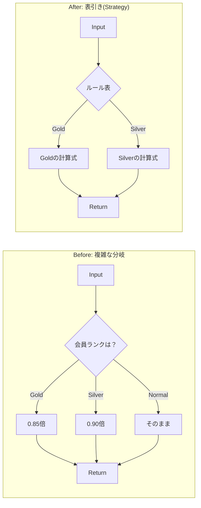

# 第01章：GoFデザインパターンってなに？（地図を持つ学び）🗺️

## ねらい🎯


* GoFが「暗記科目」じゃなくて、**“よくある困りごと”を早く解くための地図**だとわかる🧭
* 「今の自分のコード、どこがつらいの？」を言葉にできるようになる👀💭

---

## 学ぶこと📌（この章のゴール）

### 1) デザインパターン＝「よくある問題への、再利用できる解き方」🧰

* たとえば料理でいうと…🍳
  「卵焼きの作り方」じゃなくて、「失敗しやすいポイントと安定手順」がまとまってるレシピ集みたいな感じ📖✨
* “同じ悩み”が何回も出るなら、それはパターンの出番かも👀🔁

### 2) GoFは「23個の道具箱」🎁

* GoFは、ソフトウェア設計で何度も出る困りごとを「名前付き」でまとめたもの🧠
* 名前があると何が嬉しい？

  * チームで話が早い⚡（「それ、Observerっぽいね」みたいに一言で伝わる）
  * 似た問題を見つけやすい🔎
  * 解決策の“型”を使い回せる♻️

### 3) TypeScriptでも超ふつうに役立つ💙

TypeScript/JavaScriptの世界って、クラスより **関数・オブジェクト・モジュール**が自然に使われがちだよね😊
だからこそ、GoFも **「クラスでガチガチに再現」じゃなくて、TSらしく“軽く”使う**のがコツ🎈

---

## 「暗記科目」になっちゃう理由と、ならないコツ🧠➡️🧠✨

### 暗記になっちゃうパターン😵

* 「23個を全部説明できるようにする！」
* 「いつでもパターンを使うのが正義！」

これだと、**設計が目的じゃなくて“パターン使用”が目的**になっちゃう💦

### ならないコツ🧁（この教材の型）

1. **小さく作る**🧪
2. **困る（つらい！）**😵‍💫
3. **困りごとに効く道具を選ぶ（パターン候補）**🧰
4. **小さく直して、楽になったか確認**✅

> パターンは「飾り」じゃなくて「痛み止め」💊✨
> 痛くないのに飲むと副作用（複雑化）だけ増えるよ〜⚠️

---

## まずは「つらさのサイン」を知ろう👃💡

次の匂いが出たら、パターンの出番が近いかも！

### サインA：if/switchが増え続けて、読むのが怖い😱

* 種類が増えるたびに分岐が増殖…
* 修正したら別の条件が壊れた…（あるある）💥

### サインB：「new」があちこちに散らばって、生成ルールが迷子🌀

* 「どの条件で何を作るんだっけ？」が追えない
* 追加のたびに複数ファイル修正…😵

### サインC：引数が増えすぎて、呼び出しが読めない📦📦📦

* 「これ何の順番だっけ？」
* optionalだらけで事故りやすい⚠️

---

## ミニ例：これが「パターンの芽」🌱（TSらしく、関数で）

ここでは“パターン名を覚える”より、**痛み→軽くする**を体験するよ😊✨

### ありがちな「つらい」コード例😵‍💫（分岐が増殖）

```ts
type Membership = "normal" | "silver" | "gold";

type Item = { name: string; price: number; qty: number };

export function calcTotal(items: Item[], membership: Membership): number {
  const sum = items.reduce((acc, it) => acc + it.price * it.qty, 0);

  if (membership === "gold") return Math.floor(sum * 0.85);
  if (membership === "silver") return Math.floor(sum * 0.90);
  return sum;
}
```

* 今は3種類だから平気🙂
* でも「student」「vip」「coupon併用」「期間限定」…って増えたら？😱

### “TSの自然なやり方”で一歩だけ楽にする🧁✨（関数の表にする）

```ts
type Membership = "normal" | "silver" | "gold";
type Item = { name: string; price: number; qty: number };

type DiscountRule = (sum: number) => number;

const discountRules: Record<Membership, DiscountRule> = {
  normal: (sum) => sum,
  silver: (sum) => Math.floor(sum * 0.90),
  gold: (sum) => Math.floor(sum * 0.85),
};

export function calcTotal(items: Item[], membership: Membership): number {
  const sum = items.reduce((acc, it) => acc + it.price * it.qty, 0);
  return discountRules[membership](sum);
}
```

✅ 良くなったところ🎉

* ifが増殖しにくい📉
* 「割引ルールはここ！」って場所が決まる📍
* テストも分けやすい🧪✨

この“やり方を差し替える”感じが、あとで出てくる **Strategy系の発想**につながるよ🧠🎭
（この章では「名前」より「感覚」を大事にするよ〜😊）



---

## ハンズオン🛠️：自分のコードで「つらい所」を3つメモする📝✨

### やること（15〜30分くらいのライト作業）⏳

1. 直近で触ってるTypeScriptプロジェクトを開く📂
2. 「直すのが怖い」「増えるとヤバそう」って場所を探す👀
3. つらい所を3つ、短文でメモ📝（例：分岐が増えてる、生成が散ってる、引数が多い…）

### メモのテンプレ（コピペ用）🧾💖

```txt
(1) どこがつらい？：
例）注文確定の処理に if が増え続けてる

(2) 何が起きそう？：
例）種類追加のたびにミスりそう／テストがつらい

(3) 変化の方向：
例）今後「注文タイプ」が増える予定
```

---

## AIプロンプト例🤖💬（“暗記”じゃなく“痛み”から探す）

※そのままコピペOK✨（自分のコード貼るときは、秘密情報は消してね🔐）

### 1) つらい所の言語化（最初に超おすすめ）📝

```txt
次のTypeScriptコードの「保守がつらくなりそうな点」を5つ挙げてください。
それぞれに対して、
- 何が問題になりやすいか
- まず最小でできる改善（クラス増やしすぎない）
を提案してください。

（ここにコードを貼る）
```

### 2) GoFっぽく「候補」を出してもらう🧭

```txt
このコードの困りごとに効きやすい GoF デザインパターン候補を3つ挙げて、
それぞれ
- どういう痛みに効くか
- TypeScriptで「関数・型・標準機能中心」で最小実装するならどうするか
を教えてください。

（ここにコードを貼る）
```

### 3) AIの“それっぽい正解”を防ぐ質問⚠️

```txt
提案した改善案について、
- 複雑さが増える点（デメリット）
- やりすぎ判定の基準
- もっとシンプルに済む代替案
も必ず書いてください。
```

---

## つまずき回避💡（ここでよくコケるポイント）

### ✅ 最初から全部使おうとしない（1つ効けば勝ち）🥇✨

* 1パターンでも「楽になった！」が出たら十分🎉
* 逆に、パターンは**複雑さも増やせる道具**だから、必要なときだけでOK🙆‍♀️

### ✅ “パターンっぽい形”に寄せすぎない🧊

* TypeScriptは **関数・オブジェクト・モジュール**が強い💪
* 「GoFを再現するためだけのクラス増殖」は疲れるし、学びが遠回りになりがち😵‍💫

### ✅ 「増えるものは何？」を先に見る🔭

* 増えるのが「種類」なら…差し替え系が効きやすい
* 増えるのが「手順」なら…流れを整理する系が効きやすい
  （この見立てが“地図”になるよ🗺️）

---

## 2026年2月時点の“道具の最新メモ”🆕✨（さらっと）

* TypeScriptは 5.9 系のリリースノートが公開されていて、Node向けモジュール設定などの整備も進んでるよ📦🧠。([typescriptlang.org][1])
* VS Codeは 1.108（2026-01-08リリース）の更新情報が出てるよ🧰✨。([Visual Studio Code][2])
* Node.jsのリリース情報も更新され続けてるので、学習用の実行環境は「LTS」を選ぶと安心になりやすいよ🔒。([nodejs.org][3])
* AIコーディング支援は「エージェント」方向の話題も増えてるけど、**採用判断は人間がやる**がいちばん大事🧑‍💻🤝。([The Verge][4])

---

## まとめ✅🎉（この章でできたら勝ち）

* デザインパターンは「暗記」じゃなくて **困りごと→解き方の地図**🗺️✨
* まずは自分のコードで **つらい所を3つ言語化**できればOK📝💖
* TypeScriptでは **関数・型・標準機能で“軽く”始める**のが自然🌱💙

[1]: https://www.typescriptlang.org/docs/handbook/release-notes/typescript-5-9.html?utm_source=chatgpt.com "Documentation - TypeScript 5.9"
[2]: https://code.visualstudio.com/updates?utm_source=chatgpt.com "December 2025 (version 1.108)"
[3]: https://nodejs.org/en/blog/release/v22.22.0?utm_source=chatgpt.com "Node.js 22.22.0 (LTS)"
[4]: https://www.theverge.com/news/808032/github-ai-agent-hq-coding-openai-anthropic?utm_source=chatgpt.com "GitHub is launching a hub for multiple AI coding agents"
