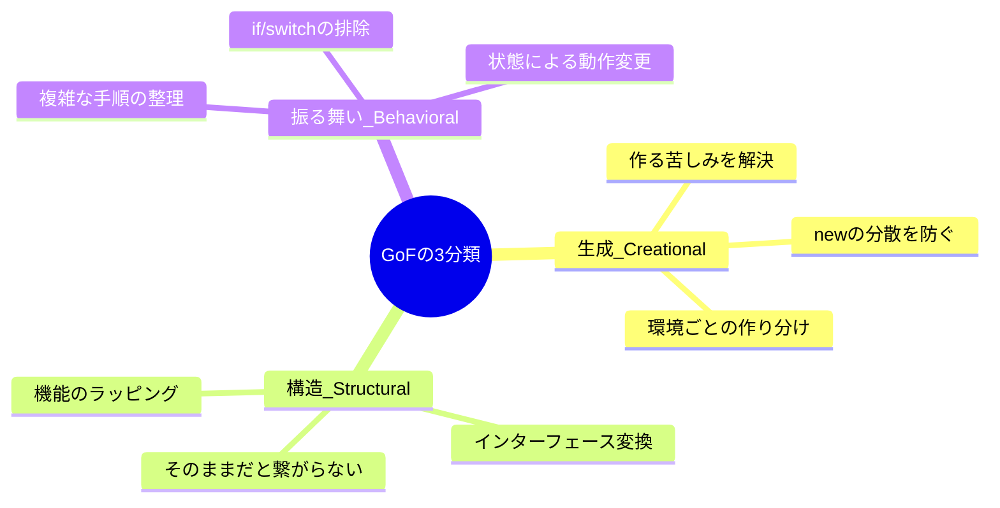

# 第02章：生成・構造・振る舞いの3分類（ざっくり理解）🍡

## ねらい🎯

* 「生成 / 構造 / 振る舞い」って何？を **一言で説明**できるようになる😊
* パターン名を暗記する前に、「いま困ってるのってどの種類？」を **当てにいける**ようになる🧭✨

---

## 今日のゴール✅（これが言えたら勝ち🏆）

* **生成（Creational）**：*「どう作る？」* 🏭
* **構造（Structural）**：*「どう組み立てる？」* 🏗️
* **振る舞い（Behavioral）**：*「どう動かす？」* 🎭


そしてもう1つ大事なこと👇

* 分類は **地図**🗺️みたいなもの！「どっちにも見える」ことは普通にあるよ🍀
  → 迷ったら「いま解決したい痛みが何か？」が先💡

---

## まずは超ざっくりイメージ図🍡

* 🏭 **生成**：newが増える、作る手順が複雑、同じ物を何度も作っちゃう…
* 🏗️ **構造**：部品が増えて関係がゴチャゴチャ、外部の形が合わない、ラップして追加したい…
* 🎭 **振る舞い**：if/switchが増殖、手順が長い、通知が絡む、状態で動きが変わる…

---

## たとえ話①：スマホアプリで仕分けしてみよ📱✨

たとえば「カフェ注文アプリ」があるとして…☕🧁

### 🏭 生成（作り方）の悩み例

* 「注文の種類が増えて、作るところが if だらけ😵」
* 「テスト用の注文データを作るのが毎回しんどい🥺」
* 「環境（本番/検証）で作る部品セットを切り替えたい🔁」

### 🏗️ 構造（組み立て方）の悩み例

* 「外部APIのレスポンス形式が微妙に違って、あちこちで変換してる😭」
* 「機能を“あと付け”で重ねたい（ログ・計測・キャッシュ）🎁」
* 「複雑な処理の入口を1つにまとめて使いやすくしたい🚪」

### 🎭 振る舞い（動き方）の悩み例

* 「割引ルールが増えて if の森🌳」
* 「注文確定したら、在庫更新・通知・ログ…が連鎖してカオス📣」
* 「注文の状態（作成中/確定/キャンセル）でできる操作が変わる🚦」



---

## たとえ話②：同じ“機能”でも見方が変わる👀✨

例：**「割引」**

* 🎭 振る舞いとして見る：割引ロジックが増えて差し替えたい（if地獄回避）
* 🏭 生成として見る：割引ルールの“セット”を環境ごとに生成したい
* 🏗️ 構造として見る：割引処理の前後にログ/計測をラップで付けたい

➡️ つまり…
**分類は「この問題をどう切り取るか」の視点**なんだよね🪄

---

## ハンズオン🛠️：スマホアプリ機能を3分類で仕分けしよう🍡

### Step 1：機能リスト（例）📌

* A. ログイン方式（メール/Google/Apple）
* B. 注文の合計金額を計算
* C. 注文確定時に、在庫更新→通知→ログ保存
* D. 外部決済APIのレスポンスを内部の型に変換
* E. 「ログ出力」を本体ロジックを汚さず追加
* F. 注文の作成（店内/持ち帰り/予約）で作り方が違う

### Step 2：あなたの答えを書こう✍️✨

「Aは🏭、Bは🎭…」みたいに置いてみてね😊
（1つに決めきれないのはOK！“今の悩み”で決めればOK🍀）

### 例の答え（1つの見方）💡

* A：🏭（作る部品セットの話になりがち）
* B：🎭（計算ルール＝動き）
* C：🎭＋🏗️（手順の流れ＆つなぎ方）
* D：🏗️（形が合わない＝組み立ての境界）
* E：🏗️（ラップして追加＝構造）
* F：🏭（作り分け＝生成）

---

## ミニ実装（オマケ）🧁：分類ラベルをTypeScriptで表す

「分類」をコードで表すと、頭の中がスッキリするよ🧠✨

```ts
type Category = "creational" | "structural" | "behavioral";

type Feature = {
  name: string;
  category: Category;
  reason: string;
};

const features: Feature[] = [
  { name: "注文の作成が種類で分岐する", category: "creational", reason: "『どう作る？』の痛み" },
  { name: "外部APIレスポンスを内部型に変換", category: "structural", reason: "『形を合わせる』の痛み" },
  { name: "割引ルールが増えてif地獄", category: "behavioral", reason: "『動き方を差し替える』の痛み" },
];

for (const f of features) {
  console.log(`${f.category} 🍡 ${f.name}（${f.reason}）`);
}
```

---

## AIに投げるプロンプト例🤖💬（“分類の練習”用）

```text
次のアプリ機能を「生成/構造/振る舞い」に分類して、
それぞれ「どんな設計の悩みが起きやすいか」を1つずつ挙げてください。
機能:
- （ここに機能を箇条書きで）
出力形式:
- 生成: ...
- 構造: ...
- 振る舞い: ...
```

✨コツ：AIの分類がブレてもOK！
「自分の悩みを言語化できたか」が勝ちだよ😊🫶

---

## つまずき回避💡（ここで詰まりがち🥺）

* **「どれに分類すれば正解？」**
  → 正解探しより、「今の痛みは何？」を言えたらOK🙆‍♀️✨
* **「混ざって見える…」**
  → 混ざって当然！地図は境界がにじむもの🗺️🌫️
* **「パターン名が気になって先に進めない…」**
  → 今日は“分類”が主役🍡 名前は後で勝手に覚えるよ😊

---

## まとめ🎉（3行でいける✨）

* 🏭 生成＝作り方
* 🏗️ 構造＝組み立て方
* 🎭 振る舞い＝動き方
  そして、分類は **目的のための目安**。迷ったら「今の痛み」が先💗

---

## 参考メモ（2026年2月上旬に確認できる最新情報）📌✨

* TypeScript は **5.9 系**のリリースノートが公開・更新されているよ🧩 ([TypeScript][1])
* Node.js は **v24 が Active LTS** として扱われている（リリース表より）🟩 ([Node.js][2])
* Visual Studio Code は **1.108（2026-01-08リリース）**の更新情報が公開されているよ🧰 ([Visual Studio Code][3])
* `structuredClone()` はブラウザ側で広く使える深いコピー手段として整理されているよ🧬 ([developer.mozilla.org][4])

[1]: https://www.typescriptlang.org/docs/handbook/release-notes/typescript-5-9.html?utm_source=chatgpt.com "Documentation - TypeScript 5.9"
[2]: https://nodejs.org/en/about/previous-releases?utm_source=chatgpt.com "Node.js Releases"
[3]: https://code.visualstudio.com/updates?utm_source=chatgpt.com "December 2025 (version 1.108)"
[4]: https://developer.mozilla.org/en-US/docs/Web/API/Window/structuredClone?utm_source=chatgpt.com "Window: structuredClone() method - Web APIs | MDN"
