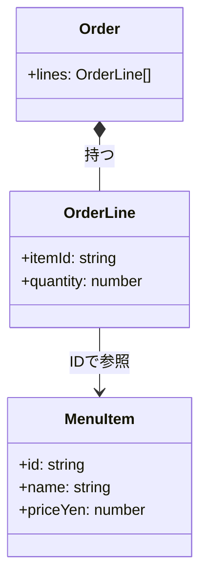

# 第03章：この教材の進め方（小さく作って育てる）🌱

## ねらい🎯

* 「作る → 困る → パターン」の流れを、体で覚える💃🕺
* “最初から正解設計”を狙わず、**小さく動かして育てる**感覚をつかむ🌿
* パターンを「暗記」じゃなく「困りごと解決の道具」として見れるようになる🧰✨

---

## 1. この教材の“学びの型”🧭🌸


この教材はずーっと同じ流れで進むよ！覚えるのはこれだけでOK🥰

1. **まず最小で動かす**（かわいくミニサイズ🐣）
2. **つらさ（匂い）を見つける**（“困った！”を言葉にする👃💭）
3. **パターンで1点だけ改善**（一気に直さない⚠️）
4. **動作確認して残す**（あとで戻れる安心感🧷）
5. **また小さく足す**（育てる🌱→🌿→🌳）

> ポイントは「一気に完成させない」こと！
> “少しずつ良くする”ほうが、現実の開発にめちゃ近いよ✨😊

---

## 2. 「小さく作る」って、どれくらい小さい？🐣☕️


“最小”って聞くと迷子になりがちなので、**合格ライン**を決めちゃおう✅✨

## 最小の合格ライン（この章の基準）🏁


* **入力**：注文（何を何個）
* **処理**：合計金額を出す
* **出力**：合計を表示（コンソールでOK🖥️）
* **データ**：型で最低限の意味が伝わる（読みやすい型🧩）

逆に、今はやらない🙅‍♀️

* UIを作り込む
* DBやAPI連携
* 「将来きっと必要」な汎用化（未来予知はしない🔮✋）

---

## 3. 2026年2月のミニ近況メモ🗞️✨（迷った時のよりどころ）

* **TypeScriptは 5.9 系が最新リリースノート**としてまとまっているよ📘✨。([TypeScript][1])
* **Node.js は v24 が Active LTS、v25 が Current**という位置づけ（安定重視ならLTSが目安）🧯🔧。([Node.js][2])
* **VS Code は 1.108（December 2025）が 2026-01-08 リリース**として案内されてるよ🧰✨。([Visual Studio Code][3])

> この章は“作り方の型”がメインだから、バージョンで悩みすぎなくて大丈夫🙆‍♀️💕

---

## 4. 共通題材「カフェ注文ミニアプリ」☕🧾（最小要件を5つに絞る）

ここから先の章も、この題材でずっと育てていくよ🌱✨
まずは**最小要件を5つ**に絞ろう！

## 最小要件（5つ）✋✨

1. メニューに「商品名」と「単価」がある
2. 注文は「商品」と「個数」の組
3. 注文を複数入れられる
4. 合計金額を計算できる
5. 合計を表示できる（まずは console でOK）

## できたら勝ち（受け入れ条件）🏆

* コーヒー(400円)×2 と ドーナツ(250円)×1 → 合計 **1050円** が出る✅

---

## 5. ハンズオン🛠️：最小の“動く版”を「想像して」「書いて」みよう✍️✨

ここは「頭の中の設計」を、いったん形にするところだよ🧠➡️📄
**クラス増やしすぎ禁止**で、まずは型＋関数でいこう🍡

## Step 1：型を決める🧩

* メニュー商品：`MenuItem`
* 注文明細：`OrderLine`
* 注文全体：`Order`

```ts
type MenuItem = {
  id: string;
  name: string;
  priceYen: number;
};

type OrderLine = {
  itemId: string;
  quantity: number;
};

type Order = {
  lines: OrderLine[];
};
```



💡ここでのコツ

* `priceYen` みたいに **単位を名前に入れる**と事故が減るよ💴✨
* `id` を持たせると、のちの章で “外部データ変換（Adapter）” とかがやりやすくなる🔌

---

## Step 2：最小の関数を3つ作る⚙️✨


1. 注文に追加する `addLine`
2. 合計を出す `calcTotalYen`
3. 表示する `printTotal`

```ts
const addLine = (order: Order, line: OrderLine): Order => {
  return { ...order, lines: [...order.lines, line] };
};

const calcTotalYen = (menu: readonly MenuItem[], order: Order): number => {
  const priceById = new Map(menu.map(m => [m.id, m.priceYen] as const));

  return order.lines.reduce((sum, line) => {
    const price = priceById.get(line.itemId);
    if (price === undefined) {
      throw new Error(`Unknown itemId: ${line.itemId}`);
    }
    return sum + price * line.quantity;
  }, 0);
};

const printTotal = (totalYen: number): void => {
  console.log(`合計: ${totalYen}円`);
};
```

💡ここでの“学びポイント”

* `Map` を使うのは **TypeScript/JavaScriptの定番**で自然👍🗺️（無理にクラス工場とか作らない）
* 例外 `throw` は今はOK。あとで「失敗を戻り値で扱う」章で整える🧯✨

---

## Step 3：最小シナリオを書いてみる🎬☕

```ts
const menu: MenuItem[] = [
  { id: "coffee", name: "コーヒー", priceYen: 400 },
  { id: "donut", name: "ドーナツ", priceYen: 250 },
];

let order: Order = { lines: [] };
order = addLine(order, { itemId: "coffee", quantity: 2 });
order = addLine(order, { itemId: "donut", quantity: 1 });

const total = calcTotalYen(menu, order);
printTotal(total); // 合計: 1050円
```

✅ ここまでできたら、この章はクリア🎉🎉🎉

---

## 6. “困る”を作るコツ👃💭（わざとでOK！）


次の章以降でパターンを使うには、**困りごとが必要**なんだよね😵‍💫
だからここでは、あえて「増えそうなところ」を見つけよう🔎✨

## 困りごと候補（印を付けるポイント）📌

* 「割引ルール」が増えそう（会員・クーポン・時間帯…）💸
* 「注文状態」が増えそう（カート中/確定/キャンセル…）🚦
* 「外部APIの形」が違いそう（DTOが変な名前…）🔌
* 「前処理」が増えそう（検証→割引→在庫→通知…）⛓️

## ミニ作業📝✨

コードにコメントでいいから、こう書いて印をつけてね👇

* `// ここ、あとで増えそう`
* `// if増えたら辛そう`
* `// 外部データ来たら壊れそう`

---

## 7. AIの使いどころ🤖✨（下書き・比較・説明役にしてね）

AIは「設計の相棒」になれるけど、**採用判断はあなたの仕事**だよ🧠💪
ここでは、使いやすい投げ方を用意しておくね💌

## 使うと気持ちいい場面😌✨

* 要件を「5つに削る」✂️
* “増えそうポイント”を列挙してもらう🔎
* テスト観点を出してもらう🧪
* リファクタ案を「段階的に」出してもらう🪜

## コピペ用プロンプト例🤖💬

（そのまま貼ってOKだよ！）

```text
カフェ注文ミニアプリの要件を「最小の5つ」に絞って。
前提:
- TypeScript
- クラス増やしすぎない（型＋関数中心）
出力:
- 最小要件5つ
- 受け入れ条件（具体例）
```

```text
次のTypeScriptコードを見て、「あとで困りそうな点（設計の匂い）」を5つ指摘して。
条件:
- いきなり大改造しない
- 改善は“小さく1点ずつ”提案して
（ここにコードを貼る）
```

```text
割引ルールが増える前提で、まずは“関数で差し替え”できる形にしたい。
条件:
- 余計な独自クラスを作らない
- TypeScriptらしく（関数・Map・型）
- まず最小コード、そのあと拡張案
```

※ AI拡張の例として、GitHubのCopilotや、OpenAIのCodex系ツールなどがよく使われるよ🤖✨（出てきた案は“採用前に必ず目でチェック”ね！）

---

## 8. つまずき回避💡（この章でありがち⚠️）


* **最初から汎用化しちゃう** → 未来のための設計で今が死ぬ😇
* **ファイル分割しすぎる** → 探すだけで疲れる🌀
* **命名がふわっとする** → `data` / `info` 地獄🧟‍♀️
* **“動く”を確認しない** → どこで壊れたか不明😭
* **一気に直す** → 何が良くなったか分からない🧨

合言葉はこれ👇
**「1回に直すのは1点だけ」**🪄✨

---

## 9. 仕上げチェック✅🎉（次に進む前に）

* [ ] 最小要件5つが書けてる✍️
* [ ] `MenuItem / OrderLine / Order` の型がある🧩
* [ ] 合計が出る（1050円の例が通る）💴
* [ ] “増えそうポイント”にコメントで印が付いてる📌
* [ ] 「次に困りそう」が1つ言える👄✨

---

## 10. ミニクイズ🎓💗（3問だけ！）

1. 「小さく作って育てる」流れを、順番に3つ言ってみよう🧠
2. この章で“今はやらない”ことを2つ言ってみよう🙅‍♀️
3. “増えそうポイント”に印を付けるのは、何のため？📌

---

## この章のまとめ🌸✨

* 設計は「最初から正解」を作るより、**動く最小から育てる**ほうが強い🌱
* パターンは「困った時に使う道具」🧰
* 困りごとを作って、言葉にして、1点だけ直す——これが上達ループだよ🔁💖

（次の章では、VS Codeの“設計に効く”機能で、直すスピードを上げていくよ🧰✨）

[1]: https://www.typescriptlang.org/docs/handbook/release-notes/typescript-5-9.html?utm_source=chatgpt.com "Documentation - TypeScript 5.9"
[2]: https://nodejs.org/en/about/previous-releases?utm_source=chatgpt.com "Node.js Releases"
[3]: https://code.visualstudio.com/updates?utm_source=chatgpt.com "December 2025 (version 1.108)"
