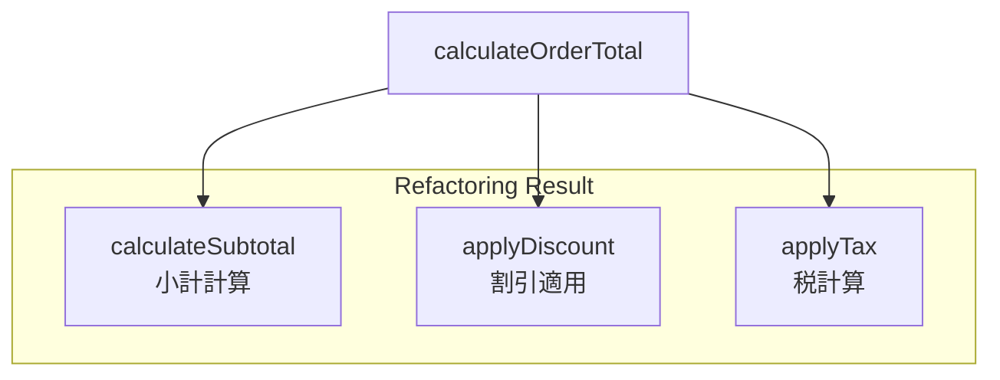

# 第04章：VS Codeの“設計に効く”機能（リネーム・参照・抽出）🧰

## ねらい🎯

* 「設計改善＝怖い変更」じゃなくて、「安全な編集の積み重ね」だと体感する💪💕
* VS Codeの **Rename / References / Refactor（Extract）** を使って、コードを“育てる”動きができるようになる🌱

## この章でできるようになること✅

* 名前を変える時に、事故らず一気に直せる（Rename Symbol）🪄
* 影響範囲を“目で見て”から動ける（Find/Peek References）👀
* 長い処理を“責務ごとに”割れる（Extract Function / Constant）✂️
* ファイル分割・整理が怖くなくなる（Move to file / Organize Imports）📦
* 壊しても戻れる（Git + Timeline）🛟

---

## 4.1 設計って、まずは「編集が安全」になるだけで勝ち🏆✨

設計の第一歩って、いきなりパターン暗記じゃないよ〜😌💗
まずは **名前を変える／分割する／移動する** を“安全に”できるようになるだけで、コードの未来が明るくなる☀️


VS Codeには、設計改善に直結する機能が最初から揃ってるよ🧰✨
特にこの3つが超大事👇

* **Rename Symbol（F2）**：プロジェクト全体で安全に名前変更🪄 ([Visual Studio Code][1])
* **Go/Peek References（Shift+F12 など）**：使われてる場所を一覧で確認👀 ([Visual Studio Code][1])
* **Refactor → Extract（Ctrl+. や右クリック）**：長い処理を切り出して整理✂️ ([Visual Studio Code][2])

---

## 4.2 ハンズオン題材：わざと“つらい”コードを作って直す☕🧾

まずは練習用に、あえて読みにくい関数を用意しよう😈（改善の練習だからね！）

## Step 0：ファイルを1つ作る📄

* 例：src/order.ts

```ts
// src/order.ts

type MenuItem = { id: string; name: string; price: number };
type OrderLine = { itemId: string; qty: number };
type Order = { lines: OrderLine[]; member: boolean; coupon?: string };

export function calc(o: Order, items: MenuItem[]) {
  let total = 0;

  for (const l of o.lines) {
    const it = items.find(x => x.id === l.itemId);
    if (!it) continue;

    total += it.price * l.qty;
  }

  // 割引（条件が増えそう…）
  if (o.member) total *= 0.9;
  if (o.coupon === "WELCOME") total -= 100;

  // 税（固定でいいの？今後変わりそう…）
  total *= 1.1;

  return Math.max(0, Math.round(total));
}
```

この時点の“匂い”👃💦

* 名前が短すぎて、責務が見えない（calc / o / l / it）
* 割引や税のロジックが増えたら if が増殖しそう😵
* 1関数に全部詰め込みがち（読むのがしんどくなる）

---

## 4.3 Rename Symbol（F2）で「責務が見える名前」にする🪄💖


## まず大事：置換（検索→置換）より Rename が安全✨

普通の置換だと、似た文字列まで巻き込む事故が起きやすい😱
Rename Symbolは “シンボル（変数/関数/型など）” を理解して変えてくれるから安全🛡️ ([Visual Studio Code][1])

## やり方（超シンプル）🎀

1. 変えたい名前（例：calc）にカーソルを置く
2. **F2**（Rename Symbol）
3. 新しい名前を入力して Enter

Renameは **ファイルをまたいで** 変更してくれるよ📚✨ ([Visual Studio Code][1])

## 命名のコツ（初心者でも効くやつ）🍬

* 関数：動詞っぽく（calculate / create / apply）
* 変数：名詞っぽく（order / menuItems / line）
* “何の世界の言葉か”を入れる（Order / Menu / Discount など）☕🧾

## 実際にリネームしてみよう🎮✨

* calc → calculateOrderTotal
* o → order
* items → menuItems
* l → line
* it → item

---

## 4.4 Referencesで「影響範囲」を先に見る👀🔎


設計改善で怖いのって、「どこに影響あるの？」問題だよね🥺
そこで References！✨

## 覚えるショートカット3点セット🎹✨

* **Shift+F12**：参照一覧（References）を見る👀
* **Alt+F12**：Peek（その場でチラ見）👓
* **F12**：定義へジャンプ（Go to Definition）🏃‍♀️💨 ([Visual Studio Code][1])

## 使いどころ（超リアル）🧡

* 名前を変える前に「どこで使われてるか」を確認したい
* Extract する前に「切り出す範囲が他と絡んでないか」を確認したい
* “この型どこで作ってる？”って迷子になった時に助かる🧭

---

## 4.5 Extract Function で「長い処理」をスパッと割る✂️✨


VS Codeのリファクタは、TypeScriptでも定番の **Extract Function / Extract Constant** が使えるよ🧁
しかも “右クリック → Refactor” や “電球（Ctrl+.)” から出せる💡 ([Visual Studio Code][2])

## Step 1：小さく切り出す（おすすめ順）🍡

まずは、次の順で“安全に”分割すると失敗しにくいよ👇

1. **計算の部品**（小計）
2. **割引**
3. **税**

## Step 2：実際に Extract してみよう🛠️

例えば、この部分（小計計算）をドラッグで選択して…

* 右クリック → Refactor → Extract Function
  （または Ctrl+. → Refactor 系の候補） ([Visual Studio Code][2])

結果イメージ（完成例）👇

```ts
type MenuItem = { id: string; name: string; price: number };
type OrderLine = { itemId: string; qty: number };
type Order = { lines: OrderLine[]; member: boolean; coupon?: string };

export function calculateOrderTotal(order: Order, menuItems: MenuItem[]) {
  const subtotal = calculateSubtotal(order, menuItems);
  const discounted = applyDiscount(subtotal, order);
  const taxed = applyTax(discounted);
  return Math.max(0, Math.round(taxed));
}

function calculateSubtotal(order: Order, menuItems: MenuItem[]) {
  let subtotal = 0;

  for (const line of order.lines) {
    const item = menuItems.find(x => x.id === line.itemId);
    if (!item) continue;
    subtotal += item.price * line.qty;
  }

  return subtotal;
}

function applyDiscount(amount: number, order: Order) {
  let result = amount;
  if (order.member) result *= 0.9;
  if (order.coupon === "WELCOME") result -= 100;
  return result;
}

function applyTax(amount: number) {
  return amount * 1.1;
}
```

💡ポイント

* まだ if はあるけどOK！まずは「責務が見える」ことが勝ち🏁
* 後で Strategy につながる“下ごしらえ”になってるよ（割引が独立した！）🍳✨



---

## 4.6 Move to file で「ファイル分割」を怖がらない📦✨

分割した関数が増えたら、次はファイル整理だよ〜📁💗
VS Codeは TypeScriptで **Move to a new file** みたいなリファクタも用意されてるよ🧁 ([Visual Studio Code][2])

さらに嬉しいのがこれ👇

* ファイル移動時の import 更新を自動でやってくれる設定がある✨ ([Visual Studio Code][2])

## 使い方イメージ🧭

* applyDiscount を選択
* リファクタから “新しいファイルへ移動” 系を実行
* 自動で import も追随（設定次第）

---

## 4.7 Organize Imports で「散らかった import」を一瞬で整える🧹✨


TypeScriptの現場で地味に効くのが **Organize Imports**！
未使用importの削除・並び整理をしてくれるよ🧼 ([Visual Studio Code][2])

* ショートカット例：**Shift+Alt+O** ([Visual Studio Code][2])

## “保存したら自動で整える”もできる（好みで）💾✨

```json
{
  "editor.codeActionsOnSave": {
    "source.organizeImports": "explicit"
  }
}
```

この手の “保存時コードアクション” は VS Code の公式手段だよ🧁 ([Visual Studio Code][2])

---

## 4.8 Quick Fix（Ctrl+.）で「小さな改善」を即やる💡✨

電球（Quick Fix / Code Action）は、TypeScriptだと特に強いよ〜🧠✨

* **Ctrl+.** で候補が出る（Quick Fix / Refactor） ([Visual Studio Code][2])

よく出る例（雰囲気）🍭

* 変数の型の補助
* 不足してる import の追加
* 使ってない変数の整理
* “ここ、Extractできるよ” の提案

---

## 4.9 Git + Timeline で「壊しても戻れる」状態にする🛟💖


設計改善でいちばん大事なのはね…
**戻せること**！！！！！😭💗（これで安心して攻められる）

VS Codeは Git をエディタ内で扱える Source Control が入ってるよ🧩 ([Visual Studio Code][3])

## まずやること（最小）✅

1. Source Control（左の枝分かれアイコン）を開く🌿
2. 変更が見える（diffも見える）👀
3. こまめにコミット（節目ごと）📌

## 「やばっ…」ってなった時の戻し方🧯

* 変更を捨てる（Discard Changes）がある🗑️ ([Visual Studio Code][4])
* しかも、捨てたファイルは OS のごみ箱（Recycle Bin / Trash）へ行く挙動がある（助かる…！）🧺✨ ([Visual Studio Code][5])

## さらに保険：Timeline（履歴）📜✨

VS Codeにはファイルの Timeline 表示があって、履歴をたどる助けになるよ🕰️ ([Visual Studio Code][5])

---

## 4.10 ミニ課題（この章のゴールチェック）✅🎀

## ミッションA：Renameで“責務が伝わる”名前へ🪄

* calc / o / items / l / it を、意味が伝わる名前に変える
* Shift+F12 で「ちゃんと置き換わったか」確認する👀

## ミッションB：Extractで3つに分ける✂️

* 小計（subtotal）
* 割引（discount）
* 税（tax）
  この3つを関数にして、メイン関数を短くする✨

## ミッションC：保険を張る🛟

* Gitでコミットを1回打つ📌
* そのあと、わざと変な編集をして、戻す（Undo / Discard / Timeline）を1回やる😆

---

## AIプロンプト例（命名・分割の相談）🤖💬✨

```text
次のTypeScript関数について、責務が伝わる命名案を3つ出して。
それぞれ「なぜその名前が良いか」も短く説明して。
（前提：VS CodeのRename Symbolで安全に名前変更する想定）

対象の関数：
<ここに関数を貼る>
```

```text
次のTypeScriptコードを「Extract Functionで分割するならどこが良いか」提案して。
- まずは“やりすぎない”小分け（3〜5個まで）
- それぞれの関数名案も出して
- 分割後の見通し（読みやすさがどう上がるか）も教えて

コード：
<ここに貼る>
```

---

## つまずき回避💡（あるある救急箱）🧯💕

* Renameが思ったほど変わらない → “文字列”を置換してるだけの箇所じゃない？（シンボルとして認識されてるか確認）
* Extractの候補が出ない → まず範囲選択してから Ctrl+. を試す（Refactor候補は選択ありで出やすい） ([Visual Studio Code][2])
* 怖くて触れない → コミット or 変更の破棄があるから、まず“戻れる状態”を作る🌿 ([Visual Studio Code][3])

---

[1]: https://code.visualstudio.com/docs/editing/editingevolved "Code Navigation"
[2]: https://code.visualstudio.com/docs/typescript/typescript-refactoring "Refactoring TypeScript"
[3]: https://code.visualstudio.com/docs/sourcecontrol/overview "Source Control in VS Code"
[4]: https://code.visualstudio.com/docs/sourcecontrol/quickstart "Quickstart: use source control in VS Code"
[5]: https://code.visualstudio.com/docs/sourcecontrol/staging-commits "Staging and committing changes"
