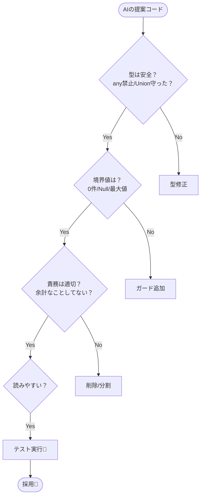

# 第05章：AI拡張の使いどころ（下書き・比較・説明役）🤖✨

## この章でできるようになること✅🎓

* AIに「任せてOKな作業」と「自分が決めるべき所」を分けられる🧠✨
* いい感じの結果を引き出す“プロンプトの型”を使い回せる🧁📝
* AIの提案を**安全に採用するチェック手順**が身につく🧯✅
* 「それっぽい正解」に騙されず、**TypeScriptで検証して勝つ**習慣ができる💪🟦

---

## まず結論：AIは「3役」だよ🎭✨

AI拡張は、ざっくりこの3役で使うと強いよ〜！😍


1. **下書き係📝**

   * 型定義のたたき台、関数の骨組み、テスト案、READMEの叩き台…など
   * *ゼロ→イチを速くするのが得意*✨

2. **比較係⚖️**

   * 「案Aと案Bどっちが良い？」「関数で行く？クラスで行く？」みたいな比較
   * *メリデメ整理が得意*✨

3. **説明係👩‍🏫**

   * そのコード、なぜそう書くの？どこが危険？何が嬉しい？
   * *初心者向けの言い換えが得意*✨

そして…最近は **“作業もやってくれる役（エージェント）”** も強くなってきてるよ🤖🛠️
VS CodeのCopilotはチャットだけじゃなく、エージェント切り替えやコンテキスト付与、テスト生成などが整理されてるよ。([Visual Studio Code][1])

---

## AIに任せてOKなこと / 任せないこと🧡⚠️

### 任せてOK寄り🟢（時短しやすい）

* 関数や型の**たたき台**を作る🧩
* 既存コードの**要約・説明**を作る📚
* 「この責務、どこに置く？」みたいな**整理案**を出させる🧹
* **テスト観点**（境界値・異常系）の列挙🧪
* **リファクタ案の候補**を複数出させる🔁

### 任せない🟥（ここは人間が最終責任🔥）

* 仕様の決定（「割引は端数切り上げ？切り捨て？」みたいなルール）📏
* セキュリティ判断（秘密情報・権限・暗号など）🔐
* 採用判断（「結局どの案でいくか」）🧠
* “動いたっぽい”だけで本番投入🚫（必ず検証！）

---

## 失敗しない「プロンプトの型」5つ🧁💬

AIに投げるときは、毎回ゼロから考えないで「型」でいこ！✨

### 型①：下書き（最小実装）📝

* **目的**：まず動く骨組みを出させる
* **コツ**：条件を絞って「最小」にする（盛りすぎ禁止🙅‍♀️）

### 型②：比較（A vs B）⚖️

* **目的**：案を並べて選びやすくする
* **コツ**：「何を優先する比較か」を書く（可読性？拡張性？テスト性？）

### 型③：説明（先生モード）👩‍🏫

* **目的**：理解を速める
* **コツ**：「中学生でも分かる」「例え話」「注意点3つ」みたいに指定する

### 型④：レビュー（危険探し）🕵️

* **目的**：バグ・匂い・落とし穴を洗い出す
* **コツ**：「バグになりそうな点」「拡張した時の地雷」「型の弱さ」を聞く

### 型⑤：テスト観点（境界/異常系）🧪

* **目的**：落とし穴をテストで潰す
* **コツ**：**期待値**も書かせる（“何が正しいか”が曖昧だと崩壊💥）

---

## ハンズオン🛠️：同じ要求を「2通りのプロンプト」で投げて比べよう🎯✨

## お題☕🧾

「注文（items）の合計金額を出す。割引がある場合もある。」

### 最小の型（例）🧩

```ts
type LineItem = { name: string; unitPrice: number; qty: number };

type Discount =
  | { kind: "none" }
  | { kind: "percent"; rate: number }   // 0.0〜1.0
  | { kind: "fixed"; amount: number };  // 円

// ここを作りたい！👇
export function calcTotal(items: LineItem[], discount: Discount): number {
  // TODO
  return 0;
}
```

---

## プロンプトA（ざっくり）🙈

```txt
TypeScriptで、注文の合計金額を計算する関数を作って。
割引にも対応して。
```

**起きがち問題😇**

* 仕様を勝手に決める（端数処理、負数、上限、税込…）
* 型がふんわり（any混入、null許容しすぎ）
* “それっぽい”けど境界ケースが弱い

---

## プロンプトB（勝ちに行く✨）🏆

```txt
TypeScriptで calcTotal(items, discount) を実装したいです。

要件:
- items は { name, unitPrice, qty } の配列
- discount は discriminated union:
  - { kind: "none" }
  - { kind: "percent", rate: number }  // 0〜1
  - { kind: "fixed", amount: number }  // 円
- 返り値は「0未満にならない」こと（割引しすぎ防止）
- 小数は扱わない（unitPrice と amount は整数）
- 実装は「関数 + 型」を基本に、余計な独自クラスを増やさない

出力してほしいもの:
1) 実装コード
2) 境界ケースのテスト観点を8個（期待値つき）
3) ありがちなバグ3つ
```

**このBが強い理由💡**

* 「仕様の穴」を塞いでる（0未満禁止、整数、union固定）
* 「設計の方向」を固定してる（関数＋型、クラス増やさない）
* 「採用判断に必要な材料」（テスト観点・バグ）まで取れる

---

## AIの回答を採用する「5つのチェック」✅🧯

AIの提案をコピペする前に、これだけは毎回やろうね！🥺

1. **型が崩れてない？**（anyが混ざってない？ unionが守られてる？）🧩
2. **境界値に強い？**（0件、qty=0、rate=0/1、割引しすぎ…）🧪
3. **責務が増えすぎてない？**（税計算や在庫確認まで混ぜてない？）🧹
4. **読みやすい？**（未来の自分が読める？）📖
5. **テストで確かめた？**（最低でも代表＋境界）✅



---

## 「AI拡張」最新の使い勝手（大事ポイントだけ）📌✨

## VS CodeのCopilotは「チャット＋エージェント＋コンテキスト」が軸🧠

* チャット（Chat view / Inline chat / Quick Chat）で聞ける💬
* エージェント切り替えや、モデル選択もできる🎛️
* `Add Context` や `#<file|symbol>` で、**ファイルを添えて聞ける**のが超重要📎
  これらはVS CodeのCopilot機能チートシートにまとまってるよ。([Visual Studio Code][1])

> 「AIがズレる」原因の多くは、**必要なコード（文脈）を渡してない**ことだよ〜！😵‍💫📎

---

## GitHub側の設定で「安全寄り」にできる🔐

* **公開コードに一致する提案**を「許可/ブロック」できるよ。ブロック時は、提案と周辺約150文字を公開コードと照合して、近いものは出さない仕組み。([GitHub Docs][2])
* Copilot Chatの**Web検索**は既定でオフで、オンにするとBing検索を使うよ。新技術の話題には便利だけど、オフ/オンの意識は大事！([GitHub Docs][2])

---

## 「見せたくないファイル」は除外できる🙅‍♀️📁

`.env` や `secrets.json` みたいなファイルは、Copilotの対象から外す設定が用意されてるよ（パスパターンで指定）。([GitHub Docs][3])

---

## “エージェントに作業させる”もできる（でも権限管理は大事）🤖🛠️

GitHubには「Copilot coding agent」があって、Issueに割り当てたり、チャットからPR作らせたりできるよ。既定で有効だけど、リポジトリへのアクセスは制御できる。([GitHub Docs][2])

---

## OpenAI系：CodexのIDE拡張も進化中🧪

CodexのIDE拡張は、コードの読み書きや実行まで含めたワークフローをサポートするドキュメントが出てるよ。([GitHub Docs][4])
なお、Windowsサポートが「実験的」扱いの記述があるので、安定重視ならWSLワークスペース運用が書かれているよ。([GitHub Docs][4])

---

## よくある失敗あるある🥲💥 → 回避法✨

## あるある①：AIが勝手に“大げさな設計”にする🏰

* ✅ 回避：プロンプトに「まず関数＋型で」「独自クラス増やさない」を明記する🧁

## あるある②：存在しないAPIを提案する🧟‍♂️

* ✅ 回避：「そのAPIの公式ドキュメント根拠も一緒に」と聞く📚
* ✅ そして **TypeScriptの型チェックとテスト**で落とす🧪

## あるある③：動くけど、仕様に合ってない😇

* ✅ 回避：**受け入れ条件（Acceptance Criteria）**を先に書く✅
  （例：0未満禁止、rate範囲、整数のみ、など）

---

## ミニ課題🎒✨（15分でOK）

1. calcTotal に対して「テスト観点8個（期待値つき）」をAIに出させる🧪
2. AIが出した観点を、**3つだけ**実際にテストにする（小さく！）✅
3. 「percent割引」と「fixed割引」で、**境界値**（rate=0 / rate=1 / amountが合計超え）をチェック🔍

---

## まとめ🧁🎉

* AIは「下書き📝・比較⚖️・説明👩‍🏫」で使うと失敗しにくい
* “勝てるプロンプト”は **要件＋制約＋出力形式**がセット✨
* 採用前は **型・境界・責務・可読性・テスト**の5点チェック✅
* 公開コード一致の扱い・Web検索・ファイル除外など、設定も味方につけよう🔐✨ ([GitHub Docs][2])

[1]: https://code.visualstudio.com/docs/copilot/reference/copilot-vscode-features "GitHub Copilot in VS Code cheat sheet"
[2]: https://docs.github.com/copilot/how-tos/manage-your-account/managing-copilot-policies-as-an-individual-subscriber "Managing GitHub Copilot policies as an individual subscriber - GitHub Docs"
[3]: https://docs.github.com/en/copilot/how-tos/configure-content-exclusion/exclude-content-from-copilot "Excluding content from GitHub Copilot - GitHub Docs"
[4]: https://docs.github.com/ja/copilot/reference/ai-models/supported-models?utm_source=chatgpt.com "GitHub Copilot でサポートされている AI モデル"
