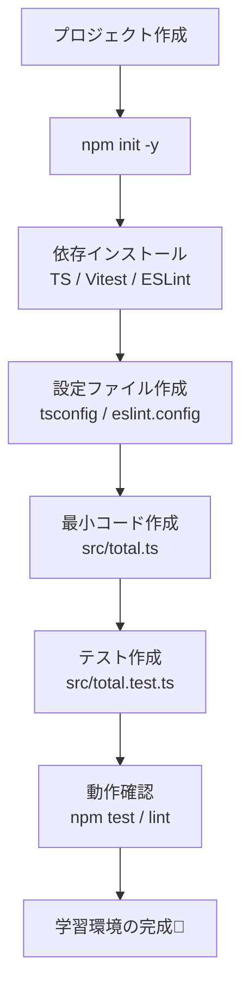

# 第06章：プロジェクト雛形（TS＋テスト＋Lintを最小で）🧪

## 6.1 この章のゴール🎯

* **TypeScriptをstrictで書ける**ようにする🧠✨ ([TypeScript][1])
* **ES Modules（ESM）**で迷子にならない構成にする📦 ([Node.js][2])
* **テスト1本が通る**ところまで到達する✅
* **Lintで最低限の事故を防ぐ**（保存するたびに安心感UP）🧹 ([ESLint][3])

---

## 6.2 まず完成形（ファイル構成）📁✨

これで「なんとなく」から卒業して、プロっぽい開発体験を手に入れよう！🚀✨


* `package.json`
* `tsconfig.json`
* `eslint.config.js`
* `src/total.ts`
* `src/total.test.ts`

---

## 6.3 手順①：プロジェクト作成（コマンドだけでOK）🛠️💨

```powershell
mkdir gof-ts-learning
cd gof-ts-learning
npm init -y
code .
```

---

## 6.4 手順②：依存関係を入れる（最小）📦✨

```powershell
npm i -D typescript vitest eslint @eslint/js typescript-eslint
```

* **テスト**：Vitest（TSと相性よくて導入が軽い） ([typescript-eslint.io][4])
* **Lint**：ESLint v9以降は **flat config（`eslint.config.js`）が標準** 🧹 ([ESLint][3])
* TS向けルール：typescript-eslint の推奨構成を使うよ🧩 ([Node.js][5])



---

## 6.5 手順③：`package.json` を整える🧾✨


### ✅ ここがポイント

* ESMにするなら `"type": "module"` を入れる📦（Nodeの公式ドキュメントでも説明あり） ([Node.js][2])
* スクリプトを4つだけ用意する（これで学習が回る）🔁

`package.json` をこうしてね👇

```json
{
  "name": "gof-ts-learning",
  "version": "1.0.0",
  "type": "module",
  "private": true,
  "scripts": {
    "typecheck": "tsc --noEmit",
    "test": "vitest run",
    "test:watch": "vitest",
    "lint": "eslint ."
  }
}
```

---

## 6.6 手順④：`tsconfig.json`（strict + Node ESM寄り）🧠📦

TypeScriptは **modern Nodeなら `module: "nodenext"` が推奨寄り**だよ🧁 ([TypeScript][6])
`moduleResolution` も `nodenext` とセットで「import/requireの解決アルゴリズム差」を扱える設計🧭 ([TypeScript][7])

`tsconfig.json` を作成👇

```json
{
  "compilerOptions": {
    "target": "ES2022",
    "module": "nodenext",
    "moduleResolution": "nodenext",
    "strict": true,
    "noEmit": true,

    "esModuleInterop": true,
    "skipLibCheck": true,
    "forceConsistentCasingInFileNames": true
  },
  "include": ["src/**/*.ts"]
}
```


> 💡 `strict: true` は「安全系オプションをまとめてON」にするスイッチだよ✨ ([TypeScript][1])

---

## 6.7 手順⑤：ESLint（flat config）を置く🧹✨

`eslint.config.js` を作成👇
（ESLint v9の流儀＝flat config！） ([ESLint][3])


```js
import js from "@eslint/js";
import tseslint from "typescript-eslint";

export default [
  { ignores: ["dist/**", "node_modules/**"] },

  js.configs.recommended,

  ...tseslint.configs.recommended
];
```

* 「TypeScript向けの推奨ルール」をそのまま使うのが一番ラク🧁 ([Node.js][5])
* ここでは **過剰なルール追加はしない**（学習の敵＝設定沼😵‍💫）

---

## 6.8 手順⑥：最小コード（関数1つ）＋テスト1本✅🍰

### `src/total.ts`

```ts
export type LineItem = {
  name: string;
  price: number; // 税抜でも税込でもOK（ここでは数値として扱うだけ）
  qty: number;
};

export const calcTotal = (items: readonly LineItem[]): number => {
  return items.reduce((sum, x) => sum + x.price * x.qty, 0);
};
```

### `src/total.test.ts`

ESMだと相対importは拡張子が絡みやすいので、ここでは **`.js` で書く**のが安定だよ📦
（NodeのESMは `package.json` の `"type": "module"` などで判定される話も公式に載ってる） ([Node.js][2])

```ts
import { describe, it, expect } from "vitest";
import { calcTotal } from "./total.js";

describe("calcTotal", () => {
  it("合計金額を計算できる", () => {
    const total = calcTotal([
      { name: "Latte", price: 450, qty: 2 },
      { name: "Cookie", price: 180, qty: 1 }
    ]);

    expect(total).toBe(1080);
  });
});
```

---

## 6.9 動作確認（3つだけ）✅✅✅


```powershell
npm run typecheck
npm run lint
npm test
```

全部通ったら勝ち〜〜！🎉✨

---

## 6.10 よくあるつまずき（ここだけ見れば復帰できる）🧯😵‍💫

### ❓ Q1. `Cannot find module './total'` とか言われる…

* ESMだと **importの解決がシビア**になりがち🧩
* まずはこの章の通り、**テスト内の相対importは `./total.js`** にすると安定しやすいよ📦
* その背景として、Nodeは `package.json` の `"type"` などでESM/CJS扱いを決めるよ（公式） ([Node.js][2])

### ❓ Q2. ESLintがVS Codeで反映されない…

* 拡張機能「ESLint」を入れて、右下の警告が出るなら **“Enable”** する🧹✨
* 反映されない時は `Ctrl+Shift+P` → **“Developer: Reload Window”** 🔁

### ❓ Q3. 「最新のNodeはTSをそのまま実行できるって聞いた！」👀

* できる方向に進んでるよ！（型を剥がして実行する仕組みなど）
* ただ、学習では「確実に動く最小」が最優先なので、まずこの雛形でOK👌✨
  （必要になったら、後で“実行方法の選択肢”として追加すれば大丈夫！）

### ❓ Q4. Vitestの設定で迷子になった…🌀

* 最初は **設定ファイル無し**で進めてOK！
* 詰まったら「よくあるエラー集」を見ると早いよ🧯 ([typescript-eslint.io][4])

---

## 6.11 この章のAIプロンプト例🤖💬

```text
TypeScriptで「関数1つ＋テスト1本」だけの最小例を作りたいです。
制約：
- ESM（package.json は type: module）
- tsconfig strict: true
- テストは Vitest
- import で迷子にならないように、相対importの書き方も含めて提示して
出力：
1) ファイル構成 2) 各ファイルの中身 3) 実行コマンド 4) よくある詰まりポイント
```

---

## 6.12 チェックリスト✅📌（ここが全部OKなら次章へ！）

* `npm run typecheck` が通る✅
* `npm run lint` が通る✅
* `npm test` が通る✅
* `src/total.ts` と `src/total.test.ts` がある✅
* 「設定を増やさずに回せる」状態になってる✅🎉

次の第7章から、この土台の上で「共通題材（カフェ注文）」を少しずつ育てていくよ〜☕🧁✨

[1]: https://www.typescriptlang.org/tsconfig/strict.html?utm_source=chatgpt.com "TSConfig Option: strict"
[2]: https://nodejs.org/api/packages.html "Modules: Packages | Node.js v25.6.0 Documentation"
[3]: https://eslint.org/docs/latest/use/configure/migration-guide "Configuration Migration Guide - ESLint - Pluggable JavaScript Linter"
[4]: https://typescript-eslint.io/getting-started/ "Getting Started | typescript-eslint"
[5]: https://nodejs.org/api/typescript.html "Modules: TypeScript | Node.js v25.6.0 Documentation"
[6]: https://www.typescriptlang.org/tsconfig/module?utm_source=chatgpt.com "TSConfig Option: module"
[7]: https://www.typescriptlang.org/tsconfig/moduleResolution.html?utm_source=chatgpt.com "TSConfig Option: moduleResolution"
