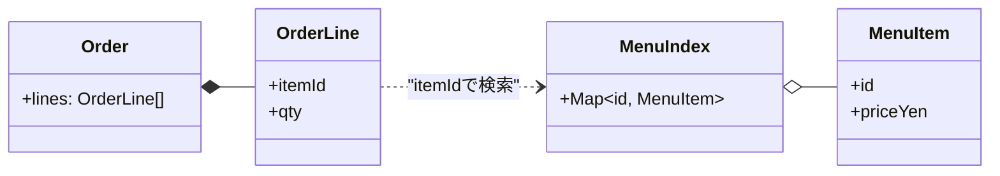

# 第07章：共通題材を実装（注文・商品・合計だけ）☕🧾

## ねらい🎯

* **「まず動く」を最速で作る**💨
* いきなり設計を頑張らず、**型（type）＋関数**だけでスッキリ書く🧁
* 後の章で「ここがつらい〜😵」って言える“素”を用意する（これ超大事！）✨

---

## 今日つくるミニ機能🍰

今回の題材は「カフェ注文」☕
最小なので、やることはこれだけ👇

   * 注文票（Order）🧾
   * メニュー（Product）☕️

   

2. **単純な計算**
   * 商品の合計金額を出す（単純な足し算）➕
   * レシート風のテキストを出す🖨️

   

---

## “最小の型”を決めよう🧩

ここは**TypeScriptの強み**が気持ちいいところ😍
まずは「データの形」を固定しちゃうよ〜！

## 設計のコツ（超KISS）🍡

* **金額は「円の整数」**で扱う（小数は事故りやすい😵‍💫）


* 「注文」は、最初は **ただの配列**でOK（クラス禁止！…じゃなくて、今は不要🙆‍♀️）

> ちなみに TypeScript の最新リリースノートは 5.9 系が公開されてるよ📌 ([TypeScript][1])
> （この章のコードは、もっと古いTSでも普通に動く内容にしてあるよ😊）

---

## 実装①：型＋関数で“動く最小”を作る🛠️✨

## `src/cafe.ts` を作る☕

```ts
// src/cafe.ts

// 「円（整数）」として扱うよ💰
export type Yen = number;

export type MenuItemId = string;

export type MenuItem = {
  id: MenuItemId;
  name: string;
  priceYen: Yen;
};

export type OrderLine = {
  itemId: MenuItemId;
  qty: number; // 1以上を想定🍩
};

```


```ts
export type Order = {
  lines: OrderLine[];
};

// メニューを検索しやすい形にする（標準の Map を使うよ🗺️）
```


```ts
export function indexMenu(menu: readonly MenuItem[]): Map<MenuItemId, MenuItem> {
  return new Map(menu.map((m) => [m.id, m]));
}

export function createOrder(): Order {
  return { lines: [] };
}

// 同じ itemId があったら qty を足す（注文っぽいよね🧾）
export function addItem(order: Order, itemId: MenuItemId, qty: number): Order {
  if (!Number.isInteger(qty) || qty <= 0) {
    throw new Error(`qty must be a positive integer: ${qty}`);
  }

  const next = order.lines.map((l) => ({ ...l }));
  const hit = next.find((l) => l.itemId === itemId);

  if (hit) {
    hit.qty += qty;
  } else {
    next.push({ itemId, qty });
  }

  return { lines: next };
}

export function calcSubtotalYen(menuIndex: Map<MenuItemId, MenuItem>, order: Order): Yen {
  let sum = 0;

  for (const line of order.lines) {
    const item = menuIndex.get(line.itemId);
    if (!item) {
      throw new Error(`unknown itemId: ${line.itemId}`);
    }
    sum += item.priceYen * line.qty;
  }

  return sum;
}

// “見た目”は標準の Intl で（デファクト⭐）
export function formatYen(yen: Yen): string {
  return new Intl.NumberFormat("ja-JP", { style: "currency", currency: "JPY" }).format(yen);
}

export function renderReceipt(menuIndex: Map<MenuItemId, MenuItem>, order: Order): string {
  const lines: string[] = [];

  lines.push("🧾 ご注文内容");
  for (const l of order.lines) {
    const item = menuIndex.get(l.itemId);
    if (!item) throw new Error(`unknown itemId: ${l.itemId}`);

    const lineTotal = item.priceYen * l.qty;
    lines.push(`- ${item.name} × ${l.qty} = ${formatYen(lineTotal)}`);
  }

  const subtotal = calcSubtotalYen(menuIndex, order);
  lines.push("—");
  lines.push(`小計: ${formatYen(subtotal)}`);

  return lines.join("\n");
}
```



---

## 実装②：動かしてみよう（consoleでOK）🖥️✨

## `src/index.ts` を作る☕

```ts
// src/index.ts
import {
  addItem,
  createOrder,
  indexMenu,
  renderReceipt,
  type MenuItem,
} from "./cafe.js";

const MENU: readonly MenuItem[] = [
  { id: "coffee", name: "コーヒー", priceYen: 380 },
  { id: "latte", name: "カフェラテ", priceYen: 480 },
  { id: "cake", name: "チーズケーキ", priceYen: 520 },
];

const menuIndex = indexMenu(MENU);

let order = createOrder();
order = addItem(order, "coffee", 1);
order = addItem(order, "cake", 2);

console.log(renderReceipt(menuIndex, order));
```

---

## テストで「合計が合ってる」を守る🧪✅


テストは“安心の自動チェック”だよ〜！🥰
（テストランナーは Vitest が軽くて人気。4.0リリースも出てるよ📌） ([vitest.dev][2])

## `src/cafe.test.ts`

```ts
// src/cafe.test.ts
import { describe, expect, it } from "vitest";
import {
  addItem,
  calcSubtotalYen,
  createOrder,
  indexMenu,
  type MenuItem,
} from "./cafe.js";

const MENU: readonly MenuItem[] = [
  { id: "coffee", name: "コーヒー", priceYen: 380 },
  { id: "cake", name: "チーズケーキ", priceYen: 520 },
];

describe("cafe order", () => {
  it("1品の合計が出せる💰", () => {
    const menuIndex = indexMenu(MENU);
    let order = createOrder();
    order = addItem(order, "coffee", 2);

    expect(calcSubtotalYen(menuIndex, order)).toBe(760);
  });

  it("複数品の合計が出せる🧾", () => {
    const menuIndex = indexMenu(MENU);
    let order = createOrder();
    order = addItem(order, "coffee", 1);
    order = addItem(order, "cake", 1);

    expect(calcSubtotalYen(menuIndex, order)).toBe(900);
  });

  it("存在しない商品IDはエラーで気づける⚠️", () => {
    const menuIndex = indexMenu(MENU);
    const order = addItem(createOrder(), "unknown", 1);

    expect(() => calcSubtotalYen(menuIndex, order)).toThrow(/unknown itemId/);
  });
});
```

---

## VS Codeでラクする操作🧰✨（地味に効く！）

* `MenuItem` のフィールド名を変えたくなったら **Rename Symbol（F2）** で一括変更🔁
* `renderReceipt` が長くなったら、処理を選択して **Extract Method** ✂️
* `MENU` の型が崩れたら、ホバーで型を確認👀（“あれ、any…？”ってすぐ気づける）

---

## AIに投げるプロンプト例🤖💬（コピペOK）

## 1) データ構造をもっとシンプルにしたい🍡

```text
カフェ注文ミニアプリの型を見直したいです。
目的：注文（商品IDと個数）→小計を計算するだけ。
制約：クラス増やしすぎない。型＋関数中心。TypeScriptで自然に。
改善案を2〜3パターン出して、メリデメも説明して。
```

## 2) “つらくなりそうな所”を先に指摘してほしい👃

```text
次のTypeScriptコードを読んで、
今後機能追加（割引、税、在庫、注文状態など）で辛くなりそうな点を5つ指摘して。
ただし、現時点では過剰設計しない前提で「今はこれでOK」も明記して。
```

---

## よくあるつまずき💥（ここだけ注意！）

* **金額を小数で扱ってズレる**：円は整数にすると安心💰✨
* **itemId が存在しないのに0円扱いで進む**：今回は `throw` で気づけるようにしたよ⚠️
* **最初から class を増やしたくなる**：今は我慢！🤣（“困ってから”増やす方が上手くいく）

---

## 今日のチェック✅🎉

* [ ] `MenuItem / OrderLine / Order` の型がある🧩
* [ ] 注文を作って、商品を追加できる🧾
* [ ] 小計が計算できる💰
* [ ] 1〜3本でいいからテストがある🧪✨

---

## 小ネタ📌（最新事情）

* Node は偶数メジャーが LTS になりやすく、**v24 が Active LTS** として案内されてるよ🧠 ([nodejs.org][3])
  （学習でも “LTSの範囲” に寄せると、周辺ツールが安定しやすい〜😊）

[1]: https://www.typescriptlang.org/docs/handbook/release-notes/typescript-5-9.html?utm_source=chatgpt.com "Documentation - TypeScript 5.9"
[2]: https://vitest.dev/blog/vitest-4?utm_source=chatgpt.com "Vitest 4.0 is out!"
[3]: https://nodejs.org/en/about/previous-releases?utm_source=chatgpt.com "Node.js Releases"
