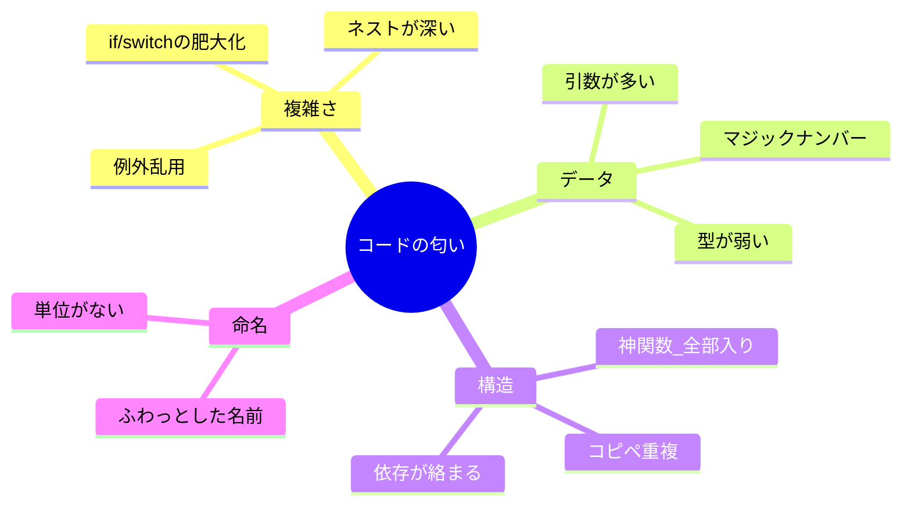

# 第08章：設計の“匂い”を嗅ぐ（つらさのサイン集）👃

## この章でできるようになること 🎯

* 「なんかこのコードつらい…😵‍💫」を**言葉にできる**ようになる
* “匂い”を見つけたら、いきなり大改造せずに**小さく直す**手順がわかる
* 次の章（判断フロー🧭）で「どのパターンが効きそう？」に**つなげられる**ようになる

---

## 匂いってなに？（バグじゃない）🌫️

“匂い”は **今すぐ壊れてはいないけど**、このまま育つと将来つらくなりやすい「サイン」だよ〜👀💦
たとえば…

* 追加要件が来るたびに if が増えていく😇
* 似たコードをコピペして修正漏れが起きる😱
* どこを直せばいいか探すだけで疲れる🫠

匂いは「悪」じゃないよ！🙆‍♀️
小さいコードなら許せることもあるし、**“規模”と“変化の頻度”**で判断するのがコツ✨

---

## 1. コードの不吉な匂い（Code Smells）🐽💦


「動くけど、なんか嫌な感じがする…」

## 匂いの見つけ方 3ステップ 🧭🔍

1. **困った瞬間をメモ**する📝
   　「追加が怖い」「読むのがしんどい」「修正が連鎖する」みたいに感情でOK😂
2. **どこが原因っぽいか**場所を特定する📍
   　ファイル？関数？条件分岐？引数？依存？
3. **“小さい改善”だけ**入れてみる✂️
   　リネーム、関数抽出、重複削除、早期return…まずこの辺で十分💕



---

## 代表的な匂いカタログ（初心者向け・超実用）🧀✨

## 匂い① if / switch が太り続ける 🐷🔀

**サイン👀**

* 分岐が3〜4個を超えて、スクロールが増える
* 「この条件、どこで使ってたっけ？」が頻発
* 追加仕様が来るたびに case が増える

**つらさ😭**

* 修正漏れ・条件抜けが起きやすい
* テストを書かないと安心できない

**まずの一手✂️（パターン前）**

* 条件を“名前付きの関数”にする（読みやすくする）

  * `isHappyHour(order)` みたいに命名して意味を固定🧠
* 早期returnでネストを浅くする
* `switch` の中身を小関数へ分割して“太り”を止める

**この後に効きやすい候補🧩**

* 「やり方を差し替えたい」→ Strategy
* 「状態でできることが変わる」→ State（まず判別Union）

---

## 匂い② 引数が増殖して呪文になる 📿😵‍💫

**サイン👀**

* 引数が4個以上で、呼び出し側が読めない
* `true, false, 0, "A"` みたいな“謎の並び”が出る
* ちょっと追加するたびに全呼び出し修正が必要

**つらさ😭**

* 呼び出しミスが増える（順番間違い・意味違い）
* 変更に弱い（新項目追加で破壊的）

**まずの一手✂️**

* **オプションオブジェクト**にする（TypeScriptの定番✨）

  * `{ size, sugar, coupon }` みたいに名前で渡す
* 既定値（デフォルト）を関数内で持つ

**この後に効きやすい候補🧩**

* 「手順や順番が大事」→ Builder
* 「種類が増える」→ Factory（登録型も）

---

## 匂い③ コピペが増えて“微妙に違う同じ処理”が乱立 📄📄📄

**サイン👀**

* 似た関数が複数ある（名前だけ違う）
* 片方だけ修正されて差が出る
* “似てるけど少し違う”が増えて混乱

**つらさ😭**

* 修正漏れが発生する
* バグの温床になる

**まずの一手✂️**

* 共通部分を関数に切り出す（Extract Method）
* “差分”を引数（または関数）で渡す
* まずは **1箇所だけ**共通化して、効果を体感しよ🙌

---

## 匂い④ 名前がふわっとしてて脳内補完が必要 🤯🌀

**サイン👀**

* `doStuff`, `handle`, `data`, `tmp`, `calc2` が多い
* “何を/なぜ”が読めない
* コメントがないと理解できない

**つらさ😭**

* 読む人の解釈がブレる
* 仕様変更で破綻しやすい

**まずの一手✂️**

* 「何を返す？」「いつ使う？」で名前を決める

  * `getTotal`（合計を返す）
  * `applyCoupon`（クーポンを適用する）
* “単位”も入れる（`priceYen` みたいに）💰

---

## 匂い⑤ 1つの関数が全部やってる（神関数）👑💥

**サイン👀**

* 1関数が50行超え
* DB/計算/整形/ログ…が混在
* 途中で例外やreturnが多すぎる

**つらさ😭**

* テストしづらい
* ちょい修正で壊れやすい

**まずの一手✂️**

* **“段落”ごとに関数抽出**（検証→計算→整形…）
* I/O（外部）と純粋計算（内部）を分ける

  * 純粋計算はテストが超ラク🥳

---

## 匂い⑥ 依存が絡まりすぎて“1個直すと全部動く”🕸️😱

**サイン👀**

* ある関数がいろんなモジュールを直接importしてる
* 変更の影響範囲が読めない
* テストで差し替えできない

**つらさ😭**

* “部分修正”ができず、常に全体修正になる
* リファクタが怖くなる

**まずの一手✂️**

* まずは「境界」を決める（外部API・日時・乱数・入出力など）
* 依存は引数で渡す（DIっぽく）
* interface（もしくは関数型）で“差し替え口”だけ作る

---

## 匂い⑦ マジックナンバー / マジック文字列が散らばる 🪄🔢

**サイン👀**

* `1.1` や `"HAPPY"` みたいな値があちこち
* 変更が来ると検索しまくり

**つらさ😭**

* “意味の取り違え”が起きる
* 変更が漏れる

**まずの一手✂️**

* 定数化する（`const TAX_RATE = 0.1`）
* 文字列は union で型にする（`type Coupon = "happy" | "member"`）

---

## 匂い⑧ 例外で流れを作っていて、分岐が読めない 💥🧯

**サイン👀**

* 例外が“正常ルート”みたいに使われてる
* try/catch があちこちにある

**つらさ😭**

* 「どこで失敗する？」が読めない
* ログやUI表示が崩れる

**まずの一手✂️**

* 失敗は戻り値で表す（Result的）
* 例外は“境界”（外部I/O）中心に寄せる

---

## ハンズオン：カフェ注文コードに“匂いコメント”を貼ろう 📝☕✨

## Step 1：わざと匂うコードを読む👃💦

（※このコードは“匂い探し用”にわざと詰め込んでるよ！）

```ts
// order.ts
type Size = "S" | "M" | "L";
type Coupon = "none" | "happy" | "member";

type OrderItem = {
  name: string;
  basePrice: number; // 税抜
  size: Size;
  sugar: number; // 0〜5
  coupon: Coupon;
};

export function calcTotal(items: OrderItem[], isTakeout: boolean, nowHour: number): number {
  let total = 0;

  for (const item of items) {
    let price = item.basePrice;

    // サイズで加算
    if (item.size === "M") price += 50;
    else if (item.size === "L") price += 100;

    // 砂糖（無料だけど上限チェック…みたいな仕様が混ざる）
    if (item.sugar < 0) throw new Error("invalid sugar");
    if (item.sugar > 5) throw new Error("too much sugar");

    // クーポン
    if (item.coupon === "happy") {
      // 夕方だけ10%OFF
      if (nowHour >= 16 && nowHour <= 18) {
        price = Math.floor(price * 0.9);
      }
    } else if (item.coupon === "member") {
      // 会員は常時5%OFF
      price = Math.floor(price * 0.95);
    }

    // 持ち帰りは容器代
    if (isTakeout) price += 30;

    // 税（10%）
    price = Math.floor(price * 1.1);

    total += price;
  }

  return total;
}
```

## Step 2：匂いをコメントで“見える化”🧷👀

次を目標に、コードにコメントを入れてみてね👇

* どこが「if太り」？🐷
* 引数（`items, isTakeout, nowHour`）は今後増えそう？📿
* “仕様”がどこに散ってる？（税、容器代、割引…）🌀
* 例外の使い方は自然？🧯

例（こんな感じでOK🙆‍♀️）

* `// 匂い①：クーポン分岐が増えたら地獄になりそう`
* `// 匂い②：税率1.1がマジックナンバー`

---

## ちょい改善：パターン無しで“読みやすく”する ✂️✨

## 改善A：マジック値に名前をつける🪄➡️📛

```ts
const TAX_RATE = 0.1;
const TAKEOUT_FEE = 30;

function applyTax(price: number): number {
  return Math.floor(price * (1 + TAX_RATE));
}
```

## 改善B：「割引」と「価格計算」を段落で分ける📚

```ts
function sizeExtra(size: Size): number {
  if (size === "M") return 50;
  if (size === "L") return 100;
  return 0;
}

function validateSugar(sugar: number): void {
  if (sugar < 0) throw new Error("invalid sugar");
  if (sugar > 5) throw new Error("too much sugar");
}

function applyCoupon(price: number, coupon: Coupon, nowHour: number): number {
  if (coupon === "member") return Math.floor(price * 0.95);

  if (coupon === "happy") {
    const isHappyHour = nowHour >= 16 && nowHour <= 18;
    if (isHappyHour) return Math.floor(price * 0.9);
  }
  return price;
}

export function calcTotal(items: OrderItem[], isTakeout: boolean, nowHour: number): number {
  let total = 0;

  for (const item of items) {
    validateSugar(item.sugar);

    let price = item.basePrice + sizeExtra(item.size);
    price = applyCoupon(price, item.coupon, nowHour);

    if (isTakeout) price += TAKEOUT_FEE;

    total += applyTax(price);
  }

  return total;
}
```

この時点で、まだGoFパターンは入れてないのに…

* どこで何してるか見えやすい😍
* 追加仕様（税率変更、クーポン追加）に備えやすい🧠
  って感じになるよ〜✨

---

## VS Codeでやると速い操作 🧰⚡

* **Rename Symbol（F2）**：名前の改善が一瞬でできる🔁
* **Find All References**：影響範囲を把握できて安心👀
* **Extract Method / Extract Variable**：神関数を分割していける✂️
  VS Codeはこういうリファクタ機能を標準でサポートしてるよ。([Visual Studio Code][1])

---

## AIに頼むときの“ちょうどいい”投げ方 🤖💬✨

## 匂い指摘（まずは観察役）

```text
このTypeScriptコードの「設計の匂い」を5つ挙げて。
- 匂いの種類（例：if肥大化 / 重複 / 命名 / 依存 など）
- なぜ辛くなるか
- “パターンを入れずに”まずできる小さな改善
で出して。
```

## 改善を“段階的に”（一気に改造させない）

```text
改善案を「小→中」の順で3段階にして。
制約：
- TypeScriptの標準機能や一般的な書き方（関数分割、定数化、オプションオブジェクト）中心
- デザインパターン専用の独自クラス乱立は禁止
- まずは挙動を変えないリファクタだけ
```

## テスト案も一緒に（安心材料🧪）

```text
この関数のテストケース案を10個。
代表ケース＋境界ケース（割引の時間、サイズ、持ち帰り、砂糖上限など）を混ぜて。
```

---

## 壊してない証拠：テストで守る 🧪🛡️

Nodeには**組み込みのテストランナー**があるので、最小ならそれでOKだよ。([nodejs.org][2])

```ts
// order.test.ts
import test from "node:test";
import assert from "node:assert/strict";
import { calcTotal } from "./order.js";

test("member coupon applies 5% off (rough check)", () => {
  const total = calcTotal(
    [{ name: "Latte", basePrice: 500, size: "S", sugar: 2, coupon: "member" }],
    false,
    12
  );
  assert.ok(Number.isFinite(total));
});
```

テストは最初から完璧じゃなくていいよ〜🙆‍♀️💕
「匂いを直したけど、動きは同じ」が守れれば勝ち🎉

---

## ミニ最新メモ（2026年2月時点）📌✨

* TypeScript は **5.9系の安定版リリース**が確認できるよ。([GitHub][3])
* TypeScript のネイティブ実装（Go移植）関連の動きがあり、**2026年初頭リリース目標**という報道・告知も出てるよ。([InfoWorld][4])
* Node.js は公式のリリース表で、**Current が v25、Active LTS が v24**（2026-02時点の更新情報）になってる。([nodejs.org][5])
* `structuredClone()` は Web 標準として広く利用可能（互換性情報あり）だよ。([MDNウェブドキュメント][6])

---

## よくあるつまずき 🐣💥

* **匂いを見つけた瞬間、全部直したくなる** → まず“1個だけ”でOK🧁
* **パターンを先に当てたくなる** → 先に「困りごと」を言語化するのが近道🧭
* **リファクタで壊れた気がする** → テスト（or 最小の動作確認）を“先に”作る🧪

---

## まとめ ✅🎀

* 匂いは「将来つらくなるサイン」🌫️
* まずは **見える化 → 小さい改善 → テストで守る** の3点セット👃✂️🧪
* if太り・引数増殖・重複・命名あいまい…この辺を嗅げるだけで、次の章から一気に楽になるよ〜🥳✨

[1]: https://code.visualstudio.com/docs/editing/refactoring?utm_source=chatgpt.com "Refactoring"
[2]: https://nodejs.org/en/learn/test-runner/using-test-runner?utm_source=chatgpt.com "Using Node.js's test runner"
[3]: https://github.com/microsoft/typescript/releases?utm_source=chatgpt.com "Releases · microsoft/TypeScript"
[4]: https://www.infoworld.com/article/4100582/microsoft-steers-native-port-of-typescript-to-early-2026-release.html?utm_source=chatgpt.com "Microsoft steers native port of TypeScript to early 2026 ..."
[5]: https://nodejs.org/en/about/previous-releases?utm_source=chatgpt.com "Node.js Releases"
[6]: https://developer.mozilla.org/en-US/docs/Web/API/Window/structuredClone?utm_source=chatgpt.com "Window: structuredClone() method - Web APIs | MDN"
