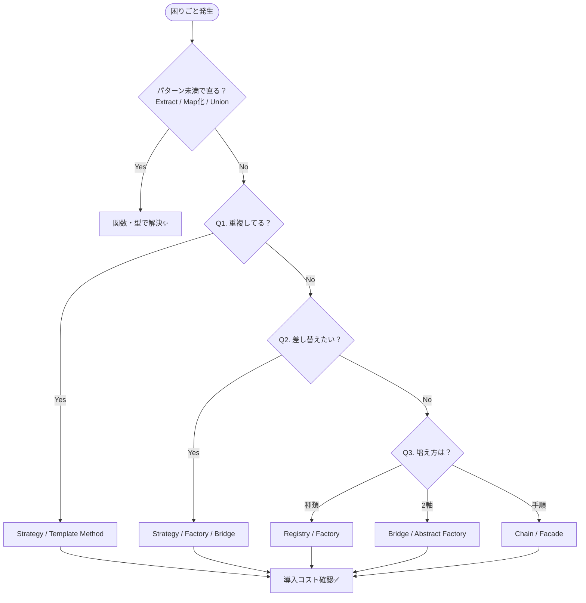

# 第09章：パターンの判断フロー（まず関数→それでも辛い？）🧭

## ねらい🎯

「いまこのコード、何がつらいの？」を言葉にして、**“最小の改善”→“パターン候補”**の順で判断できるようになるよ😊🌸

---

## 1) まず大事：> 「パターンを使うことが目的じゃない。**痛みを消すための処方箋**として使うんだ💊」


パターンは「答え」じゃなくて「選択肢」🎒💡

GoFパターンって、最初から当てにいくとしんどいの🥺
だからこの章は **“当てゲーム”**でOK！🎮✨

* まず **関数の整理**でラクになる？🧹
* それでも **増え方がヤバい**？📈
* じゃあ **どの系統のパターンが効きそう？**🧩

この順番が勝ち筋だよ🫶

---

## 2) 判断フロー（これを毎回回す）🔁🧭


## ステップ0：つらさを1文にする📝

例：

* 「割引が増えるたびに `if` が伸びる」😵‍💫
* 「生成（new）が色んな場所に散ってる」🧨
* 「状態によってできる操作が変わって、分岐地獄」🚦

---

## ステップ1：まず“パターン未満”で整える🧹✨

ここで直るなら、パターン入れなくてOK😌🌸

* **重複** → 同じ処理を関数にまとめる（Extract）✂️
* **引数多すぎ** → オプションオブジェクト化 `{ ... }` 📦
* **switch/if こわい** → 判別Unionで網羅チェック🚥
* **散らばった変換** → 境界に変換関数を1個置く（Adapterの“手前”）🧼

---

## ステップ2：「4つの質問」で候補パターンを絞る🧠💫

ここが本章のメイン！🎉

### Q1. 重複してる？（同じ形のコードが増えてる？）🪞

* YES → まず関数化・共通化
* それでも「処理の差分だけ変えたい」なら → **Strategy / Template Method**候補🎭

### Q2. 差し替えたい？（やり方を入れ替えたい？）🔁


* YES → **Strategy**（まずは関数）⚙️
* 「生成を差し替えたい」なら → **Factory Method / Abstract Factory**🏭
* 「やりたいこと×実装の2軸がある」なら → **Bridge**🌉

### Q3. 増え方は？（種類が増え続ける？組み合わせが増える？）📈💥


* 種類が増える（1軸）→ Map登録のFactory / Strategy登録🗂️
* 2軸で増える（組み合わせ爆発）→ **Bridge / Abstract Factory**💣
* 処理手順が増える → **Chain / Facade**⛓️🚪

### Q4. 責務が混ざってる？（何役もやってる？）🎭😵

* YES → まず分割（関数/ファイル/モジュール）🧩
* 「通知」「監視」「ログ」など横断が混ざる → **Observer / Decorator**📣🎁
* 「外部I/Oの形」が混ざる → **Adapter**🔌



---

## ステップ3：採用前チェック（“導入コスト”確認）✅🧯

パターンは便利だけど、増やすと複雑になるのも事実🥺

* **新しいファイル/概念が増えても、読む人が迷わない？**🧭
* **テストがラクになる？**🧪
* **「追加」の作業が本当に短くなる？**✂️
* **2回以上同じつらさが起きてる？（1回だけなら我慢もアリ）**🫣

---

## 3) 匂い → 候補パターン（当てゲーム用チート）📝✨

「困りごと」を見たら、まずこのへんを思い出してね😊

* `if/switch` が増殖して “種類” が増える → **Strategy / State**🚦⚙️
* `new` が条件分岐で散らばる → **Factory Method**🏭
* “セット”で切替えたい（整合する部品群） → **Abstract Factory**👨‍👩‍👧‍👦
* 引数が多すぎ／順序が大事 → **Builder**🧱
* 外部APIの形が合わない／変換が散らばる → **Adapter**🔌
* 手順が長くて呼ぶ側が大変 → **Facade**🚪
* 前処理が増えてパイプライン化したい → **Chain**⛓️
* 通知でつなぎたい（疎結合） → **Observer**📣
* 履歴/Undo/Redo → **Command / Memento**🎮📸
* 大量生成で重い → **Flyweight**🗃️
* 遅延/監視/キャッシュの代理 → **Proxy**🕵️

---

## 4) ハンズオン🛠️：匂い → “まず関数” → 候補パターン（カフェ割引）☕💰

## 4-1. ありがちな「つらいコード」😵‍💫

割引ルールが増えて、`if` が伸びるやつ！

```ts
type Item = { name: string; price: number };
type Order = { items: Item[]; couponCode?: string; isMember: boolean };

export function calcTotal(order: Order): number {
  const subtotal = order.items.reduce((sum, it) => sum + it.price, 0);

  let discount = 0;
  if (order.isMember) {
    discount += Math.floor(subtotal * 0.1);
  }
  if (order.couponCode === "WELCOME") {
    discount += 200;
  }
  if (subtotal >= 2000) {
    discount += 150;
  }

  return Math.max(0, subtotal - discount);
}
```

**匂いチェック👃**

* 割引が増えるほど `calcTotal` が肥大化しそう🍔📈
* 割引ルールのテストが `calcTotal` に密集しがち🧪😵

---

## 4-2. パターン未満の改善：「割引だけ外に出す」✂️✨

まずは **関数**に逃がす！これで十分なこと多いよ😊

```ts
type Item = { name: string; price: number };
type Order = { items: Item[]; couponCode?: string; isMember: boolean };

type DiscountRule = (subtotal: number, order: Order) => number;

const rules: DiscountRule[] = [
  (subtotal, order) => (order.isMember ? Math.floor(subtotal * 0.1) : 0),
  (_subtotal, order) => (order.couponCode === "WELCOME" ? 200 : 0),
  (subtotal, _order) => (subtotal >= 2000 ? 150 : 0),
];

export function calcTotal(order: Order): number {
  const subtotal = order.items.reduce((sum, it) => sum + it.price, 0);
  const discount = rules.reduce((sum, rule) => sum + rule(subtotal, order), 0);
  return Math.max(0, subtotal - discount);
}
```

**この時点で勝ち🎉**

* 追加は `rules` に1個足すだけになった🧩
* ルールを個別にテストしやすい🧪✨

**ここで判断🧭**

* 「ルールがどんどん増える」→ **Strategy（関数）**が本命候補⚙️
* 「ルールのON/OFFや並び替えが必要」→ **Chain**っぽさも出てくる⛓️
* 「注文状態でルールが変わる」→ **State**も匂う🚦

---

## 4-3. “増え方”がさらにヤバいとき：登録（Map）で散らばり防止🗂️📌


「クーポン種類が無限に増える」みたいなときは、登録方式がラク😊

```ts
type Order = { couponCode?: string; isMember: boolean };
type CouponDiscount = (subtotal: number, order: Order) => number;

const couponRules = new Map<string, CouponDiscount>([
  ["WELCOME", (_subtotal, _order) => 200],
  ["VIP", (subtotal, order) => (order.isMember ? Math.floor(subtotal * 0.15) : 0)],
]);

export function couponDiscount(subtotal: number, order: Order): number {
  if (!order.couponCode) return 0;
  return couponRules.get(order.couponCode)?.(subtotal, order) ?? 0;
}
```

**判断ポイント🧠**

* 「ifを増やしたくない」→ Map登録は超定番🗂️✨
* この延長線上が **Strategy登録 / Factory登録** だよ😊

---

## 5) 「パターン採用」の前に見るべきチェックリスト✅💛

## A. 変更の軸は何？（1軸？2軸？）📐

* 1軸（種類だけ増える）→ Strategy / Factory / State
* 2軸（機能×実装で増える）→ Bridge / Abstract Factory

## B. 追加作業はどこが面倒？🛠️

* if追加が面倒 → 差し替え/登録へ（Strategy/Registry）
* 呼び出しが面倒 → 入口を作る（Facade）
* 前後処理が面倒 → つなぐ（Chain / Decorator）

## C. テストがラクになる？🧪

* “差し替え”ができる＝テストも差し替えできることが多い😊✨

---

## 6) AIの使いどころ🤖💬（当てゲームを加速！）

AIには「コード」より先に **匂いの言語化**を投げると強いよ✨

## プロンプト例（そのままコピペOK）🧠💖

```text
次のコードの「つらさ」を1文で言語化して。
次に、パターン未満（関数抽出・オプションオブジェクト・Union・Map登録）で直せる順に提案して。
それでも辛い場合のGoFパターン候補を3つ、理由と“採用しない理由”も添えて。
```

```text
この変更要求が頻発する前提で、追加作業が最短になる設計案を2案ください。
案ごとに「増える概念（ファイル/型/関数）」と「テストのしやすさ」を比較して。
```

```text
この匂いに対して、Strategy/State/Chain/Facadeのどれが近い？
判断の根拠を「増え方（軸）」「責務」「差し替え」「手順」で説明して。
```

---

## 7) つまずき回避💡🥺

* **最初から“正解のパターン”を当てにいかない**（当てゲームでOK）🎯
* **まず関数で逃がす**（それで8割勝てる）🏃‍♀️💨
* **「増え方（軸）」を見る**（1軸か2軸かで一気に整理）📐
* **パターン入れたらテストもセット**（安心感が段違い）🧪✨

---

## 8) ミニ演習🎒✨（5分でOK）

次の「匂い」から、候補パターンを1〜3個挙げてね😊（理由もひと言！）

1. 「通知先（メール/アプリ）が増えるたび、あちこちに if が増える」📣
2. 「注文状態が増えて、できる操作の条件が分岐だらけ」🚦
3. 「外部APIのレスポンス形式が微妙に違って、変換コードが散らばった」🔌
4. 「確定処理が長すぎて、呼ぶ側が手順を覚えないといけない」🚪
5. 「同じ商品情報を何万回も生成して重い」🐢

---

## 9) 参考：2026年初頭の“標準寄り”知識メモ📌✨

* 公式リリースノート上、TypeScriptは **5.9** 系が現行ラインとして整理されているよ📘✨ ([TypeScript][1])
* Node.js は v24 が Active LTS として整理されていて、v25 は Current 扱い（開発の先頭）だよ🟢🟡 ([nodejs.org][2])
* `structuredClone()` はブラウザでも広く使えるディープコピー手段で、Node.jsでも v17 以降で入っている流れだよ🧬✨ ([MDNウェブドキュメント][3])

[1]: https://www.typescriptlang.org/docs/handbook/release-notes/typescript-5-9.html?utm_source=chatgpt.com "Documentation - TypeScript 5.9"
[2]: https://nodejs.org/en/about/previous-releases?utm_source=chatgpt.com "Node.js Releases"
[3]: https://developer.mozilla.org/ja/docs/Web/API/Window/structuredClone?utm_source=chatgpt.com "Window: structuredClone() メソッド - Web API - MDN Web Docs"
