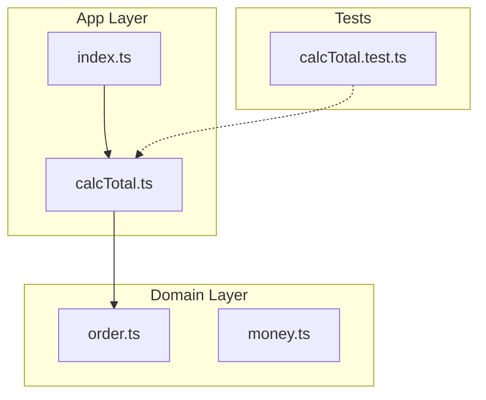

# 第10章：まとめ：ここまでの成果物チェック✅🎉

## この章のゴール🎯

ここまで作ってきた「カフェ注文ミニアプリ（最小）」を、**“学習し続けられる状態”**に整えます✨
やることはシンプルに3つだけ👇

* ① **動く**（いつでも再現できる）▶️
* ② **壊れにくい**（テストと型で守れてる）🛡️
* ③ **次に直す場所がわかる**（改善の優先度が決まってる）🧭

---

## ✅ 成果物チェックリスト（まずは全部に✔を付けよう！）

「今の自分のプロジェクト」を、これで点検してね🧁💕

### A. コマンドで“健康診断”🩺


* [ ] `npm test`（または `pnpm test`）が **通る**✅
* [ ] `npm run lint` が **通る**✅
* [ ] `npm run typecheck`（なければ `npx tsc --noEmit`）が **通る**✅
* [ ] 失敗したときに **エラーメッセージを読める**（怖がらない😌）

> TypeScriptは今ちょうど **6.0がベータ→RC→正式**へ進む時期の情報が公開されてるので、学習用プロジェクトは「バージョン固定」しとくと安心だよ🍀（スケジュールが具体的に出てる）([GitHub][1])

### B. プロジェクトの“形”📦

* [ ] ファイルが「役割」で分かれてる（例：`domain` / `app` / `tests` みたいに）🗂️
* [ ] `index.ts` が巨大になってない（“入口”は薄く✨）
* [ ] 「注文の型」「合計計算」みたいな中心が、見つけやすい👀

### C. テストの“最低ライン”🧪

* [ ] **代表ケース**（普通の注文）
* [ ] **境界ケース**（0件/0円/空文字など）
* [ ] **失敗ケース**（入力がおかしいとき）
  この3つが少なくとも入ってる✅

### D. “匂い”がメモされてる👃💭

* [ ] 「ここつらい…」にコメント印がある（後で直す場所）📌
* [ ] if/switchが増えそうな場所が分かる😵
* [ ] 引数が増えそうな場所が分かる😵‍💫

### E. Gitの節目がある🌿


* [ ] 「第10章の時点」のコミットが1つある✅
* [ ] コミットメッセージが、あとで見ても分かる（例：`ch10: baseline working + tests`）📝

---

## ハンズオン🛠️：点検 → ちょい掃除 → コミット（30分コース）⏳✨

## Step 1）3連チェックを回す▶️▶️▶️

VS Codeのターミナルでこれを順に実行するだけ！

```ts
## 例（scriptsに合わせて置き換えてOK）
npm test
npm run lint
npx tsc --noEmit
```

* 1つでも落ちたら、**直すのはそこだけ**でOK🙆‍♀️
* “全部いっぺんに直す”は疲れるので禁止〜！🚫😵‍💫

---

## Step 2）VS Codeで“読みやすさ”を1個だけ上げる🧰✨

ここは「1個だけ」でいいよ💕

おすすめはこのどれか👇

* **Rename Symbol**：名前を分かりやすくする✍️
* **Find References**：どこから呼ばれてるか追う👣
* **Extract Method**：長い処理を小さく切る🔪

目安：

* 1関数が **30行超えてたら**、Extract候補かも😌

---

## Step 3）テストを“1本だけ”増やして強くする💪🧪

次のどれか1つを追加しよう✨（1本でOK！）

* 注文が空配列のとき、合計は0になる？🧾➡️0円
* 数量が0の項目が混ざってても大丈夫？0は無視？扱い決める🎚️
* 金額がマイナスは拒否する？Result/例外/バリデーションどれ？🧯

---

## Step 4）Gitコミットで“節目”を固定📌🎉

VS Codeのソース管理（左のツリーのやつ🌳）からコミットするだけ！

コミットメッセージ例👇

* `ch10: baseline checked (test/lint/typecheck)`
* `ch10: extract total calculation + add boundary test`

この“節目コミット”があると、後で迷子になりにくいよ🧭✨

---

## 📁 ここまでの“理想の最小フォルダ”例（迷子防止マップ🗺️）


※完全一致じゃなくてOK！「役割で分ける」だけ守れれば勝ち🥳

```ts
src/
  domain/
    order.ts        // 型（Order, Item）
    money.ts        // 金額の扱い（あれば）
  app/
    calcTotal.ts    // 合計計算（純粋関数に寄せたい）
    format.ts       // 表示用（あれば）
  index.ts          // 入口（薄く！）
tests/
  calcTotal.test.ts
```



---

## “できてる感”が出るチェックポイント✨（超重要）


## ✅ 1）中心ロジックが「純粋関数」っぽい

入力を入れたら出力が返るだけ、みたいな形🍀
副作用（ログ・I/O）が混ざるとテストがしんどくなる😵

## ✅ 2）型が“仕様メモ”になってる

型を見るだけで「何が入るのか」が分かるのが理想💎
（第11章の `interface` に繋がるよ！🧩）

## ✅ 3）追加要求が来た時に、つらい場所が予想できる

たとえば👇

* 割引が増えたらどこがつらい？
* 注文状態（作成中/確定/キャンセル）が増えたらどこがつらい？
  この“予想”ができたら、設計センス育ってる🌱✨

---

## AIプロンプト例🤖💬（第10章：振り返り専用セット）

そのままコピペでOKだよ〜🧁✨

```ts
## 1) 構成を要約して、次に直す優先度を出して
このプロジェクトの構成（フォルダ/責務/依存）を要約して、
改善すると良い点を「優先度順」に5つ出して。各項目に理由もつけて。

## 2) テストの穴を探す
calcTotal の仕様を推測して、足りないテストケースを10個提案して。
代表ケース・境界ケース・異常系で分類して。

## 3) 匂い→候補パターン（まだ導入しない）
このコードの“つらくなりそうな匂い”を3つ指摘して、
効きそうなGoFパターン候補を各2つ、理由つきで出して（導入はまだしない）。
```

ちなみに、GitHub のCopilotは「要約・テスト案・リファクタ案」の相性が良いって公式ドキュメントでも整理されてるよ📚✨([Visual Studio Code][2])
（ただし採用判断は人間の仕事🫶）

最近は“モダナイズ支援”みたいな拡張の話も出ていて、JS/TSの移行・整理の流れも強くなってるよ🧹✨([Microsoft Developer][3])
（こういうのは便利だけど、学習では「自分で読める状態」を優先ね💡）

---

## つまずき回避💡（ここで詰まりがちTOP3）

## 1）`typecheck` が落ちて意味が分からない😵

* まずは**最初のエラーだけ**見る（連鎖は無視！）
* “型のズレ”は、だいたい **どこかで型が広がってる（any化）** ことが多い😮‍💨

## 2）ESMまわりで import が混乱する🌀

* 学習用は「1つの流儀」に統一が大事📌
  TypeScriptもNode向け設定の話をリリースノートで触れてるので、“混ぜない”が吉だよ🍀([TypeScript][4])

## 3）Nodeのバージョン差で挙動がズレる😵‍💫

* 2026年2月ごろだと、Nodeは **v24がActive LTS**、v25がCurrentって整理が見えるよ📍([nodejs.org][5])
  学習プロジェクトは「使うNodeの系統を固定」すると迷子になりにくい🧸

---

## 次（第11章）へつながる“宿題”🧩✨

第11章は `interface` で「差し替え可能」を作る章だよね🍡
だから今のうちに、コードを見てこれを1個だけ探しておこう👇

* 「ここ、将来差し替えたくなりそう…」って場所どこ？🔁
  例：割引ロジック／表示整形／支払い方法／通知方法…

見つけられたら、第11章がスッ…と入ってくるよ😌💖

---

## ✅ 第10章チェック完了の合図🎉

* 3連チェックが通る
* テストが最低ラインある
* つらい所が1〜3個メモされてる
* 節目コミットがある

ここまでできたら、もう“学び続けられる土台”完成〜！🌸✨

（参考：VS Codeの安定版リリースは2026年初頭時点で1.108系の情報が出てるよ📌）([Visual Studio Code][6])

[1]: https://github.com/microsoft/TypeScript/issues/63085?utm_source=chatgpt.com "TypeScript 6.0 Iteration Plan · Issue #63085"
[2]: https://code.visualstudio.com/docs/copilot/overview?utm_source=chatgpt.com "GitHub Copilot in VS Code"
[3]: https://developer.microsoft.com/blog/jsts-modernizer-preview?utm_source=chatgpt.com "Announcing the JavaScript/TypeScript Modernizer for VS ..."
[4]: https://www.typescriptlang.org/docs/handbook/release-notes/typescript-5-8.html?utm_source=chatgpt.com "Documentation - TypeScript 5.8"
[5]: https://nodejs.org/en/about/previous-releases?utm_source=chatgpt.com "Node.js Releases"
[6]: https://code.visualstudio.com/updates?utm_source=chatgpt.com "December 2025 (version 1.108)"
