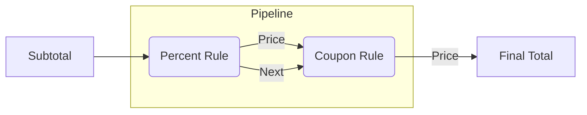

# 第12章：関数で表現できるパターン（Strategyの前準備）⚙️

## ねらい🎯

* 「クラスでStrategyしなきゃ…😵」の前に、**データを関数に通すたびに、少しずつ形が変わっていくイメージ🌊


できる**感覚をつかむ✨
* `if / switch` が増えてきたときに、**関数＋型でスッキリ整理**できるようになる🧹
* テストが「めっちゃ書きやすい！」を体験する🧪🎉

---

## 1. まずは“あるある地獄”を見てみよ😇🔥

「割引ルールが増える」あるある👇

* 学割👩‍🎓、VIP💎、初回クーポン🎟️、雨の日☔、誕生日🎂、平日限定📅 …増殖！！

## ❌ ifが増えた版（つらい）

```ts
type MemberRank = "guest" | "student" | "vip";

function calcTotal(subtotal: number, rank: MemberRank, couponCode?: string) {
  let discount = 0;

  if (rank === "student") discount += Math.floor(subtotal * 0.1);
  else if (rank === "vip") discount += Math.floor(subtotal * 0.2);

  if (couponCode === "WELCOME500") discount += 500;
  if (couponCode === "VIP1000" && rank === "vip") discount += 1000;

  const total = Math.max(0, subtotal - discount);
  return total;
}
```

**つらさポイント😭**

* ルール追加のたびに `calcTotal` を編集 → 壊しやすい💥
* 条件が絡むと読みづらい（VIP1000とか…）🌀
* テストも「分岐の組合せ爆発」しがち💣

---

## 2. 発想チェンジ💡「処理（やり方）を値として渡す」

TypeScriptでは、関数は“値”として渡せるよ📦✨
公式にも「関数は値で、型で呼び方を表せる」って書かれてる感じ！ ([TypeScript][1])

ここからが本章の主役👇

* **コールバック**：関数を引数に渡す📲
* **高階関数**：関数を返す / 関数を受け取る関数🪄
* **設定オブジェクト**：増える引数を `{...}` にまとめる🧁

---

## 3. Strategyの“芯”を関数で作る🧠✨

## 3-1. まずは「割引＝関数」にする🎁

「小計→割引額」を返す関数にしちゃう！

```ts
type DiscountFn = (subtotal: number) => number;

const noDiscount: DiscountFn = () => 0;

```


```ts
const percentOff = (rate: number): DiscountFn => {
  return (subtotal) => Math.floor(subtotal * rate);
};
```

* `percentOff(0.1)` みたいに作れるのが **高階関数**だよ🪄✨

---

## 3-2. “差し替え表”を作る（ifを消す）🗂️✨

```ts
type MemberRank = "guest" | "student" | "vip";

const discountByRank = {
  guest: percentOff(0),
  student: percentOff(0.1),
  vip: percentOff(0.2),
} satisfies Record<MemberRank, DiscountFn>;
```


`satisfies` は「型に合ってるかだけチェックして、推論はそのまま」っていう便利機能だよ🧡 ([TypeScript][2])

* キーの打ち間違い（例：`stundent`）を防ぎやすい✅
* でも値側の型推論は潰さない✨

使う側はこう👇

```ts
function calcTotal(subtotal: number, rank: MemberRank) {
  const discount = discountByRank[rank](subtotal);
  return Math.max(0, subtotal - discount);
}
```

**うれしさ🥳**

* 新しい会員ランク増えても、表に追加するだけ📌
* `calcTotal` が育たない（太らない）🍰🚫

---

## 4. ルールが増えたら“合成”しよう（順番も大事）🧩✨

割引って「複数重なる」よね？
ここでおすすめは **“金額を変換する関数”をつなぐ**やり方💰➡️💰

## 4-1. 価格を変換する関数（パイプライン）🚰


```ts
type PriceRule = (price: number) => number;

const pipe =
  (...rules: PriceRule[]): PriceRule =>
  (price) =>
    rules.reduce((p, rule) => rule(p), price);

const applyPercentOffRule = (rate: number): PriceRule => (price) =>
  Math.max(0, price - Math.floor(price * rate));

const applyCouponRule = (amount: number): PriceRule => (price) =>
  Math.max(0, price - amount);
```

## 4-2. 「会員割引＋クーポン」を合成🎟️💎

```ts
type MemberRank = "guest" | "student" | "vip";

const percentRuleByRank = {
  guest: applyPercentOffRule(0),
  student: applyPercentOffRule(0.1),
  vip: applyPercentOffRule(0.2),
} satisfies Record<MemberRank, PriceRule>;

const couponRuleFromCode = (code?: string): PriceRule => {
  if (code === "WELCOME500") return applyCouponRule(500);
  if (code === "VIP1000") return applyCouponRule(1000);
  return (p) => p;
};

function calcTotalV2(subtotal: number, rank: MemberRank, couponCode?: string) {
  const rule = pipe(
    percentRuleByRank[rank],
    couponRuleFromCode(couponCode)
  );

  return rule(subtotal);
}
```



**ポイント💡**

* ルールは「小さな関数」にするほど強い💪✨
* そして **順番が仕様**になる！（先に%割引→あとクーポン、みたいに）📌

---

## 5. “引数増殖”は設定オブジェクトで止める🧁✨


「税率、丸め、割引…」って引数が増えると、呼び出しが読みにくくなるよね😵‍💫

## 5-1. 設定オブジェクト＋デフォルト値🥨

```ts
type Rounding = "floor" | "round" | "ceil";

type PriceOptions = {
  taxRate?: number;
  rounding?: Rounding;
};

const roundBy = (mode: Rounding): PriceRule => (price) => {
  if (mode === "floor") return Math.floor(price);
  if (mode === "ceil") return Math.ceil(price);
  return Math.round(price);
};

function createPriceCalculator(options: PriceOptions = {}) {
  const taxRate = options.taxRate ?? 0.1;
  const rounding = options.rounding ?? "floor";

  const addTax: PriceRule = (price) => price * (1 + taxRate);

  return pipe(addTax, roundBy(rounding));
}
```

使う側👇

```ts
const calcFinal = createPriceCalculator({ taxRate: 0.1, rounding: "floor" });
const total = calcFinal(1200);
```

**うれしさ🥳**

* 引数の順番ミスが起きにくい✅
* オプション追加しても壊れにくい✨

---

## 6. テストがラクになる理由🧪🎉（関数Strategyの神ポイント）


関数の割引ルールは **入出力がはっきり**してるから、テストが超書きやすい！

```ts
import { describe, it, expect } from "vitest";

describe("applyPercentOffRule", () => {
  it("10% off of 1000 => 900", () => {
    const rule = applyPercentOffRule(0.1);
    expect(rule(1000)).toBe(900);
  });

  it("never goes below 0", () => {
    const rule = applyCouponRule(2000);
    expect(rule(1500)).toBe(0);
  });
});
```

---

## 7. 迷子にならない命名・整理術🧭✨（関数が増えても勝つ！）

## 命名テンプレ（おすすめ）📝

* `applyXxxRule`：価格を変換する（入力→出力）
* `xxxFromYyy`：変換・生成（`couponRuleFromCode` みたいに）
* `createXxx`：設定を閉じ込めて“作る”（`createPriceCalculator`）

## ファイル分け（最小）📁

* `pricing/rules.ts`：小さいルール（関数）
* `pricing/calcTotal.ts`：合成して使う側
* `pricing/rules.test.ts`：テスト

---

## 8. つまずき回避💡（ここで転びがち！）

* **「ルール関数が“状態”を隠し始める」**🫣

  * 例：関数の中で外の変数を更新しだす（副作用）
  * 対策：まずは **純粋関数（入力→出力）** を目指す🧼✨

* **「割引額を返すのか、価格を返すのか」**で混乱😵

  * 対策：増えてきたら **価格変換（PriceRule）** に寄せると整理しやすい💰➡️💰

* **「どこに追加すればいいの？」問題**🌀

  * 対策：登録場所（表）を1つに固定する📌（`discountByRank` みたいに）

---

## 9. ハンズオン🛠️（手を動かすコーナー）✨

## 課題1🌸：ifを1行も増やさず、新ルール追加できる？

* 「誕生日なら `500円引き`」を追加🎂🎟️
* 条件は `isBirthday=true/false` を引数で渡す形でもOK！

ヒント💡

* `couponRuleFromCode` みたいに「条件→Rule」の関数を作ると楽☺️

---

## 課題2🌼：順番で結果が変わる例を作ってみよう

* `10%OFF → 500円引き` と
* `500円引き → 10%OFF`
  で合計が変わるパターンをテストで確認🧪✨

---

## 課題3🌺：設定オブジェクトにオプション追加

* `minTotal`（合計が最低いくら、みたいな下限）を追加してみよう🧱
* 例：`minTotal: 300` なら、どんな割引しても 300円以下にならない

---

## 10. AIプロンプト例🤖💬（そのままコピペOK✨）

```text
次のTypeScriptコードの「ifが増殖している部分」を、
関数（コールバック/高階関数）で差し替えできる形にリファクタして。
条件:
- クラス増殖はしない（関数と型、Record/Map中心）
- 追加ルールは「表に追加」だけで済む形にしたい
- 価格変換（price => price）方式も検討して、順序の注意点も書いて
出力:
1) つらさの指摘
2) 改善後の設計（責務）
3) 最小コード
4) テスト案（境界ケース含む）
コード:
<ここに貼る>
```

---

## 11. ミニまとめ🧡✅

* Strategyって「クラスの話」より前に、**関数で十分できる**よ⚙️✨
* `if` が増えたら、まずは

  * **関数を型で定義**して
  * **表（Record/Map）に登録**して
  * **合成（pipe）**で育てる🌱
* 関数はテストがラク！🧪🎉

---

## おまけメモ📝✨

* 本章の書き方（`satisfies` など）はTypeScriptの標準機能として公式に説明されてるよ📚 ([TypeScript][2])
* 本日時点のTypeScript最新は **5.9 系**として案内されてるよ（npm/公式ダウンロードページ）。 ([npmjs.com][3])

[1]: https://www.typescriptlang.org/docs/handbook/2/functions.html?utm_source=chatgpt.com "Documentation - More on Functions"
[2]: https://www.typescriptlang.org/docs/handbook/release-notes/typescript-4-9.html?utm_source=chatgpt.com "Documentation - TypeScript 4.9"
[3]: https://www.npmjs.com/package/typescript?utm_source=chatgpt.com "typescript"
