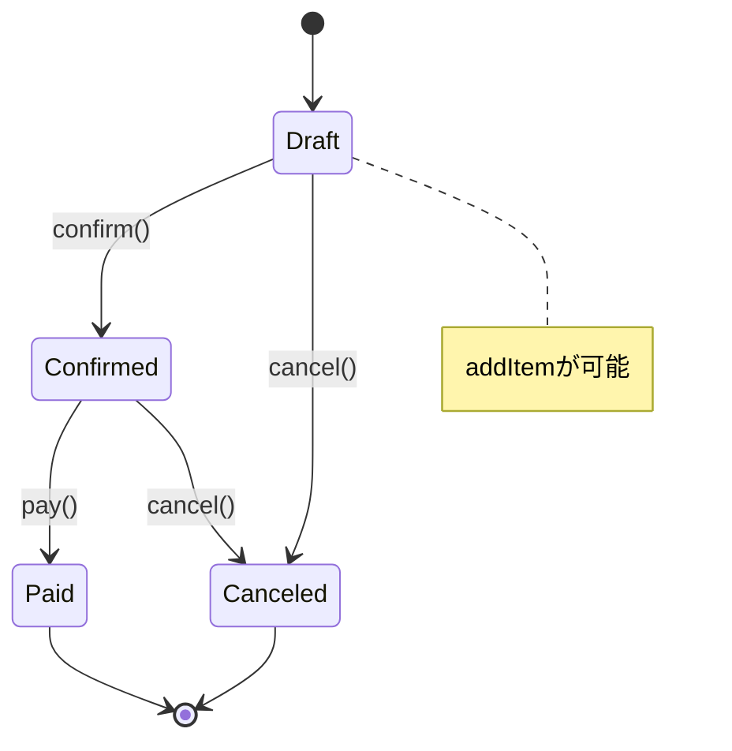

# 第13章：判別Unionで“状態/種類”を安全にする（State/Visitorの土台）🚦

## 13-1 まず困るやつ：`status: string` が事故る😵‍💫

「状態」をこう書いたこと、あるよね👇

```ts
type Order = {
  id: string;
  status: string; // ← なんでも入っちゃう
};

const order: Order = { id: "o1", status: "confrimed" }; // タイポでも通る😱
```

* `"confirmed"` のつもりが `"confrimed"`…みたいな**小さな事故が本番で爆発**💥
* `if/switch` が増えるほど「処理漏れ」も増える…🌀

ここを **TypeScriptの型で止める**のが「判別Union」だよ✨

---

## 13-2 判別Unionってなに？（超ざっくり）🧠🍡

**共通の“分岐キー”**（例：`status` や `type`）を持つオブジェクトを、**リテラル文字列で分けたUnion**にするやり方！

TypeScript公式でも「Discriminating Unions（判別Union）」として定番テクで紹介されてるよ。([TypeScript][1])

---

## 13-3 いちばん大事：分岐キーは短く固定（`status` / `type`）🧷

分岐キーがブレると、型の絞り込み（narrowing）が効かないの🥲
だからおすすめはこの2つ👇

* 状態 → `status`
* 種類 → `type`

---

## 13-4 ハンズオン①：注文状態を判別Unionで表す☕🧾

## ✅ ゴール

* 「今できる操作」だけ通るようにする
* 将来、状態が増えたときに **処理漏れをコンパイルで怒られる**ようにする🔥

---

## 13-4-1 状態を“型”で作る🧱

```ts
type OrderDraft = {
  status: "draft";
  items: { name: string; price: number }[];
};

type OrderConfirmed = {
  status: "confirmed";
  items: { name: string; price: number }[];
  confirmedAt: number; // epoch ms（例）
};

type OrderPaid = {
  status: "paid";
  items: { name: string; price: number }[];
  confirmedAt: number;
  paidAt: number;
};

type OrderCanceled = {
  status: "canceled";
  items: { name: string; price: number }[];
  reason: string;
};

type Order = OrderDraft | OrderConfirmed | OrderPaid | OrderCanceled;
```

ポイント💡

* `status: "draft"` みたいに **文字列リテラル**で固定する
* 状態ごとに「持ってていい情報」を分けられる（これが強い✨）

判別Unionは **分岐（if/switch）で型が勝手に絞られる**のがうれしい。([TypeScript][1])

---

## 13-4-2 `switch` で型が絞れる（そして事故が減る）🛟

```ts
function getReceiptLine(order: Order): string {
  switch (order.status) {
    case "draft":
      return `📝 下書き（${order.items.length}点）`;
    case "confirmed":
      return `✅ 確定（${new Date(order.confirmedAt).toLocaleString()}）`;
    case "paid":
      return `💳 支払い済み（${new Date(order.paidAt).toLocaleString()}）`;
    case "canceled":
      return `🛑 キャンセル：${order.reason}`;
  }
}
```

これ、`order.status === "paid"` の分岐の中では `paidAt` が**安全に使える**のが最高✨

---

## 13-5 ハンズオン②：網羅チェック（exhaustiveness check）で「処理漏れゼロ」へ✅🔥

TypeScript公式でも `never` を使った **網羅チェック**が紹介されてるよ。([TypeScript][2])

## 13-5-1 `assertNever` を用意しよ🧯

```ts
function assertNever(x: never): never {
  throw new Error("Unhandled case: " + JSON.stringify(x));
}
```

## 13-5-2 `default` で `assertNever` を呼ぶ✅

```ts
function getReceiptLine(order: Order): string {
  switch (order.status) {
    case "draft":
      return `📝 下書き`;
    case "confirmed":
      return `✅ 確定`;
    case "paid":
      return `💳 支払い済み`;
    case "canceled":
      return `🛑 キャンセル`;
    default:
      return assertNever(order); // ← ここが網羅チェック✨
  }
}
```

🌟何が嬉しいの？
もし将来 `status: "refunded"` を追加したら……

* `switch` にその `case` がない限り、**コンパイルエラーで止まる**🎉
* 「追加したのに処理を直し忘れた」を防げる🧠✨
* 「この形（タグ）なら、この穴（処理）！」と型が導いてくれるよ🧩✨


---

## 13-6 状態で「許可されない操作」を型で防ぐ🔒🚦

## 13-6-1 例：アイテム追加は “draftだけ” にしたい🍰

```ts
function addItem(order: OrderDraft, item: { name: string; price: number }): OrderDraft {
  return { ...order, items: [...order.items, item] };
}
```

これで👇は **型でNG** になる（最高！）😆

```ts
declare const paid: OrderPaid;
// addItem(paid, { name: "Cookie", price: 200 }); // ❌ コンパイルで怒られる
```

---

## 13-6-2 遷移も「型」で表せる（Stateの下準備）🧠✨

```ts
function confirm(order: OrderDraft): OrderConfirmed {
  return { status: "confirmed", items: order.items, confirmedAt: Date.now() };
}

function pay(order: OrderConfirmed): OrderPaid {
  return { status: "paid", items: order.items, confirmedAt: order.confirmedAt, paidAt: Date.now() };
}

function cancel(order: OrderDraft | OrderConfirmed, reason: string): OrderCanceled {
  return { status: "canceled", items: order.items, reason };
}
```

* 「確定してないのに支払う」みたいな順序事故が減るよ💥➡️🛡️



---

## 13-7 `satisfies` で“ハンドラ表”も網羅チェックできる🗂️✨

最近のTypeScriptでは `satisfies` が超便利！
「型に合ってるかチェックしつつ、推論の良さは残す」やつだよ。([TypeScript][3])

たとえば「状態ごとの表示関数」を表で持つ👇

```ts
type Status = Order["status"];

const renderByStatus = {
  draft: (o: OrderDraft) => `📝 ${o.items.length} items`,
  confirmed: (o: OrderConfirmed) => `✅ confirmed at ${o.confirmedAt}`,
  paid: (o: OrderPaid) => `💳 paid at ${o.paidAt}`,
  canceled: (o: OrderCanceled) => `🛑 ${o.reason}`,
} satisfies Record<Status, (o: any) => string>;
```

💡これで何が起きる？

* `Status` に状態が増えたのに表に追加しないと、**ここがコンパイルで落ちる**🔥
* 「switchが長すぎる…」ってときに表形式が読みやすい✨

`never` や `satisfies` を使った網羅チェックは、実務でもよく使われる定番テクだよ。([Zenn][4])

---

## 13-8 よくあるつまずき（ここ注意！）⚠️🧸

## ❶ 分岐キーが `string` になってる

```ts
const status = "draft"; // ← これ、ただのstring推論になることがある
```

対策✨

* オブジェクトを作るときにリテラルが保たれる形にする
* `as const` を使う（必要な場面だけね！）

```ts
const order = { status: "draft", items: [] } as const;
```

## ❷ `as` でごまかしちゃう🥲

`as OrderPaid` とかで通すと、型の安全が消えるよ〜😭
「通ったけど実行で落ちた」が起きる⚡

## ❸ `switch` に `default` を書いて終わりにする

`default` だけだと「処理漏れ」が静かに混ざる…
→ `assertNever` で止めよ✅

---

## 13-9 ミニ演習（手を動かす）✍️✨

## 演習A：状態を1個増やして、コンパイルエラーを“味わう”😆

1. `OrderRefunded { status: "refunded"; ... }` を追加
2. `type Order = ...` に混ぜる
3. `getReceiptLine` がエラーになるのを確認
4. `case "refunded"` を足して直す✅

---

## 演習B：イベント（操作）も判別Unionにする🎮

「ユーザー操作」をこういうUnionにしてみて👇

* `{ type: "ADD_ITEM"; item: ... }`
* `{ type: "CONFIRM" }`
* `{ type: "PAY" }`
* `{ type: "CANCEL"; reason: string }`

`switch (event.type)` で網羅チェック✅
（これ、のちの **Command / State** に繋がるよ〜✨）

---

## 演習C：種類（type）でも事故を減らす🍩🥤

`OrderItem` を判別Unionにしてみよ👇

* `type: "drink"` → `size: "S" | "M" | "L"`
* `type: "food"` → `heated: boolean`

`switch (item.type)` で、飲み物だけ `size` を触れるようにする☕✨

---

## 13-10 AIプロンプト例（コピペOK）🤖💬✨

```text
次のTypeScriptコードを「判別Union（discriminated union）」で安全にリファクタして。
- status/type を分岐キーにする
- switch の網羅チェック（never / assertNever）を入れる
- 余計な独自クラスは増やさない（型と関数中心）
- できれば「許可されない操作」を型で防ぐ関数シグネチャにする
- 変更点の理由も短く説明して
```

```text
この判別Union設計に対して、将来 status が増えた時に処理漏れが起きないかレビューして。
不足している網羅チェック箇所と、直し方を提案して。
```

---

## 13-11 まとめ（この章で持ち帰るやつ）🎁✨

* 判別Unionは「状態/種類」を**型で安全にする最強の基本技**🚦
* `switch` + `never`（`assertNever`）で **処理漏れをコンパイルで止める**✅ ([TypeScript][2])
* `satisfies` を使うと「表形式」の実装でも網羅チェックしやすい🗂️✨ ([TypeScript][3])
* 次の **State / Visitor** に進むための土台が完成〜！🎉

[1]: https://www.typescriptlang.org/docs/handbook/unions-and-intersections.html?utm_source=chatgpt.com "Handbook - Unions and Intersection Types"
[2]: https://www.typescriptlang.org/docs/handbook/2/narrowing.html?utm_source=chatgpt.com "Documentation - Narrowing"
[3]: https://www.typescriptlang.org/docs/handbook/release-notes/typescript-5-0.html?utm_source=chatgpt.com "Documentation - TypeScript 5.0"
[4]: https://zenn.dev/nkzn/articles/exhaustive-check-with-satisfies?utm_source=chatgpt.com "TypeScriptのexhaustiveness checkをsatisfiesで簡単に書く"
