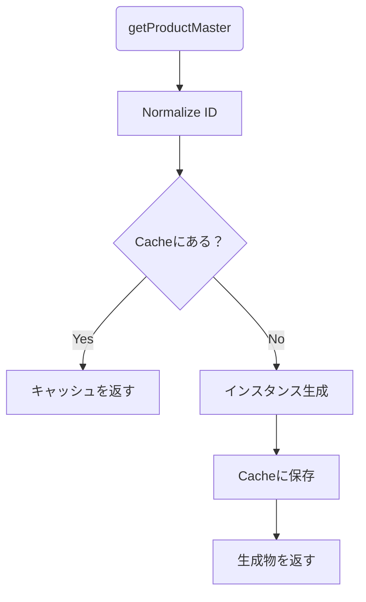

# 第14章：Map/Setで“共有・キャッシュ”の基本（Flyweightの土台）🗃️

## ねらい🎯

同じデータを何回も作ってしまうムダを減らして、**“共有”と“キャッシュ”**の基本がわかるようになる章だよ〜！🧸💕

## できるようになること✅

* `Map` で **「キー → 共有データ」** を管理できる🗂️
* **キー設計**（ブレないIDの作り方）を意識できる🔑
* キャッシュの **寿命**（いつ消す？）の考え方がわかる🕰️
* `WeakMap` を使うと **メモリリークを避けやすい場面**があると知る🧠✨
* `Set` で **重複を一瞬で消す**＆**既出チェック**ができる🌟

---

## 1. まずは「困りごと」😵‍💫

カフェ注文アプリで、注文行（OrderLine）ごとに商品マスタ（名前・価格など）を持たせたいとするよね☕🧾

でも、こんな実装だと…👇

* 注文が増えるたびに **同じ商品マスタを何回も生成**しちゃう
* メモリも増えるし、ちょっとずつ処理も重くなる🐢💦
* 「同じ商品」なのに参照がバラバラで扱いづらい（更新や比較が面倒）🙃

ここで登場するのが `Map` だよ〜！🗺️✨

---

## 2. `Map` と `Set` を超ざっくり理解🍡

## `Map`：キーと値のペアを持つ📌

* `Map.get(key)` / `Map.set(key, value)`
* **キーは1つにつき1回だけ**（同じキーは上書き）([MDNウェブドキュメント][1])
* **挿入順でイテレートされる**（入れた順に取り出せる）([MDNウェブドキュメント][1])

## `Set`：値の集合（重複なし）📌

* `Set.add(value)` / `Set.has(value)`
* 同じ値は2回入らない✨

---

## 3. ハンズオン🛠️：商品マスタを `Map` で共有する☕🧁

## ゴール🎯

同じ `productId` の商品マスタは、**常に同じ参照（同じオブジェクト）**が返ってくる状態にするよ🧡

```ts
type ProductId = string;

type ProductMaster = Readonly<{
  id: ProductId;
  name: string;
  priceYen: number;
}>;

type OrderLine = {
  product: ProductMaster; // ここが「共有」ポイント✨
  qty: number;
};

const productCache = new Map<ProductId, ProductMaster>();

```


```ts
function normalizeProductId(id: string): ProductId {
  // キー設計の基本：表記ゆれを消す（超重要🔑）
  return id.trim().toLowerCase();
}

function getProductMaster(rawId: string): ProductMaster {
  const id = normalizeProductId(rawId);

  const cached = productCache.get(id);
  if (cached) return cached;

```


```ts
  // 本当はDB/APIなどから取ってくるイメージ（ここでは固定で）
  const created: ProductMaster =
    id === "latte"
      ? { id, name: "カフェラテ", priceYen: 520 }
      : { id, name: "本日のコーヒー", priceYen: 420 };

  productCache.set(id, created);
  return created;
}

function createOrderLine(productId: string, qty: number): OrderLine {
  return {
    product: getProductMaster(productId),
    qty,
  };
}

```


```ts
// ✅ 共有できてるか確認！
const a = createOrderLine("Latte", 1);
const b = createOrderLine(" latte ", 2);

console.log(a.product === b.product); // true になるのが理想✨
console.log(productCache.size);        // 1 になるはず🌟
```



## ここが大事💡

* `Map.get()` で返る値は **コピーじゃなくて同じ参照**だよ🪞
  （だから、値がオブジェクトなら“共有”になる）([MDNウェブドキュメント][2])

---

## 4. キー設計が9割🔑✨（ブレると共有できない…！）

## よくあるキーの地雷💣

* `"Latte"` と `"latte"` が別扱い
* `" latte "`（空白入り）で別扱い
* `"Latte\n"` みたいな見えない文字で別扱い

だから、さっきの `normalizeProductId()` が効いてくるの！🎯✨

## “複合キー”が必要になったら？🧩

例：`size` も含めたい（`latte + tall` と `latte + grande` は別）

**おすすめは「区切り文字で固定フォーマット」**にすること🎀
（余計な独自クラスは作らない！）

```ts
type Size = "tall" | "grande";
type ProductKey = string;

function makeProductKey(productId: string, size: Size): ProductKey {
  return `${normalizeProductId(productId)}::${size}`;
```


```ts
}
```

> コツ：`::` みたいな **他で出にくい区切り**を使うと事故りにくいよ😉💕

---

## 5. キャッシュの“寿命”を考える🕰️🧠

キャッシュは便利だけど、**消さないと増え続ける**ことがあるよ😱

## よくある方針3つ🧭

1. **マスタ系**（商品一覧など）
   → 起動中ずっと保持でもOKになりがち🍰（数が有限なら）

2. **セッション系**（一時的な計算結果）
   → 「使い終わったら消す」 or 「一定時間で消す」⏳

3. **無限に増えそう**（ユーザー入力をキーにする等）
   → **サイズ制限**をつける（超大事！）🚧

## “雑だけど効く”サイズ制限（最古から削除）🧹

`Map` は挿入順で回せるから、簡易LRUっぽいことができるよ🧁
（※本格LRUは別章レベルだけど、学習としてはこれで十分✨）

```ts
function setWithLimit<K, V>(map: Map<K, V>, key: K, value: V, limit: number) {
  if (!map.has(key) && map.size >= limit) {
    const oldestKey = map.keys().next().value as K; // 挿入順の先頭
    map.delete(oldestKey);
  }
  map.set(key, value);
}
```

---

## 6. `WeakMap` / `WeakSet` って何？🫧（メモリ対策の味方）

`WeakMap` は「キーが **オブジェクト限定**」で、しかもそのキーは **弱い参照**になるよ🧠✨
つまり、外で参照されなくなったキーは GC されうる＝結果的に値も回収されうる、という考え方！([MDNウェブドキュメント][3])

## こんな時に向く🌷

* 「DOM要素ごとに計算結果をメモしたい」
* 「みんなで1つのメニュー表を見る」＝メモリ節約！🌱


* 「あるオブジェクトに紐づく一時データを持ちたい」
* 「Mapだと消し忘れが怖い」😢

```ts
type User = { id: string; name: string };

```


```ts
const memo = new WeakMap<User, number>();

function expensiveScore(u: User): number {
  const cached = memo.get(u);
  if (cached !== undefined) return cached;

  const score = u.name.length * 100; // ダミーの重い計算っぽいもの
  memo.set(u, score);
  return score;
}
```

## 注意点⚠️

* `WeakMap` / `WeakSet` は **反復（for..of）できない**よ〜！
  （中身を一覧で取り出せない）([MDNウェブドキュメント][4])

---

## 7. `Set` の気持ちよさ体験🎁✨（重複消し＆既出チェック）

## 例1：注文内の「商品IDの重複」を消す🧾

```ts
const ids = ["latte", "coffee", "latte", "coffee", "tea"];

const uniqueIds = [...new Set(ids.map(s => s.trim().toLowerCase()))];
console.log(uniqueIds); // ["latte","coffee","tea"] みたいに✨
```

## 例2：既に処理した商品だけスキップする🚦

```ts
const seen = new Set<string>();

function processProduct(id: string) {
  const key = id.trim().toLowerCase();
  if (seen.has(key)) return; // 2回目以降は何もしない✨
  seen.add(key);

  console.log("処理したよ:", key);
}
```

---

## 8. “共有”は便利だけど、ミスると事故る😇💥

## 事故①：共有オブジェクトをうっかり書き換える

共有してるってことは、**どこで書き換えても全員に影響**するよ〜！😱
だから商品マスタみたいなものは `Readonly` にしておくのが安心🧊✨

## 事故②：キーがブレる（共有できてない）

→ `normalize` しよう🔑（この章の核心！）

## 事故③：Mapキャッシュが増え続ける

→ 寿命・サイズ制限を考えよう🧹🕰️

---

## 9. ミニ演習💪🎓（手を動かすと一気に身につくよ！）

## 演習A🌸：共有できてるかテストする

* `createOrderLine("Latte", 1)` と `createOrderLine(" latte ", 2)` の `product` が `===` になることを確認✅

## 演習B🍰：複合キー対応

* `makeProductKey(productId, size)` を導入して

  * `latte+tall` と `latte+grande` は別
  * `Latte+tall` と ` latte +tall` は同じ
    にしてみよう🔑✨

## 演習C🧹：サイズ制限キャッシュ

* `setWithLimit(cache, key, value, 3)` を使って、4件目が入ったら最古が消えることを確認🧪

---

## 10. AIに聞くと爆速になるプロンプト例🤖💬✨

（そのままコピペOK！）

```text
TypeScriptで、Mapを使った「商品マスタ共有キャッシュ」を実装したいです。
- キーの正規化（trim + lowerCase）を入れて
- 共有参照（===で同一確認）できるデモも入れて
- 共有オブジェクトはReadonlyで安全にして
短いコードでお願いします。
```

```text
Mapのキー設計が不安です。
「productId + size + option」をブレないキーにする方法を3案出して、
それぞれの落とし穴も教えてください（TypeScript）。
```

```text
WeakMapを使うべきケースと、Mapで十分なケースを、
具体例（DOM要素・セッション・マスタデータ）で比較して説明してください。
```

---

## つまずき回避💡（ここだけ覚えれば勝ち！）🎉

* 共有できない原因の多くは **キーの表記ゆれ**🔑
* キャッシュは便利だけど、**寿命を決めないと増え続ける**🧯
* 共有するデータは **Readonlyで固める**と事故りにくい🧊
* 「オブジェクトキーで、消し忘れが怖い」なら **WeakMap候補**🫧([MDNウェブドキュメント][3])

[1]: https://developer.mozilla.org/en-US/docs/Web/JavaScript/Reference/Global_Objects/Map?utm_source=chatgpt.com "Map - JavaScript - MDN Web Docs - Mozilla"
[2]: https://developer.mozilla.org/en-US/docs/Web/JavaScript/Reference/Global_Objects/Map/get?utm_source=chatgpt.com "Map.prototype.get() - JavaScript - MDN Web Docs - Mozilla"
[3]: https://developer.mozilla.org/en-US/docs/Web/JavaScript/Reference/Global_Objects/WeakMap?utm_source=chatgpt.com "WeakMap - JavaScript - MDN Web Docs"
[4]: https://developer.mozilla.org/ja/docs/Web/JavaScript/Guide/Memory_management?utm_source=chatgpt.com "メモリー管理 - JavaScript - MDN Web Docs"
