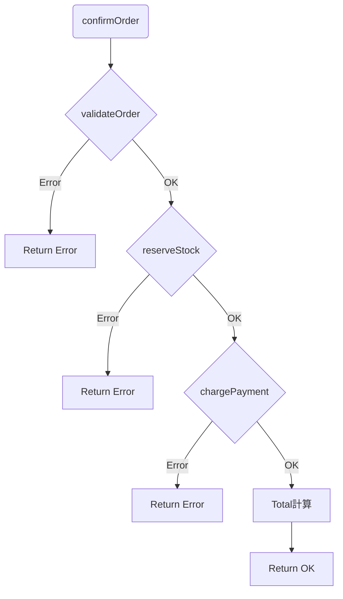

# 第15章：例外よりResult的な扱い（Command/Chain/Observerの安定化）🧯

## ねらい🎯✨

* `throw` に頼らず、**失敗を「戻り値」で扱える**ようになる😊
* 失敗が起きても、**処理の流れが壊れにくい**コードになる🧱
* 「失敗もまた、一つの値である」🎁


* 「失敗の種類」を整理して、**呼び出し側が迷子にならない**ようにする🧭

---

## まず結論：Resultは「失敗を型で見える化」する📦👀

例外（`throw`）は便利だけど、慣れてくるとこんな悩みが出がち…😵‍💫

### 例外がつらくなる瞬間😵


* どこで `throw` されるか **呼び出し側から見えにくい**🙈
* 複数ステップ（検証→在庫→決済→通知…）で、**どこで落ちたか追いづらい**🌀
* 例外を握りつぶしたり、ログだけ吐いて続行して、**状態が壊れる**💥

### Resultが気持ちいい瞬間😌✨

* 「成功 or 失敗」が **戻り値の型で必ず見える**✅
* 失敗パターン（在庫切れ、入力ミス…）を **仕様として明文化**できる📘
* 後の章（Command/Chain/Observer）で、**失敗を“安全に受け渡し”**できる🧷

---

## TypeScript流のResult型：いちばん定番の形🧁

TypeScriptでは、Resultはだいたいこの形が王道だよ〜💡

```ts
// 成功: { ok: true, value }
// 失敗: { ok: false, error }
```


```ts
export type Result<T, E> =
  | { ok: true; value: T }
  | { ok: false; error: E };

export const ok = <T>(value: T): Result<T, never> => ({ ok: true, value });
export const err = <E>(error: E): Result<never, E> => ({ ok: false, error });

export const isOk = <T, E>(r: Result<T, E>): r is { ok: true; value: T } => r.ok;
export const isErr = <T, E>(r: Result<T, E>): r is { ok: false; error: E } => !r.ok;
```

### あると超便利：`match`（分岐を読みやすく）🎛️

```ts
export const match = <T, E, R>(
  r: Result<T, E>,
  arms: { ok: (v: T) => R; err: (e: E) => R }
): R => (r.ok ? arms.ok(r.value) : arms.err(r.error));
```

---

## 失敗の「種類」を型で作る🧩🧯

Resultをやるときのコツは、`Error` だけを返すんじゃなくて、**失敗の種類（分類）**を作ることだよ〜✨

たとえば「注文確定」で起こりそうな失敗👇


```ts
export type OrderError =
  | { type: "validation"; message: string; field?: string }
  | { type: "out_of_stock"; productId: string }
  | { type: "payment_failed"; message: string; cause?: unknown }
  | { type: "unexpected"; message: string; cause?: unknown };
```

> `cause` は「元の原因をぶら下げる」用途で便利だよ🧵
> `Error` の `cause` は広く使える仕組みとして整理されてるよ〜📌 ([MDNウェブドキュメント][1])

---

## ハンズオン：注文確定をResultで壊れにくくする☕🧾✨

### お題の型（最小）🧁

```ts
export type OrderItem = { productId: string; qty: number; unitPrice: number };

export type Order = {
  id: string;
  items: OrderItem[];
};

export type ConfirmedOrder = Order & {
  total: number;
  confirmedAt: string;
};
```

---

### Step 1) まずは「検証」をResultで返す🧼✅

「入力ミス」は“想定内の失敗”だから、例外よりResultが向いてるよ😊

```ts
import { Result, ok, err } from "./result";
import type { Order, OrderError } from "./types";

export function validateOrder(order: Order): Result<Order, OrderError> {
  if (order.items.length === 0) {
    return err({ type: "validation", message: "商品が1つも入ってないよ🥺", field: "items" });
  }
  for (const item of order.items) {
    if (item.qty <= 0) {
      return err({
        type: "validation",
        message: "数量は1以上にしてね🙏",
        field: `items.qty(${item.productId})`,
      });
    }
  }
  return ok(order);
}
```

---

### Step 2) 外部I/Oは「例外をResultに変換」して境界で止める🌐🧱

決済APIやDBみたいな外部I/Oは、**例外が混ざりやすい**場所！
なので「境界でキャッチしてResultにする」が安全だよ🧤✨

```ts
import { Result, ok, err } from "./result";
import type { Order, OrderError } from "./types";

// 例：在庫確保（外部I/Oっぽい想定）
export async function reserveStock(order: Order): Promise<Result<Order, OrderError>> {
  // ダミー：在庫切れを1つ作る
  const out = order.items.find((i) => i.productId === "bean-999");
  if (out) return err({ type: "out_of_stock", productId: out.productId });

  return ok(order);
}

// 例：決済（外部I/Oっぽい想定）
export async function chargePayment(order: Order): Promise<Result<Order, OrderError>> {
  try {
    // ダミー：ランダム失敗
    if (Math.random() < 0.2) {
      throw new Error("gateway timeout", { cause: { retryAfterMs: 500 } });
    }
    return ok(order);
  } catch (e: unknown) {
    return err({
      type: "payment_failed",
      message: "決済に失敗したよ💳💦",
      cause: e,
    });
  }
}
```

`Error(..., { cause })` の形は「原因を持たせたい」ときに便利だよ🧵 ([MDNウェブドキュメント][1])

---

### Step 3) 注文確定を “順番に” つなぐ（Resultで安全に）⛓️✨

いちばん読みやすいのは「成功なら進む、失敗なら即return」💨

```ts
import { Result, ok } from "./result";
import type { Order, ConfirmedOrder, OrderError } from "./types";
import { validateOrder } from "./validate";
import { reserveStock, chargePayment } from "./io";

export async function confirmOrder(order: Order): Promise<Result<ConfirmedOrder, OrderError>> {
```


```ts
  const v = validateOrder(order);
  if (!v.ok) return v;

  const s = await reserveStock(v.value);
  if (!s.ok) return s;

  const p = await chargePayment(s.value);
  if (!p.ok) return p;

  const total = p.value.items.reduce((sum, i) => sum + i.qty * i.unitPrice, 0);

  return ok({
    ...p.value,
    total,
    confirmedAt: new Date().toISOString(),
  });
}

```



---

### Step 4) 呼び出し側は `match` でキレイに🎀

UIでもCommandでもObserverでも、受け取り側が迷わないのが最高〜☺️✨

```ts
import { match } from "./result";
import { confirmOrder } from "./confirm";

async function onClickConfirm() {
  const result = await confirmOrder({
    id: "o-1",
    items: [{ productId: "latte-001", qty: 1, unitPrice: 520 }],
  });

```


```ts
  const message = match(result, {
    ok: (order) => `注文OK🎉 合計 ${order.total}円だよ〜☕`,
    err: (e) => {
      switch (e.type) {
        case "validation":
          return `入力ミスかも💦 ${e.message}`;
        case "out_of_stock":
          return `ごめんね🙏 在庫切れ: ${e.productId}`;
        case "payment_failed":
          return `決済NG💳 ${e.message}`;
        default:
          return `想定外エラー😵‍💫 ${e.message}`;
      }
    },
  });

  console.log(message);
}
```

---

## どこまでResultにする？“全部Result”は疲れるよ😂🧠

コツはこれ👇

* ✅ **想定内の失敗**（入力ミス、在庫切れ、権限NG、外部I/O失敗）→ Result
* ⚠️ **想定外のバグ**（null参照、あり得ない状態）→ 例外でもOK（直すべき）🛠️

つまり、Resultは「仕様として起きうる失敗」を扱う道具だよ📌✨

---

## テストして安心しよ🧪💕（最小）

例は `vitest` っぽい書き方にしておくね（読みやすさ重視）💡

```ts
import { describe, it, expect } from "vitest";
import { validateOrder } from "./validate";
import { confirmOrder } from "./confirm";

describe("validateOrder", () => {
  it("商品が空ならvalidationエラー", () => {
    const r = validateOrder({ id: "o-1", items: [] });
    expect(r.ok).toBe(false);
    if (!r.ok) {
      expect(r.error.type).toBe("validation");
    }
  });
});

describe("confirmOrder", () => {
  it("正常ならokでtotalが入る", async () => {
    const r = await confirmOrder({
      id: "o-2",
      items: [{ productId: "latte-001", qty: 2, unitPrice: 520 }],
    });
    expect(r.ok).toBe(true);
    if (r.ok) {
      expect(r.value.total).toBe(1040);
    }
  });
});
```

---

## つまずきポイントあるある😵‍💫➡️😌（回避ワザつき）

1. **エラー型が増えすぎる**📦
   → `type` は大分類だけにして、細かい情報はフィールドで持つ（例：`message`, `field`）🧩

2. **ifが多くて読みにくい**🌀
   → まずは「早期return」でOK！慣れたら `andThen` みたいな補助関数を追加しても良いよ✨

3. **外部I/Oの例外が混ざってカオス**🌪️
   → 境界で `try/catch` → `err(...)` に変換して、内側をきれいに保つ🧤

4. **`cause` の型が怒られる**😡
   → `cause` はES2022以降で整ってるので、型的に困ったら `unknown` で受けて、ログ用途に回すのが安全🧵 ([MDNウェブドキュメント][1])

5. **「全部Result」にして疲れる**🫠
   → 仕様上“起こりうる失敗”だけResultにする（境界中心でOK）🧭

---

## ミニ課題（5〜15分）⏱️🌸

1. `OrderError` に `type: "store_closed"` を追加してみよう🏪🌙
2. `toUserMessage(error)` を作って、UI表示の文言を一箇所に集めよう🪄
3. `payment_failed` のときだけ `cause` をログに出すようにしてみよう🧾

---

## AIプロンプト例🤖💬✨

```text
Result型で例外を減らしたいです。
- 成功/失敗のdiscriminated unionでResult<T,E>を提案して
- OrderErrorの分類案（validation/out_of_stock/payment_failed/unexpected）も
- confirmOrder（検証→在庫→決済→合計）をResultで実装して
- 呼び出し側のmatch例と、テストケース案も
```

```text
この関数はthrowしていて呼び出し側が辛いです。
「想定内の失敗」と「想定外のバグ」を分けて、
想定内だけResultに変換するリファクタ案を段階的に出して。
```

```text
OrderErrorが増えすぎて困ってます。
分類の粒度（typeの種類）を減らしつつ、
UI向けメッセージとログ向け情報(cause等)を両立する設計にして。
```

---

## 2026のTypeScript小ネタ（超短）🗞️✨

* npm上の安定版は **TypeScript 5.9.3** が “Latest” として掲載されているよ📌 ([npm][2])
* そして **TypeScript 6.0 は「7.0への橋渡し（bridge）」**として位置づけられていて、7.0はネイティブ化（Goベース）に向かって進捗が出てるよ🚀 ([Microsoft for Developers][3])

（Resultの書き方自体は、5.x系でもそのまま通用するよ😊）

[1]: https://developer.mozilla.org/en-US/docs/Web/JavaScript/Reference/Global_Objects/Error/cause?utm_source=chatgpt.com "Error: cause - JavaScript - MDN Web Docs"
[2]: https://www.npmjs.com/package/typescript?utm_source=chatgpt.com "typescript"
[3]: https://devblogs.microsoft.com/typescript/progress-on-typescript-7-december-2025/?utm_source=chatgpt.com "Progress on TypeScript 7 - December 2025"
