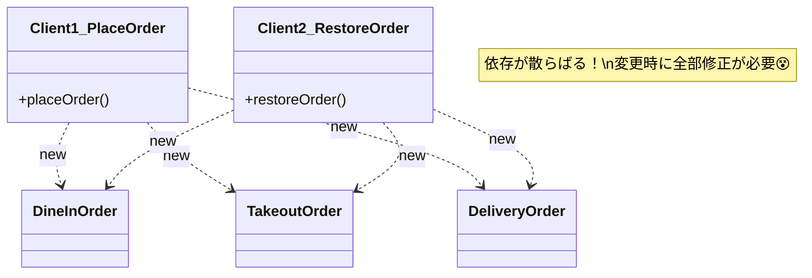

# 第16章：Factory Method ① 困りごと編：new分岐が増えた！😵

## 1) 今日のテーマ：**「作り方の分岐」が散らばって地獄になるやつ**🌀


Factory Method（ファクトリメソッド）は、ひとことで言うと…

* 「**どのクラス（どの実装）を作るか**」の判断を
  呼び出し側に散らばらせず、**“作る場所”に寄せる**考え方だよ〜🧁✨

GoFの意図としては「生成を直接 `new` せず、生成用メソッドに任せて依存を減らす」系の話になるよ📦🧠 ([リファクタリング・グuru][1])

---

## 2) こんな症状が出たら要注意🚨（Factory Methodの“出番の匂い”👃）


次のうち、2つ以上当てはまったら「やばくなり始めてる」サインかも🫠

* `new`（またはオブジェクト生成）が **あちこちのファイルに散ってる**📌
* `if/switch` で「種類ごとに生成」が **何箇所もある**🔀
* 種類を1つ増やすと、修正が **3箇所以上** 必要になる😱
* ある箇所だけ作り方が古くて、**初期値や必須項目がズレる**🧨
* テストで「この種類、どこで生成してるの…？」って迷子になる🧪🌀

---

## 3) ハンズオン🛠️：わざと「new分岐が増えた！」を作ろう😵

題材：カフェ注文 ☕🧾
注文の種類が増えると、生成ロジックが散らばっていく…を体験するよ💥

### 3-1. まずは“散らばる版”を作る（悪い例）😈

ポイントは「生成のswitchが複数箇所にある」こと！

```ts
// orderTypes.ts
export type OrderKind = "dineIn" | "takeout";

export interface Order {
  kind: OrderKind;
  id: string;
  createdAt: Date;
}

export class DineInOrder implements Order {
  kind: OrderKind = "dineIn";
  constructor(
    public id: string,
    public createdAt: Date,
    public tableNo: number,
  ) {}
}

export class TakeoutOrder implements Order {
  kind: OrderKind = "takeout";
  constructor(
    public id: string,
    public createdAt: Date,
    public pickupAt: Date,
  ) {}
}
```

```ts
// placeOrder.ts（注文確定のとき）
import { DineInOrder, Order, OrderKind, TakeoutOrder } from "./orderTypes.js";

export function placeOrder(kind: OrderKind, id: string): Order {
  // 😵 ここに生成分岐がある
  switch (kind) {
    case "dineIn":
      return new DineInOrder(id, new Date(), 1);
    case "takeout":
      return new TakeoutOrder(id, new Date(), addMinutes(new Date(), 15));
  }
}

function addMinutes(d: Date, minutes: number) {
  return new Date(d.getTime() + minutes * 60_000);
}
```

```ts
// restoreOrder.ts（保存データから復元するとき）
import { DineInOrder, Order, OrderKind, TakeoutOrder } from "./orderTypes.js";

type SavedOrder = {
  kind: OrderKind;
  id: string;
  createdAt: string; // JSONなので文字列
  tableNo?: number;
  pickupAt?: string;
};

export function restoreOrder(saved: SavedOrder): Order {
  // 😵 ここにも生成分岐がある（しかもDate復元も混ざる）
  switch (saved.kind) {
    case "dineIn":
      return new DineInOrder(
        saved.id,
        new Date(saved.createdAt),
        saved.tableNo ?? 1,
      );
    case "takeout":
      return new TakeoutOrder(
        saved.id,
        new Date(saved.createdAt),
        new Date(saved.pickupAt ?? saved.createdAt),
      );
  }
}
```

### 3-2. ここで“種類追加”してみる（地獄の入口）🚪🔥

例えば `delivery`（配達）を追加したくなったとするよ〜🚚

* `OrderKind` に `"delivery"` を足す
* `DeliveryOrder` を作る
* **placeOrder / restoreOrder / 他にも生成がある場所** を全部探して直す

このとき起きがちなのが👇

* 直し漏れが出る😵‍💫
* 初期値が揃わない（片方は `pickupAt`、片方は `deliveryAt` みたいにブレる）🧨
* 「どこで生成してる？」探索タイムが始まる🔍🌀

---

## 4) “何が”つらいの？を言語化しよう🗣️💭（超大事！）

この段階では、パターン暗記より **症状を言える** のが勝ち🏆✨

### つらさ①：呼び出し側が「具体クラス」を知ってしまう😵


`placeOrder` が `DineInOrder` を知ってる
`restoreOrder` も `TakeoutOrder` を知ってる
→ 依存が増えて、変更が伝播する💥

### つらさ②：同じ判断（kind分岐）が重複する🔁

“種類で分ける”ロジックが複製されると、増えた瞬間に破綻しやすい😇

### つらさ③：生成と関係ない処理まで混ざる🧃

### つらさ③：生成と関係ない処理まで混ざる🧃

復元処理に `Date` 変換やデフォルト値が混ざって、責務がぐちゃぐちゃ🍝



---

## 5) 応急処置💊：まずは「生成だけ」1箇所に寄せる🧲


Factory Methodの入り口は、むずかしく考えなくてOK🙆‍♀️
まずは **“生成はここ”** を1個作るだけで、世界が変わるよ🌍✨

### 5-1. `createOrder(...)` に寄せる（第一歩）👣

```ts
// createOrder.ts
import { DineInOrder, Order, OrderKind, TakeoutOrder } from "./orderTypes.js";

export type CreateOrderParams =
  | { kind: "dineIn"; id: string; tableNo?: number }
  | { kind: "takeout"; id: string; pickupInMinutes?: number };

export function createOrder(p: CreateOrderParams): Order {
  const now = new Date();

  switch (p.kind) {
    case "dineIn":
      return new DineInOrder(p.id, now, p.tableNo ?? 1);
    case "takeout":
      return new TakeoutOrder(p.id, now, addMinutes(now, p.pickupInMinutes ?? 15));
```


```ts
    default:
      // ✅ “増えたらここがコンパイルで気づける”ようにする保険
      return assertNever(p);
  }
}

function addMinutes(d: Date, minutes: number) {
  return new Date(d.getTime() + minutes * 60_000);
}

function assertNever(x: never): never {
  throw new Error(`Unknown kind: ${JSON.stringify(x)}`);
}
```

### 5-2. 呼び出し側は“作り方”を忘れていい🥰

```ts
// placeOrder.ts
import { createOrder } from "./createOrder.js";

export function placeOrder() {
  return createOrder({ kind: "dineIn", id: "o-100", tableNo: 2 });
}
```

この時点で得すること🎁

* 種類追加の修正箇所が **createOrder に集まる**📌
* デフォルト値や必須項目が **揃う**✅
* テストも「createOrderだけ」狙えばよくなる🧪✨

---

## 6) ミニテスト🧪：恩恵を体感しよう🎉

「生成の正しさ」を1箇所で保証できるのが、ほんとに強い💪

```ts
// createOrder.test.ts（例：vitest想定）
import { describe, expect, it } from "vitest";
import { createOrder } from "./createOrder.js";

describe("createOrder", () => {
  it("dineIn は tableNo デフォルト 1", () => {
    const o = createOrder({ kind: "dineIn", id: "o-1" });
    expect(o.kind).toBe("dineIn");
    // @ts-expect-error: 型をちゃんと分けたくなるよね（次章以降で育てる）
  });

  it("takeout は pickupInMinutes デフォルト 15", () => {
    const o = createOrder({ kind: "takeout", id: "o-2" });
    expect(o.kind).toBe("takeout");
  });
});
```

> メモ💡：ここではテストを“雑に”でOK！
> 「生成が1箇所に寄ったからテストが楽」を体験できれば勝ち🏅

---

## 7) よくあるつまずき回避💡😵‍💫

* **「Factoryってクラスいっぱい作るやつ？」**
  → いきなり増やさないでOK🙆‍♀️ まず関数 `createOrder` で十分🧁
* **「生成ついでに、計算や保存も入れたくなる」**
  → それは混ぜると沼🍲💥 “作るだけ”を守ると後で楽！
* **「unknown kind の扱いどうする？」**
  → まずは `assertNever` で“気づける”形にしておけばOK✅（次の章でResult型とも相性よくできるよ🧯）

---

## 8) AI拡張に投げるプロンプト例🤖💬（そのままコピペOK）

```text
次のTypeScriptコードで「種類ごとのnew分岐」が散らばっている箇所を全部列挙して。
そして、生成ロジックを1箇所に寄せる最小のリファクタ案を示して。
制約：
- 余計な独自クラスを増やさない
- まずは関数 createOrder(...) に寄せるだけでOK
- 追加で「種類が増えたときに漏れを検知できる」工夫（never網羅など）も入れて
```

---

## 9) まとめ🧾✨（この章でできるようになったこと）

* 「Factory Methodが効く症状」＝ **new分岐が散らばる痛み** を説明できる😵➡️🧠
* まずは応急処置として、**生成を1箇所に寄せる**一歩が踏める👣✨
* 種類追加が来ても「直す場所が見える」状態に近づく🔍✅

Factory Methodの定義としても「生成を直接指定せず、生成メソッドに任せる」ことで依存を減らす発想だよ📦✨ ([リファクタリング・グuru][1])

---

## ちょいコラム：2026のTypeScriptまわり最新メモ🧁🧠

* npm上のTypeScriptは **5.9.3** が “Latest” として案内されてるよ（ページ表記ベース）([npm][2])
* TypeScriptチームは **6.0/7.0**（ネイティブ移行を含む）に向けた進捗を継続的に発信してるので、過剰に複雑な独自仕組みより「シンプルに保つ」ほど移行も楽になりやすいよ🧠✨ ([Microsoft for Developers][3])

---

[1]: https://refactoring.guru/design-patterns/factory-method?utm_source=chatgpt.com "Factory Method"
[2]: https://www.npmjs.com/package/typescript?utm_source=chatgpt.com "typescript"
[3]: https://devblogs.microsoft.com/typescript/progress-on-typescript-7-december-2025/?utm_source=chatgpt.com "Progress on TypeScript 7 - December 2025"
