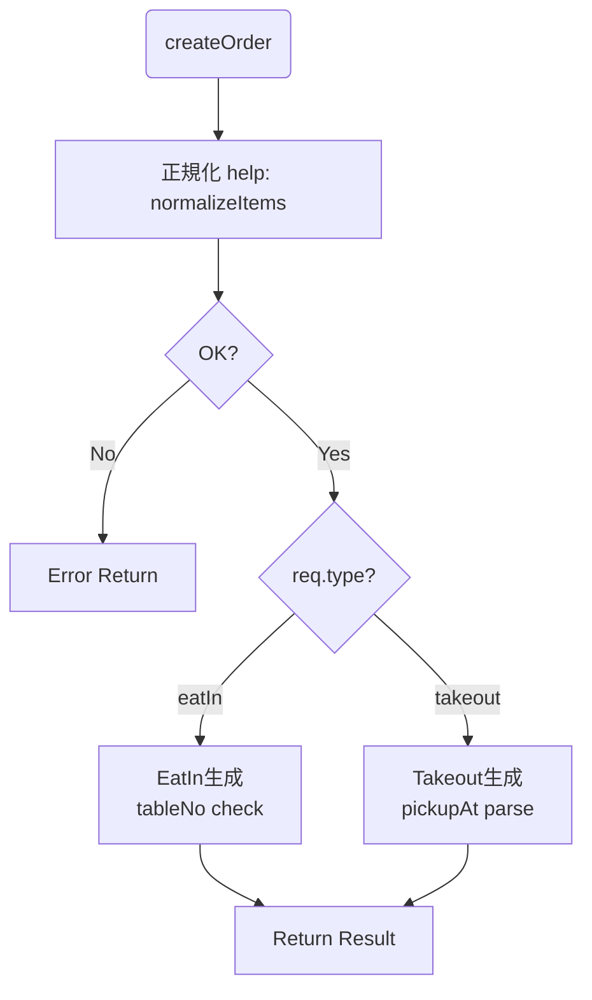

# 第17章：Factory Method ② TypeScript流：関数Factoryから始めよう🧁

## ねらい🎯

* 「クラス工場」より先に、**関数Factory（factory関数）**でだいたい解ける！って体感する🧁✨
* `new` が散らば「注文」を受け取って、「商品」を渡す。客席と厨房の境界線！🍽️


入り口を1つに寄せる**だけでスッキリさせる🧼
* **戻り値の型**をちゃんと効かせて、呼び出し側を安心させる🛡️

---

## この章でできるようになること✅

* `createOrder(...)` を **“注文タイプ別に生成する入口”**として作れる☕
* `OrderRequest`（入力）→`Order`（出力）を **判別Union**で安全にできる🚦
* 生成の中でやるべき「正規化」（trim/型変換/デフォルト付与）を整理できる🧽

---

## まず結論🧁✨（超重要）

Factory Method は「難しい仕組み」じゃなくて、

* ✅ **“作る処理を1か所に集める”**
* ✅ **“呼び出し側は new しない”**
* ✅ **“種類が増えても、修正箇所が少ない”**

これを満たせば、TypeScriptでは **まず関数FactoryでOK** だよ〜🙆‍♀️💕

（ちなみに本日時点のTypeScriptの安定版は 5.9.3 が “latest” として公開されてるよ📌。）([npm][1])
（TypeScript 6.0/7.0 の計画も進行中で、今後の互換性や非推奨整理が話題になってるよ🔭。）([Microsoft for Developers][2])

---

## 1) よくある “new散らばり地獄” 😵‍💫

「注文タイプが増えたら、あちこちに `if/switch + new` が増える」やつ！

* UI層でも `new`
* API層でも `new`
* テストでも `new`
* どこで何が作られるか追えない…👀💦

ここでやりたいのが👇
**生成（作る）を `createOrder` に寄せる！** 🧁

---

## 2) TypeScript流のFactory Methodはこう書く🧩

ポイントは3つだけ💡

1. 入力は **判別Union**（`type` キーで分岐）🚦
2. 出力も **判別Union**（`type` で安全に扱える）🛡️
3. 生成時に **正規化**（文字列→Date、trim、デフォルト付与）🧽

---

## 3) ハンズオン🛠️：`createOrder(...)` を作ろう☕🧾

## 3-1. 型を用意する（入力と出力を分ける）🧠

* 入力：UIやAPIから来るので、ちょい汚れてる前提（文字列の日時とか）😗
* 出力：アプリ内部で使うので、整っててほしい（Dateになってるとか）✨


```ts
// --- 注文アイテム（入力） ---
export type OrderItemInput = {
  sku: string;          // 商品IDみたいなもの
  name: string;
  unitPrice: number;    // 価格（円）
  qty: number;          // 個数
};

// --- 注文アイテム（出力） ---
export type OrderItem = {
  sku: string;
  name: string;
  unitPrice: number;
  qty: number;
};

// --- 出力：注文（アプリ内部で使う） ---
export type BaseOrder = {
  id: string;
  type: "eatIn" | "takeout";
  items: OrderItem[];
  createdAt: Date;
  note?: string;
};

export type EatInOrder = BaseOrder & {
  type: "eatIn";
  tableNo: number;
};

export type TakeoutOrder = BaseOrder & {
  type: "takeout";
  pickupAt: Date;
};

export type Order = EatInOrder | TakeoutOrder;

// --- 入力：注文（外から来る） ---
export type EatInOrderRequest = {
  type: "eatIn";
  tableNo: number;
  items: OrderItemInput[];
  note?: string;
};

export type TakeoutOrderRequest = {
  type: "takeout";
  pickupAt: string; // 例: "2026-02-04T19:00:00+09:00"
  items: OrderItemInput[];
  note?: string;
};

export type OrderRequest = EatInOrderRequest | TakeoutOrderRequest;
```

---

## 3-2. 失敗を戻り値で返す（Result型）🧯

例外でもいいけど、学習題材では「失敗を型で見える化」しよ〜🙆‍♀️✨

```ts
export type Result<T> =
  | { ok: true; value: T }
  | { ok: false; error: { code: string; message: string } };

const ok = <T>(value: T): Result<T> => ({ ok: true, value });
const err = (code: string, message: string): Result<never> => ({
  ok: false,
  error: { code, message },
});
```

---

## 3-3. 正規化ヘルパー（Factoryの中でやる価値が高い）🧽✨

「Factoryは作るだけ」なんだけど、**“作る前に最低限整える”**のはFactoryの大事なお仕事だよ☺️

```ts
const normalizeNote = (note?: string) => {
  const trimmed = note?.trim();
  return trimmed ? trimmed : undefined;
};

```


```ts
const normalizeItems = (items: OrderItemInput[]): Result<OrderItem[]> => {
  if (items.length === 0) return err("EMPTY_ITEMS", "商品が1つもないよ🥺");

  for (const it of items) {
    if (!it.sku) return err("INVALID_SKU", "skuが空だよ🥺");
    if (it.qty <= 0) return err("INVALID_QTY", "qtyは1以上にしてね🥺");
    if (it.unitPrice < 0) return err("INVALID_PRICE", "価格がマイナスだよ🥺");
  }
  return ok(items);
};

const parsePickupAt = (iso: string): Result<Date> => {
  const d = new Date(iso);
  if (Number.isNaN(d.getTime())) {
    return err("INVALID_PICKUP_AT", "pickupAtが日時として読めないよ🥺");
  }
  return ok(d);
};
```

---

## 3-4. ここが本体！関数Factory `createOrder` 🧁✨

* `switch(req.type)` で **網羅**
* 生成の共通部分（id/createdAt/items/note）をまとめる
* typeごとの必須項目だけ追加する💕

テストしやすいように、`id` と `now` を差し替えできる形にしておくと最高🧪✨（DIのミニ版だよ）


```ts
type FactoryDeps = {
  now: () => Date;
  newId: () => string;
};

const defaultDeps: FactoryDeps = {
  now: () => new Date(),
  newId: () => crypto.randomUUID(),
};

// オーバーロード：入力が eatIn なら出力も eatIn と推論してほしい✨
```


```ts
export function createOrder(
  req: EatInOrderRequest,
  deps?: Partial<FactoryDeps>
): Result<EatInOrder>;

export function createOrder(
  req: TakeoutOrderRequest,
  deps?: Partial<FactoryDeps>
): Result<TakeoutOrder>;

// 実体：共通の実装
export function createOrder(
  req: OrderRequest,
  deps: Partial<FactoryDeps> = {}
): Result<Order> {
  const d: FactoryDeps = { ...defaultDeps, ...deps };

  const itemsR = normalizeItems(req.items);
  if (!itemsR.ok) return itemsR;

  const base = {
    id: d.newId(),
    type: req.type,
    items: itemsR.value,
    createdAt: d.now(),
    note: normalizeNote(req.note),
  } as const;

  switch (req.type) {
    case "eatIn": {
      if (req.tableNo <= 0) return err("INVALID_TABLE", "tableNoは1以上だよ🥺");
      return ok({
        ...base,
        type: "eatIn",
        tableNo: req.tableNo,
      });
    }
    case "takeout": {
      const pickupR = parsePickupAt(req.pickupAt);
      if (!pickupR.ok) return pickupR;
      return ok({
        ...base,
        type: "takeout",
        pickupAt: pickupR.value,
      });
    }
  }
}

```



---

## 4) 使う側はこう変わる🎉（newが消える！）

呼び出し側は **「どの注文でも createOrder を呼ぶだけ」**になるよ🙌✨

```ts
import { createOrder } from "./orderFactory.js";

const r = createOrder({
  type: "takeout",
  pickupAt: "2026-02-04T19:00:00+09:00",
  items: [{ sku: "latte", name: "カフェラテ", unitPrice: 520, qty: 1 }],
  note: "  氷少なめ  ",
});

if (!r.ok) {
  console.log(r.error.code, r.error.message);
} else {
  // r.value.type で安全に分岐できるよ🚦
  console.log(r.value.id, r.value.type);
}
```

---

## 5) テストして「Factoryの価値」を体感しよ🧪✨

Factoryは **“仕様の門番”**になれるのが強い💪

ここでは **Nodeの標準テストランナー**（`node:test`）でいくよ〜🧡
（Node 20 でテストランナーが stable になったよ、って公式が言ってる📌）([Node.js][3])

```ts
import test from "node:test";
import assert from "node:assert/strict";
import { createOrder } from "./orderFactory.js";

const fixed = {
  now: () => new Date("2026-02-04T10:00:00.000Z"),
  newId: () => "ORDER-001",
};

```


```ts
test("eatIn: note が trim されて作られる🧽", () => {
  const r = createOrder(
    {
      type: "eatIn",
      tableNo: 3,
      items: [{ sku: "cake", name: "チーズケーキ", unitPrice: 480, qty: 1 }],
      note: "  お誕生日  ",
    },
    fixed
  );

  assert.equal(r.ok, true);
  if (!r.ok) return;

  assert.equal(r.value.id, "ORDER-001");
  assert.equal(r.value.type, "eatIn");
  assert.equal(r.value.tableNo, 3);
  assert.equal(r.value.note, "お誕生日");
});

test("takeout: pickupAt が読めないと失敗する🥺", () => {
  const r = createOrder(
    {
      type: "takeout",
      pickupAt: "not-a-date",
      items: [{ sku: "latte", name: "カフェラテ", unitPrice: 520, qty: 1 }],
    },
    fixed
  );

  assert.equal(r.ok, false);
  if (r.ok) return;

  assert.equal(r.error.code, "INVALID_PICKUP_AT");
});
```

---

## 6) よくあるつまずきポイント💡🥺（ここ超あるある！）

## つまずき①：Factoryに「計算」や「業務判断」まで入れちゃう

* ❌ 合計計算、割引、在庫チェック、通知…を `createOrder` に詰める
* ✅ `createOrder` は **生成＋最低限の正規化**まで🧁

  * 計算は「計算役」、通知は「通知役」に任せる📦✨

## つまずき②：戻り値の型が `any` っぽくなる

* ✅ **判別Union**にして `type` を固定する🚦
* ✅ 必要なら **オーバーロード**で「入力→出力」を綺麗に推論させる✨

## つまずき③：入力の汚さを見て見ぬふりしちゃう

* ✅ `pickupAt: string` を `Date` にする
* ✅ `note` の空白をtrimする
* ✅ `qty <= 0` を弾く
  こういう “地味正規化” が、あとで超効く🧽💕

---

## 7) AIプロンプト例🤖💬（コピペでOK✨）

```text
あなたはTypeScriptの先生です。
次の createOrder(req) をFactory Methodとして改善してください。

制約:
- クラスを増やしすぎない（関数＋型中心）
- 判別Unionで型安全に
- Factoryは「生成＋正規化」まで（計算や通知は入れない）
### Factoryのもう一つの大事な役割：入力の正規化（浄化）✨


外の世界（ユーザー入力やAPIレスポンス）は汚れてるかもしれない…☔
- Result型で失敗を戻り値にする
- テストケースも2〜4本提案する（境界値も）

題材:
- 注文タイプ: eatIn / takeout
- takeout の pickupAt は入力では string、出力では Date にしたい
- note は trim して空なら undefined にしたい
```

---

## まとめ🎀✨

* Factory Methodは「作る入口を1つに寄せる」だけで一気にラクになる🧁
* TypeScriptでは、まず **関数Factory + 判別Union** が王道🚦
* `createOrder` を “生成の門番” にすると、呼び出し側もテストも気持ちいい🧪💕

（次の第18章では、種類追加で `switch` が伸びてきたときに、`Map` 登録（Registry）で増やす形に進化させるよ📌✨）

[1]: https://www.npmjs.com/package/typescript?activeTab=versions&utm_source=chatgpt.com "typescript"
[2]: https://devblogs.microsoft.com/typescript/progress-on-typescript-7-december-2025/?utm_source=chatgpt.com "Progress on TypeScript 7 - December 2025"
[3]: https://nodejs.org/en/blog/announcements/v20-release-announce?utm_source=chatgpt.com "Node.js 20 is now available!"
