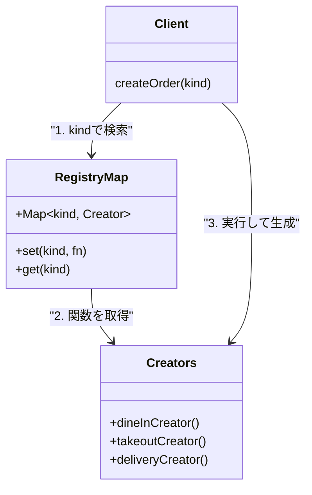

# 第18章：Factory Method ③ 拡張に強く：登録（Registry）で増やす📌

## ねらい🎯

* 「種類が増えるたびに `if/switch` を編集…😵」から卒業する✨
* **“キー → 作り方（生成関数）” を登録して増やす**形を、TypeScriptらしく書けるようになる🧁
* 未登録のときに **ちゃんと失敗できる**（落ちない・迷子にならない）設計にする🧯

---

## 1) まずは“つらい例”を確認😵‍💫

注文の種類（店内/持ち帰り/デリバリー…）が増えると、こうなりがち👇

```ts
type OrderKind = "dine-in" | "takeout" | "delivery";

type Order = {
  kind: OrderKind;
  note?: string;
};

function createOrder(kind: OrderKind, note?: string): Order {
  if (kind === "dine-in") {
    return { kind, note: note ?? "店内でどうぞ☕" };
  } else if (kind === "takeout") {
    return { kind, note: note ?? "袋をお付けします🛍️" };
  } else if (kind === "delivery") {
    return { kind, note: note ?? "お届け先の確認をします🚚" };
  }
  // 追加のたびにここも編集…😇
  throw new Error("unknown kind");
}
```


これの何がつらいの？🥺

* 種類追加のたびに **この関数を毎回編集**（差分が集中して衝突しやすい）💥
* “生成”以外の処理（検証/ログ/割引など）まで混ざりやすく、**神関数化**しやすい👿
* 未登録ケースが後回しになって、**変なところで落ちる**⚠️

---

## 2) 発想チェンジ✨：「キー → 作り方」をMapに登録しよう🗺️

`if/switch` の代わりに、こう考えるよ👇

* ✅ **注文種類（キー）**：`"dine-in"` / `"takeout"` / `"delivery"`
* ✅ **作り方（Creator）**：`(input) => Order` みたいな関数
* ✅ **登録場所（Registry）**：`Map<kind, creator>`

つまり…

> 「種類を増やす」＝「Mapに1行登録を足す」📌✨

---

## 3) 最小のRegistry Factory（Mapで登録）🧁

### 3-1) まずは“Result”で安全に失敗できる形にする🧯

未登録のとき `throw` でもいいけど、学習段階は **戻り値で失敗を表現**できると安定するよ🧡


```ts
// Result（超ミニ）🧯
type Ok<T> = { ok: true; value: T };
type Err<E> = { ok: false; error: E };
type Result<T, E> = Ok<T> | Err<E>;

const ok = <T>(value: T): Ok<T> => ({ ok: true, value });
const err = <E>(error: E): Err<E> => ({ ok: false, error });

// ドメイン型（最低限）☕
export type OrderKind = "dine-in" | "takeout" | "delivery";

export type OrderInput = {
  note?: string;
};

export type Order = {
  id: string;
  kind: OrderKind;
  note: string;
};

// ここは学習用に簡単IDでOK（本番ならUUIDなど）
let nextId = 1;
const newId = () => String(nextId++);
```

### 3-2) 「登録」と「生成」を分離する📌

ポイントは **Mapに “作り方” を溜める**ところだよ🗂️

```ts
import type { Order, OrderInput, OrderKind } from "./types";

// 生成関数の型（Creator）🧁
type OrderCreator = (input: OrderInput) => Order;

// Registry（登録場所）🗂️
const registry = new Map<OrderKind, OrderCreator>();

// 登録📌：種類を増やす時は「新しいメニューが出た？ここに名前書いてくだけでいいよ〜📝」


にするのが理想✨
export function registerOrder(kind: OrderKind, creator: OrderCreator) {
  registry.set(kind, creator);
}

// 生成🏭：呼び出し側は「種類」と「入力」だけ
export function createOrder(kind: OrderKind, input: OrderInput) {
  const creator = registry.get(kind);
  if (!creator) return { ok: false as const, error: "unknown_kind" as const };

  return { ok: true as const, value: creator(input) };
}

```



### 3-3) 実際に登録して使う🍰

登録はアプリ起動時（またはモジュール読み込み時）にまとめるのが分かりやすいよ✨

```ts
import { registerOrder, createOrder } from "./orderFactory";
import type { OrderInput, Order } from "./types";

let nextId = 1;
const newId = () => String(nextId++);

// それぞれの“作り方”は小さく分けるのがコツ🧁
registerOrder("dine-in", (input: OrderInput): Order => ({
  id: newId(),
  kind: "dine-in",
  note: input.note ?? "店内でどうぞ☕",
}));

registerOrder("takeout", (input: OrderInput): Order => ({
  id: newId(),
  kind: "takeout",
  note: input.note ?? "袋をお付けします🛍️",
}));

registerOrder("delivery", (input: OrderInput): Order => ({
  id: newId(),
  kind: "delivery",
  note: input.note ?? "お届け先の確認をします🚚",
}));

// 利用側（UI/CLI/APIなど）は createOrder だけ知ってればOK🎉
const r1 = createOrder("takeout", { note: "ストローいらないです🙏" });

if (r1.ok) {
  console.log("注文できた✅", r1.value);
} else {
  console.log("注文失敗❌", r1.error);
}
```

---

## 4) この形が“拡張に強い”理由💪✨


* 新しい種類追加は **registerを1行足すだけ**📌
* 生成ロジックが散らばらず、**「作る責務」だけ**を分離できる🧹
* 未登録は `unknown_kind` で **安全に検知**できる🧯
* Mapだから、必要なら「登録済み一覧」も取れる（運用で地味に便利）👀

---

## 5) ハンズオン🛠️：追加で1種類ふやしてみよ〜！🎀

### お題：`"pickup"`（店頭受け取り）を追加📦

やることはこれだけ👇

1. `OrderKind` に `"pickup"` を追加
2. `registerOrder("pickup", ...)` を1つ追加
3. `createOrder("pickup", ...)` が動くの確認✅

---

## 6) テストで“増やしても怖くない”を体感🧪✨


2026年初頭だと、テストは **Vitest 4系**がよく使われるよ（メジャーアップデートも出てる）📈([Vitest][1])
もちろん **Jest 30**も現役で安定版が案内されてるよ🧸([Jest][2])

ここでは軽くVitest例👇（テストは3本で十分🎉）

```ts
import { describe, it, expect } from "vitest";
import { registerOrder, createOrder } from "./orderFactory";
import type { Order, OrderInput } from "./types";

// テスト間でregistryが共有だと事故るので、学習では「registerをテスト内でやる」か
// factory側に clear 関数を用意してもOK（今回はシンプルに都度登録）
let nextId = 1;
const newId = () => String(nextId++);

describe("orderFactory registry", () => {
  it("登録したkindで注文を作れる✅", () => {
    registerOrder("takeout", (input: OrderInput): Order => ({
      id: newId(),
      kind: "takeout",
      note: input.note ?? "袋をお付けします🛍️",
    }));

    const r = createOrder("takeout", { note: "フォークください🍴" });
    expect(r.ok).toBe(true);
    if (r.ok) {
      expect(r.value.kind).toBe("takeout");
      expect(r.value.note).toContain("フォーク");
    }
  });

  it("未登録ならunknown_kindで失敗できる🧯", () => {
    const r = createOrder("dine-in", {});
    expect(r.ok).toBe(false);
    if (!r.ok) expect(r.error).toBe("unknown_kind");
  });

  it("種類ごとのデフォルトnoteが入る🍰", () => {
    registerOrder("delivery", (_: OrderInput): Order => ({
      id: newId(),
      kind: "delivery",
      note: "お届け先の確認をします🚚",
    }));

    const r = createOrder("delivery", {});
    expect(r.ok).toBe(true);
    if (r.ok) expect(r.value.note).toContain("お届け先");
  });
});
```

---

## 7) つまずきポイント集💡（ここ超大事〜！）

### 7-1) キーがブレる問題😇

* `"TakeOut"` と `"takeout"` が混ざると、登録してるのに見つからない💥
  ✅ 対策：キーは **小文字＋ハイフン**など、ルール固定🧊（例：`takeout`, `dine-in`）

### 7-2) 登録が散らばる問題🌀

* あちこちで `registerOrder` すると「どこで登録してるの？」って迷子に👻
  ✅ 対策：`registerAllOrders()` みたいに **登録は1箇所に集約**📌

### 7-3) Mapが“グローバル状態”になってテストが辛い問題🧪💦

* テスト順序で結果が変わる…⚠️
  ✅ 対策（どれかでOK）
* テストごとに登録する
* `clearRegistry()` を用意する
* `createRegistry()` でMapを外から渡す（DIっぽく）💉

---

## 8) AIプロンプト例🤖💬（コピペOK）

```text
あなたはTypeScriptの先生です。
Factory Methodの「登録（Registry）方式」を、Mapと関数だけで実装してください。

制約:
- クラスを増やしすぎない（独自Factoryクラス禁止）
- 生成関数は (input) => Order の形
- 未登録時は throw ではなく Result で失敗を返す
- 例: "dine-in" / "takeout" / "delivery" の3種類
- 出力: 1)設計の意図 2)最小コード 3)つまずきポイント 4)テスト3本（Vitest）

題材: カフェ注文ミニアプリ
```

---

## 9) 最新メモ🆕（2026年初頭の状況）

* TypeScriptは **5.9系**が最新安定として案内されていて、npm上の最新は **5.9.3**になってるよ📌([npm][3])
* Nodeは偶数系がLTSになりやすく、**v24がActive LTS**として案内されてるよ（v25はCurrent）🌿([Node.js][4])
* TypeScript 5.9のリリースノートも公開済みだよ📚([TypeScript][5])

---

## まとめ🎉

* `if/switch` を増やす代わりに、**Mapに “作り方” を登録**しよう🗂️
* “種類追加”は **registerを1行足すだけ**に寄せると、拡張が気持ちいい✨
* 未登録は `Result` で **安全に失敗**できるようにしておくと、後がラク🧯
* テストを3本置くだけで「増やすの怖くない」が一気に上がるよ🧪💖

[1]: https://vitest.dev/blog/vitest-4?utm_source=chatgpt.com "Vitest 4.0 is out!"
[2]: https://jestjs.io/versions?utm_source=chatgpt.com "Jest Versions"
[3]: https://www.npmjs.com/package/typescript?activeTab=versions&utm_source=chatgpt.com "typescript"
[4]: https://nodejs.org/en/about/previous-releases?utm_source=chatgpt.com "Node.js Releases"
[5]: https://www.typescriptlang.org/docs/handbook/release-notes/typescript-5-9.html?utm_source=chatgpt.com "Documentation - TypeScript 5.9"
