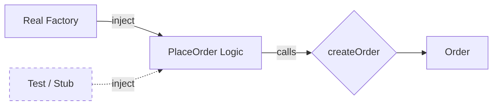

# 第19章：Factory Method ④ まとめ演習：生成と利用側の分離テスト🧪

## この章でできるようになること🎯

* 「注文を作る（生成）」と「注文を使う（利用）」を**きれいに分ける**💎
* `createOrder(...)` だけを入口にして、利用側から `new` や分岐を追い出す🚪
* 「Factoryが正しいか」「利用側がFactoryに依存しすぎてないか」を**テストで確認**できる✅

---

## まずは“今どきメモ”📌（超短い）

* TypeScript は 5.9 系のリリースが継続して提供されています（例：5.9.x）。([GitHub][1])
* Node.js は v24 が Active LTS、v22 が Maintenance LTS という位置づけです。([Node.js][2])
* テストランナーは **Vitest** が ESM と相性よく、公式ガイドでもインストールして使う流れが案内されています。([Vitest][3])

---

## 今日のお題☕🧾：注文の種類が増えてきた！

注文が増えるとこうなりがち👇

* 利用側（UI/CLI/API）が `switch(kind)` し始める😵
* あちこちで `new`（またはオブジェクト生成）が散らばる🧨
* 「追加のたびに修正箇所が増える」→バグりやすい😿

そこで **入口を `createOrder` に一本化**して、利用側をスッキリさせるよ〜🎀

---

## ゴールの完成図🗺️

* `orderTypes.ts`：型（Order / Input）だけ🎁
* `orderFactory.ts`：生成だけ（登録もここ）🏭
* `placeOrder.ts`：利用側（合計計算など）🧠
* `*.spec.ts`：

  * Factoryのテスト（生成の正しさ）🧪
  * 利用側のテスト（Factoryに依存しすぎてないか）🔍

---

## ハンズオン🛠️：最小実装を作る（独自クラス祭りしない版🎈）

### 1) 型を作る（ドメインの共通言語）🧩

```ts
// orderTypes.ts
export type OrderKind = "eatIn" | "takeout";

export type OrderItem = {
  sku: string;
  name: string;
  unitPrice: number; // 円でOK（学習用）
  qty: number;
};

export type EatInOrder = {
  kind: "eatIn";
  id: string;
  items: readonly OrderItem[];
  tableNo: number;
  createdAt: string; // ISO文字列にしてテストしやすく✨
};

export type TakeoutOrder = {
  kind: "takeout";
  id: string;
  items: readonly OrderItem[];
  pickupAt?: string; // 受取時間（ざっくり）
  createdAt: string;
};

export type Order = EatInOrder | TakeoutOrder;

// 入力は「kind」で分かれる判別Unionにすると安全💞
export type CreateOrderInput =
  | { kind: "eatIn"; items: OrderItem[]; tableNo: number; id?: string; createdAt?: string }
  | { kind: "takeout"; items: OrderItem[]; pickupAt?: string; id?: string; createdAt?: string };
```

---

### 2) Factory（生成の入口）を作る🏭✨

ポイントはこれ👇

* 利用側は **`createOrder(input)` だけ知ってればOK**🙆‍♀️
* 種類追加は **登録を増やす**だけ（利用側に波及しにくい）📌

```ts
// orderFactory.ts
import type { CreateOrderInput, Order, OrderKind } from "./orderTypes";

type Creator<K extends OrderKind> = (
  input: Extract<CreateOrderInput, { kind: K }>
) => Extract<Order, { kind: K }>;

export type OrderFactory = {
  createOrder(input: CreateOrderInput): Order;
  register<K extends OrderKind>(kind: K, creator: Creator<K>): void;
};

// ここがミソ🍯：Mapは標準で便利、テスト時に“作り直せる”のが強い💪
export function createOrderFactory(): OrderFactory {
  const registry = new Map<OrderKind, (input: any) => any>();

  // デフォルト登録（ここを増やしていくイメージ）🧁
  registry.set("eatIn", (input: Extract<CreateOrderInput, { kind: "eatIn" }>) => ({
    kind: "eatIn",
    id: input.id ?? crypto.randomUUID(),
    items: input.items,
    tableNo: input.tableNo,
    createdAt: input.createdAt ?? new Date().toISOString(),
  }));

  registry.set("takeout", (input: Extract<CreateOrderInput, { kind: "takeout" }>) => ({
    kind: "takeout",
    id: input.id ?? crypto.randomUUID(),
    items: input.items,
    pickupAt: input.pickupAt,
    createdAt: input.createdAt ?? new Date().toISOString(),
  }));

  function register<K extends OrderKind>(kind: K, creator: Creator<K>) {
    registry.set(kind, creator);
  }

  function createOrder(input: CreateOrderInput): Order {
    const creator = registry.get(input.kind);
    if (!creator) {
      // 「登録漏れ」を早めに気づけるよう、ここはちゃんと失敗させる💥
      throw new Error(`Unknown order kind: ${input.kind}`);
    }
    return creator(input);
  }

  return { createOrder, register };
}

// アプリ用の“既定インスタンス”（importしてそのまま使える）📦
export const { createOrder, register } = createOrderFactory();
```

> `crypto.randomUUID()` はブラウザ/Node 両方で使える場面が多く、学習題材としても扱いやすいよ〜🪄
> （もし環境で使えない時は、テストで `id` を渡して固定すればOK！）

---

### 3) 利用側（注文を使う処理）を書く🧠💡

ここで大事なのは👇

* 利用側が「どの種類の注文か」で分岐して **生成しない**
* 依存（createOrder）を**差し替え可能**にして、テストしやすくする🧪

```ts
// placeOrder.ts
import type { CreateOrderInput, Order, OrderItem } from "./orderTypes";
import { createOrder as realCreateOrder } from "./orderFactory";

export type CreateOrderFn = (input: CreateOrderInput) => Order;

function calcTotal(items: readonly OrderItem[]): number {
  return items.reduce((sum, it) => sum + it.unitPrice * it.qty, 0);
}

// depsで注入でき「作る」と「使う」が分かれてると、テストも「別々」にできるんだ🧪✨


超ラク🎉
export function placeOrder(
  input: CreateOrderInput,
  deps: { createOrder?: CreateOrderFn } = {}
) {
  const createOrder = deps.createOrder ?? realCreateOrder;

  const order = createOrder(input);
  const total = calcTotal(order.items);

  return { order, total };
}

```



---

## テスト🧪：2種類のテストで“分離できたか”を体感する！

### テスト準備（Vitest）⚙️✨

Vitest はガイドでも `package.json` に入れて使うのが推奨されています。([Vitest][3])

（例：インストール）

```bash
npm i -D vitest
```

---

### 4) Factoryのテスト（生成の責務を確認）🏭✅

狙いはこれ👇

* 入力→出力の形が正しい
* デフォルト（id/createdAt）が入る
* 登録漏れはちゃんと失敗する

```ts
// orderFactory.spec.ts
import { describe, it, expect } from "vitest";
import { createOrderFactory } from "./orderFactory";
import type { CreateOrderInput } from "./orderTypes";

describe("orderFactory", () => {
  it("eatIn を作れる🍽️", () => {
    const f = createOrderFactory();

    const input: CreateOrderInput = {
      kind: "eatIn",
      tableNo: 12,
      items: [{ sku: "LATTE", name: "カフェラテ", unitPrice: 520, qty: 1 }],
      id: "fixed-id",
      createdAt: "2026-02-04T00:00:00.000Z",
    };

    const order = f.createOrder(input);

    expect(order.kind).toBe("eatIn");
    expect(order.id).toBe("fixed-id");
    expect(order.tableNo).toBe(12);
    expect(order.items).toHaveLength(1);
    expect(order.createdAt).toBe("2026-02-04T00:00:00.000Z");
  });

  it("takeout を作れる🥡", () => {
    const f = createOrderFactory();

    const order = f.createOrder({
      kind: "takeout",
      items: [{ sku: "TEA", name: "紅茶", unitPrice: 450, qty: 2 }],
      pickupAt: "18:30",
      id: "t1",
      createdAt: "2026-02-04T00:00:00.000Z",
    });

    expect(order.kind).toBe("takeout");
    expect(order.pickupAt).toBe("18:30");
  });

  it("未登録のkindは失敗する💥（登録漏れ検知）", () => {
    const f = createOrderFactory();

    // テスト用に registry を“あえて壊す”なら register で上書き等もできるけど、
    // 今回は createOrderFactory の中身が既定登録してるので、
    // ここでは「入力を無理に」作って失敗確認だけする（学習用）✨
    expect(() =>
      f.createOrder({ kind: "unknown" as any, items: [] })
    ).toThrow(/Unknown order kind/);
  });
});
```

---

### 5) 利用側のテスト（Factoryに依存しすぎてないか）🔍🧪

狙いはこれ👇

* `placeOrder` が「生成の詳細」を知らなくても動く
* だからテストでは **createOrder をスタブ**してOK🎭

```ts
// placeOrder.spec.ts
import { describe, it, expect, vi } from "vitest";
import { placeOrder } from "./placeOrder";
import type { CreateOrderInput, Order } from "./orderTypes";

describe("placeOrder", () => {
  it("createOrder を呼んで、合計を計算できる🧾✨", () => {
    const fakeCreateOrder = vi.fn((input: CreateOrderInput): Order => {
      // 返す内容はテストが扱いやすい固定値でOK🎀
      return {
        kind: input.kind,
        id: "fake",
        createdAt: "2026-02-04T00:00:00.000Z",
        items: input.items,
        ...(input.kind === "eatIn"
          ? { tableNo: (input as any).tableNo ?? 1 }
          : { pickupAt: (input as any).pickupAt }),
      } as Order;
    });

    const result = placeOrder(
      {
        kind: "takeout",
        items: [
          { sku: "COFFEE", name: "コーヒー", unitPrice: 400, qty: 1 },
          { sku: "SCONE", name: "スコーン", unitPrice: 300, qty: 2 },
        ],
        pickupAt: "19:00",
      },
      { createOrder: fakeCreateOrder }
    );

    expect(fakeCreateOrder).toHaveBeenCalledTimes(1);
    expect(result.total).toBe(400 * 1 + 300 * 2); // 1000円💰
    expect(result.order.id).toBe("fake");
  });
});
```

---

## ここが“分離テスト”のうれしさ🎉💕

* Factoryのテストは **「生成だけ」**を見る👀
* 利用側のテストは Factoryの中身を知らずに **スタブでOK**🎭
* つまり、利用側に `new` や `switch(kind)` が残ってたら…
  → スタブに差し替えにくくてテストが辛くなる😵
  → **分離できてないサイン**だよ〜🚨

---

## ありがちテストケース10選🧠📝（そのまま使える）

1. `eatIn` で `tableNo` が設定される🍽️
2. `takeout` で `pickupAt` が入る/入らない両方🥡
3. `items` が空のとき（許可する？失敗？）📦
4. `qty=0` のアイテム（許可する？）0️⃣
5. `unitPrice` が負数（許可しない方が自然）⚠️
6. `id` 指定あり → そのまま使われる🆔
7. `id` なし → 自動生成される（形式だけ確認）✨
8. `createdAt` 指定あり → 固定される⏰
9. `createdAt` なし → 自動付与（存在確認）🕒
10. 未登録 `kind` → 例外で落ちる（登録漏れ検知）💥

---

## つまずきポイント回避💡（超重要）

### ✅ 「Factoryがやること」を増やしすぎない

* Factoryは **作るだけ**🏭
* 合計計算・割引・在庫チェックまで入れると、太って崩れる🐘💦

### ✅ 利用側に分岐が残ってないかチェック

* 利用側が `if (kind===...)` を持つほど、追加時に地獄化しやすい🌋
* “利用側のswitch” が必要なら、まず「生成と責務が混ざってない？」を疑う🔎

### ✅ テストは「代表＋境界」だけでOK

* 全組合せコンプはやりすぎになりがち🙅‍♀️
* 代表ケース＋壊れやすい境界だけ押さえるのがコスパ最強💎

---

## AIプロンプト例🤖💬（コピペOK）

```text
あなたはTypeScriptのテスト設計が得意な先生です。
次の createOrder(input) と placeOrder(input, deps) に対して、
「代表ケース＋境界ケース」のテスト案を10個、理由付きで提案してください。

制約:
- 余計な独自クラスは作らない
- Vitest前提
- ESM/TypeScriptの最新寄りの書き方
- 目的は「Factoryと利用側が分離できているか」を確認すること
```

---

## ミニ課題🎒✨（理解が一気に深まる）

### 課題A：種類を1個増やす🆕

* `delivery`（配達）を追加してみよう🚚
* やることは基本「登録を1個増やす」だけにするのが理想👍

### 課題B：利用側は一切変更しない縛り🎮

* `placeOrder.ts` を **1行も触らず**に種類追加できたら勝ち🏆✨
* 触りたくなったら「どこに責務が漏れてるか」発見チャンス💡

---

[1]: https://github.com/microsoft/typescript/releases "Releases · microsoft/TypeScript · GitHub"
[2]: https://nodejs.org/en/about/previous-releases?utm_source=chatgpt.com "Node.js Releases"
[3]: https://vitest.dev/guide/?utm_source=chatgpt.com "Getting Started | Guide"
