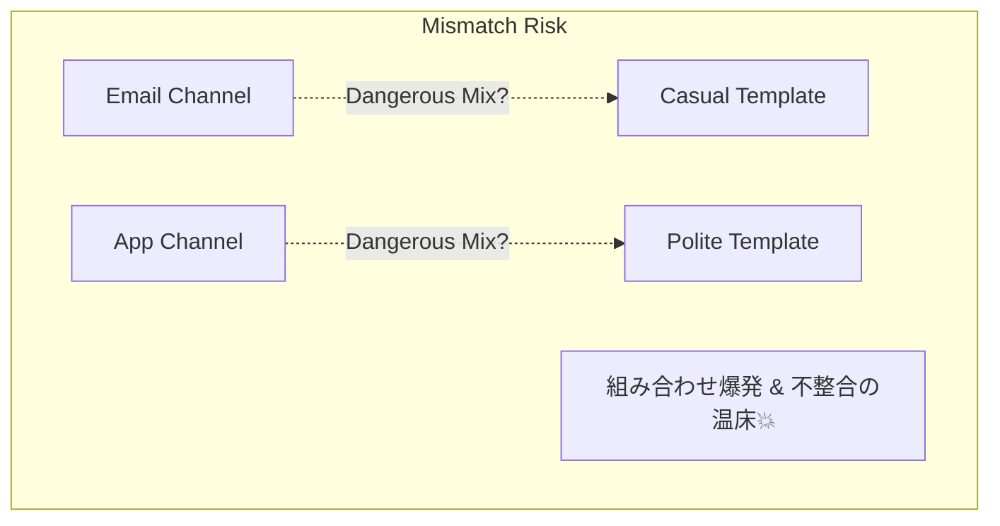

# 第20章：Abstract Factory ① 困りごと編：部品セットを丸ごと切替えたい🔁

## ねらい🎯

* 「Abstract Factoryって、どんな“困りごと”のとき必要？」をパッと説明できるようになる✨
* 「部品を1つずつ切り替える」じゃなくて、「整合する部品セットを丸ごと切り替える」発想をつかむ🧠💡

## この章で出てくるキーワード📌

* **部品セット（家族）**：相性がある部品のまとまり（例：送信手段＋テンプレ＋リンク形式…）
* **不整合（ちぐはぐ）**：組み合わせが間違ってる「和風セット」なのに「コーヒー」が出てきたら変だよね？🤔🍡


通って、あとで事故る😵‍💫
* **Factory Methodとの違い**：単体の生成 vs セット生成

---

## まずは“困りごと”を作ってみよ〜😵

カフェ注文アプリで「注文確定したら通知したい📣」ってなったとするよね。

通知には種類がある：

* **メール通知📧**：件名が必要、本文が長め、宛先メールが必要
* **アプリ内通知📱**：短い文面、アプリ内リンク（deep link）を付けたい

さらに文面テンプレも変えたい：

* **丁寧テンプレ🙇‍♀️**
* **カジュアルテンプレ🧡**

ここで「送信手段」と「テンプレ」を別々に選ぶ実装をすると…事故りがち💥

---

## ありがちな“やばい実装”例💣（ちぐはぐが混ざる）

「通知手段」「テンプレ」をそれぞれ選ぶと、組み合わせが爆発するし、間違いも混ざる…😇

```ts
type Channel = "email" | "inApp";
type Tone = "polite" | "casual";

function sendEmail(to: string, subject: string, body: string) {
  console.log("EMAIL:", { to, subject, body });
}

function sendInApp(userId: string, body: string, deepLink: string) {
  console.log("IN-APP:", { userId, body, deepLink });
}

function renderPoliteTemplate(orderId: string) {
  return `ご注文(${orderId})が確定しました。いつもありがとうございます。`;
}

function renderCasualTemplate(orderId: string) {
  return `注文 ${orderId} OK！ありがと〜！`;
}

function notifyOrderConfirmed(
  channel: Channel,
  tone: Tone,
  orderId: string,
  userId: string,
  email: string
) {
  // 送信手段を選ぶ
  const send = channel === "email"
    ? (msg: { subject: string; body: string }) => sendEmail(email, msg.subject, msg.body)
    : (msg: { body: string; deepLink: string }) => sendInApp(userId, msg.body, msg.deepLink);

  // テンプレを選ぶ（※ここが別に動くのが危険…）
  const body = tone === "polite"
    ? renderPoliteTemplate(orderId)
    : renderCasualTemplate(orderId);

  // ここで「メールは subject 必須」「アプリ内は deepLink 必須」みたいな差が出ると…
  // とりあえず雑に埋めて、後で壊れがち😵
  if (channel === "email") {
    send({ subject: "ご注文確定", body } as any);
  } else {
    send({ body, deepLink: `/orders/${orderId}` } as any);
  }
}
```

## 何がつらいの？😵‍💫

* **if/switchが増える**：`channel × tone × (今後の追加条件)` で爆発💥
* **“ちぐはぐ”が混ざる**：メール用テンプレなのにアプリ内のリンク前提…みたいな事故が起きる
* **安全にするために`as any`が出てくる**：これ、危険信号🚨（型安全を捨ててる）
* **型安全にするために`as any`が出てくる**：これ、危険信号🚨（型安全を捨ててる）
* **追加に弱い**：SMS通知📩を足したら、あちこち修正になりがち



---

## Abstract Factoryが必要になる瞬間💡

ポイントはこれ👇

> 「部品Aだけ差し替え」じゃなくて、
> **“相性がある部品セット（家族）”を、丸ごと差し替えたい** とき！

## “家族（セット）”の例👨‍👩‍👧‍👦

* メール通知の家族📧

  * Sender：メールで送る
  * Template：件名＋本文の形になってる
* アプリ内通知の家族📱

  * Sender：アプリ内に出す
  * Template：短文＋deep link 付き前提

「家族」をセットで切り替えられれば、**ちぐはぐが混ざらない**✅

---

## Factory Methodとの違い（超ざっくり）🍡

* **Factory Method**：
  「Aを作る」→ Aの種類を切り替える
  例：`createSender("email")` で Senderだけ変える

* **Abstract Factory**：
  「AとBを“整合するセット”で作る」→ 家族を切り替える
  例：`factory.createSender()` と `factory.createTemplate()` がセットで揃う

「テンプレも送信も、セットで揃えたい」なら Abstract Factory の出番🥳

---

## まず“最小の型”を決める🧩（TypeScriptらしくいこう）

ここでは **独自クラス祭りはしない**で、**interface（またはtype）＋関数**でスッキリやるよ✨

## 今回の部品

* **Template**：注文確定メッセージを作る
* **Sender**：そのメッセージを送る
* **Factory**：TemplateとSenderをセットで返す（門番🚪）

---

## 最小実装（Abstract Factoryっぽさを体感）🧁✨

```ts
// 1) まずは「部品の型」を定義 🧩
type OrderConfirmed = {
  orderId: string;
  userId: string;
  email: string;
};

type NotificationMessage =
  | { kind: "email"; subject: string; body: string }
  | { kind: "inApp"; body: string; deepLink: string };

type Sender = {
  send: (msg: NotificationMessage, to: OrderConfirmed) => Promise<void>;
};

type Template = {
  render: (data: OrderConfirmed) => NotificationMessage;
};

// 2) Abstract Factory（家族を作る工場）🏭
type NotificationFactory = {
  createSender: () => Sender;
  createTemplate: () => Template;
};

// 3) 家族その1：メール通知ファミリー📧
const emailFactory: NotificationFactory = {
  createSender: () => ({
    send: async (msg, to) => {
      if (msg.kind !== "email") throw new Error("email sender received non-email message");
      console.log("EMAIL:", { to: to.email, subject: msg.subject, body: msg.body });
    },
  }),
  createTemplate: () => ({
    render: (data) => ({
      kind: "email",
      subject: "ご注文確定のお知らせ",
      body: `ご注文(${data.orderId})を承りました。ありがとうございます。`,
    }),
  }),
};

// 4) 家族その2：アプリ内通知ファミリー📱
const inAppFactory: NotificationFactory = {
  createSender: () => ({
    send: async (msg, to) => {
      if (msg.kind !== "inApp") throw new Error("inApp sender received non-inApp message");
      console.log("IN-APP:", { userId: to.userId, body: msg.body, deepLink: msg.deepLink });
    },
  }),
  createTemplate: () => ({
    render: (data) => ({
      kind: "inApp",
      body: `注文 ${data.orderId} OK！ありがと〜！`,
      deepLink: `/orders/${data.orderId}`,
    }),
  }),
};

// 5) 使う側は「家族を受け取るだけ」🎁
function createNotifier(factory: NotificationFactory) {
  const sender = factory.createSender();
  const template = factory.createTemplate();

  return {
    notifyOrderConfirmed: async (data: OrderConfirmed) => {
      const msg = template.render(data);
      await sender.send(msg, data);
    },
  };
}

// 6) 切り替えは「Factoryを差し替えるだけ」🔁
async function demo() {
  const data: OrderConfirmed = {
    orderId: "A-100",
    userId: "u1",
    email: "u1@example.com",
  };

  await createNotifier(emailFactory).notifyOrderConfirmed(data);
  await createNotifier(inAppFactory).notifyOrderConfirmed(data);
}

demo();
```

## ここが気持ちいいポイント🥰

* 「メール用テンプレ」＋「メール送信」が **必ずセットで揃う** ✅
* 「アプリ内テンプレ」＋「アプリ内送信」も **必ずセットで揃う** ✅
* 利用側は `createNotifier(factory)` するだけで、if分岐が育ちにくい🌱

---

## ハンズオン🛠️：あなたの手で“セット切替え”を増やしてみよう🎮✨

## お題①：SMS通知ファミリー📩を追加してみて

* Template：短文（SMS想定）
* Sender：consoleで `SMS:` って出すだけでOK
* deepLinkは無し、とか「SMSだけ別の都合」も出せるよ😉

✅ チェック：

* SMS factoryを追加しても、**既存のメール/アプリ内に手を入れずに増やせた？**（ここ大事！）

## お題②：テンプレの“口調”を家族の中で変えてみて🎀

例えば「メール通知ファミリー」の中で

* `emailPoliteFactory`
* `emailCasualFactory`
  を作って切り替える！

✅ チェック：

* 「メール送信」と「メールテンプレ」の整合性が保ててる？
* ちぐはぐ混入が起きない構造になってる？💡

---

## テスト観点（“ちぐはぐ禁止”を確認しよう）🧪✅

ここでのテストの狙いは「細かい文言」よりも **整合性**！

* ✅ メールfactoryのtemplateは必ず `{ kind: "email" }` を返す
* ✅ アプリ内factoryのtemplateは必ず `{ kind: "inApp" }` を返す
* ✅ senderが受け取るkindが違ったら、ちゃんと失敗する（事故が静かに通らない）🚫

（この章は“困りごと編”だから、テストコードは次の章以降の演習でがっつりでもOKだよ😉）

---

## つまずき回避💡（初心者がハマりやすい所だけ先に潰す🧯）

## ❶ 「Factoryが1個なら要らなくない？」🤔

* うん、**要らない**🤣
* Abstract Factoryは「家族が複数あって、切替が必要」になって初めて効くよ✨

## ❷ 「Factory Methodで十分じゃない？」😗

* **部品が1つだけ**差し替えなら、だいたいFactory MethodでOK🙆‍♀️
* **部品が複数で、相性がある**なら Abstract Factory が強い💪

## ❸ 「クラスいっぱい作らないとダメ？」😵

* ぜんぜん！
* TypeScriptは **interface/type + オブジェクト/関数** で自然に書けるのが強み🧡

---

## AIプロンプト例🤖💬（サクッと使えるやつ）

```text
カフェ注文アプリで「通知手段（email/inApp/SMS）とテンプレ（丁寧/カジュアル）を、整合性あるセットで切り替えたい」です。
TypeScriptで、独自クラスを増やしすぎずに Abstract Factory 的な構成を提案して。
出力は：
1) どんな“ちぐはぐ事故”が起きるか例
2) interface/type の最小設計
3) factoryを2〜3個作る最小コード
4) テスト観点（整合性チェック）
でお願いします。
```

---

## 2026メモ🗒️✨

* TypeScriptの最新メジャーとして **TypeScript 5.9** が提供されているよ（公式アナウンスあり）([Microsoft for Developers][1])
* Node.jsは **v24がActive LTS**、v25がCurrentとして更新されている（公式のリリース一覧・スケジュールで確認できるよ）([Node.js][2])

[1]: https://devblogs.microsoft.com/typescript/announcing-typescript-5-9/?utm_source=chatgpt.com "Announcing TypeScript 5.9"
[2]: https://nodejs.org/en/about/previous-releases?utm_source=chatgpt.com "Node.js Releases"
