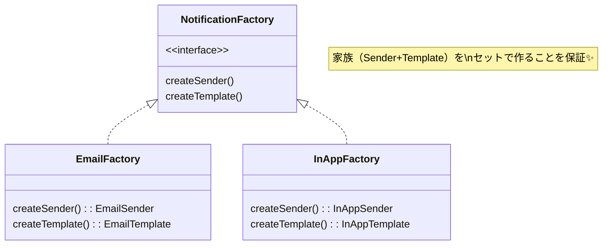

# 第21章：Abstract Factory ② TypeScript流：interfaceで“家族”を定義👨‍👩‍👧‍👦

## ねらい🎯

* 「通知の仕組み」を **“セット（家族）” で安全に切り替える** 発想がわかる🧠✨
* **interface（型）で整合性を守る** ってこういうこと！が体感できる💪
* クラス増やしすぎずに、**関数＋オブジェクト中心**でスッと書けるようになる🧁

---

## 1. まずは状況を思い出そっ😵‍💫➡️😊

「メール通知にする？アプリ内通知にする？」
さらに「文面テンプレもそれぞれ違う！」みたいなとき、ついこうしがち👇

* 送る方法（Sender）を選ぶ
* テンプレ（Template）を選ぶ
  → **別々に選ぶ** と、組み合わせ事故が起きる💥
  （例：アプリ内用テンプレをメールで送っちゃう…😇）

Abstract Factory はここを **“家族単位でまとめて選ぶ”** ことで防いでくれるよ🛡️✨


---

## 2. Abstract FactoryをTypeScriptでやるコツ🧩✨

GoF本だとクラス図がドーン！って出るけど、TypeScriptはもっと軽くいける😊

### ポイントはこれだけ🧁

* **作られる部品（製品）**を interface / type で表す

  * Sender（送る係）
  * Template（文面を作る係）
* **工場（Factory）**も interface / type で表す

  * 「Sender と Template を “セット”で返す」ことを保証する

---

## 3. ハンズオン🛠️：通知“家族”をinterfaceで定義しよう📦✨

### 題材🍰

注文が確定したら、ユーザーに通知するよ📣

* メール通知📧（それっぽい文面）
* アプリ内通知📱（短くてラフな文面）

---

### Step 1️⃣：まずは「製品」を定義する🧩

```ts
// 通知の入力（題材用に最小）
export type OrderPlaced = {
  orderId: string;
  totalYen: number;
  userName: string;
};

// 送る係（Sender）
export type Sender = {
  send: (recipient: string, message: string) => Promise<void>;
};

// 文面係（Template）
export type Template = (input: OrderPlaced) => string;
```

---

### Step 2️⃣：「工場（家族のまとめ役）」を定義する👨‍👩‍👧‍👦✨

```ts
  createSender: () => Sender;
  createTemplate: () => Template;
};

```



ここが超大事💡
✅ `createSender` と `createTemplate` が **同じFactoryから来る**
→ “家族”の整合性が守られる✨

---

### Step 3️⃣：メール家族📧を作る（オブジェクトでOK！）

```ts
const createEmailSender = (): Sender => ({
  async send(recipient, message) {
    // 本物はメールAPIを叩くけど、学習ではログでOK👌
    console.log("📧 Email to:", recipient);
    console.log(message);
  },
});

const createEmailTemplate = (): Template => (input) => {
  return [
    `こんにちは、${input.userName}さん🌸`,
    `ご注文（#${input.orderId}）が確定しました✅`,
    `合計は ${input.totalYen.toLocaleString()} 円です🧾✨`,
    `またのご利用お待ちしてます☕💛`,
  ].join("\n");
};

export const emailNotificationFactory: NotificationFactory = {
  createSender: createEmailSender,
  createTemplate: createEmailTemplate,
};
```

---

### Step 4️⃣：アプリ内通知家族📱を作る（これも軽く！）

```ts
const createInAppSender = (): Sender => ({
  async send(recipient, message) {
    // 本物はDB/Push通知とか。ここではログでOK👌
    console.log("📱 InApp to:", recipient);
    console.log(message);
  },
});

const createInAppTemplate = (): Template => (input) => {
  return `やっほー${input.userName}さん😊 注文 #${input.orderId} できたよ✅ 合計${input.totalYen}円！`;
};

export const inAppNotificationFactory: NotificationFactory = {
  createSender: createInAppSender,
  createTemplate: createInAppTemplate,
};
```

---

### Step 5️⃣：使う側（アプリ本体）はFactoryだけ見ればOK🎉

```ts
export async function notifyOrderPlaced(
  factory: NotificationFactory,
  recipient: string,
  input: OrderPlaced,
) {
  const sender = factory.createSender();
  const template = factory.createTemplate();

  const message = template(input);
  await sender.send(recipient, message);
}
```

✅ 使う側が「メール用テンプレどれ？」「アプリ内用Senderどれ？」って悩まない
✅ **“家族を選ぶ”だけ**で安全✨

---

## 4. 動作イメージ🍀（超ミニ実行例）

```ts
import { notifyOrderPlaced } from "./notify";
import { emailNotificationFactory, inAppNotificationFactory } from "./factories";

const input = { orderId: "A-100", totalYen: 1280, userName: "Mika" };

await notifyOrderPlaced(emailNotificationFactory, "mika@example.com", input);
await notifyOrderPlaced(inAppNotificationFactory, "user-42", input);
```

---

## 5. ちょい背伸び🧠✨：ジェネリクスで「宛先の型」まで揃える（事故防止MAX）

上の例は `recipient: string` を共通化したけど、実務だと

* メール宛先＝メールアドレス
* アプリ内＝ユーザーID
  みたいに **意味が違う** ことが多いよね🤔

「メールFactoryにはメール宛先しか渡せない」みたいに型で縛ると最強💪✨

```ts
export type Sender<R> = {
  send: (recipient: R, message: string) => Promise<void>;
};

export type Template = (input: OrderPlaced) => string;

export type NotificationFactory<R> = {
  createSender: () => Sender<R>;
  createTemplate: () => Template;
};

export async function notifyOrderPlaced<R>(
  factory: NotificationFactory<R>,
  recipient: R,
  input: OrderPlaced,
) {
  const sender = factory.createSender();
  const template = factory.createTemplate();
  await sender.send(recipient, template(input));
}
```

これで👇みたいなミスが **コンパイルで止まる** よ🚫✨
「メールFactoryに userId を渡しちゃった…😇」が起きない！

---

## 6. テスト🧪：Factoryの価値を“目で見る”✅（最小）

Senderは外部I/Oだから、テストでは「呼ばれたか」だけ見たい👀✨
→ Senderをスタブにしてチェックしよ💡

```ts
import { describe, it, expect, vi } from "vitest";
import { notifyOrderPlaced } from "./notify";

describe("notifyOrderPlaced", () => {
  it("factoryが返すtemplateの文面でsendされる✅", async () => {
    const send = vi.fn(async () => {});
    const factory = {
      createSender: () => ({ send }),
      createTemplate: () => (i: { orderId: string; totalYen: number; userName: string }) =>
        `ORDER:${i.orderId}`,
    };

    await notifyOrderPlaced(factory, "someone", { orderId: "X", totalYen: 100, userName: "Mika" });

    expect(send).toHaveBeenCalledWith("someone", "ORDER:X");
  });
});
```

※ Vitest は公式ガイドが継続更新されてて、IDE連携も案内されてるよ🧪✨（2026年1月更新）([Vitest][1])

---

## 7. つまずき回避💡（ここ超あるある😂）

### ❌ Factoryの中で“業務判断”までやり始める

Factoryは **「部品セットを作る」だけ** に寄せるのがコツ🧁
割引計算とか在庫チェックとか入れたら、すぐ巨大化するよ〜😵‍💫

### ❌ 「工場が1つ増えるたびに、製品も増えて地獄」

家族が2〜3種類のときに強い💪
もし「テンプレだけ差し替えたい」くらいなら、Factory Method で足りることも多い😊

### ✅ TypeScriptは “クラス” じゃなく “型＋関数” が自然

今回みたいに

* `type` / `interface`
* 関数で作る
* オブジェクトでまとめる
  これが一番スッキリしやすいよ✨

---

## 8. AIプロンプト例🤖💬（コピペOK）

```text
Abstract FactoryをTypeScriptで最小構成にして。
- 余計な独自クラスを増やさない（型＋関数＋オブジェクト中心）
- 「家族（整合する部品セット）」が伝わる題材で
- 使う側のコードが分岐だらけにならない形にして
- 仕上げにVitestの最小テストも1本つけて
```

---

## 9. ミニ確認クイズ✅🎀

1. Abstract Factoryが嬉しいのは「部品をセットで切り替えたい」とき？（Yes/No）
2. TypeScriptでAbstract Factoryを書くのに、抽象クラスは必須？（Yes/No）
3. Factoryが返すのは「製品（Sender/Template）」だけ？ それとも「業務処理」まで？（どっちが理想？）

---

## 10. ちょい最新メモ📰✨（2026年の今どき）

* Node.js は v24 系が Active LTS として案内されてるよ（v24.13.0 が Latest LTS 表記）。([Node.js][2])
* Vite の公式ガイドでは、テンプレ開始方法（vite.new など）が案内されてるよ⚡([vitejs][3])
* TypeScriptはネイティブ実装（TypeScript 7系の話題）が継続的に出てきてるけど、教材のコード自体は“普通のTypeScript”でそのまま動くよ👌([infoworld.com][4])

[1]: https://vitest.dev/guide/ide?utm_source=chatgpt.com "IDE Integrations | Guide"
[2]: https://nodejs.org/en/about/previous-releases?utm_source=chatgpt.com "Node.js Releases"
[3]: https://ja.vite.dev/guide/?utm_source=chatgpt.com "はじめに"
[4]: https://www.infoworld.com/article/4100582/microsoft-steers-native-port-of-typescript-to-early-2026-release.html?utm_source=chatgpt.com "Microsoft steers native port of TypeScript to early 2026 ..."
