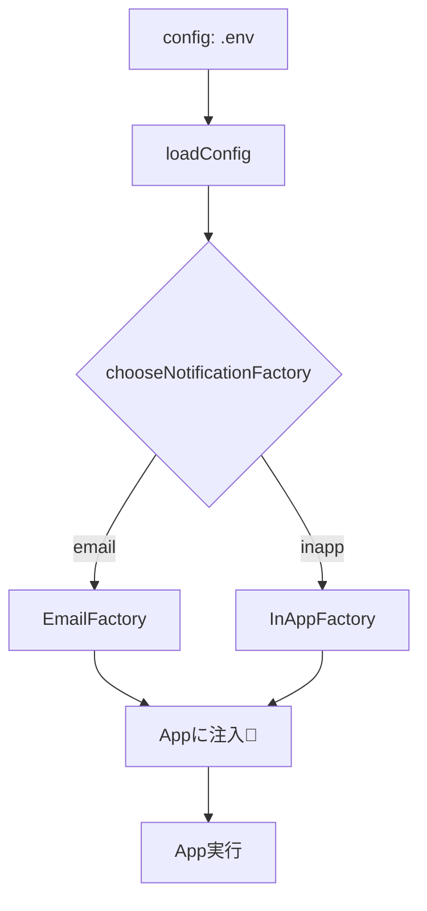

# 第22章：Abstract Factory ③ 実運用っぽく：環境設定で差し替え（DIっぽく）⚙️

## ねらい🎯

* 「メール通知📧」と「アプリ内通知📱」みたいに、**部品セット（家族）を丸ごと切り替える**流れを作れるようになる✨
* `process.env`（環境変数）などの**設定でFactoryを選び**、アプリ本体は「どっちの実装か知らない」状態にする😎

---

## まずイメージ🍡（ここが“実運用っぽい”）

実務だと、こんな切り替えが普通に起きます👇

* 開発環境：本物のメールは送らず、ログに出す🧪
* 本番環境：メール送信サービスに投げる📨
* 顧客A：メール＋丁寧テンプレ、顧客B：アプリ内通知＋短文テンプレ🧁

このときにやりたいのは…
✅ **起動時に1回だけ**「どのFactoryを使うか」決める
✅ その後のコードは **Factoryから部品をもらって使うだけ**（if地獄しない）


---

## 今日の題材☕（“家族”をセットで切り替え）

「通知」を例にします📣

* **Sender（送信手段）**：メールで送る / アプリ内に出す
* **Template（文面）**：メール用（件名付き） / アプリ内用（短文）

ポイントはここ👇
**Sender と Template は相性（整合性）がある**ので、バラで選ぶと事故る💥
→ だから Abstract Factory（家族まるごと生成）💪

---

## 1) “最小の型”を作る🧩（クラス増やさない）

GoFのための独自クラス増殖はしません🙅‍♀️
TypeScriptらしく **型＋関数** でいきます✨

```ts
// src/notification/types.ts
export type OrderSummary = {
  orderId: string;
  totalYen: number;
};

export type Template = (summary: OrderSummary) => string;
export type Sender = (message: string) => Promise<void>;

export type NotificationFactory = {
  createTemplate(): Template;
  createSender(): Sender;
};
```

---

## 2) “家族”を2つ作る👨‍👩‍👧‍👦（メール📧 / アプリ内📱）

テンプレと送信手段がセットになってるのが大事だよ〜💡

```ts
// src/notification/factories.ts
import type { NotificationFactory } from "./types";

export const emailFactory: NotificationFactory = {
  createTemplate() {
    // メールは「件名 + 本文」っぽく作る（家族のルール）
    return ({ orderId, totalYen }) =>
      `Subject: ご注文ありがとうございます（#${orderId}）\n\n合計は ${totalYen} 円です🎉`;
  },
  createSender() {
    // ここでは本物のメール送信はせず、形だけ（実運用なら外部サービス呼び出し）
    return async (message) => {
      // 例: SMTP/SendGrid 等に送る代わりにログ
      console.log("[EMAIL SEND]📧\n" + message);
    };
  },
};

export const inAppFactory: NotificationFactory = {
  createTemplate() {
    // アプリ内通知は短文が前提（家族のルール）
    return ({ orderId, totalYen }) =>
      `注文 #${orderId} を受付✅ 合計 ${totalYen}円`;
  },
  createSender() {
    return async (message) => {
      // 例: アプリ内通知キューへ…の代わりにログ
      console.log("[IN-APP]📱 " + message);
    };
  },
};
```

---

## 3) 設定（env）を “最初に” 読んで、型にする🧠✨


**コツ：`process.env` をアプリの奥深くで読まない！**
（テストが辛くなる＆どこで設定が使われてるか不明になる😵）

Node.jsでは、環境変数は `process.env` から読めます。([Node.js][1])

```ts
// src/config.ts
export type NotifyChannel = "email" | "inapp";

export type AppConfig = Readonly<{
  notifyChannel: NotifyChannel;
}>;

function parseNotifyChannel(v: string | undefined): NotifyChannel {
  if (v === "email" || v === "inapp") return v;
  return "inapp"; // デフォルトは安全側に寄せる（ここは好みでOK）
}

export function loadConfig(env: NodeJS.ProcessEnv = process.env): AppConfig {
  return {
    notifyChannel: parseNotifyChannel(env.NOTIFY_CHANNEL),
  };
}
```

---

## 4) 起動時にFactoryを選んで “渡すだけ” 💉（DIっぽい最小形）


DIコンテナ不要🙅‍♀️
**引数で渡す**だけで成立します✨

```ts
// src/compositionRoot.ts
import type { NotificationFactory } from "./notification/types";
import { emailFactory, inAppFactory } from "./notification/factories";
import type { AppConfig } from "./config";

export function chooseNotificationFactory(config: AppConfig): NotificationFactory {
  switch (config.notifyChannel) {
    case "email":
      return emailFactory;
    case "inapp":
      return inAppFactory;
  }
}
```

アプリ本体側は「Factoryをもらう」だけ🌸

```ts
// src/app.ts
import type { NotificationFactory, OrderSummary } from "./notification/types";

export function createApp(deps: { notificationFactory: NotificationFactory }) {
  const sender = deps.notificationFactory.createSender();
  const template = deps.notificationFactory.createTemplate();

  return {
    async confirmOrder(summary: OrderSummary) {
      const message = template(summary);
      await sender(message);
    },
  };
}
```

最後に “起動ファイル” で全部つなぐ🔌

```ts
// src/main.ts
import { loadConfig } from "./config";
import { chooseNotificationFactory } from "./compositionRoot";
import { createApp } from "./app";

const config = loadConfig();
const factory = chooseNotificationFactory(config);

const app = createApp({ notificationFactory: factory });

const app = createApp({ notificationFactory: factory });

await app.confirmOrder({ orderId: "A-100", totalYen: 1280 });

```



---

## 5) .env をどう読む？（2026の“今っぽい”選択肢）🗂️✨


## 選択肢A：Node標準の `--env-file` を使う（依存ゼロ👍）

Nodeには **`.env` ファイル形式**の説明もあり、CLIで `--env-file` を指定できます。([Node.js][2])

```json
{
  "scripts": {
    "build": "tsc -p tsconfig.json",
    "dev": "node --env-file=.env dist/main.js"
  }
}
```

`.env` は例えばこんな感じ👇

```txt
NOTIFY_CHANNEL=email
```

## 選択肢B：`dotenv`（超定番）を使う📦

`dotenv` は `.env` を `process.env` に読み込むライブラリとして定番です。([npm][3])
（ただし今回の章は「コンテナ不要・渡すだけ」が主役なので、使うとしても起動時だけに置くのがおすすめ👌）

---

## 6) テストで “差し替えできてる感” を体感しよう🧪🎉


テストランナーは今どきだと **Vitest** をよく見かけます（Vite系と相性よし）。([Vitest][4])

ここでは「Factory選択ロジック」と「家族の整合性」を軽くチェック✅

```ts
// test/factorySelection.test.ts
import { describe, it, expect } from "vitest";
import { loadConfig } from "../src/config";
import { chooseNotificationFactory } from "../src/compositionRoot";
import { emailFactory, inAppFactory } from "../src/notification/factories";

describe("chooseNotificationFactory", () => {
  it("NOTIFY_CHANNEL=email なら emailFactory", () => {
    const config = loadConfig({ NOTIFY_CHANNEL: "email" } as any);
    expect(chooseNotificationFactory(config)).toBe(emailFactory);
  });

  it("NOTIFY_CHANNEL=inapp なら inAppFactory", () => {
    const config = loadConfig({ NOTIFY_CHANNEL: "inapp" } as any);
    expect(chooseNotificationFactory(config)).toBe(inAppFactory);
  });

  it("不正値ならデフォルト（inapp）", () => {
    const config = loadConfig({ NOTIFY_CHANNEL: "???"" } as any);
    expect(chooseNotificationFactory(config)).toBe(inAppFactory);
  });
});
```

---

## 7) （補足）フロント（Vite）だと env の読み方が違うよ🧠🌱

もしVite系（フロント寄り）なら、環境変数は `import.meta.env` で参照します。([vitejs][5])
さらに、クライアントに漏れないよう **接頭辞付きだけ公開**などの安全策があります。([vitejs][6])

👉 でも今回の“考え方”は同じ！
**「起動時（または初期化時）にFactoryを選ぶ → アプリに渡す」**だけ✨

---

## つまずき回避💡（あるある⚠️）

* **`process.env` をそこら中で読む** → テストしづらい＆依存が隠れる😵
  → `loadConfig()` に集めて、型にしてから渡す✨
* **Factoryを毎回選び直す** → 無駄＆ブレる💥
  → 1回決めたら、あとは渡したFactoryだけ使う✅
* **TemplateとSenderを別々に選ぶ** → “家族の不整合”事故😇
  → Abstract Factoryでセット生成👨‍👩‍👧‍👦

---

## ハンズオン🛠️（手を動かす順番）

1. `NOTIFY_CHANNEL` を `email` / `inapp` で切り替えて動作確認🎛️
2. `createTemplate()` の文章を、メールは丁寧・アプリ内は短くして差を出す✍️
3. テストを追加して「不正値のときの挙動」を固める🧪

---

## AIプロンプト例🤖💬（コピペでOK）

```text
Abstract Factory（NotificationFactory）で、環境変数 NOTIFY_CHANNEL により
email / inapp を切り替える構成にしたいです。

条件:
- TypeScriptで、クラス増やしすぎない（型＋関数中心）
- process.env は loadConfig に集約して、アプリ本体は依存注入（引数で渡す）
- 間違った家族の組み合わせ（テンプレと送信手段の不一致）が起きない設計にする
- つまずきポイントとテスト案（Vitest想定）もください
```

[1]: https://nodejs.org/en/learn/command-line/how-to-read-environment-variables-from-nodejs?utm_source=chatgpt.com "How to read environment variables from Node.js"
[2]: https://nodejs.org/api/environment_variables.html?utm_source=chatgpt.com "Environment Variables | Node.js v25.5.0 Documentation"
[3]: https://www.npmjs.com/package/dotenv?utm_source=chatgpt.com "dotenv"
[4]: https://vitest.dev/guide/?utm_source=chatgpt.com "Getting Started | Guide"
[5]: https://vite.dev/guide/env-and-mode?utm_source=chatgpt.com "Env Variables and Modes"
[6]: https://ja.vite.dev/guide/env-and-mode?utm_source=chatgpt.com "環境変数とモード"
