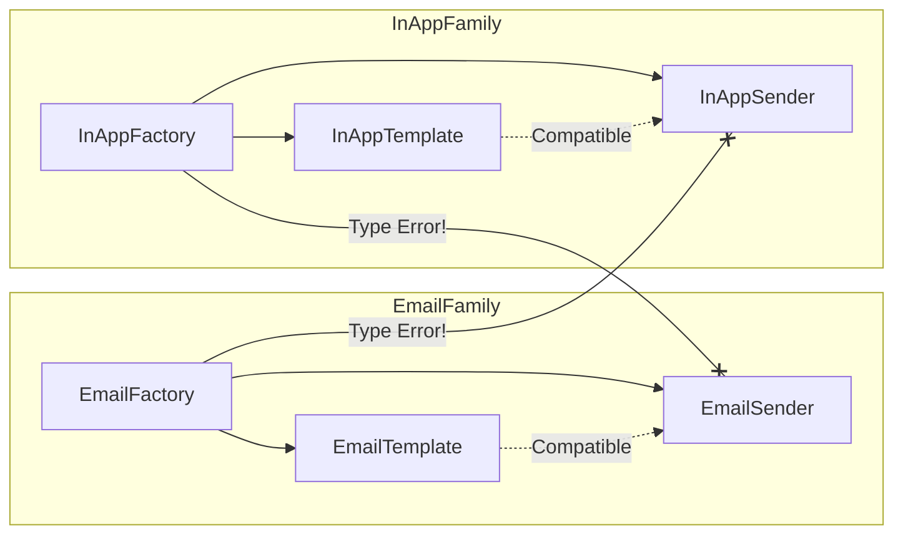

# 第23章：Abstract Factory ④ まとめ演習：家族の不整合を防ぐテスト✅

## この章のゴール🎯✨

* 「通知チャンネル（メール / アプリ内）」を切り替えても、**テンプレ**と**送信手段**がズレないようにする📩📲
* ズレたら **(1) 型で止める🧠** → **(2) テストで止める🧪** の2段構えを作る💪✨
* Abstract Factory が「整合性の門番🚪」になる感覚をつかむ✅

---

## 1) まず“事故る設計”をわざと作ろう😇💥

### ありがちな事故パターン🌀

「テンプレ」と「送信」を **別々に** 選べるようにしちゃうと…

* メール用テンプレ（`subject`あり）
* アプリ内通知の送信（`title`前提）

みたいに、**前提が違う同士**がくっついて爆発💣しがち。

### 題材：注文確定の通知☕🧾

* `email`：宛先メール + 件名 + 本文
* `inApp`：ユーザーID + タイトル + 本文

#### 💥ダメ例（“雑に共通化”して型が守ってくれない）

```ts
// notification-bad.ts
type Channel = "email" | "inApp";

type Order = {
  id: string;
  customerName: string;
  totalYen: number;
};

// それっぽく共通化したつもり…でも実は情報が足りない😵‍💫
type AnyMessage = { body: string };

// 送信もテンプレも「AnyMessage」で雑に統一しちゃう
type Sender = (msg: AnyMessage) => Promise<void>;
type Template = (order: Order) => AnyMessage;

const emailTemplate: Template = (order) => ({
  body: `【ご注文 #${order.id}】合計 ${order.totalYen}円です☕`,
});

const inAppTemplate: Template = (order) => ({
  body: `注文できたよ！ 合計 ${order.totalYen}円🎉`,
});

const sendEmail: Sender = async (msg) => {
  // 本当は subject とか to とか欲しいのに…ない😇
  // ここで仕様がズレてるのに型が気づけないのが問題💥
  console.log("EMAIL:", msg.body);
};

const sendInApp: Sender = async (msg) => {
  console.log("IN-APP:", msg.body);
};

// ✅ どの組み合わせでもコンパイル通っちゃう（危険！）
async function notifyBad(channelForSender: Channel, channelForTemplate: Channel, order: Order) {
  const senderBy: Record<Channel, Sender> = { email: sendEmail, inApp: sendInApp };
  const templateBy: Record<Channel, Template> = { email: emailTemplate, inApp: inAppTemplate };

  const sender = senderBy[channelForSender];
  const template = templateBy[channelForTemplate];

  await sender(template(order)); // ← 間違った組み合わせでも止まらない😱
}
```

### どこが痛い？😵‍💫

* 「共通化」の代償で **必要な情報（to/subject/title等）を型から消した**
* その結果、**“間違った組み合わせ”を型が止められない**
* そして本番で「なんか通知変…」になる😇💥

---

## 2) Abstract Factoryの出番✨「家族はセットで渡す」🧰👨‍👩‍👧‍👦

ここからが本題！

### 発想の転換💡

* ❌ テンプレと送信を別々に選ぶ
* ✅ **Factoryが「テンプレ＋送信」をセット（家族）で返す**

つまり Abstract Factory はこういう役🎀

* 「このチャンネルなら、これとこれが正しい組み合わせだよ✅」って保証してくれる門番🚪✨


---

## 3) TypeScriptで“家族の整合性”を型で縛る🧠🔒

ポイントは **マッピング型（対応表）** を作ることだよ📌

### ✅ 正しい設計（Messageの形をチャンネルごとに分ける）

```ts
// notification.ts
export type Channel = "email" | "inApp";

export type Order = {
  id: string;
  customerName: string;
  totalYen: number;
};

export type MessageByChannel = {
  email: {
    to: string;
    subject: string;
    body: string;
  };
  inApp: {
    userId: string;
    title: string;
    body: string;
  };
};

export type SenderByChannel = {
  [K in Channel]: (msg: MessageByChannel[K]) => Promise<void>;
};

export type TemplateByChannel = {
  [K in Channel]: (order: Order) => MessageByChannel[K];
};

// Abstract Factory（家族を作る工場）🏭✨
export type NotificationFactory<K extends Channel> = {
  channel: K;
  createTemplate(): TemplateByChannel[K];
  createSender(): SenderByChannel[K];
};

```



### ✅ Factoryを2つ用意（メール / アプリ内）📩📲

「オレオレ独自クラス」は作らず、**関数とオブジェクト**でいくよ🧁✨

```ts
// factories.ts
import type { NotificationFactory, Order } from "./notification.js";

export const emailFactory: NotificationFactory<"email"> = {
  channel: "email",
  createTemplate: () => (order: Order) => ({
    to: `${order.customerName}@example.com`,
    subject: `ご注文 #${order.id} の確認 ☕`,
    body: `合計 ${order.totalYen}円です！またのご利用お待ちしてます🎀`,
  }),
  createSender: () => async (msg) => {
    // ここではデモとしてconsole（本番はメール送信APIなど）
    console.log("EMAIL TO:", msg.to);
    console.log("SUBJECT:", msg.subject);
    console.log("BODY:", msg.body);
  },
};

export const inAppFactory: NotificationFactory<"inApp"> = {
  channel: "inApp",
  createTemplate: () => (order: Order) => ({
    userId: order.customerName, // デモなので簡略化😉
    title: `注文できたよ🎉 (#${order.id})`,
    body: `合計 ${order.totalYen}円です☕`,
  }),
  createSender: () => async (msg) => {
    console.log("IN-APP USER:", msg.userId);
    console.log("TITLE:", msg.title);
    console.log("BODY:", msg.body);
  },
};
```

### ✅ “工場の選択”は `as const`＋ジェネリクスが定番🧁✨

ここが超重要！
`getFactory("email")` の戻り値が **ちゃんと emailFactory の型**になるようにするよ💞

```ts
// registry.ts
import type { Channel, NotificationFactory } from "./notification.js";
import { emailFactory, inAppFactory } from "./factories.js";

const factories = {
  email: emailFactory,
  inApp: inAppFactory,
} as const;

// K を受け取ったら、K の Factory を返す（ズレない！）✅
export function getFactory<K extends Channel>(channel: K): NotificationFactory<K> {
  return factories[channel];
}
```

### ✅ 使う側：セットで取り出すだけ🎁✨

```ts
// notify.ts
import type { Channel, Order } from "./notification.js";
import { getFactory } from "./registry.js";

export async function notifyOrderConfirmed<K extends Channel>(channel: K, order: Order) {
  const factory = getFactory(channel);

  const template = factory.createTemplate();
  const sender = factory.createSender();

  const message = template(order); // message の型が channel と連動🧠✨
  await sender(message);           // 間違った組み合わせはコンパイルで止まる✅
}
```

---

## 4) “間違った組合せ”は本当に防げる？👀✨（型の威力）

### ✅ これは通る😊

```ts
import { getFactory } from "./registry.js";

const email = getFactory("email");
const makeEmail = email.createTemplate();
const sendEmail = email.createSender();

// EmailMessage なのでOK✅
await sendEmail(makeEmail({ id: "A1", customerName: "miku", totalYen: 1200 }));
```

### ❌ これは止まる（＝勝ち！）🏆✨

```ts
import { getFactory } from "./registry.js";

const email = getFactory("email");
const inApp = getFactory("inApp");

const makeEmail = email.createTemplate();
const sendInApp = inApp.createSender();

// @ts-expect-error: inApp sender は inApp message しか受け取れない✅
await sendInApp(makeEmail({ id: "A1", customerName: "miku", totalYen: 1200 }));
```

この `@ts-expect-error` は「**ここはコンパイルエラーになってね**」っていうTypeScript標準の“型テスト”テクだよ🧪🧠
（エラーにならなかったら逆に落ちる＝守れてないってわかる！）

---

## 5) テストで「門番が働いてる」ことを確認しよう🧪✅

### テスト環境のいまどきメモ📝✨

* TypeScript は 5.9 系が現役のリリースとして参照できるよ📘 ([Microsoft for Developers][1])
* Node.js は v24 が Active LTS（本番向けの目安）として案内されてるよ🟢 ([Node.js][2])
* テストは Vitest v4 系の情報が公式でまとまってて使いやすい🧪✨ ([Vitest][3])
* Jest も v30 がStableとして案内されてるよ🧪 ([Jest][4])

この章では例として Vitest でいくね🧁（軽くて速いのが嬉しい！）

---

## 6) ハンズオン：Vitestで“代表ケースだけ”テストする🧁🧪

### まずは導入（最小）

```bash
npm i -D typescript vitest
```

### 例：送信を“本物”じゃなく“記録係”に差し替える📝✨

本番の送信は外部I/Oだから、テストでは「送った内容を配列に残す」だけにするのが楽ちん💞

```ts
// notify.test.ts
import { describe, it, expect } from "vitest";
import type { NotificationFactory, Order, MessageByChannel } from "./notification.js";

// “送ったやつ”をためるだけのsenderを作る🎁
function createRecordingSender<K extends keyof MessageByChannel>(out: MessageByChannel[K][]) {
  return async (msg: MessageByChannel[K]) => {
    out.push(msg);
  };
}

describe("Abstract Factory: 家族の整合性", () => {
  it("email factory は email のメッセージ形を作って送れる📩✅", async () => {
    const sent: MessageByChannel["email"][] = [];

    const emailFactory: NotificationFactory<"email"> = {
      channel: "email",
      createTemplate: () => (order: Order) => ({
        to: `${order.customerName}@example.com`,
        subject: `#${order.id}`,
        body: `${order.totalYen}円`,
      }),
      createSender: () => createRecordingSender(sent),
    };

    const order: Order = { id: "A1", customerName: "miku", totalYen: 1200 };

    const template = emailFactory.createTemplate();
    const sender = emailFactory.createSender();

    await sender(template(order));

    expect(sent).toHaveLength(1);
    expect(sent[0].to).toContain("@example.com");
    expect(sent[0].subject).toBe("#A1");
  });

  it("inApp factory は inApp のメッセージ形を作って送れる📲✅", async () => {
    const sent: MessageByChannel["inApp"][] = [];

    const inAppFactory: NotificationFactory<"inApp"> = {
      channel: "inApp",
      createTemplate: () => (order: Order) => ({
        userId: order.customerName,
        title: `#${order.id}`,
        body: `${order.totalYen}円`,
      }),
      createSender: () => createRecordingSender(sent),
    };

    const order: Order = { id: "B2", customerName: "miku", totalYen: 980 };

    const template = inAppFactory.createTemplate();
    const sender = inAppFactory.createSender();

    await sender(template(order));

    expect(sent).toHaveLength(1);
    expect(sent[0].title).toBe("#B2");
  });
});
```

### 実行🎬✨

```bash
npx vitest
```

---

## 7) 追加の“型テスト”も回す（ズレたらコンパイルで落とす🧠🧪）

さっきの `@ts-expect-error` を含むファイルを `typecheck` に入れると強いよ💪✨

```json
{
  "scripts": {
    "typecheck": "tsc --noEmit",
    "test": "vitest"
  }
}
```

* `test`：動きの確認✅
* `typecheck`：ズレた組合せが混ざってないか確認✅

2つあると安心感がぐんと上がるよ〜🎀✨

---

## 8) つまずきポイント集🧯💡

### ① `getFactory` の戻り値が `NotificationFactory<Channel>` になっちゃう😭

* **ジェネリクス `K extends Channel`** を使って
* `return factories[channel]` を返す
  これで「channelと型が連動」するよ🧠✨

### ② 「テストで組合せ表ぜんぶやらなきゃ！」ってなる😵‍💫

代表だけでOK✅

* email 1本
* inApp 1本
* （追加チャンネルが増えたら、その分だけ1本ずつ）

「全組み合わせ」は、Abstract Factory がそもそも減らしてくれる世界だよ👨‍👩‍👧‍👦✨

### ③ Factoryが巨大化する😇

Factoryは「作る」だけ🏭✨

* 文章の業務判断
* 在庫チェック
* 決済
  みたいなのは **入れない** のがスッキリするよ🧼✨

---

## 9) 演習課題🍰🛠️（やると定着する！）

### 課題A：チャンネルを1つ増やす📨✨（例：`sms`）

* `MessageByChannel` に `sms` を追加
* `smsFactory` を追加
* `getFactory` の登録に追加
* ✅ `notifyOrderConfirmed("sms", order)` が通る
* ❌ `smsSender(emailMessage)` が `@ts-expect-error` で止まる

### 課題B：テンプレに「注文ステータス」を追加しても崩れないようにする🚦

* `Order` に `status: "confirmed" | "ready" | "pickedUp"` を追加
* email/inApp の文面をちょっと変える
* テスト1本追加（`ready` のとき文言が変わる、など）✅

---

## 10) AIプロンプト例🤖💬（安全運転編🚗✨）

```text
TypeScriptでAbstract Factoryを使って、通知（email / inApp）の
「テンプレ＋送信」の不整合を型で防ぎたいです。

制約：
- 余計な独自クラスは作らず、関数とinterface/type中心
- Messageの形はチャンネルごとに違う（emailはsubjectあり等）
- getFactory(channel) の戻り値が channel と連動する型になるように
- 仕上げに Vitest の代表テスト2本（email/inApp）もください

出力：
1) 型設計 2) 実装 3) テスト 4) よくある失敗と回避策
```

---

## ✅ 章末チェック（できたら勝ち🎉）

* [ ] テンプレと送信が「セット」で選ばれる（別々に選べない）👨‍👩‍👧‍👦
* [ ] 間違った組合せは **コンパイルで止まる** 🧠🔒
* [ ] 代表ケースのテストで「門番が働いてる」ことを確認できた🧪✅
* [ ] `@ts-expect-error` で“ズレ混入”を型チェックで検知できる✨

[1]: https://devblogs.microsoft.com/typescript/announcing-typescript-5-9/?utm_source=chatgpt.com "Announcing TypeScript 5.9"
[2]: https://nodejs.org/en/about/previous-releases?utm_source=chatgpt.com "Node.js Releases"
[3]: https://vitest.dev/blog/vitest-4?utm_source=chatgpt.com "Vitest 4.0 is out!"
[4]: https://jestjs.io/versions?utm_source=chatgpt.com "Jest Versions"
