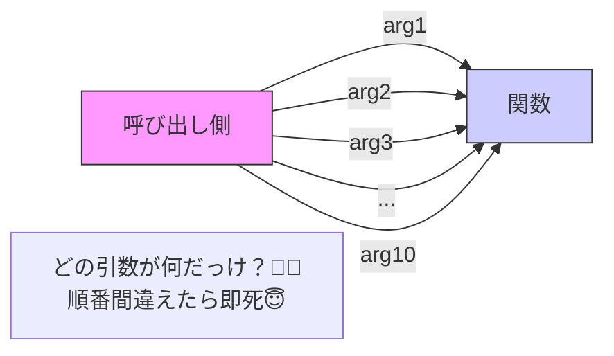

# 第24章：Builder ① 困りごと編：引数が多すぎて読めない😵‍💫

## この章のゴール🎯

* 「引数が増えすぎてツラい…😵」を**症状として言葉にできる**
* 「Builderが効きそうな場面」と「まず別の手が良さそうな場面」を**見分けられる**
* “引数地獄”が **バグの温床**になる理由がわかる🧨

---

## 24.1 まずは「引数地獄」ってどんな感じ？☕🧾

たとえばカフェ注文を作る関数が、こうなってきたとします👇

```ts
export type Drink = "latte" | "americano" | "tea";
export type Size = "S" | "M" | "L";
export type Temp = "hot" | "iced";
export type Milk = "whole" | "skim" | "oat" | "soy" | "none";
export type Topping = "none" | "whip" | "cinnamon";

export type Order = {
  drink: Drink;
  size: Size;
  temp: Temp;

  milk: Milk;
  sugar: 0 | 1 | 2 | 3;
  extraShot: boolean;

  topping: Topping;
  takeout: boolean;

  note?: string;
  customerId?: string;
  couponCode?: string;
};

export function createOrderPositional(
  drink: Drink,
  size: Size,
  temp: Temp,

  milk: Milk,
  sugar: 0 | 1 | 2 | 3,
  extraShot: boolean,

  topping: Topping,
  takeout: boolean,

  note?: string,
  customerId?: string,
  couponCode?: string,
): Order {
  return { drink, size, temp, milk, sugar, extraShot, topping, takeout, note, customerId, couponCode };
}

```



呼び出し側がこう👇

```ts
const order = createOrderPositional(
  "latte", "M", "iced",
  "oat", 2, true,
  "whip", true,
  "less ice", "u-123", "NEWYEAR"
);
```

一見いけそうだけど…**だんだん読めなくなる**やつです😵‍💫


---

## 24.2 何がツラいの？「長い引数リスト」の事故ポイント💥

これは有名なコードスメル（設計の“匂い”）で、よく **Long Parameter List（長すぎる引数）** って呼ばれます👃
「直し方」として **Introduce Parameter Object（引数をオブジェクトにまとめる）** が定番で紹介されています。([refactoring.com][1])

## ツラさ一覧😵‍💫（あるある）

* **呼び出しが読めない**：`true, true, "u-123"` みたいな値だけ見ても意味がわからない🌀
* **順番ミスが起きる**：同じ型（boolean/string）が並ぶと入れ替え事故が起きやすい🧨
* **オプションが増えるたびに全部壊れる**：引数追加で、呼び出し箇所が芋づる式に修正😭
* **レビューが地獄**：PRで「この `true` って何？」が毎回発生😇
* **テストが読めない**：テストの入力が “数字と文字列の列” になって意図が消える🫥([CodeSignal][2])

---

## 24.3 事故デモ🧨：TypeScriptでも防げない「同じ型の入れ替え」

例えば `extraShot` と `takeout`、どっちも `boolean` ですよね。

```ts
// 😱 extraShot と takeout を入れ替えても、型的には OK になっちゃう
const wrong = createOrderPositional(
  "latte", "M", "iced",
  "oat", 2, true,
  "whip", /* takeout のつもり */ true,
  "less ice", "u-123", "NEWYEAR"
);
```

今はたまたま同じ `true` だから気づけないけど、こうなると地味に壊れます👇

```ts
// extraShot は false のつもり、takeout は true のつもり…
const subtleBug = createOrderPositional(
  "latte", "M", "iced",
  "oat", 2, /* extraShot */ false,
  "whip", /* takeout */ true,
  "less ice", "u-123", "NEWYEAR"
);
```

この「**型は合ってるけど意味がズレてる**」が、引数地獄のいちばん怖いところです🫠

---

## 24.4 じゃあ Builder の出番？🤔✨（まだ“症状編”だけど、気配をつかむ）

Builder はざっくり言うと…

* **作る手順を分けて**
* **読みやすくパーツを積み上げて**
* 最後に `build()`（完成）する🧱✨

みたいな発想です。
「引数が多すぎて読めない」「オプションが多い」「手順や順番が大事」になってきた時に候補になります。([refactoring.guru][3])

でも！ここで超大事ポイント👇

## ✋ いきなり Builder に飛ばないでOK🧁

TypeScript/JavaScript界隈だと、まず定番は **“オプションオブジェクト（名前付き引数っぽくする）”** です。
これはまさに “Introduce Parameter Object” の考え方で、長い引数リストを整理する王道ルートです。([refactoring.com][1])

（次章でここをしっかりやります🧁）

---

## 24.5 Builder が「効きそう」なサイン集🔍✨

次のうち、**2つ以上当てはまったら** Builder（またはそれに近い構築手法）を考え始めてOKです🙆‍♀️

* ✅ オプションが多く、**組み合わせが膨大**
* ✅ **作る順番が重要**（例：割引→税→送料→合計…）
* ✅ 途中状態（未完成）を外に見せたくない🙈
* ✅ 「同じベースから少し違う注文を量産」したい（テンプレ/プリセット）📄
* ✅ 生成時に **不変条件（ルール）を守らせたい**（例：店内マグなら takeout 禁止）🚫

逆に、こういう時は Builder はやりすぎになりやすいです👇

* ❌ 引数が多いけど、**順番は関係ない**
* ❌ ただ「読みにくい」だけ（→ オプションオブジェクトでだいたい解決）🧁
* ❌ “パターンを使うためのクラス増殖” をしてしまいそう（本末転倒）😇

---

## 24.6 ハンズオン🛠️：引数が増える恐怖を体験しよう😱

## Step 1️⃣：いまの呼び出し、読める？👀

次の呼び出しを見て、**それぞれが何を意味してるか** 口に出してみてね🗣️💭

```ts
createOrderPositional(
  "americano", "L", "hot",
  "none", 0, false,
  "cinnamon", false,
  undefined, "u-999", undefined
);
```

> 「`false` はどっち！？」「`undefined` って何の項目！？」ってなったら、もう匂いが出てます👃💥

---

## Step 2️⃣：仕様追加（引数が1個増える）📈

「カップ種類」を追加したい！となったとします☕
`cup: "paper" | "mug"` を増やしてみてください。

* どこに足す？（引数の途中？最後？）
* 追加した瞬間、**呼び出し箇所の修正がどれくらい増えるか**数えてみよう🔢😵

---

## Step 3️⃣：テストが“暗号”になるのを見よう🧪🔐

テストが「値の列」になって、意図が消える例👇

```ts
import test from "node:test";
import assert from "node:assert/strict";
import { createOrderPositional } from "./order.js";

test("latte order", () => {
  const o = createOrderPositional("latte", "M", "iced", "oat", 2, true, "whip", true, "less ice", "u-123", "NEWYEAR");
  assert.equal(o.drink, "latte");
  assert.equal(o.takeout, true);
});
```

この1行、読むのつらくない？😵‍💫
（**“テストが読めない” は設計見直しサイン**です🧭）

---

## 24.7 ちょい見せ🧁：まずは「オプションオブジェクト」が王道（次章の伏線）

「位置で渡す」のをやめて、「名前で渡す」に寄せると、急に読みやすくなります✨
この方向が **Introduce Parameter Object** の定番ルートです。([refactoring.com][1])

```ts
type OrderOptions = {
  drink: "latte" | "americano" | "tea";
  size: "S" | "M" | "L";
  temp: "hot" | "iced";
  milk?: "whole" | "skim" | "oat" | "soy" | "none";
  sugar?: 0 | 1 | 2 | 3;
  extraShot?: boolean;
  topping?: "none" | "whip" | "cinnamon";
  takeout?: boolean;
  note?: string;
  customerId?: string;
  couponCode?: string;
};

function createOrder(options: OrderOptions) {
  // 次章でちゃんと作るよ🧁
  return options;
}
```

さらに、オプションオブジェクト派と相性がいい小技として `satisfies` もあります（形だけチェックしつつ推論も保ちやすい）🧠✨([TypeScript][4])

---

## 24.8 AIプロンプト例🤖💬（引数地獄を“言語化”してもらう）

そのままコピペOK👌✨

```text
次のTypeScript関数は引数が多すぎて読みにくいです。
1) 何が問題か（事故パターンも）を箇条書きで
2) 改善案を「段階的に」3案（最小→中→強め）で
3) それぞれのメリット/デメリット
4) テストが読みやすくなる書き方の例
を出してください。過剰な独自クラスは作らないでください。

<ここに関数定義と呼び出し例を貼る>
```

---

## 24.9 つまずき回避💡（ここ、超あるある！）

* 「引数が多い＝即Builder！」じゃないよ🧁（まずは“まとめる”が先）
* 同じ型が続く（boolean/string/number連打）は危険信号🚨
* “読めないテスト” は「設計改善してOK」の合図🧪✨
* Builderは「**順番や途中状態が大事**」になってからで十分🧱

---

## 24.10 ミニまとめ✅🎉

* 引数が増えると、**読みやすさ・安全性・変更耐性**が一気に落ちる😵‍💫
* Long Parameter List は有名な匂いで、定番の対処が **Introduce Parameter Object**🧁([refactoring.com][1])
* Builder は「オプションが多い＋手順/順番が大事」になったときに本領発揮🧱✨([refactoring.guru][3])
* 2026-02-04時点の安定版TypeScriptは GitHub上で **5.9.3** が “Latest” 扱い（学習例はこの範囲でOK）📌([GitHub][5])

---

[1]: https://refactoring.com/catalog/introduceParameterObject.html?utm_source=chatgpt.com "Introduce Parameter Object - Refactoring"
[2]: https://codesignal.com/learn/courses/refactoring-by-leveraging-your-tests-with-csharp-xunit/lessons/long-parameter-list-introduce-parameter-object?utm_source=chatgpt.com "Long Parameter List: Introduce Parameter Object"
[3]: https://refactoring.guru/design-patterns/builder?utm_source=chatgpt.com "Builder"
[4]: https://www.typescriptlang.org/docs/handbook/release-notes/typescript-4-9.html?utm_source=chatgpt.com "Documentation - TypeScript 4.9"
[5]: https://github.com/microsoft/typescript/releases?utm_source=chatgpt.com "Releases · microsoft/TypeScript"
