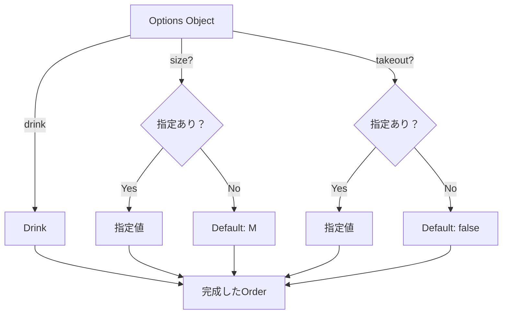

# 第25章：Builder ② TypeScriptの定番：オプションオブジェクト＋デフォルト値🧁

## ねらい🎯

* 「引数が多すぎて読めない😵‍💫」を、**オプションオブジェクト**でスッキリ解決できるようになる🧹✨
* **必須/任意**を型でハッキリ分けて、呼び出しミスを減らす🔒
* **デフォルト値**を安全に入れて、呼び出し側を気持ちよくする☺️💕

---

## この章の結論🍀（まずここだけ覚えればOK）

TypeScriptでは、Builderに行く前にまずこれ👇

* 引数が増えてきたら → **`createX({ ...options })`** にする🎁
* 任意の項目は `?:`（オプショナル）でOK👌
* デフォルト値は **分割代入のデフォルト** or **`??`（nullish）** を使う✨
* “必須なのに `?:` にしちゃう”のが事故の元💥 → **必須は必須に！** 🔥

ちなみに、TypeScriptの最新安定版は 5.9 系が案内されています。([TypeScript][1])
（Node.jsは v24 が Active LTS、v25 が Current として掲載されています。([Node.js][2])）

---

## 1) まず「つらい」例を見よう😵‍💫（引数地獄）

カフェ注文を作る関数が、こうなってきたとします👇

```ts
type Drink = "latte" | "mocha" | "tea";
type Size = "S" | "M" | "L";
type Temp = "hot" | "ice";

type Order = {
  drink: Drink;
  size: Size;
  temp: Temp;
  shots: number;
  takeout: boolean;
  note?: string;
};

export function createOrder_v1(
  drink: Drink,
  size: Size,
  temp: Temp,
  shots: number,
  takeout: boolean,
  note?: string
): Order {
  return { drink, size, temp, shots, takeout, note };
}

// 呼び出し側😵
const o = createOrder_v1("latte", "M", "ice", 1, false, "氷少なめ");
```

### ここが嫌ポイント🙅‍♀️💦

* `"M"` がサイズなのか温度なのか、目が滑る👀💫
* 引数の順番ミスが起きる（でも型だけだと気づきにくいケースもある）💥
* オプションが増えるたびに、呼び出し側が全滅しがち😇

---

## 2) 王道の直し方：オプションオブジェクト🎁✨

**「何を渡してるか」が一目でわかる**のが最強です💪💕


```ts
type CreateOrderOptions = {
  drink: Drink;      // ✅必須
  size?: Size;       // 任意
  temp?: Temp;       // 任意
  shots?: number;    // 任意
  takeout?: boolean; // 任意
  note?: string;     // 任意
};

type Order = {
  drink: Drink;
  size: Size;
  temp: Temp;
  shots: number;
  takeout: boolean;
  note?: string;
};

export function createOrder(options: CreateOrderOptions): Order {
  // デフォルト値をここで適用する（次の節で丁寧にやるよ✨）
  const drink = options.drink;
  const size = options.size ?? "M";
  const temp = options.temp ?? "hot";
  const shots = options.shots ?? 0;
  const takeout = options.takeout ?? false;

  return {
    drink,
    size,
    temp,
    shots,
    takeout,
    note: options.note,
  };
}

// 呼び出し側が読みやすい🥰
const a = createOrder({ drink: "latte" });
const b = createOrder({ drink: "tea", temp: "ice", takeout: true });
const c = createOrder({ drink: "mocha", size: "L", shots: 2, note: "甘さ控えめ" });
```




### うれしいこと🎉

* 引数の順番ミスが消える🧼
* 呼び出しが「説明文」みたいに読める📖✨
* オプションが増えても、既存コードは壊れにくい🛡️

---

## 3) デフォルト値の入れ方💡（`??` が超大事！）

デフォルト値でありがちな罠がこれ👇

* `||` を使うと、`0` や `false` が「未指定扱い」になって事故る💥
* `??` は `null` / `undefined` だけを「未指定扱い」にするので安全✨

✅ だからこう書くのが基本形です👇

```ts
const shots = options.shots ?? 0;     // 0 はちゃんと 0 のまま
const takeout = options.takeout ?? false; // false はちゃんと false のまま
```

---

## 4) “分割代入＋デフォルト”も便利🧁✨（ただし必須に注意）

見た目がスッキリする書き方👇

```ts
export function createOrder2({
  drink,
  size = "M",
  temp = "hot",
  shots = 0,
  takeout = false,
  note,
}: CreateOrderOptions): Order {
  return { drink, size, temp, shots, takeout, note };
}
```

### 注意点⚠️

* これは「プロパティが `undefined` のとき」もデフォルトが効く✅
* ただし、**`{ size: undefined }`** を明示的に入れてくる人がいると、挙動がちょっと読みづらくなることも💭
  → 実務では `??` 方式のほうが「意図が明確」な場面も多いよ✨

---

## 5) 必須項目は“必須”にする🔥（optional乱用しない）

ここ、超大事ポイントです💥

```ts
type BadOptions = {
  drink?: Drink; // ❌ 本当は必須なのに optional にしちゃった
};
```

これをやると…

* `createOrder({})` が型的に通ってしまう😱
* 実行時に「drink がない」事故が起きる💥

✅ だから、必須は必須で！

```ts
type GoodOptions = {
  drink: Drink; // ✅必須！
  size?: Size;
};
```

---

## 6) “オプションが多くなってきた”時の整理術🧺✨（標準ユーティリティ型でOK）

TypeScriptの標準ユーティリティ型を使うと、**型の重複コピペ**が減ってラクになるよ☺️

### (1) `Partial<T>`：途中までの入力を許す（内部用が多い）

```ts
type Patch = Partial<CreateOrderOptions>;

function applyPatch(base: CreateOrderOptions, patch: Patch): CreateOrderOptions {
  return { ...base, ...patch };
}
```

⚠️ ただし `Partial` を“外向きAPI”に出しすぎると
「何でも欠けてOK」になって事故るので要注意だよ🥺💦

---

### (2) `Pick<T, K>` / `Omit<T, K>`：必要な形だけ切り出す✂️

```ts
type DrinkOnly = Pick<CreateOrderOptions, "drink">; // { drink: Drink }
type WithoutNote = Omit<CreateOrderOptions, "note">; // note だけ除外
```

---

## 7) ハンズオン🛠️（この章のメイン！）✨

### お題☕

「引数地獄の `createOrder_v1` を、オプションオブジェクトの `createOrder` に直す！」

---

### Step 1️⃣：旧関数を用意（地獄を体験😵‍💫）

* `createOrder_v1` を作って、呼び出しが読みにくいのを確認👀💦

---

### Step 2️⃣：`CreateOrderOptions` を作る🧩

* 必須：`drink`
* 任意：`size/temp/shots/takeout/note`

---

### Step 3️⃣：デフォルト値を入れる（`??` 推奨）✨

* `size` → `"M"`
* `temp` → `"hot"`
* `shots` → `0`
* `takeout` → `false`

---

### Step 4️⃣：呼び出し側を3パターン書く🧁

1. 最小：`{ drink: "latte" }`
2. 一部指定：`{ drink: "tea", temp: "ice" }`
3. たくさん指定：`{ drink: "mocha", size:"L", shots:2, note:"..." }`

---

## 8) テスト（最小でOK）🧪✨

Vitestで「デフォルトが効く」「指定が優先される」を確認しよう✅
（テストツールとしてVitestが広く使われています、という流れは最近の教材でもよく見かけます。([TypeScript入門『サバイバルTypeScript』][3])）

```ts
import { describe, it, expect } from "vitest";
import { createOrder } from "./createOrder";

describe("createOrder", () => {
  it("デフォルト値が入る", () => {
    const o = createOrder({ drink: "latte" });
    expect(o.size).toBe("M");
    expect(o.temp).toBe("hot");
    expect(o.shots).toBe(0);
    expect(o.takeout).toBe(false);
  });

  it("指定した値が優先される", () => {
    const o = createOrder({ drink: "tea", temp: "ice", shots: 2, takeout: true });
    expect(o.temp).toBe("ice");
    expect(o.shots).toBe(2);
    expect(o.takeout).toBe(true);
  });
});
```

---

## 9) よくあるつまずき回避💡（ここでコケがち！）

### ✅ つまずき1：`||` を使って `0`/`false` が消える😱

* `shots || 0` → shots が 0 のとき 0 が “未指定扱い” になっちゃう💥
* **`??` を使う**✨

### ✅ つまずき2：必須まで `?:` にしてしまう🥺

* まず「この項目、呼び出し時に絶対必要？」を考える🧠
* 必須なら `drink: Drink` みたいに必須で固定🔒

### ✅ つまずき3：オプションが増えて型がごちゃる🌀

* `Pick/Omit/Partial` で「必要な形だけ」作る✂️
* “APIの入口”はできるだけ厳しく、内部は柔らかく（これが事故りにくい）🧡

---

## 10) AIプロンプト例🤖💬（コピペOK✨）

```text
次のTypeScript関数は引数が多くて読みにくいです。
オプションオブジェクト形式に直し、必須/任意を型で表現し、
デフォルト値は `??` を使って安全に適用してください。
さらに「デフォルトが入る」「指定が優先される」を確認する最小テスト（Vitest）も作ってください。

対象コード:
(ここに createOrder_v1 を貼る)
```

---

## まとめ🎀✨

* **Builderに行く前の最強手札**が「オプションオブジェクト＋デフォルト値」🎁
* TypeScriptでは **型で必須/任意を守る**のが超強い🛡️
* デフォルトは **`??` が安定**（`0/false` を壊さない）🌟

次の章（第26章）で「順番がある」「途中状態を隠したい」みたいなケースに行くと、いよいよ Builder が必要になってくるよ〜🧱✨

[1]: https://www.typescriptlang.org/download/?utm_source=chatgpt.com "How to set up TypeScript"
[2]: https://nodejs.org/en/about/previous-releases?utm_source=chatgpt.com "Node.js Releases"
[3]: https://typescriptbook.jp/releasenotes/2026-01-13?utm_source=chatgpt.com "2026-01-13 チュートリアル大幅刷新など"
