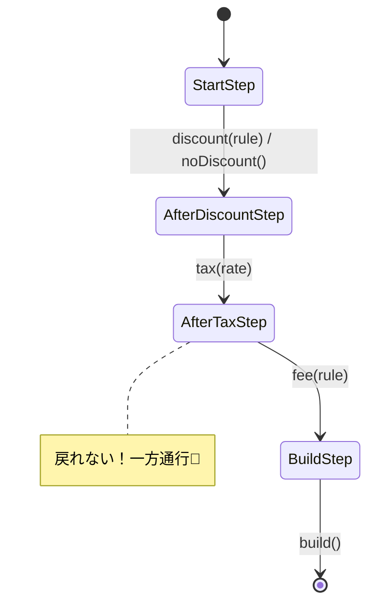

# 第26章：Builder ③ Builderが必要な瞬間：手順が複雑で“順番”がある🧱

## この章のねらい🎯

* 「引数が多い」だけじゃなく、「手順の順番が大事」なときに Builder が効くって説明できるようになるよ😊
* 手順を **“順番どおりにしか呼べない”** 形にして、バグを減らすよ🛡️✨
* TypeScriptらしく **余計な独自クラスを増やさず**、標準的な書き方でやるよ🍰

---

## まず結論：Builderが刺さるのはこんな時💡✨

## Builderが必要になりやすいサイン👀

1. **処理の順番が意味を持つ**（割引→税→送料…みたいに順序で結果が変わる）🔁


2. **途中の状態を外に見せたくない**（中間データを触られると破綻する）🙅‍♀️

3. **「やった/やってない」を管理したい**（税計算を2回やる事故…など）🧯
4. **呼び出し側を読みやすくしたい**（「何をしてるか」が1行ずつ見える）📖✨

## BuilderじゃなくてOKなこともあるよ🙆‍♀️

* **任意引数が多いだけ** → 「オプションオブジェクト＋デフォルト値」で十分なことが多い🧁
* **順番がどうでもいい** → 関数の組み合わせ（パイプライン）でスッキリすることが多い⚙️

---

## ありがちな事故：順番が自由すぎると、バグが混ざる😵‍💫

たとえば「合計金額」を作るとき👇

* 割引は税の前？税の後？
* 持ち帰り手数料はどのタイミング？
* 丸め（端数処理）は最後？途中？

順番をミスると、**金額が数円ズレる** みたいな地味に痛いバグが出るよね…💦

---

## 今日の題材☕🧾（カフェ注文の「金額内訳」を作る）

作りたい最終成果（完成品）👇

* 小計
* 割引額
* 税額
* 送料/持ち帰り手数料
* 合計

---

## Before：順番が自由で事故りやすい例💥

「割引→税→送料」みたいな順番を守ってね！と言っても、呼び出し側が自由だと…こうなる😇

```ts
type Item = { name: string; unitPrice: number; qty: number };
type Order = { items: Item[]; takeout: boolean };

type PriceBreakdown = {
  subtotal: number;
  discount: number;
  tax: number;
  fee: number;
  total: number;
};

function calcSubtotal(order: Order): number {
  return order.items.reduce((sum, it) => sum + it.unitPrice * it.qty, 0);
}

function applyDiscount(subtotal: number, discountRate: number): { discounted: number; discount: number } {
  const discount = Math.floor(subtotal * discountRate);
  return { discounted: subtotal - discount, discount };
}

function applyTax(amount: number, taxRate: number): { taxed: number; tax: number } {
  const tax = Math.floor(amount * taxRate);
  return { taxed: amount + tax, tax };
}

function applyFee(amount: number, takeout: boolean): { withFee: number; fee: number } {
  const fee = takeout ? 10 : 0;
  return { withFee: amount + fee, fee };
}

// 呼び出し側が「順番」を間違えてもコンパイルは通っちゃう😵‍💫
function calcTotalBad(order: Order): PriceBreakdown {
  const subtotal = calcSubtotal(order);

  // 😭 本当は「割引→税」なのに、先に税をかけちゃった！
  const { taxed, tax } = applyTax(subtotal, 0.1);
  const { discounted, discount } = applyDiscount(taxed, 0.1);
  const { withFee, fee } = applyFee(discounted, order.takeout);

  return { subtotal, discount, tax, fee, total: withFee };
}
```

この時点で「お願い！順番守って！」ってレビューで言い続ける未来が見える…👻

---

## After：Builderで“順番どおりにしか進めない”ようにする🧱✨

ここからが本題！
**「次に呼べるメソッド」を型で制限**して、順番ミスをコンパイルで止めるよ🚧✨

---

## 実装：Step Builder（手順固定Builder）🪜🧱

## 1) まずは型（ステップ）を用意する🧩

今回の流れはこれ👇
**開始 → 割引（する/しない） → 税 → 手数料 → build**

```ts
type Item = { name: string; unitPrice: number; qty: number };
type Order = { items: Item[]; takeout: boolean };

type PriceBreakdown = {
  subtotal: number;
  discount: number;
  taxedBase: number;
  tax: number;
  fee: number;
  total: number;
};

type DiscountRule = (subtotal: number) => number;
type FeeRule = (amountAfterTax: number, order: Order) => number;

type StartStep = {
  discount: (rule: DiscountRule) => AfterDiscountStep;
  noDiscount: () => AfterDiscountStep;
};

type AfterDiscountStep = {
  tax: (taxRate: number) => AfterTaxStep;
};

type AfterTaxStep = {
  fee: (rule: FeeRule) => BuildStep;
};

type BuildStep = {
  build: () => PriceBreakdown;
};
```

ポイント💡

* StartStep には **tax** が存在しないよね？
  → つまり「割引ステップを通らないと税に行けない」✅
* AfterTaxStep まで来たら **もう割引には戻れない** ✅



---

## 2) Builder本体（クラスを増やさず関数＋クロージャで）🍰

「余計な独自クラスを増やさない」ために、**関数でBuilderを作る**よ✨
（中の状態はクロージャに隠して、外から触れないようにするのがコツ🫶）

```ts
function calcSubtotal(order: Order): number {
  return order.items.reduce((sum, it) => sum + it.unitPrice * it.qty, 0);
}

export function priceBuilder(order: Order): StartStep {
  const state = {
    order,
    subtotal: calcSubtotal(order),
    discount: 0,
    taxedBase: 0,
    tax: 0,
    fee: 0,
    total: 0,
  };

  const afterDiscount: AfterDiscountStep = {
    tax(taxRate: number): AfterTaxStep {
      state.taxedBase = state.subtotal - state.discount;
      state.tax = Math.floor(state.taxedBase * taxRate);
      const amountAfterTax = state.taxedBase + state.tax;

      const afterTax: AfterTaxStep = {
        fee(rule: FeeRule): BuildStep {
          state.fee = rule(amountAfterTax, state.order);
          state.total = amountAfterTax + state.fee;

          return {
            build(): PriceBreakdown {
              return {
                subtotal: state.subtotal,
                discount: state.discount,
                taxedBase: state.taxedBase,
                tax: state.tax,
                fee: state.fee,
                total: state.total,
              };
            },
          };
        },
      };

      return afterTax;
    },
  };

  const start: StartStep = {
    discount(rule: DiscountRule): AfterDiscountStep {
      state.discount = rule(state.subtotal);
      return afterDiscount;
    },
    noDiscount(): AfterDiscountStep {
      state.discount = 0;
      return afterDiscount;
    },
  };

  return start;
}
```

---

## 3) 使い方：呼び出し側がめっちゃ読みやすい📖✨

```ts
const order: Order = {
  items: [
    { name: "Latte", unitPrice: 420, qty: 1 },
    { name: "Cookie", unitPrice: 180, qty: 2 },
  ],
  takeout: true,
};

const tenPercentOff: DiscountRule = (subtotal) => Math.floor(subtotal * 0.1);

const takeoutFee: FeeRule = (_amountAfterTax, o) => (o.takeout ? 10 : 0);

const breakdown =
  priceBuilder(order)
    .discount(tenPercentOff)   // ✅ ここで割引を確定
    .tax(0.1)                  // ✅ 次は税しか呼べない
    .fee(takeoutFee)           // ✅ 次は手数料
    .build();                  // ✅ 最後に完成！

console.log(breakdown);
```

**ここが気持ちいいポイント😍**

* 上から読むだけで「何をしてるか」がわかる✨
* 順番が崩せないから、バグの入口が減る✨

---

## “順番ミス”はコンパイルで止まる🛑✨

たとえばこれ👇

* いきなり tax を呼ぶ
* tax の後に discount を呼ぶ
  …どっちも「そのメソッドが存在しない型」になるので、呼べないよ🙅‍♀️

---

## ミニテスト🧪（最小でOK！）

「金額系」はテストが超大事だよ〜！💰🧡
代表ケースだけでも守っておくと安心感が段違い✨

```ts
import test from "node:test";
import assert from "node:assert/strict";
import { priceBuilder } from "./priceBuilder";

test("割引→税→手数料の順番で計算できる", () => {
  const order = {
    items: [
      { name: "Latte", unitPrice: 420, qty: 1 },
      { name: "Cookie", unitPrice: 180, qty: 2 },
    ],
    takeout: true,
  };

  const tenPercentOff = (subtotal: number) => Math.floor(subtotal * 0.1);
  const takeoutFee = () => 10;

  const b =
    priceBuilder(order)
      .discount(tenPercentOff)
      .tax(0.1)
      .fee((_amountAfterTax, _order) => takeoutFee())
      .build();

  // 小計 = 420 + 180*2 = 780
  assert.equal(b.subtotal, 780);

  // 割引 = floor(780*0.1)=78 → 課税対象=702
  assert.equal(b.discount, 78);
  assert.equal(b.taxedBase, 702);

  // 税 = floor(702*0.1)=70 → 税込=772
  assert.equal(b.tax, 70);

  // 手数料=10 → 合計=782
  assert.equal(b.fee, 10);
  assert.equal(b.total, 782);
});
```

---

## ハンズオン🛠️（やってみよう！）

## お題A：割引ルールを増やす🎟️✨

* 200円引きクーポン（ただし小計500円以上）
* 会員ランク（goldは15%引き、silverは10%引き、bronzeは5%引き）

ヒント💡：割引は **subtotalを受け取って「割引額」を返す** 形にすると、Builder本体がキレイに保てるよ🧼✨

## お題B：丸めルールを最後に足す🔢

* 最終合計だけ「1円単位に丸め」
* もしくは「10円単位に丸め」

やり方は2つあるよ👇

* fee の中で丸める（手軽）
* fee の次に rounding ステップを追加（よりキレイ）✨

---

## AIに頼るプロンプト例🤖💬

```text
あなたはTypeScriptの先生です。
Step Builder（手順固定Builder）で、次の条件を満たす実装案を出してください。

題材：カフェ注文の金額計算（割引→税→手数料→合計）
条件：
- Builder本体は「構築の責務」だけ（業務判断はルール関数に外出し）
- 余計な独自クラスは増やさない（関数＋型＋クロージャ中心）
- “順番を型で固定”できるようにする（間違った順番はコンパイルで防ぐ）
- 出力：1) 型設計 2) 最小コード 3) 代表テスト 4) つまずきポイント
```

---

## つまずき回避💡（ここでコケやすいよ〜！）

## 1) Builderが“何でも屋”になりがち🤹‍♀️

* ❌ Builderの中に「割引条件の判断（会員か？クーポンか？）」まで入れる
* ✅ Builderは **手順の器**、判断は **ルール関数** に逃がす
  → こうすると責務がスッキリ✨

## 2) 手順が長すぎて逆に読みにくい📜

* ステップが多いなら、ステップを「大きめの意味単位」にまとめるのもアリだよ🙆‍♀️
  （例：割引ステップに「複数割引の合成」を隠す、など）

## 3) 中間状態を外に出してしまう😵

* 中間の state を返しちゃうと、好き勝手にいじられて破綻することがあるよ💥
* 今回みたいに **クロージャで隠す** のが安全🛡️✨

---

## ミニまとめ✅🎉

* Builderが本気で効くのは **「順番が大事」「途中状態を隠したい」** とき🧱✨
* Step Builderにすると、**順番ミスがコンパイルで止まる** から強い🛑
* TypeScriptでは **関数＋型＋クロージャ** で、重たいクラス構成にしなくてもいけるよ🍰

---

## 最新情報メモ🗓️✨

* 2026年2月上旬時点で、TypeScript の安定版は npm 上で 5.9.3 が最新として案内されているよ。([npm][1])
* TypeScript 6.0 は（少なくとも公式の進行表では）2026-02-10 に Beta、2026-03-17 に Final の予定が提示されているよ。([github.com][2])

[1]: https://www.npmjs.com/package/typescript?utm_source=chatgpt.com "typescript"
[2]: https://github.com/microsoft/TypeScript/issues/63085?utm_source=chatgpt.com "TypeScript 6.0 Iteration Plan · Issue #63085"
