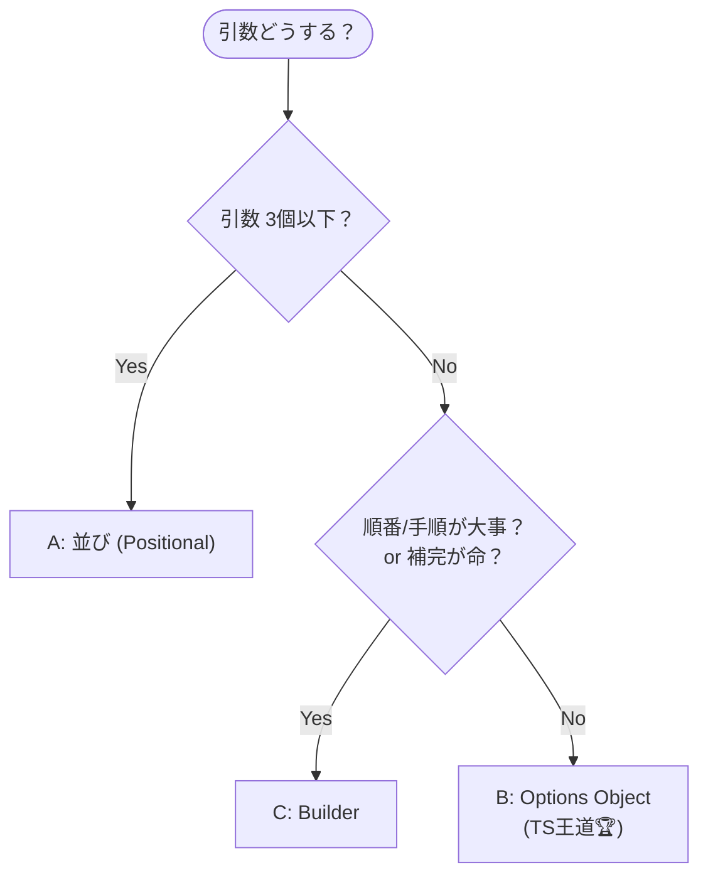

# 第27章：Builder ④ まとめ演習：読みやすさチェック（レビュー観点）👀

## ねらい🎯

この章を終えると、こんな判断ができるようになります😊✨

* 「引数の並び」🧵 / 「オプションオブジェクト」📦 / 「Builder」🧱 を **状況で使い分け**できる
* PRレビューで「読みやすいAPIか？」を **チェックリストで指摘**できる✅
* 3案を **同じ題材で比較**して、チームで“決め”を作れる🫶💡

---

## お題：カフェ注文を “気持ちよく” 作りたい☕🧁

「注文を作る」って、最初は単純でもすぐこうなりがち👇😵‍💫

* 必須が増える（ドリンク/サイズ/温冷…）
* 任意も増える（ミルク/砂糖/トッピング/メモ…）
* さらに増える（テイクアウト、配達、予約時間…）

ここで **呼び出し側が読めない** と、設計が崩れます🫠
だから今日は「呼び出し側（使う側）が気持ちいいか？」を主役にします👑✨

---

## まずは共通の型（ドメイン）を用意しよう🧩




※ この章は“比較”が目的なので、型はシンプルでOKです😊

```ts
// domain.ts
export type Drink = "latte" | "americano" | "tea";
export type Size = "S" | "M" | "L";
export type Temperature = "hot" | "iced";
export type Milk = "none" | "regular" | "soy" | "oat";
export type Topping = "cinnamon" | "whip" | "caramel";

export type Order = {
  id: string;
  drink: Drink;
  size: Size;
  temp: Temperature;

  milk: Milk;
  sugar: number;            // 0〜3想定
  toppings: Topping[];

  takeout: boolean;
  note?: string;
  scheduledAt?: Date;
};

let seq = 0;
export const resetOrderIdForTest = () => { seq = 0; };
export const nextOrderId = () => `o_${++seq}`;
```

---

## 3つの作り方で “同じ注文” を作って比較🆚✨


### A案：引数の並び（positional args）🧵😵‍💫


**最初はラク**。でも、すぐ辛くなりやすい代表です…！

```ts
// createOrder_positional.ts
import { Milk, Order, Temperature, Drink, Size, Topping, nextOrderId } from "./domain";

export function createOrderPositional(
  drink: Drink,
  size: Size,
  temp: Temperature,
  milk: Milk,
  sugar: number,
  toppings: Topping[],
  takeout: boolean,
  note?: string,
  scheduledAt?: Date,
): Order {
  return {
    id: nextOrderId(),
    drink,
    size,
    temp,
    milk,
    sugar,
    toppings,
    takeout,
    note,
    scheduledAt,
  };
}
```

呼び出し側👇（読める？😇）

```ts
createOrderPositional(
  "latte",
  "M",
  "hot",
  "oat",
  1,
  ["cinnamon", "whip"],
  true,
  "急ぎで！",
  new Date("2026-02-04T10:00:00"),
);
```

**つらいポイント**😵‍💫💥

* `"oat"` と `1` と `true` … **何の値？** ってなる
* 引数追加で **呼び出しが全部壊れやすい**
* 並び間違いが **レビューで見落ちやすい**（型が同じだと特に😱）

---

### B案：オプションオブジェクト（TSの王道🥇）📦✨


TypeScriptで「引数が増えたらまずこれ」になりやすい形です😊
**読む人に優しい**のが強い💪

```ts
// createOrder_options.ts
import { Drink, Size, Temperature, Milk, Topping, Order, nextOrderId } from "./domain";

export type CreateOrderOptions = {
  drink: Drink;
  size: Size;
  temp: Temperature;

  milk?: Milk;
  sugar?: number;
  toppings?: readonly Topping[];

  takeout?: boolean;
  note?: string;
  scheduledAt?: Date;
};

export function createOrderOptions(opts: CreateOrderOptions): Order {
  const {
    drink,
    size,
    temp,
    milk = "regular",
    sugar = 0,
    toppings = [],
    takeout = false,
    note,
    scheduledAt,
  } = opts;

  return {
    id: nextOrderId(),
    drink,
    size,
    temp,
    milk,
    sugar,
    toppings: [...toppings],
    takeout,
    note,
    scheduledAt,
  };
}
```

呼び出し側👇（めっちゃ読みやすい〜！🥹✨）

```ts
createOrderOptions({
  drink: "latte",
  size: "M",
  temp: "hot",
  milk: "oat",
  sugar: 1,
  toppings: ["cinnamon", "whip"],
  takeout: true,
  note: "急ぎで！",
  scheduledAt: new Date("2026-02-04T10:00:00"),
});
```

**さらにレビュー向きの小ワザ**（`satisfies`）🪄✨
「余計なキー」「typo」を減らしやすいです😊

```ts
import { CreateOrderOptions, createOrderOptions } from "./createOrder_options";

const opts = {
  drink: "latte",
  size: "M",
  temp: "hot",
  milk: "oat",
  sugar: 1,
  toppings: ["cinnamon", "whip"],
  takeout: true,
} satisfies CreateOrderOptions;

createOrderOptions(opts);
```

**いいところ**😍

* 呼び出しが “文章” になる📖✨
* 任意/必須が見える👀
* 引数追加しても壊れにくい🧱

**注意点**⚠️

* オプションが増えすぎると「何を渡すべき？」で迷子になる🌀
  → その時に Builder を検討！

---

### C案：Builder（呼び出しを “会話” にする）🧱✨


「オプション多すぎ問題」や「順番が大事」に寄せたい時に強いです💪
※ この章は“過剰な独自クラス”を避けたいので、**クラスではなく関数＋オブジェクト**で書きます😊

```ts
// createOrder_builder.ts
import { Drink, Size, Temperature, Milk, Topping, Order, nextOrderId } from "./domain";

export function orderBuilder() {
  const draft: Omit<Order, "id"> = {
    drink: "latte",  // 仮の初期値（必須は後で上書き想定）
    size: "M",
    temp: "hot",
    milk: "regular",
    sugar: 0,
    toppings: [],
    takeout: false,
  };

  return {
    drink(v: Drink) { draft.drink = v; return this; },
    size(v: Size) { draft.size = v; return this; },
    temp(v: Temperature) { draft.temp = v; return this; },

    milk(v: Milk) { draft.milk = v; return this; },
    sugar(v: number) { draft.sugar = v; return this; },
    addTopping(v: Topping) { draft.toppings.push(v); return this; },

    takeout(v: boolean = true) { draft.takeout = v; return this; },
    note(v: string) { draft.note = v; return this; },
    scheduleAt(v: Date) { draft.scheduledAt = v; return this; },

    build(): Order {
      return { id: nextOrderId(), ...draft, toppings: [...draft.toppings] };
    },
  };
}
```

呼び出し側👇（読みやすいし、補完も気持ちいい🫶✨）

```ts
import { orderBuilder } from "./createOrder_builder";

const order = orderBuilder()
  .drink("latte")
  .size("M")
  .temp("hot")
  .milk("oat")
  .sugar(1)
  .addTopping("cinnamon")
  .addTopping("whip")
  .takeout()
  .note("急ぎで！")
  .scheduleAt(new Date("2026-02-04T10:00:00"))
  .build();
```

**いいところ**😍

* 呼び出しが “意図の列” になる🧾✨
* オプションが多くても、補完で迷いにくい🧭
* “段階的に構築”が自然（章26の流れと相性◎）🧱

**注意点**⚠️

* Builder自体のコード量は増える（作る側コスト）💸
* 「必須をセットし忘れる」を型で完全に防ぐには、もう一段工夫がいる（発展）🧠

---

## どれが読みやすい？レビュー観点チェックリスト✅👀


PRレビューでそのまま使える形にします💌✨

### 1) 呼び出し1行で意図が読める？📖

* A案：値だけ並ぶ → “翻訳”が必要😵
* B案：キーが語る → 読める😍
* C案：メソッド名が語る → 読める😍

### 2) 必須/任意が自然に分かる？🔎

* B案：必須は型で強制、任意は `?` で明確✨
* C案：必須を「順番」や「build前に揃える」で表現しやすい🧱

### 3) 変更に強い？（引数追加で壊れない？）🛡️

* A案：壊れやすい💥
* B案：壊れにくい✨
* C案：壊れにくい✨（ただしBuilder側の修正は必要）

### 4) レビューでミスを見つけやすい？🧑‍⚖️

* A案：並びミスを見落としやすい😱
* B/C案：名前が見えるので気づきやすい👀✨

### 5) “補完”で迷子にならない？🧠

* B案：オブジェクト内で候補が出る📦
* C案：チェーンで候補が出る🧱
  （どっちも強い！）

### 6) 差分（diff）が読みやすい？🧾✨

* B案：追加行が綺麗に出る（レビューしやすい）
* C案：チェーンの増減が追える
* A案：差分は出るけど “意味” が見えにくい

---

## 演習①：同じ注文を3案で作って“目で比較”しよう🧁👀

次の注文を、A/B/C で全部書いて並べてください😊✨

* drink: latte
* size: M
* temp: hot
* milk: oat
* sugar: 1
* toppings: cinnamon + whip
* takeout: true
* note: 急ぎで！
* scheduledAt: 2026-02-04 10:00

最後に自分で一言メモ📝✨

* 「どれが一番 “誤読されない”？」
* 「チームで採用するならどれ？」

---

## 演習②：レビューコメント練習📝💬（テンプレ付き）

PRでこう書けると強いです💪✨（そのままコピペOK）

* ✅ **「引数の並びだと意図が読みにくいので、オプションオブジェクトにしたいです」**
  → “どこが読みにくいか” を具体的に（例：`true` が何か分からない）

* ✅ **「オプションが増えてきたので、Builderにすると補完で迷いにくくなりそうです」**
  → “増え方” を根拠にする（今後も増える見込み）

* ✅ **「デフォルト値が分散してるので、作成関数の中で一箇所に寄せたいです」**
  → デフォルトは “仕様” なので散るとバグりやすい😵‍💫

---

## 演習③：3案が同じ結果になるテスト🧪⚡


テストは「呼び出しの読みやすさ」を守る盾です🛡️✨
ここでは **Vitest** を例にします（2025年にVitest 4.0が発表されています）。([Vitest][1])

```ts
// createOrder.test.ts
import { describe, it, expect, beforeEach } from "vitest";
import { resetOrderIdForTest } from "./domain";
import { createOrderPositional } from "./createOrder_positional";
import { createOrderOptions } from "./createOrder_options";
import { orderBuilder } from "./createOrder_builder";

beforeEach(() => resetOrderIdForTest());

describe("create order variations", () => {
  it("A/B/C produce same Order shape (except id sequence is deterministic here)", () => {
    const a = createOrderPositional(
      "latte",
      "M",
      "hot",
      "oat",
      1,
      ["cinnamon", "whip"],
      true,
      "急ぎで！",
      new Date("2026-02-04T10:00:00"),
    );

    resetOrderIdForTest();

    const b = createOrderOptions({
      drink: "latte",
      size: "M",
      temp: "hot",
      milk: "oat",
      sugar: 1,
      toppings: ["cinnamon", "whip"],
      takeout: true,
      note: "急ぎで！",
      scheduledAt: new Date("2026-02-04T10:00:00"),
    });

    resetOrderIdForTest();

    const c = orderBuilder()
      .drink("latte")
      .size("M")
      .temp("hot")
      .milk("oat")
      .sugar(1)
      .addTopping("cinnamon")
      .addTopping("whip")
      .takeout()
      .note("急ぎで！")
      .scheduleAt(new Date("2026-02-04T10:00:00"))
      .build();

    expect(a).toEqual(b);
    expect(b).toEqual(c);
  });
});
```

---

## AIプロンプト例🤖💬（レビュー目線を鍛える用）

### 1) 「読みやすさレビュー」をAIにやってもらう👀✨

```text
次の3つのAPI（引数並び / オプションオブジェクト / Builder）を比較して、
「呼び出し側の可読性」「誤用しにくさ」「変更に強いか」の観点でレビューしてください。
- それぞれの欠点を、具体的に“どんなバグ/誤読が起きるか”まで書く
- 改善案は「TypeScript標準の型・構文」を中心に（余計な独自クラスを増やさない）
題材: カフェ注文 createOrder
コード: <ここに貼る>
```

### 2) 「チームの決め」を作る🫶📌

```text
このプロジェクトでは createXxx 系の関数が増えます。
引数が増えた時のルール（例: 3個までならpositional、それ以上はoptions、順序依存や大量オプションならbuilder…）を、
初心者にも守れる形で提案してください。レビューで使えるチェックリストも付けてください。
```

### 3) Builderが過剰か判断する🧠⚖️

```text
このBuilderは過剰設計か評価してください。
- オプションオブジェクトで十分な場合の条件
- Builderが妥当になる条件（順序・段階的構築・補完の価値など）
- それぞれの「保守コスト」を具体例で説明
コード: <ここに貼る>
```

---

## よくあるつまずき＆回避💡😇

* **「positionalのまま粘って地獄」**😵‍💫
  → 引数が増えたら、まず **B案（オプション）**に逃げてOK📦✨

* **「オプションが増えすぎて、何を渡せばいいか分からない」**🌀
  → その時が **C案（Builder）検討タイミング**🧱✨（補完の価値が出る）

* **「デフォルトがあちこちに散る」**🧨
  → デフォルトは “仕様”！ **作成関数の中に寄せる**のが安定😊✅

---

## まとめ✅🎉

* **少ない引数**ならA案もアリ🧵🙂
* **増えたら基本はB案（オプション）**が王道🥇📦
* **オプションが多い/段階的に組み立てたい/補完で迷子を減らしたい**ならC案（Builder）🧱✨

そして一番大事なのはこれ👇💖
**「短い」より「誤読されない」** を選ぶこと😊👀✨

---

### ちょいメモ（2026年初頭の周辺事情）🗒️✨

* TypeScript は 5.9.3 が “Latest” として公開されています。([GitHub][2])
* TypeScript 5.8 では `--module node18` が安定フラグとして触れられています。([TypeScript][3])
* Node.js は v24 系が LTS として更新されています。([Node.js][4])

[1]: https://vitest.dev/blog/vitest-4?utm_source=chatgpt.com "Vitest 4.0 is out!"
[2]: https://github.com/microsoft/typescript/releases "Releases · microsoft/TypeScript · GitHub"
[3]: https://www.typescriptlang.org/docs/handbook/release-notes/typescript-5-8.html?utm_source=chatgpt.com "Documentation - TypeScript 5.8"
[4]: https://nodejs.org/en/blog/release/v24.13.0?utm_source=chatgpt.com "Node.js 24.13.0 (LTS)"
