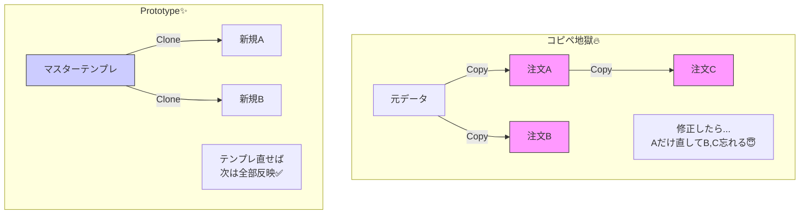

# 第28章：Prototype ① 困りごと編：テンプレから複製したい📄➡️📄

## ねらい🎯

* 「コピペで量産してる注文データ」が、なぜつらいのか説明できるようになる😵‍💫
* 「原型（テンプレ）を複製して、ちょい編集する」発想（Prototype）をつかむ📌
* “浅いコピー事故”が起きる理由を、イメージで理解する🧨

---

## 1. あるあるストーリー☕✨「いつものセットを一瞬で作りたい！」

カフェ注文ミニアプリで、こんな機能が欲しくなるよね👇🥰

* 「いつもの注文」をテンプレとして保存したい📌
* 「おすすめセット（朝セット/甘党セット）」を用意しておいて、そこから新規注文を作りたい🌟
* 作った注文を“ちょっとだけ”変えたい（サイズだけ変える、トッピングだけ足す…）🧁

でも、これを**コピペ**でやり始めると…だんだん壊れていく😇

---

## 2. コピペ運用が壊れる理由💥（地味に効くやつ）


## コピペ地獄の症状リスト😵‍💫

* 似たオブジェクトの作成コードが、あちこちに増える📄📄📄
* ちょい変更したはずが、どこかの値が古いまま残る（値の更新漏れ）🫠
* 「このセット、どれが正解？」ってテンプレの正本がわからなくなる🌀
* 仕様変更（税率、表示名、商品ID…）が来たとき、**全部探して直す**羽目になる🔍💦
* “ついで修正”で内容がズレて、バグが混ざる（しかも気づきにくい）😱



---

## 3. Prototypeって、超ざっくり何？🧬✨


Prototypeのコアはこれだけ👇

> **「原型（テンプレ）を用意して、複製してから、差分だけ変える」**📄➡️📄✏️


ポイントは **“ゼロから作らない”** こと😌
毎回 `new` やオブジェクトリテラルを頑張るんじゃなくて、**ベースをコピーして使う**やり方だよ🧁

---

## 4. どんな時にPrototypeが向く？向かない？🤔

## 向くとき👍✨

* 「だいたい同じ形」を大量に作る（テンプレ機能、複製ボタン）📄📄
* 初期値のセットが複雑で、毎回書くのがだるい😵
* “おすすめセット”みたいに、**基準があって差分だけ違う**ものが多い🧁
* 「作ったあとに少し編集」するのが前提✏️

## 向かないとき👋💦

* そもそもテンプレが不要（毎回まったく違う）🌀
* 複製じゃなくて「生成ルール」を差し替えたい（Factory/Strategy寄り）⚙️
* 「手順の順番」が重要で、途中状態を作りたい（Builder寄り）🧱

---

## 5. まずは“つらい例”を作ろう😇（コピペでおすすめセット量産）

例として、注文データがこんな形だとするね👇

```ts
type Money = number;

type OrderItem = {
  sku: string;
  name: string;
  unitPrice: Money;
  qty: number;
  options?: {
    size?: "S" | "M" | "L";
    ice?: "hot" | "ice";
    syrup?: "none" | "vanilla" | "caramel";
  };
};

type Order = {
  id: string;
  items: OrderItem[];
  note?: string;
};
```

## コピペで「おすすめセット」3つ作ると…🫠

```ts
const sweetSetOrder: Order = {
  id: "tmp",
  items: [
    { sku: "latte", name: "カフェラテ", unitPrice: 480, qty: 1, options: { size: "M", ice: "hot" } },
    { sku: "cake", name: "チーズケーキ", unitPrice: 520, qty: 1 },
  ],
  note: "甘党セット🍰",
};

const morningSetOrder: Order = {
  id: "tmp",
  items: [
    { sku: "coffee", name: "コーヒー", unitPrice: 380, qty: 1, options: { size: "M", ice: "hot" } },
    { sku: "toast", name: "バタートースト", unitPrice: 320, qty: 1 },
  ],
  note: "朝セット🌞",
};

// …さらに増えると、あちこちに類似データが散らかる📄💦
```

この段階でもう、未来が見えるよね…😇
「サイズLにしたい」「シロップ追加したい」って要望が来たら、コピー元も含めてどれをどう変えるの？ってなる🌀

---

## 6. Prototypeの解決イメージ🌟「テンプレを持って、複製して、差分だけ変更」

やりたいのは、こう👇

1. **テンプレ（原型）を保存する**📌
2. 新規注文は **テンプレを複製** して作る📄➡️📄
3. 変更は **差分だけ** 入れる✏️

テンプレが“正本”になると、仕様変更もラクになるよ💪✨

---

## 7. でも！ここで最大の落とし穴⚠️「浅いコピー事故」🧨


「複製」と聞くと、ついスプレッドでこう書きたくなる👇

```ts
const cloned = { ...template };
```

でもこれ、**浅いコピー**になりやすいんだよね😵‍💫
スプレッド1回は「浅いコピー」だよ〜って、MDNにも明記されてるよ。([MDN Web Docs][1])
浅いコピーは「トップレベルだけコピーして、ネストは参照が共有される」ってやつ。([MDN Web Docs][2])

## 事故の例💥「複製したつもりが、テンプレが壊れる」


```ts
const template: Order = {
  id: "template",
  items: [{ sku: "latte", name: "カフェラテ", unitPrice: 480, qty: 1 }],
};

const cloned = { ...template };     // 👈 浅いコピー
cloned.items.push({ sku: "cake", name: "ケーキ", unitPrice: 520, qty: 1 });

console.log(template.items.length); // えっ…増えてる！？😱
```

`items` が配列（ネスト）だから、**同じ配列を共有しちゃう**のが原因だよ🫠

---

## 8. じゃあどうするの？（この章の結論）✅✨

第28章の時点では、まずこの判断ができればOK🙆‍♀️💕

## ✅ Prototypeが必要になる合図📣

* 「テンプレから複製して、少しだけ変えたい」が頻発している📄➡️📄✏️
* コピペが増えて、修正漏れ・不整合が出てきた😵‍💫
* “複製元（正本）”を1つに集約したい📌

## ✅ 複製でいちばん大事な注意点⚠️

* **ネストがあるなら “深いコピー（deep clone）” が必要**になりがち
* スプレッドや `Object.assign` は浅いコピーのことが多い（ネスト注意）([MDN Web Docs][1])

---

## 9. 2026的な「深いコピー」の本命チラ見せ👀✨（次章の主役）


いまのJavaScriptには **`structuredClone()`** という標準の“深いコピー”があるよ🧬
これは「structured clone algorithm」でオブジェクトを深く複製する仕組みで、MDNでも説明されてるよ。([MDN Web Docs][3])
仕様の入口としては WHATWG のHTML標準にも `structuredClone(value[, options])` が載ってるよ。([html.spec.whatwg.org][4])

さらに、サーバー側でも `structuredClone` がグローバルとして案内されてる（Nodeのグローバル一覧に載ってる）よ。([Node.js][5])

> つまり、2026の「まず候補」は `structuredClone()` になりやすい✨
> （ただし **関数** など“複製できないもの”もあるから、テンプレは基本“データ（JSONっぽい形）”に寄せるのがコツだよ☺️）

---

## 10. ミニ・ハンズオン🛠️「テンプレから注文を作る」発想を体に入れる💕


この章は“困りごと編”だから、実装は最小でOK👌
（深いコピーの具体技は次章でガッツリやるよ🧁）

## Step 1️⃣ テンプレを用意する📌

```ts
type OrderTemplate = Omit<Order, "id">;

const templates: Record<string, OrderTemplate> = {
  sweetSet: {
    items: [
      { sku: "latte", name: "カフェラテ", unitPrice: 480, qty: 1, options: { size: "M", ice: "hot" } },
      { sku: "cake", name: "チーズケーキ", unitPrice: 520, qty: 1 },
    ],
    note: "甘党セット🍰",
  },
};
```

## Step 2️⃣ 「複製してIDをつける」流れを作る📄➡️📄

ここは “こういう形にしたい” が伝わればOK✨（深いコピーは次章で完成させよう）

```ts
function newId(): string {
  return crypto.randomUUID();
}

// ※ deep clone の本命は次章で！ここではイメージ重視
function createOrderFromTemplate(t: OrderTemplate): Order {
  const cloned = structuredClone(t); // 👈 2026の本命（次章で詳解）
  return { id: newId(), ...cloned };
}

const order = createOrderFromTemplate(templates.sweetSet);
order.items[0].options = { ...order.items[0].options, size: "L" }; // 差分だけ変更✏️
```

---

## 11. テスト観点（超だいじ）✅🧪

Prototype系の機能で、最低これだけ押さえると安心🥰

* ✅ 複製した注文を編集しても、テンプレが変わらない
* ✅ 複製同士も影響しない（Aを編集してBが変わらない）
* ✅ ネスト（配列/オブジェクト）を編集しても、元が無傷
* ✅ テンプレの内容が増えても、複製処理は壊れにくい
* ✅ “差分変更”が読みやすい（呼び出し側が気持ちいい）✨

---

## 12. AIプロンプト例🤖💬（困りごと整理に効く！）

```text
次の状況をPrototype（テンプレ複製）で整理したいです。
- テンプレ注文（おすすめセット）から新規注文を作る
- 複製後に、サイズ変更やトッピング追加など差分編集をしたい
- コピペ増殖をやめたい
質問：
1) コピペ地獄になる典型的な症状を、この題材で列挙して
2) Prototypeの考え方でどう整理するか、テンプレ/複製/差分の責務を分けて説明して
3) 浅いコピー事故の例を1つ示して、なぜ起きるか説明して
4) 深いコピーの選択肢のうち、標準API中心で現実的な方針を提案して
```

---

## 13. つまずき回避💡（ここでコケやすい😵‍💫）

* 「コピーしたつもり」でテンプレが壊れる → だいたい浅いコピー事故🧨
* テンプレに関数やクラスインスタンスを混ぜる → 複製が難しくなる（まずデータ寄りに）🧊
* “テンプレも編集OK”にしちゃう → いつの間にか正本が汚れてカオス🌀
* 最初から完璧な汎用テンプレ機構を作る → 学習が重くなるので、まず1〜2個のテンプレで十分🌱

---

次の章では、この章で出てきた **浅いコピー/深いコピー** を、`structuredClone`・スプレッド・`Object.assign` の違いでスッキリ整理していくよ🧬✨

[1]: https://developer.mozilla.org/en-US/docs/Web/JavaScript/Reference/Operators/Spread_syntax?utm_source=chatgpt.com "Spread syntax (...) - JavaScript - MDN Web Docs - Mozilla"
[2]: https://developer.mozilla.org/en-US/docs/Glossary/Shallow_copy?utm_source=chatgpt.com "Shallow copy - Glossary - MDN Web Docs"
[3]: https://developer.mozilla.org/en-US/docs/Web/API/Web_Workers_API/Structured_clone_algorithm?utm_source=chatgpt.com "The structured clone algorithm - Web APIs | MDN"
[4]: https://html.spec.whatwg.org/?utm_source=chatgpt.com "HTML Standard - WhatWG"
[5]: https://nodejs.org/api/globals.html "Global objects | Node.js v25.6.0 Documentation"
