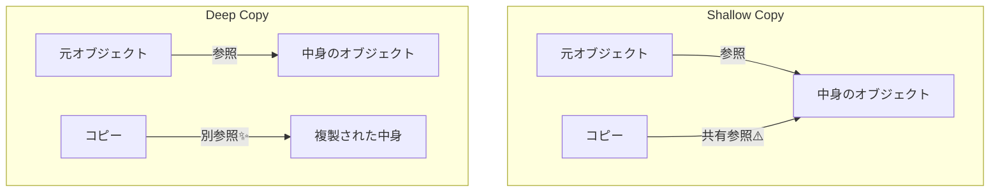

# 第29章：Prototype ② TypeScript標準でやる：スプレッド/structuredClone/assign🧬

## ねらい🎯

* 「テンプレ（原型）から複製して、ちょっと変えて使う」を **TypeScriptの標準機能だけ** で安全にできるようになる💪✨
* **浅いコピー / 深いコピー** の違いで事故らなくなる🚑💥
* 「このケースはスプレッドでOK」「ここはstructuredCloneが安心」って判断できるようになる🧠🔍

---

## 1) まず超重要：浅いコピーと深いコピー🫧🧊

## 浅いコピー（Shallow copy）🫧



* **外側だけ** 新しくなる
* 中に入ってる **オブジェクトや配列は同じ参照** を共有しがち
* だから「複製したつもりが、元も一緒に変わる😱」が起きる

スプレッド（`{ ...obj }`, `[...arr]`）は **基本“浅いコピー”** だよ〜！🫧 ([GitHub][1])

## 深いコピー（Deep copy）🧊

* ネストした中身まで **全部まるごと別物** にできる
* 「複製して編集」みたいなUI（テンプレ機能）で事故りにくい✨


---

## 2) 今日の主役：3つの複製テク🧰✨

## A. スプレッド `...` 🥐

* 速い・短い・読みやすい
* でも **浅いコピー** なのでネストがあると注意⚠️ ([GitHub][1])

**向いてる場面** ✅

* フラットな設定オブジェクト
* 配列の1段コピー（`items: [...items]`）
* 「元を壊さない更新」をしたいとき（immutable更新の入口）🧊✨

---

## B. `Object.assign` 🧷

* これもよくある **浅いコピー** の道具
* 「複数オブジェクトのマージ（上書き）」が得意🧩
* ただし、`Object.assign` は **setterを呼ぶことがある** ので、そこがスプレッドと違うポイントだよ⚠️ ([GitHub][1])
  （普通のデータだけなら、そこまで怖がらなくてOK👌）

---

## C. `structuredClone` 🧬✨（深いコピーの本命）

* ネストしてても **まるごと深く複製** できる
* **循環参照（AがBを持っててBがAを持つ…）** みたいなややこしいのも扱えることが多い💪
* ただし **コピーできないもの** もある（あとで説明するね）🚫

`structuredClone` は “structured clone algorithm” に基づく複製で、主要環境で広く使えるようになってるよ✨ ([Stack Overflow][2])
Node.js でも `structuredClone` がグローバル関数として用意されてる（追加は v17.0.0）よ📦 ([Node.js][3])

---

## 3) カフェ題材：テンプレ注文を「複製して編集」したい☕🧾➡️🧾

ここからは “テンプレ（原型）を複製して少しだけ変える” Prototypeっぽい流れを、標準機能だけでやってみよ〜！🧬💕

## データ型（ネストあり）📦

```ts
type Product = {
  id: string;
  name: string;
  price: number;
  tags: string[];
};

type LineItem = {
  product: Product;
  qty: number;
  note?: string;
};

type Coupon = {
  code: string;
  percent: number;
};

type Order = {
  id: string;
  items: LineItem[];
  coupon?: Coupon;
  createdAt: Date;
};
```

---

## 4) 事故る例：浅いコピーで「元も一緒に変わる」😱💥

## ❌ スプレッドだけで複製したつもり

```ts
const base: Order = {
  id: "TEMPLATE-001",
  items: [
    { product: { id: "coffee", name: "Coffee", price: 400, tags: ["hot"] }, qty: 1 }
  ],
  coupon: { code: "WELCOME", percent: 10 },
  createdAt: new Date("2026-02-01"),
};

// 浅いコピー（外側だけ）
const cloned = { ...base };

// “複製した方”を編集したつもり…
cloned.items[0].product.name = "Cafe Latte";

console.log(base.items[0].product.name); // 😱 "Cafe Latte"（元も変わった！）
```

スプレッドでオブジェクトをコピーしても **浅いコピー** だから、ネストがあるとこうなるよ〜🫧⚠️ ([GitHub][1])

---

## 5) まず現実的：1段ずつ“必要な所だけ”深くする🪄✨

「深いコピーが必要なのは `items` と、その中の `product` だけ！」みたいなときは、**必要な階層だけ** 追加でコピーするとスッキリするよ😊

## ✅ “必要なところだけ”深くする（読みやすくて強い）

```ts
function cloneOrderForEdit(base: Order): Order {
  return {
    ...base,
    items: base.items.map((it) => ({
      ...it,
      product: {
        ...it.product,
        tags: [...it.product.tags],
      },
    })),
    coupon: base.coupon ? { ...base.coupon } : undefined,
    createdAt: new Date(base.createdAt), // Dateは別インスタンスにしたいならこう
  };
}
```

**ポイント**💡

* `map` で配列要素を“それぞれコピー”してるのが大事✨
* `tags` みたいな配列も、必要なら `[...tags]` で別物に🫶
* 「全部deepにする」より、**壊れやすい所だけ深く** がコスパ良いこと多いよ〜💕

---

## 6) まるごと深く：`structuredClone` で一撃🧬✨

ネストが深い・構造が増えそう・テンプレを安心して編集したい
そんなときは `structuredClone` が強いよ💪✨ ([MDN Web Docs][4])

## ✅ deep copy（ほぼ一発）

```ts
function deepCloneOrder(base: Order): Order {
  return structuredClone(base);
}
```

---

## 7) でも注意：`structuredClone` にも「コピーできないもの」がある🚫😵

structured clone algorithm には、できること・できないことがあるよ〜！
たとえば **関数** とかはダメで、失敗すると例外になることがある（典型は `DataCloneError`）⚠️ ([MDN Web Docs][4])

## ❌ ダメな例（関数入り）

```ts
const bad = {
  x: 1,
  fn: () => 123, // 🚫 関数
};

try {
  structuredClone(bad);
} catch (e) {
  console.log("clone failed:", e);
}
```

## ✅ どうするの？

* 「データ」だけを複製対象にする（関数は外に出す）🧠✨
* “テンプレ” は **プレーンなデータ構造** に寄せるのが超おすすめだよ😊

---

## 8) ミニ演習：テンプレ注文→複製→ちょい編集🍰🧾

## お題🎀

1. テンプレ `base` を複製して `orderA` を作る
2. `orderA` の **最初の商品の名前** と **数量** を変える
3. 元の `base` が変わってないことを確認する✅

## ヒント💡

* まずは `cloneOrderForEdit`（必要な所だけ深く）でやってみよ🪄
* できたら `structuredClone` 版もやって、短さの気持ちよさを味わってね🧬✨

---

## 9) テストで「元が変わらない」を守る✅🧪

“テンプレ複製”は **元が変わった瞬間に地獄** だから、ここはテストで守るのが安心だよ〜🥹🧡

```ts
import { describe, it, expect } from "vitest";

describe("Prototype clone", () => {
  it("浅いコピーだと元も変わる（事故確認）", () => {
    const base: Order = {
      id: "TEMPLATE",
      items: [{ product: { id: "coffee", name: "Coffee", price: 400, tags: ["hot"] }, qty: 1 }],
      createdAt: new Date("2026-02-01"),
    };

    const cloned = { ...base };
    cloned.items[0].product.name = "Latte";

    expect(base.items[0].product.name).toBe("Latte"); // 😱 事故
  });

  it("必要な所だけ深くすると元が守られる", () => {
    const base: Order = {
      id: "TEMPLATE",
      items: [{ product: { id: "coffee", name: "Coffee", price: 400, tags: ["hot"] }, qty: 1 }],
      createdAt: new Date("2026-02-01"),
    };

    const cloned = cloneOrderForEdit(base);
    cloned.items[0].product.name = "Latte";

    expect(base.items[0].product.name).toBe("Coffee"); // ✅ 守れた
  });

  it("structuredCloneでも元が守られる（関数などが無い前提）", () => {
    const base: Order = {
      id: "TEMPLATE",
      items: [{ product: { id: "coffee", name: "Coffee", price: 400, tags: ["hot"] }, qty: 1 }],
      createdAt: new Date("2026-02-01"),
    };

    const cloned = structuredClone(base);
    cloned.items[0].product.name = "Latte";

    expect(base.items[0].product.name).toBe("Coffee"); // ✅
  });
});
```

---

## 10) 使い分けチートシート📝✨

* **フラット（ネストなし）** → `...` or `Object.assign` 🥐🧷
* **1〜2段くらいのネスト** → “必要な所だけ” `map + ...` 🪄
* **深いネスト / 将来増える / 安心したい** → `structuredClone` 🧬✨ ([MDN Web Docs][4])
* **関数・DOM要素・特殊オブジェクトが混ざる** → まず“データだけ”に分離してから考える🚫🧠 ([MDN Web Docs][4])

---

## 11) AIプロンプト例🤖💬（コピペOK）

```text
次のTypeScriptコードは「テンプレを複製して編集」したいです。
- どこが浅いコピーで事故るか指摘して
- スプレッド/Object.assign/structuredClone のどれが適切か判断して
- 可能なら「必要な所だけ深くコピーする」実装案も出して
- 最後に、元テンプレが変わらないことを確認するテスト（vitest想定）も3本ください

コード：
<ここに貼る>
```

---

## 12) つまずき回避💡あるある救急箱🚑✨

* 「スプレッドしたのに元が変わる」
  → それ、ネストが共有されてるやつ🫧⚠️ ([GitHub][1])
* 「structuredCloneしたら落ちた」
  → 関数など “クローン対象外” が混ざってないかチェック🚫 ([MDN Web Docs][4])
* 「Object.assignでOK？」
  → “浅いコピー”でいいならOK👌 でも setter があると挙動が変わることは覚えとくと安心🧷⚠️ ([GitHub][1])

---

## まとめ🎉

Prototypeの「テンプレから複製して少し変える」は、**コピーの深さ** が命だよ🧬✨
スプレッド/assignでいけるのか、structuredCloneが必要かを見極められると、テンプレ機能が一気に安定するよ〜☕🧡

[1]: https://github.com/mochajs/mocha/issues/4897 " Bug: structuredClone is not defined in Node <17 · Issue #4897 · mochajs/mocha · GitHub"
[2]: https://stackoverflow.com/questions/70661021/structuredclone-not-available-in-typescript "javascript - structuredClone() not available in TypeScript - Stack Overflow"
[3]: https://nodejs.org/api/globals.html "Global objects | Node.js v25.6.0 Documentation"
[4]: https://developer.mozilla.org/en-US/docs/Web/API/Web_Workers_API/Structured_clone_algorithm "The structured clone algorithm - Web APIs | MDN"
