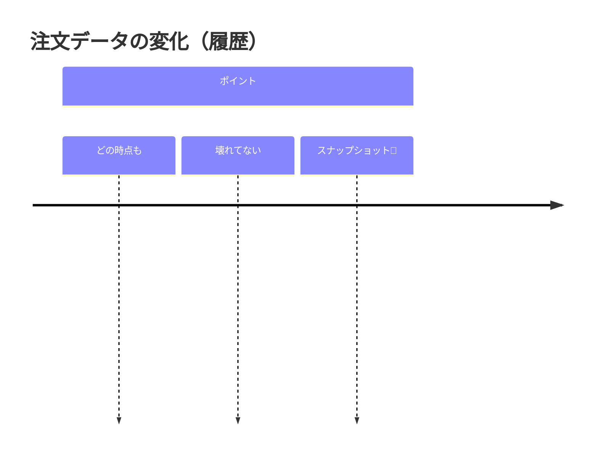

# 第30章：Prototype ③ “不変”と相性が良い：変更はコピーで表現🧊

## ねらい🎯

* 「オブジェクトを直接書き換える」じゃなくて、「コピーして新しい状態を作る」感覚をつかむ✨
* Prototype（複製して少し変える）を、**不変（immutable）な更新**として自然に使えるようになる🧁
* Undo/Redo（履歴）にもつながる“状態の扱い方”を体に入れる📸↩️

---

## まず困りごと😵：「どこで書き換わった!?」が起きる

たとえば「テンプレ注文を複製して編集する」機能を作るとき、うっかり元（テンプレ）を壊しがち…🥲

### ❌ よくある事故（破壊的変更）💥

* `push()` や 代入で、元の配列やオブジェクトをそのまま変更しちゃう
* 画面を行ったり来たりすると、**過去の状態が勝手に変わってる**（Undoが壊れる）😱

**ポイント**
「状態（注文データ）」は、**なるべく書き換えない**ほうが追いやすいよ🔎✨

---

## Prototype × 不変更新の相性が良い理由🫶

Prototypeの発想はこう👇

* “ベース（原型）”がある📄
* それを複製して📄➡️📄
* 差分だけ変更する✍️

不変更新はこう👇

* 元データは触らない🧊
* 新しいデータを作る（コピー）🧬
* 「いつ」「何が」変わったかが追いやすい🧭

つまり… **「複製して編集」＝不変更新そのもの**なんだよね🌸




---

## 今日の主役：TypeScriptの“普通の道具”だけでやる🧰✨

* オブジェクト：スプレッド `{ ...obj, changed: value }`
* 配列：`map / filter / concat / [...arr]`
* 深い複製が必要なとき：`structuredClone()`（標準API）🧬

  * `structuredClone` は「structured clone algorithm」を使う標準の複製方法だよ📦([MDN Web Docs][1])
  * Node.js でも `structuredClone` はグローバルで使えて、Node v17.0.0 から追加されてるよ🟩([Node.js][2])

> `structuredClone()` は便利だけど万能じゃない（後で注意点やるよ⚠️）
> まずは「変更したいところだけ浅くコピー」がおすすめ😊

---

## 題材：カフェ注文を“不変”で育てる☕🧾✨

### データ型（なるべくプレーンなデータ）🍡

* 「クラスのインスタンス」より「プレーンなオブジェクト」が扱いやすいよ🧁
* 不変っぽくするために `readonly` を付ける（型で守る）🛡️

```ts
export type Money = number;

export type OrderItem = Readonly<{
  productId: string;
  name: string;
  unitPrice: Money;
  qty: number;
}>;

export type Customer = Readonly<{
  name: string;
  phone?: string;
}>;

export type Order = Readonly<{
  id: string;
  customer: Customer;
  items: ReadonlyArray<OrderItem>;
  note?: string;
  createdAtISO: string; // 例: "2026-02-04T12:34:56.000Z"
}>;
```

---

## 基本レシピ①：1か所だけ変える（スプレッド）🧁✨

「メモ（note）だけ変えたい」みたいな単純な変更はこれでOK🙆‍♀️

```ts
export function setNote(order: Order, note: string): Order {
  return { ...order, note };
}
```

✅ **元の `order` は触らない**
✅ 新しい `Order` が返る
✅ テストもしやすい🧪✨

---

## 基本レシピ②：配列を変える（push禁止で map/concat）🚫➕➡️✅

「商品を追加したい」なら、`items` を新しい配列で作るよ🍰

```ts
export function addItem(order: Order, item: OrderItem): Order {
  return {
    ...order,
    items: [...order.items, item],
  };
}
```

---

## 基本レシピ③：配列の一部だけ更新（mapで差し替え）🔁✨

「数量を変えたい」みたいな“部分更新”は `map` が定番だよ🎀

```ts
export function changeQty(order: Order, productId: string, qty: number): Order {
  const nextItems = order.items.map((it) =>
    it.productId === productId ? { ...it, qty } : it
  );

  return { ...order, items: nextItems };
}
```

💡ここが気持ちいいポイント

* 変更する要素だけ `{ ...it, qty }` でコピー
* それ以外はそのまま（参照もそのまま）＝**必要な分だけコピー**🧠✨

---

## ここが“Prototypeっぽい”瞬間📄➡️📄✨（テンプレから作る）

テンプレ（原型）を「読み取り専用のベース」として扱うと事故が減るよ🧊

```ts
export const TEMPLATE_ORDER: Order = {
  id: "TEMPLATE",
  customer: { name: "ゲスト" },
  items: [],
  note: "",
  createdAtISO: "2026-02-04T00:00:00.000Z",
};

export function newOrderFromTemplate(template: Order, newId: string, nowISO: string): Order {
  // まずは “必要な差分だけ” 上書きするのが軽い✨
  return {
    ...template,
    id: newId,
    createdAtISO: nowISO,
    // items はテンプレが空でも、念のため新配列にしておくと安心💡
    items: [...template.items],
  };
}
```

---

## どうしても「深い複製」が欲しいとき：structuredClone🧬

ネストが深くて「どこか共有が残るの怖い…😣」ってときだけ、`structuredClone()` を使うのはアリ✅

```ts
export function cloneDeepOrder(order: Order): Order {
  return structuredClone(order);
}
```

### structuredClone の注意点⚠️（大事！）

* **関数は複製できない**（`DataCloneError`）🚫([MDN Web Docs][1])
* **DOMノードも不可**🚫([MDN Web Docs][1])
* **プロパティ記述子（readonly設定など）は保たれない**ことがあるよ🧯([MDN Web Docs][1])
* “プレーンなオブジェクト中心”なら扱いやすい🍡([MDN Web Docs][1])

つまり…
✅ データを「プレーン」に寄せておくと勝ち🏆✨

---

## ハンズオン🛠️：updateOrder(base, patch) を作る（でも無理しない）🌸

「差分だけ当てる」更新関数を作ってみよ〜😊

### 1) “トップレベルだけ”のpatchを許す（シンプル優先）🧁

ネストまで深追いして“自作DeepMerge”を作るのは沼りやすいので、ここではやらないよ🙅‍♀️
（ネスト更新は `changeQty` みたいな専用関数でやるのが安全✨）

```ts
export type OrderPatch = Readonly<{
  customer?: Partial<Customer>;
  note?: string;
}>;

export function updateOrder(base: Order, patch: OrderPatch): Order {
  return {
    ...base,
    ...(patch.note !== undefined ? { note: patch.note } : {}),
    ...(patch.customer ? { customer: { ...base.customer, ...patch.customer } } : {}),
  };
}
```

✅ “変更したところだけ”コピーされる
✅ ネスト（customer）も、パス上だけコピーされる🧬✨

### 2) 使ってみる🎀

```ts
const o1 = newOrderFromTemplate(TEMPLATE_ORDER, "o-001", new Date().toISOString());

const o2 = updateOrder(o1, { note: "氷少なめ🧊" });

const o3 = updateOrder(o2, { customer: { name: "こみやんま" } });
```

---

## テストで「元が変わってない」を証明しよ🧪✅

ポイントは2つだよ👇

* ✅ 更新後のオブジェクトは別物（参照が違う）
* ✅ 更新前のオブジェクトの中身はそのまま

（テストランナーは何でもOKだけど、例は `vitest` っぽい書き方で置くね😊）

```ts
import { describe, it, expect } from "vitest";
import { TEMPLATE_ORDER, newOrderFromTemplate, addItem, changeQty, updateOrder } from "./order";

describe("immutable updates", () => {
  it("addItem は元の order を壊さない", () => {
    const o1 = newOrderFromTemplate(TEMPLATE_ORDER, "o-001", "2026-02-04T12:00:00.000Z");

    const o2 = addItem(o1, { productId: "latte", name: "ラテ", unitPrice: 520, qty: 1 });

    expect(o2).not.toBe(o1);
    expect(o1.items.length).toBe(0);
    expect(o2.items.length).toBe(1);
  });

  it("changeQty は指定アイテムだけ差し替える", () => {
    const o1 = {
      ...TEMPLATE_ORDER,
      id: "o-002",
      createdAtISO: "2026-02-04T12:00:00.000Z",
      items: [
        { productId: "latte", name: "ラテ", unitPrice: 520, qty: 1 },
        { productId: "tea", name: "紅茶", unitPrice: 420, qty: 1 },
      ],
    } as const;

    const o2 = changeQty(o1, "latte", 2);

    expect(o2).not.toBe(o1);
    expect(o2.items[0].qty).toBe(2);
    expect(o1.items[0].qty).toBe(1);

    // “変えてない要素”は同じ参照のまま（構造共有）になりやすい✨
    expect(o2.items[1]).toBe(o1.items[1]);
  });

  it("updateOrder は customer を安全に更新できる", () => {
    const o1 = newOrderFromTemplate(TEMPLATE_ORDER, "o-003", "2026-02-04T12:00:00.000Z");
    const o2 = updateOrder(o1, { customer: { name: "みお" }, note: "シロップ多め🍯" });

    expect(o1.customer.name).toBe("ゲスト");
    expect(o2.customer.name).toBe("みお");
    expect(o2.note).toBe("シロップ多め🍯");
  });
});
```

---

## つまずき回避💡あるある5連発😵‍💫➡️😊

### 1) スプレッドは“浅いコピー”だよ🫧

ネストしてると参照が残ることがあるから、**変更するパスだけ**コピーしてね✨
（例：`customer` を変えるなら `customer: { ... }` もやる）

### 2) 配列は `push` / `splice` を我慢🍰

代わりに `map / filter / concat / [...arr]` を使うと安定するよ🧡

### 3) structuredClone は便利だけど制約あり⚠️

関数やDOMがダメ、プロトタイプやメタ情報も期待しないほうが安心だよ📦([MDN Web Docs][1])

### 4) 何でも不変にしない🧊

* 共有される状態（UIの状態、編集途中、履歴が欲しい）→ 不変が強い💪
* その場限りのローカル変数 → そこまで気にしなくてもOK🙆‍♀️

### 5) 「深いネスト」を増やさないのが最強🧠✨

ネストが深いほど更新が大変になるよ〜🥲
できるだけ浅く、配列の要素は `id` で参照…みたいにしていくと楽🎀

---

## ミニまとめ🎉

* Prototype を「不変更新」として使うと、**複製→差分変更**が超自然🧬✨
* まずは **スプレッド＋map** で“変更パスだけコピー”が基本🍰
* 深い複製は `structuredClone()` を“必要なときだけ”使う🧯([MDN Web Docs][1])
* 「元が変わってない」をテストで守ると最強🧪✅

---

## AIプロンプト例🤖💬

```text
TypeScriptで「不変更新（immutable）」の練習をしたいです。
題材はカフェ注文（Order / OrderItem / Customer）です。

やってほしいこと：
1) 破壊的変更が混ざった悪い例（どこで壊れるか説明つき）
2) スプレッド + map/filter で直した良い例
3) updateOrder(base, patch) の設計（ネスト更新は限定してOK）
4) 「元が変わらない」ことを確認するテスト案（代表ケース＋境界ケース）

条件：
- 余計な独自クラスは作らない
- できるだけ標準APIで
- わかりやすい日本語＋絵文字多め
```

---

[1]: https://developer.mozilla.org/en-US/docs/Web/API/Web_Workers_API/Structured_clone_algorithm "The structured clone algorithm - Web APIs | MDN"
[2]: https://nodejs.org/api/globals.html "Global objects | Node.js v25.6.0 Documentation"
