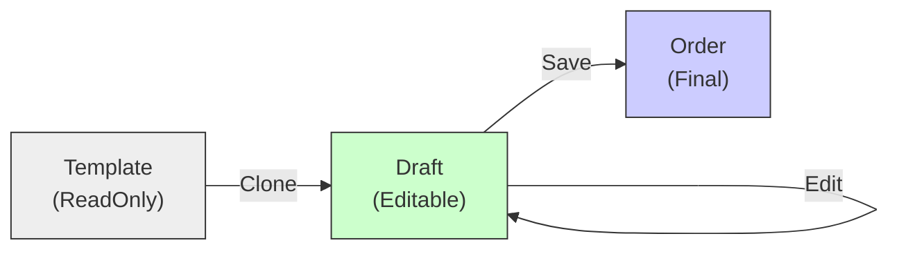

# 第31章：Prototype ④ まとめ演習：複製＋編集のUI想定シナリオ🧁

## ねらい🎯

* 「テンプレから複製して編集する」機能を、**安全に**・**壊れにくく**作れるようになる✨
* 「テンプレ（原本）」と「下書き（編集対象）」を混ぜて事故らない設計ができるようになる🧯

---

## 学ぶこと📌

* Prototypeの本質：**原本をそのまま触らず、複製してから編集する**🧬
* TypeScriptで“深いコピー”を素直にやる：`structuredClone()` を中心に使う🧁


  * `structuredClone()` は深いコピーで、循環参照も扱えるよ♻️ ([MDN Web Docs][1])
  * ブラウザは2022年ごろから広く利用可能になってるよ📱💻 ([MDN Web Docs][1])
  * Node.js なら `v17.0.0` から `structuredClone()` が使えるよ🟢 ([Node.js][2])
* “テンプレは読み取り専用”に寄せる考え方（事故の8割を潰す）🔒

---

## まずはUI想定シナリオ📱✨（テンプレ機能あるある！）


カフェ注文アプリで、こんな機能を作るよ☕️

1. **テンプレ一覧**を見る👀（「いつものラテセット」「会議用おやつセット」など）
2. 「このテンプレで作る」ボタンを押す👉
3. **新規注文の下書き（draft）が作られる**（ここで複製！）
4. 下書きを編集する✏️（数量変更、トッピング追加、メモ追加）
5. 保存すると「注文」として確定される✅

ポイントはこれ👇
**テンプレは“原本”だから絶対に汚さない！**
編集は必ず **draft（複製物）** に対してだけやる🧼✨



---

## データ設計（最小＆実務っぽい形）🧾📦


「テンプレ」と「下書き」を、型で分けておくのが超大事だよ〜！🧡

* `OrderTemplate`：テンプレ（原本）📌
* `OrderDraft`：下書き（編集対象）✏️
* `Order`：保存された注文（確定）✅

```ts
type Money = number;

type OrderItem = {
  sku: string;        // 商品ID（キーになる！）
  name: string;
  unitPrice: Money;
  qty: number;
};

type OrderTemplate = {
  templateId: string;
  title: string;
  items: OrderItem[];
  notePreset?: string; // テンプレに付いてる“初期メモ”
};

type OrderDraft = {
  draftId: string;
  fromTemplateId: string;
  items: OrderItem[];
  note: string;
  createdAt: string;   // 迷ったら文字列でOK（ISO）
};

type Order = {
  orderId: string;
  items: OrderItem[];
  note: string;
  placedAt: string;
};
```

---

## 実装方針（事故らない3ルール）🧯✨

## ルール①：テンプレは“読むだけ”📖

* テンプレを編集画面に直で渡さない
* 必ず **複製して draft を作ってから** UI に渡す

## ルール②：複製は `structuredClone()` を基本にする🧬

`structuredClone()` は深いコピーで、循環参照もOKだよ♻️ ([MDN Web Docs][1])
しかも Node.js の `v17.0.0` から使える🟢 ([Node.js][2])

## ルール③：編集は“破壊的変更”を避けて、コピーで返す🧊

* 「更新した新しい draft を返す」形にすると、あとでUndo/履歴にも繋げやすいよ🧠✨

---

## ハンズオン🛠️：テンプレ→複製→編集→保存 を通す🎉

## 1) テンプレ一覧（仮のデータ）📋

```ts
const templateStore = new Map<string, OrderTemplate>([
  ["latte-set", {
    templateId: "latte-set",
    title: "いつものラテセット☕️",
    items: [
      { sku: "latte", name: "カフェラテ", unitPrice: 480, qty: 1 },
      { sku: "cookie", name: "クッキー", unitPrice: 220, qty: 1 },
    ],
    notePreset: "氷少なめ🧊",
  }],
  ["meeting-snacks", {
    templateId: "meeting-snacks",
    title: "会議用おやつセット🍪",
    items: [
      { sku: "brownie", name: "ブラウニー", unitPrice: 300, qty: 6 },
      { sku: "tea", name: "紅茶", unitPrice: 400, qty: 2 },
    ],
  }],
]);

export function listTemplates() {
  return [...templateStore.values()].map(t => ({
    templateId: t.templateId,
    title: t.title,
  }));
}
```

---

## 2) 「テンプレから下書きを作る」＝Prototypeの中心🧁🧬

```ts
function newId(prefix: string) {
  return `${prefix}-${crypto.randomUUID()}`;
}

export function createDraftFromTemplate(templateId: string): OrderDraft {
  const tpl = templateStore.get(templateId);
  if (!tpl) throw new Error(`Template not found: ${templateId}`);

  return {
    draftId: newId("draft"),
    fromTemplateId: tpl.templateId,
    items: structuredClone(tpl.items),     // ✅ 深いコピー
    note: tpl.notePreset ?? "",
    createdAt: new Date().toISOString(),
  };
}
```

`structuredClone()` は深いコピーで、循環参照も保てるよ♻️ ([MDN Web Docs][1])
（関数みたいにクローンできない値が混じると `DataCloneError` が起きるので、テンプレは“データだけ”に寄せるのがおすすめだよ🧼）([MDN Web Docs][1])

---

## 3) 編集操作（UIのボタン操作を想定）✏️✨


「数量+」「削除」「メモ更新」みたいな操作を、関数で用意するよ🎮

```ts
export function setItemQty(draft: OrderDraft, sku: string, qty: number): OrderDraft {
  const items = draft.items.map(it =>
    it.sku === sku ? { ...it, qty } : it
  );
  return { ...draft, items };
}

export function removeItem(draft: OrderDraft, sku: string): OrderDraft {
  const items = draft.items.filter(it => it.sku !== sku);
  return { ...draft, items };
}

export function setNote(draft: OrderDraft, note: string): OrderDraft {
  return { ...draft, note };
}
```

> ここでのコツ💡
>
> * `draft.items` を直接 `push` とかで触らず、**新しい配列を作って返す**とスッキリ🧊✨
> * 「編集は draft だけ」のルールが守りやすくなるよ🔒

---

## 4) 保存（draft → order）✅🎉

```ts
const orderStore = new Map<string, Order>();

export function placeOrder(draft: OrderDraft): Order {
  const order: Order = {
    orderId: newId("order"),
    items: structuredClone(draft.items), // 念のため確定側もコピー
    note: draft.note,
    placedAt: new Date().toISOString(),
  };

  orderStore.set(order.orderId, order);
  return order;
}
```

---

## 動作イメージ（UI操作をコードで再現）🎬✨

```ts
// 1) 一覧を表示
console.log(listTemplates());

// 2) テンプレから下書きを作る
let draft = createDraftFromTemplate("latte-set");

// 3) 編集（数量を2にする、メモ追記）
draft = setItemQty(draft, "latte", 2);
draft = setNote(draft, draft.note + " / シロップ少し🍯");

// 4) 保存
const order = placeOrder(draft);

console.log({ draft, order });
```

---

## テストで「テンプレが汚れてない」を保証しよう🧪🧼


ここがPrototypeの“勝ち筋”だよ〜！🥳
**テンプレが編集で変わってたら即アウト**🚨

```ts
import { describe, it, expect } from "vitest";

describe("Prototype template flow", () => {
  it("テンプレから作ったdraftを編集してもテンプレは変わらない🧼", () => {
    const before = templateStore.get("latte-set")!;
    const beforeSnapshot = structuredClone(before);

    let draft = createDraftFromTemplate("latte-set");
    draft = setItemQty(draft, "latte", 3);

    const after = templateStore.get("latte-set")!;
    expect(after).toEqual(beforeSnapshot); // ✅ テンプレは無傷
  });

  it("draftのitemsはテンプレと参照共有しない🧬", () => {
    const tpl = templateStore.get("latte-set")!;
    const draft = createDraftFromTemplate("latte-set");

    expect(draft.items).not.toBe(tpl.items); // ✅ 参照が別
  });
});
```

---

## よくある事故パターン😵‍💫（そして回避法💡）

## 事故①：スプレッドで“浅いコピー”して安心しちゃう

* `const draft = { ...tpl }` は **中の配列やオブジェクトが共有**されがち⚠️
* ネストがあるなら、基本は `structuredClone()` が安心🧬 ([MDN Web Docs][1])

## 事故②：テンプレを編集画面が直接いじれる形で渡しちゃう

* UIがうっかり破壊的に変更して、テンプレが汚れる🥲
* **編集は draft だけ**に固定しよう🔒✨

## 事故③：テンプレに関数やクラスインスタンスを入れる

* `structuredClone()` はクローンできない値があると例外になるよ（`DataCloneError`）🧯 ([MDN Web Docs][1])
* テンプレは “データだけ” に寄せるのが強い🧼

---

## AIプロンプト例🤖💬（そのままコピペOK）

```text
あなたはTypeScriptの先生です。
「テンプレ一覧 → 複製して下書き作成 → 編集 → 保存」の流れを、
- テンプレ原本を絶対に汚さない
- structuredClone中心（過剰な独自クラスなし）
- 編集は immutable 更新（コピーして返す）
で設計して、最小コードとテスト案をください。
題材：カフェ注文テンプレ機能
```

```text
このコード、テンプレが汚れる可能性ある？（参照共有チェックして）
危険ポイントと、最小の直し方を教えて。
```

---

## つまずき回避💡（ここだけ守れば強い！）

* ✅ テンプレは **読み取り専用**（UIに直で渡さない）🔒
* ✅ draft作成は **1箇所**に集める（`createDraftFromTemplate`）📌
* ✅ ネストありなら **structuredClone** を基本にする🧬 ([MDN Web Docs][1])
* ✅ 「テンプレが汚れてない」テストを1本でいいから必ず入れる🧪✨

---

## おまけ🌟：最近のTypeScript側の“嬉しい”動き

最新のTypeScript（現行のリリースノート）では、Node向け設定やエディタ体験も改善されてるよ🧠✨（例：`--module node20` の安定オプション、ホバー表示の改善など）([typescriptlang.org][3])

[1]: https://developer.mozilla.org/en-US/docs/Web/API/Window/structuredClone "Window: structuredClone() method - Web APIs | MDN"
[2]: https://nodejs.org/api/globals.html "Global objects | Node.js v25.6.0 Documentation"
[3]: https://www.typescriptlang.org/docs/handbook/release-notes/typescript-5-9.html "TypeScript: Documentation - TypeScript 5.9"
