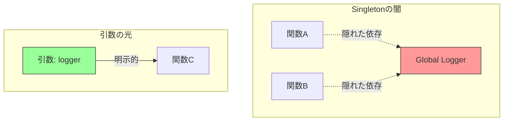

# 第32章：Singleton ① 危険も学ぶ：便利だけど依存が隠れる⚠️

## 1) Singletonってなに？（超ざっくり）🧁

Singletonは「インスタンスを1つだけにして、どこからでも同じものを使えるようにする」考え方だよ〜🧠✨
たとえば「ログ」「設定」「キャッシュ」みたいに、アプリ全体で共有したくなるものが題材になりがちです📦

でも！便利さの裏に“地雷”が多いのがSingleton😵‍💫💥
この章は **「うっかり使うと何が困るの？」** を体験して、危険察知スキルを上げる回です🚨✨

---

## 2) 便利に見えるポイント（なぜ皆つい使うの？）😍

* どこからでも呼べてラク🙌（引数で渡さなくていい）
* 生成コストが重いものを1回だけ作れる気がする🐢
* 「共有っぽい」雰囲気が出て安心する（気がする）😌

…でもこの“ラクさ”が、あとで保守とテストを苦しめることが多いんだよね🥲

---

## 3) Singletonの代表的な落とし穴（ここが危ない！）⚠️⚠️⚠️

### 落とし穴A：依存が隠れる（コードを読んでも分からない）👻

関数の引数に出てこないのに、裏で `Logger.getInstance()` とかを呼んでると…
「この処理って何に依存してるの？」が見えなくなるよ〜😵‍💫


* 影響範囲が読めない📉
* 差し替えがしにくい🔁
* いつの間にか“なんでも屋”になりやすい🧟‍♂️



### 落とし穴B：グローバル状態になる（順番で壊れる）🧨

Singletonが内部に状態（配列、カウンタ、キャッシュ）を持つと、
**実行順によって結果が変わる** 事故が起きやすいです🎲💥

* 「さっきの処理の残り」が混ざる
* バグが再現しにくい（たまにしか起きない）😇

### 落とし穴C：テストがつらい（状態が残る）🧪😵

テストは「毎回まっさら」だと嬉しいよね✨
でもSingletonが状態を持つと、**前のテストのゴミが次のテストに残る** ことがあるよ〜🗑️➡️🧪

Jestは「テストファイルごとに独立したモジュールレジストリ」を持つけど、**同じファイル内**ではモジュール状態が共有されやすいです。([Jest][1])
さらに `resetModules` を使うと「各テストごとにモジュールレジストリ（キャッシュ）をリセット」できます。([Jest][1])

### 落とし穴D：モジュールキャッシュの“Singletonっぽさ”に頼りすぎる📦

JavaScript/TypeScriptの世界では、モジュールの読み込み（import）はキャッシュされやすく、結果として「ファイル＝Singletonっぽい」挙動になります。([Billennium][2])
これ自体は便利なんだけど、**そこに状態を溜めはじめる**と上の問題が一気に出ます😵‍💫

---

## 4) ハンズオン：雑にSingletonログを作って、テストが地獄を見る😇🧪

### お題 ☕🧾

カフェ注文ミニアプリで「注文確定したらログを残す」だけの機能を考えるよ〜✨

---

### 4-1) “ありがちなSingleton”を作る（※わざと危険な例）🧨

```ts
// loggerSingleton.ts
export class LoggerSingleton {
  private static instance: LoggerSingleton | undefined;
  private logs: string[] = [];

  private constructor() {}

  static getInstance(): LoggerSingleton {
    if (!this.instance) this.instance = new LoggerSingleton();
    return this.instance;
  }

  info(message: string) {
    this.logs.push(message);
  }

  getAll(): readonly string[] {
    return this.logs;
  }
}
```

使う側👇

```ts
// placeOrder.ts
import { LoggerSingleton } from "./loggerSingleton";

export function placeOrder(orderId: string) {
  // 依存が引数に出てこない👻（ここがまず危険）
  const logger = LoggerSingleton.getInstance();
  logger.info(`placed: ${orderId}`);
}
```

---

### 4-2) テストで詰む（状態が残る）🧪💥

```ts
// placeOrder.test.ts
import { describe, it, expect } from "vitest";
import { placeOrder } from "./placeOrder";
import { LoggerSingleton } from "./loggerSingleton";

describe("placeOrder", () => {
  it("ログが1件になるはず", () => {
    placeOrder("A");
    const logs = LoggerSingleton.getInstance().getAll();
    expect(logs.length).toBe(1);
  });

  it("こっちも1件になるはず（…え？）", () => {
    placeOrder("B");
    const logs = LoggerSingleton.getInstance().getAll();
    // 前のテストのログが残ってたら2になる😇
    expect(logs.length).toBe(1);
  });
});
```

**起きてること**

* Singletonが内部状態（logs配列）を持っている
* テスト間でその状態が残ってしまう
* テストの順番や実行方法で結果がブレる🎲💥

---

## 5) 応急処置と、ちゃんとした考え方💡

### 応急処置：毎回リセットする（でも根本じゃない）🧯

* テストの `beforeEach` でログ配列をクリア…みたいなことをしたくなる
* でもそれ、**「テストがSingletonの内部事情を知ってる」** 状態で、設計的にしんどい😵‍💫

Jestなら `jest.resetModules()` で「モジュールキャッシュをリセット」して分離を強くできます。([Jest][3])
（ただし多用するとテストが遅くなったり、別の面倒が出ることもあるよ🌀）

### 根本の方向性：依存を“見える化”する👀✨

「ログが必要」なら、`placeOrder` の引数で受け取れる形にすると世界が平和になりやすいです🕊️

```ts
// logger.ts
export type Logger = {
  info(message: string): void;
};

export const consoleLogger: Logger = {
  info(message) {
    console.log(message);
  },
};
```

```ts
// placeOrder.ts
import type { Logger } from "./logger";
import { consoleLogger } from "./logger";

export function placeOrder(orderId: string, deps?: { logger?: Logger }) {
  const logger = deps?.logger ?? consoleLogger; // デフォルトは用意しつつ
  logger.info(`placed: ${orderId}`);
}
```

テストは超ラク👇😆🧪

```ts
import { describe, it, expect } from "vitest";
import { placeOrder } from "./placeOrder";

describe("placeOrder", () => {
  it("ログを検証できる（状態が残らない）", () => {
    const logs: string[] = [];
    const fakeLogger = { info: (m: string) => logs.push(m) };

    placeOrder("A", { logger: fakeLogger });
    expect(logs).toEqual(["placed: A"]);
  });
});
```

ポイント🌟

* 依存が引数に出る＝コード読んだだけで分かる👀
* テストで差し替えが簡単🧪
* 変なグローバル状態を持ちにくい🧊

---

## 6) Singletonを使いたくなった時のチェックリスト✅💭

次の質問に「うっ…😨」が多いほど危険度UPだよ〜⚠️

* それ、内部に状態（配列・Map・カウンタ）を持つ？🗃️
* テストで差し替えたい？🧪
* 実行順で結果が変わりそう？🎲
* その依存、引数に出したら困る？（＝設計的な都合で隠したいだけ？）👻
* ログ・設定・キャッシュが“便利箱”になってない？🧰💥

---

## 7) AIプロンプト例🤖💬（コピペOK）

```text
次のTypeScriptコードの「Singleton由来の危険」を指摘して。
- 依存が隠れていないか
- テストが書きにくくならないか
- 状態が残って順番依存にならないか
改善案は「独自クラスを増やしすぎない」方針で、段階的に3案出して。
```

```text
この関数を、Singleton参照をやめて「引数で依存注入」できる形に直して。
- public API（呼び出し側）をあまり複雑にしない
- デフォルト実装は用意してOK
- テストで差し替えできる例もつけて
```

---

## 8) まとめ🎉

* Singletonは「便利に見える」けど、**依存が隠れて**、**状態が残って**、**テストがつらくなる**地雷が多い⚠️
* とくに「内部状態を持つSingleton」は、順番依存＆再現しにくいバグの温床になりがち😇
* まずは「依存を見える化（引数で渡す）」を考えると、設計もテストもラクになりやすいよ🧪✨

次章では「TypeScriptでSingletonクラスを作らない定番のやり方（モジュールのexportで十分）」を、もっとスッキリ整理していくよ〜📦✨

[1]: https://jestjs.io/docs/configuration?utm_source=chatgpt.com "Configuring Jest"
[2]: https://billennium.com/full-guide-to-javascript-modules-from-chaos-to-clarity/?utm_source=chatgpt.com "Full Guide to JavaScript Modules: From Chaos to Clarity"
[3]: https://jestjs.io/docs/jest-object?utm_source=chatgpt.com "The Jest Object"
