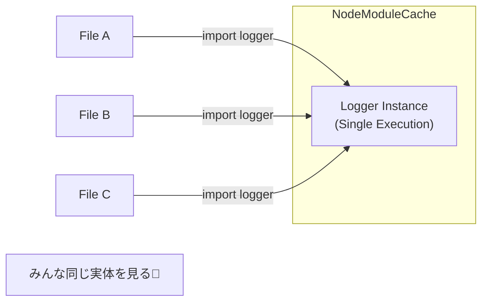

# 第33章：Singleton ② TypeScriptの定番：モジュールのexportで十分📦

## 1) まず結論：Singletonクラス、作らなくてOKだよ〜🙆‍♀️💡

TypeScript（というかES Modules）では、**「ファイル（モジュール）を1回だけ実行して、結果を使い回す」**のが基本の動きだよ〜📦
つまり、モジュールの中で作ったインスタンスをそのまま「export」すれば、それがもう “Singletonっぽい共有” になるの🥳


（モジュールは基本「一度だけ評価（実行）される」って説明されてるよ）([MDN Web Docs][1])

---

## 2) なんで「export」でSingletonになるの？🤔✨


ざっくり言うと…

* 「import」されたモジュールは、同じものなら**同じ実体を参照**する📦
* だから「モジュール内に1個だけ作ったもの」をexportすれば、アプリのどこから使っても“それ”になる🎯

Node.jsでも、ESMは公式の標準形式で、URLとして解決してキャッシュされる（＝同じURLなら同じモジュール扱い）って説明があるよ〜🧠([Node.js][2])
TypeScript側も、ESMの「import/export」文法をそのまま理解して扱うよ〜📘([TypeScript][3])



---

## 3) いちばん定番：モジュールで共有インスタンスをexportする🧁📦

「Logger」みたいな共有物はこの形がめちゃ定番だよ〜😊✨

```ts
// logger.ts
export type LogLevel = "debug" | "info" | "warn" | "error";

export interface Logger {
  debug(message: string, data?: unknown): void;
  info(message: string, data?: unknown): void;
  warn(message: string, data?: unknown): void;
  error(message: string, data?: unknown): void;
}

function write(level: LogLevel, message: string, data?: unknown) {
  const prefix = `[${new Date().toISOString()}] ${level.toUpperCase()}:`;
  if (data === undefined) {
    console.log(prefix, message);
  } else {
    console.log(prefix, message, data);
  }
}

// ✅ これが「モジュールSingleton」になる！
export const logger: Logger = {
  debug: (m, d) => write("debug", m, d),
  info: (m, d) => write("info", m, d),
  warn: (m, d) => write("warn", m, d),
  error: (m, d) => write("error", m, d),
};
```

> ポイント💡
>
> * クラスでSingleton実装しない
> * 標準の「console」を使う（TS/JSで超定番）😄
> * exportした「logger」が共有物になる📦✨

---

## 4) ハンズオン：注文処理でloggerを使ってみよう☕🧾📣

注文の合計を計算して、確定ログを出すよ〜🎉

```ts
// orderService.ts
import { logger } from "./logger.js";

export type OrderItem = { name: string; price: number; qty: number };

export function calcTotal(items: OrderItem[]): number {
  return items.reduce((sum, it) => sum + it.price * it.qty, 0);
}

export function placeOrder(items: OrderItem[]) {
  const total = calcTotal(items);
  logger.info("order placed", { total, itemCount: items.length });
  return { total };
}
```

```ts
// app.ts
import { placeOrder } from "./orderService.js";

placeOrder([
  { name: "Latte", price: 520, qty: 1 },
  { name: "Cookie", price: 220, qty: 2 },
]);
```

### 💥「.jsって何？」ってなりがちポイント

ESMでは、実行時（Node.js）の都合で相対importに拡張子が必要なケースがあるよ〜🌀
TypeScriptの公式ドキュメントでも、例として「./module.js」みたいなimportが普通に出てくるよ📘([TypeScript][3])
（ここで詰まったら「tsconfigのmodule/moduleResolution」を見直すやつ！）([TypeScript][4])

---

## 5) “モジュールSingleton”の落とし穴⚠️（複数になるパターン）

「え、同じloggerのはずなのに、2個ある…😇」ってなるときはだいたいこれ👇

### ① importの“指定の仕方”が違う

Node.jsのESMは、解決結果がURLとして扱われてキャッシュされるよ📦
なので、**同じファイルでも別URL扱い**になると、別モジュールとしてロードされちゃうことがあるの⚠️
例：クエリ（?）やフラグメント（#）が違うと別扱い、みたいな話も出てくるよ🧠([Node.js][2])

✅ 対策

* importパスの書き方をプロジェクトで統一する（表記ゆれ禁止）🧹✨
* エイリアスを使うなら、入口を1つに決める📌

### ② 開発中のHMR/ホットリロード


開発サーバーの仕組みで「モジュールを差し替え」ると、再評価が起きることがあるよ〜🔥
（これはツール側の都合なので、ログに“初期化ログ”が何回も出て気づくことが多い👀）

✅ 対策

* モジュール初期化で副作用（勝手に接続する等）をなるべく避ける🙅‍♀️
* 初期化が必要なら「明示的にinit関数」を用意する（でもやりすぎ注意）⚙️

---

## 6) テストで困るやつ：モジュールの状態が残る🧪😵


モジュールに「Mapキャッシュ」とか「カウンタ」とかを持つと、テストが影響し合いがち💦
なので、**共有物はできるだけ不変（読み取り中心）**に寄せるのがコツだよ〜🧊✨

### どうしても状態が必要なら：最小のリセット口を作る🧹

（“オレオレクラス”じゃなくて、標準のMap＋関数で十分👍）

```ts
// priceCache.ts
const priceCache = new Map<string, number>();

export function getCachedPrice(name: string) {
  return priceCache.get(name);
}

export function setCachedPrice(name: string, price: number) {
  priceCache.set(name, price);
}

// テストだけで使う想定の「掃除関数」🧹
export function __resetCacheForTest() {
  priceCache.clear();
}
```

### Jestを使う場合の別解：モジュールごとリセット

Jestには「モジュールレジストリをリセット」する機能があるよ🧪
代表が「resetModules」！([TypeScript][4])

---

## 7) いつ“export Singleton”でOK？いつ危ない？🧭✨

### ✅ わりとOK（やりやすい）

* ロガー（今回のloggerみたいなやつ）📝
* 読み取り専用の設定（定数の塊）⚙️
* 純粋なユーティリティ（状態を持たない）🧰

### ⚠️ 慎重に（次章の「注入」にしたくなる）

* DB接続 / APIクライアント（失敗や再接続が絡む）🌩️
* キャッシュ（寿命・削除・競合が絡む）🗃️
* グローバルに増減する状態（テスト地獄の入口）😇

> 「状態が強い・外部I/Oが強い」ほど、モジュールSingletonは事故りやすいよ〜⚠️
> ここが次章（注入で差し替え）につながる流れだよ💉✨

---

## 8) ミニ演習🎯✨（手を動かすやつ！）

### 演習A：loggerに「注文ID」を入れよう🧾🆔

* placeOrderの引数に「orderId: string」を追加
* logger.infoのdataに「orderId」を入れてみよう📣

### 演習B：loggerを“静かモード”にできるようにしよう🤫

* logger.tsに「ログレベル」を追加（debug/info/warn/error）
* レベル以下は出さないようにする（if 1個でOK）✨

### 演習C：キャッシュを持つモジュールを作って、テストでリセット🧪🧹

* Mapを使って「商品名→価格」を保存
* テスト前に「__resetCacheForTest」を呼んで安定させる✅

---

## 9) AIプロンプト例🤖💬（コピペOK）

* 「logger.tsを、標準consoleだけで、最小構成で作って。export constで共有インスタンスにして」
* 「ESMのimportで同じモジュールが複数になる原因を、具体例つきで3つ」
* 「Mapキャッシュを持つモジュールのテスト戦略を、状態漏れの観点でレビューして」

---

## 10) まとめ🎉📦

* Singletonクラスを頑張る前に、**“モジュールのexport”でだいたい解決**するよ〜📦✨
* モジュールは基本「一度だけ評価」されるから共有が自然にできるよ😊([MDN Web Docs][1])
* でも「状態が強い共有」はテストや不具合の温床になりやすい⚠️
* そのときは「状態を減らす」or「テストでリセット」or「次章の注入（DIっぽい）」が効くよ💉✨

[1]: https://developer.mozilla.org/en-US/docs/Web/JavaScript/Guide/Modules "JavaScript modules - JavaScript | MDN"
[2]: https://nodejs.org/api/esm.html "Modules: ECMAScript modules | Node.js v25.6.0 Documentation"
[3]: https://www.typescriptlang.org/docs/handbook/modules/reference.html "TypeScript: Documentation - Modules - Reference"
[4]: https://www.typescriptlang.org/tsconfig/ "TypeScript: TSConfig Reference - Docs on every TSConfig option"
