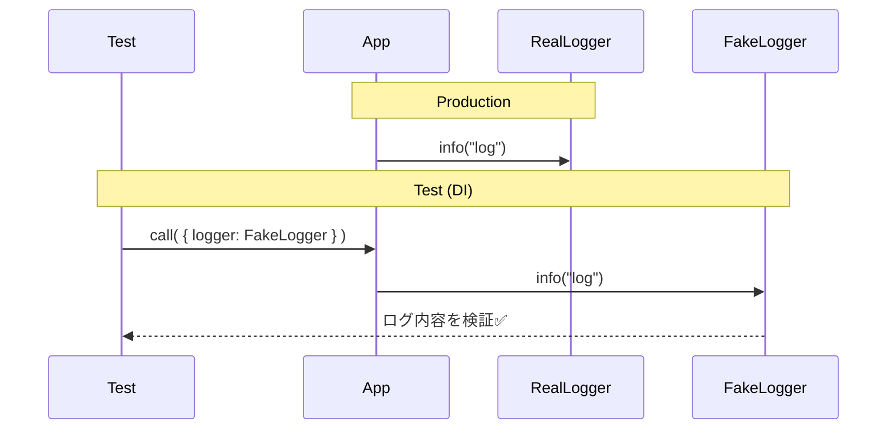

# 第34章：Singleton ③ 代替案：DI（引数で渡す）にするとテスト楽💉

## ねらい🎯

* 「Singletonに頼るとテストがしんどい…😵」の理由がわかる
* 依存（ログ・時間・乱数など）を **引数で渡して見える化👀** できる
* テストで **差し替えが一瞬🧪✨** になるのを体感する

---

## 1. まずDIってなに？🧠💡

DI（Dependency Injection）は難しい道具じゃなくて、

* 「必要なもの（依存）を、外から渡す」
  ただそれだけだよ😊✨


たとえばログ出力を考えると…

* ❌ **悪い例**：関数の中で勝手に “どこかのlogger” を掴む（依存が隠れる🫥）
* ✅ **良い例**：`logger` を引数でもらう（依存が見える👀）

こうすると、テストで `logger` を **ニセモノに差し替え** できるから超ラクになるの🎉

---

## 2. 「依存が隠れる」と何がつらいの？😢🧯

Singleton（やグローバル）で `logger` を握ると、ありがちな困りごとが出るよ👇

* テストでログを止められない／検証しにくい🙅‍♀️
* 「いつ」「何回」呼ばれたか追いづらい🌀
* モックのために変な仕組みが増える（本末転倒）😵‍💫
* 並列テストでログや状態が混ざることも💥

DIにすると、これが **すーっと消える** よ🌈



---

## 3. TypeScriptの定番DI：依存は「第2引数のdepsオブジェクト」で渡す🧁🎁

TypeScriptだと、引数が増えすぎないように **依存はまとめて `deps`** にするのが王道✨
しかも `console` は標準であるから、デフォルトに使えるよ🧡

## ✅ 最小実装（カフェ注文：確定するとログが出る）☕🧾

```ts
// placeOrder.ts
export type OrderItem = { id: string; name: string; price: number; qty: number };
export type Order = { id: string; items: OrderItem[] };

type Logger = Pick<Console, "info" | "warn" | "error">;

export type PlaceOrderDeps = {
  logger: Logger;
  now: () => Date; // テストで時間を固定できるようにする✨
};

export function placeOrder(order: Order, deps: Partial<PlaceOrderDeps> = {}) {
  const logger: Logger = deps.logger ?? console;
  const now = deps.now ?? (() => new Date());

  const total = order.items.reduce((sum, it) => sum + it.price * it.qty, 0);
  const placedAt = now();

  logger.info(`[placeOrder] order=${order.id} total=${total} at=${placedAt.toISOString()}`);

  return { ...order, total, placedAt };
}
```

ポイント🌟

* `Logger` は `Console` から必要なメソッドだけ抜いた型（標準に寄せる✨）
* `deps` を省略したら本番は `console` と `new Date()` を使う（自然で楽😊）
* テストだけ `logger` と `now` を差し替えられる（ここが神👏）

---

## 4. テストで差し替え！「偽logger」と「固定時刻」🧪⏰

今回は **Vitest** でいくよ（超軽くて速い子🏎️💨）。
※Vitestは公式ドキュメント上、Node要件などが明記されてるよ。([Vitest][1])

```ts
// placeOrder.test.ts
import { describe, it, expect } from "vitest";
import { placeOrder } from "./placeOrder";

describe("placeOrder", () => {
  it("合計を計算してログに出し、時刻も固定できる✨", () => {
    const logs: string[] = [];

    // ニセモノlogger（テスト用）🧸
    const fakeLogger: Pick<Console, "info" | "warn" | "error"> = {
      info: (...args: unknown[]) => logs.push(args.join(" ")),
      warn: (...args: unknown[]) => logs.push(args.join(" ")),
      error: (...args: unknown[]) => logs.push(args.join(" ")),
    };

    const fixed = new Date("2026-02-04T00:00:00.000Z");

    const result = placeOrder(
      { id: "o1", items: [{ id: "c1", name: "Latte", price: 500, qty: 2 }] },
      { logger: fakeLogger, now: () => fixed }
    );

    expect(result.total).toBe(1000);
    expect(result.placedAt.toISOString()).toBe(fixed.toISOString());
    expect(logs.join("\n")).toContain("order=o1");
    expect(logs.join("\n")).toContain("total=1000");
  });
});
```

やってることはシンプル🎀

* `fakeLogger` にログを溜めるだけ
* 「ログが出た？」を **文字列で検証**
* `now` を固定して、テストが **ブレない**（超大事）✅

---

## 5. 「全部注入」は疲れる…どこまでDIすればいい？😵‍💫➡️🙂

DIは万能だけど、**やりすぎると引数だらけ** になるのも事実💦
なので目安はこれ👇

## 注入すると嬉しい依存ランキング🏆✨

1. **時間**（`Date`）⏰：テストが安定する
2. **乱数**（`Math.random`）🎲：再現できる
3. **ログ**（`console`/logger）📝：検証・静音化できる
4. **外部I/O**（fetch/DB/FS）🌐：テストが爆速になる
5. **環境設定**（env/設定値）⚙️：ケース分けが楽

逆に、**純粋な計算**（割引計算とか）みたいに副作用がないものは、DIしなくてもOK🙆‍♀️✨
（むしろ “純粋関数” に寄せると最強💪）

---

## 6. 実務っぽい形：アプリ起動時に「本番deps」を組み立てる🧩🏗️

「depsをどこで作るの？」問題は、だいたい **入口（起動コード）で1回だけ作る** のがスッキリ✨

* UI/CLI/API の入口で deps を作る
* 中の関数には deps を渡す
* テストは deps を差し替える

この “入口で組み立てる” 考え方は、DIの基本の基本だよ😊💕

---

## 7. つまずき回避💡🧯（あるある注意）

* **depsを深い階層まで渡すのが面倒** → まずは「重要依存（ログ/時間/I/O）」だけでOK🙆‍♀️
* **depsの型が膨らむ** → 「機能ごとに deps を分ける」か「必要なものだけPickする」✂️
* **テスト用のニセモノが多い** → ログは配列に詰める方式が一番カンタン📦✨

---

## 8. ハンズオン🛠️🎉（今日のミッション）

1. `placeOrder` の中で使ってる `console` と `new Date()` を洗い出す👀
2. `deps`（第2引数）を足して、`logger` と `now` を注入できるようにする💉
3. テストで `fakeLogger` と固定時刻を渡して、ログ内容を検証する🧪✨
4. 余裕があれば：`notify`（通知）も deps にして差し替えできるようにしてみよ📣

---

## 9. AIプロンプト例🤖💬（コピペでOK）

```text
次のTypeScript関数は、内部で console と new Date() を直接使っています。
これを「依存を引数で注入する（DI）」形にリファクタしてください。

条件：
- 依存は第2引数 deps オブジェクトにまとめる
- デフォルトは本番実装（console / () => new Date()）
- テストしやすい形にする（固定時刻・偽loggerで検証できる）
- 余計な独自クラスは作らない
- 変更前/変更後の差分が分かるように説明もつけて
```

---

## 10. 2026年2月時点メモ🗓️✨（“いま”の情報）

* TypeScriptは 5.9系のリリースが確認できるよ（例：5.9.3）。([GitHub][2])
* Node.jsは v24 が Active LTS として掲載されていて、v22は Maintenance LTS。([Node.js][3])
* JavaScriptのモジュールは「一度だけ評価される」性質がある（Singletonが“成立しやすい”背景）。([MDN Web Docs][4])

※そしてTypeScriptチームは将来に向けて “TypeScript 7のネイティブ実装” に関する進捗も公開してるよ（設計思想の流れを追うのに面白い👀✨）。([Microsoft for Developers][5])

[1]: https://vitest.dev/guide/ "Getting Started | Guide | Vitest"
[2]: https://github.com/microsoft/typescript/releases "Releases · microsoft/TypeScript · GitHub"
[3]: https://nodejs.org/en/about/previous-releases?utm_source=chatgpt.com "Node.js Releases"
[4]: https://developer.mozilla.org/en-US/docs/Web/JavaScript/Guide/Modules "JavaScript modules - JavaScript | MDN"
[5]: https://devblogs.microsoft.com/typescript/announcing-typescript-5-9/?utm_source=chatgpt.com "Announcing TypeScript 5.9"
