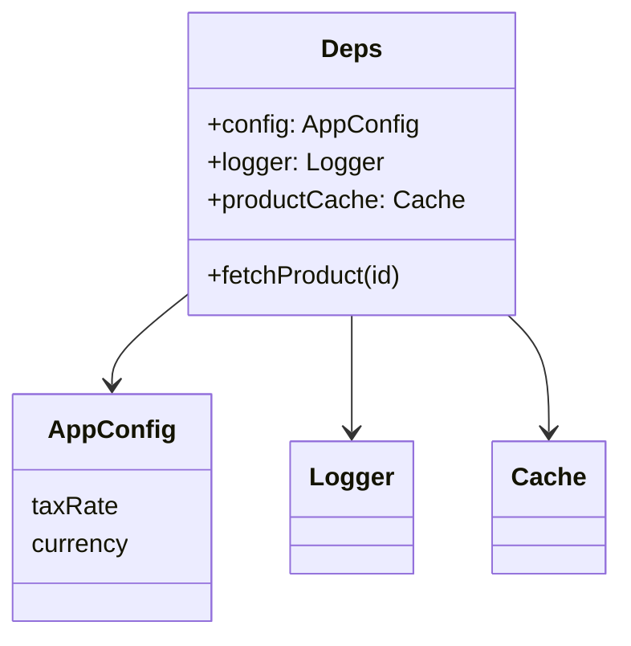

# 第35章：Singleton ④ まとめ演習：設定・ログ・キャッシュの扱い方📌

---

## この章のゴール🎯

* 「共有してOKなもの / 危険なもの」を言葉で説明できるようになる😊
* “Singletonっぽい共有”を **安全寄り** に実装できるようになる🛡️
* テストしやすさ（差し替えやすさ）を落とさずに、現場っぽくまとめられる🧪✨

---

## 1) まず結論：共有してOK？それとも危険？⚠️🆗

## 共有してOK寄り（やりやすい）🟢

* **読み取り中心の設定（Config）**：起動時に決めて、その後ほぼ変わらない📄
* **純粋な定数/辞書**：変更しない、増えない🧊
* **キャッシュ（Cache）**：ただし「寿命」「クリア方法」「キー設計」が決まってるとき🗃️


## 危険寄り（事故りやすい）🔴

* **ログ（Logger）を完全グローバル固定**：テストで差し替えにくい、依存が見えない🕳️
* **書き換わるグローバル状態**：いつ誰が変えたか追えない😵‍💫
* **“なんでも入る”共有ストア**：便利そうに見えて、後で地獄👿

---

## 2) “Singletonでも許されやすい”チェックリスト✅

次の質問に **YESが多いほど安全** だよ✨

1. **読み取り中心？**（書き換えない/書き換えが少ない）📖
2. **副作用が少ない？**（勝手に外部I/Oしない）🧼
3. **テストで差し替え可能？**（注入できる/置き換えできる）🧪
4. **寿命が明確？**（いつ作る？いつ捨てる？）⏳
5. **責務が1つ？**（設定は設定、キャッシュはキャッシュ）🎯

---

## 3) ここから演習！☕🧁（カフェ注文ミニアプリ）

やりたいことはこの3つ👇

* **設定（Config）**：税率・通貨などをまとめる📌
* **ログ（Logger）**：注文確定のログを出す📝
* **キャッシュ（Cache）**：商品マスター取得をMapでメモして高速化🗃️⚡

ポイント：
「Configは共有OK」「Loggerは注入」「Cacheは共有するならルール付き」って方針でいくよ😊

---

## 4) なぜ “exportの共有” がSingletonっぽく動くの？📦

ES Modules は、同じモジュールを何度importしても **1回だけ評価され、結果が再利用** されるのが基本だよ📌（つまり “モジュールが1個の共有場所” になりやすい！）([nodejs.org][1])
CommonJS（`require`）も同様に、読み込んだモジュールはキャッシュされる仕組みがあるよ🧠([typescriptlang.org][2])

ただし！最近のTypeScriptでは `import defer`（遅延評価）も入ってきて、**「importした瞬間に必ず実行される」前提が揺れる場面**もあるよ⚠️（副作用をimport時に置きすぎないのが安全）([typescriptlang.org][3])

---

## 5) 実装してみよう🛠️✨（オレオレ独自クラス無し！）

## 5-1) 設定（Config）は “共有OK” の代表🥰


* 起動時に決める
* 以後は読み取りだけ
* 書き換え禁止（Readonly + freeze）

```ts
// config.ts
export type AppConfig = Readonly<{
  taxRate: number;          // 例: 0.1
  currency: "JPY" | "USD";  // 学習用に2択
  logLevel: "debug" | "info" | "warn" | "error";
}>;

function toNumber(value: string | undefined, fallback: number): number {
  const n = Number(value);
  return Number.isFinite(n) ? n : fallback;
}

const config: AppConfig = Object.freeze({
  taxRate: toNumber(process.env.TAX_RATE, 0.1),
  currency: (process.env.CURRENCY === "USD" ? "USD" : "JPY"),
  logLevel:
    process.env.LOG_LEVEL === "debug" ||
    process.env.LOG_LEVEL === "info" ||
    process.env.LOG_LEVEL === "warn" ||
    process.env.LOG_LEVEL === "error"
      ? process.env.LOG_LEVEL
      : "info",
});

export const appConfig = config;
```

✅これが「安全寄りSingleton」：
“データとしての共有” に寄せると事故りにくいよ🧊💕

---

## 5-2) ログ（Logger）は “注入できる形” が超おすすめ💉📝


* グローバル固定にしない
* 引数で受け取れるようにして、テストは差し替え✨
* 標準の `console` で十分（まずは！）

```ts
// logger.ts
export type Logger = {
  debug: (msg: string, meta?: unknown) => void;
  info: (msg: string, meta?: unknown) => void;
  warn: (msg: string, meta?: unknown) => void;
  error: (msg: string, meta?: unknown) => void;
};

export function createConsoleLogger(): Logger {
  return {
    debug: (msg, meta) => console.debug(msg, meta ?? ""),
    info:  (msg, meta) => console.info(msg,  meta ?? ""),
    warn:  (msg, meta) => console.warn(msg,  meta ?? ""),
    error: (msg, meta) => console.error(msg, meta ?? ""),
  };
}
```

> 「Loggerを共有で持つ」のがダメってより、
> **“差し替え不能なグローバル固定” が辛い** って感じだよ⚠️

---

## 5-3) キャッシュ（Cache）は Map が王道🗺️🗃️


ここは “共有したい欲” が出るけど、ルールが大事！

* 共有したいなら：**クリア方法が必要**（テスト・運用）
* 共有しないなら：**依存として渡す**（いちばん安全）

今回は「作って渡せる」形にするよ😊

```ts
// cache.ts
export type Cache<K, V> = {
  get: (key: K) => V | undefined;
  set: (key: K, value: V) => void;
  clear: () => void;
};

export function createMapCache<K, V>(): Cache<K, V> {
  const map = new Map<K, V>();
  return {
    get: (key) => map.get(key),
    set: (key, value) => { map.set(key, value); },
    clear: () => { map.clear(); },
  };
}
```

---

## 6) “使う側” を組み立てる（依存が見えるのが正義）👀✨


```ts
// orderService.ts
import type { AppConfig } from "./config.js";
import type { Logger } from "./logger.js";
import type { Cache } from "./cache.js";

export type Product = Readonly<{ id: string; name: string; price: number }>;
export type OrderLine = Readonly<{ productId: string; qty: number }>;
export type Order = Readonly<{ lines: OrderLine[] }>;

export type Deps = Readonly<{
  config: AppConfig;
  logger: Logger;
  productCache: Cache<string, Product>;
  fetchProduct: (id: string) => Promise<Product>;
}>;

async function getProduct(deps: Deps, id: string): Promise<Product> {
  const cached = deps.productCache.get(id);
  if (cached) return cached;

  const p = await deps.fetchProduct(id);
  deps.productCache.set(id, p);
  return p;
}

export async function placeOrder(deps: Deps, order: Order): Promise<number> {
  let subtotal = 0;

  for (const line of order.lines) {
    const p = await getProduct(deps, line.productId);
    subtotal += p.price * line.qty;
  }

  const total = Math.round(subtotal * (1 + deps.config.taxRate));
  deps.logger.info("order placed", { subtotal, total, lines: order.lines.length });
  return total;
}
```




ここで最高に大事なのは👇

* `placeOrder` が **「どれに依存してるか」丸見え**（後から困らない）😆✨
* LoggerもCacheも **テストで差し替え可能**（Singleton地獄回避）🧪💕

---

## 7) テスト：注入すると一瞬で楽になる🧪🎉

標準の `node:test` と `assert` で最小にいくよ（まずはこれでOK）✨

```ts
// orderService.test.ts
import test from "node:test";
import assert from "node:assert/strict";
import { createMapCache } from "./cache.js";
import { placeOrder } from "./orderService.js";

test("placeOrder logs and uses cache", async () => {
  const logs: Array<{ msg: string; meta?: unknown }> = [];

  const deps = {
    config: { taxRate: 0.1, currency: "JPY", logLevel: "info" } as const,
    logger: {
      debug: () => {},
      info: (msg: string, meta?: unknown) => logs.push({ msg, meta }),
      warn: () => {},
      error: () => {},
    },
    productCache: createMapCache<string, { id: string; name: string; price: number }>(),
    fetchProduct: async (id: string) => ({ id, name: "Coffee", price: 500 }),
  };

  const total = await placeOrder(deps, { lines: [{ productId: "coffee", qty: 2 }] });
  assert.equal(total, Math.round(1000 * 1.1));
  assert.equal(logs.length, 1);
});
```

✅テストの気持ちよさ：

* Loggerは配列に入れるだけで検証できる📦
* Cacheは `createMapCache()` で毎回新品にできる🧼

---

## 8) “事故あるある” と守り方🧯💥

## 事故1：Configが途中で書き換わる😱

* `Readonly` + `Object.freeze` で“書き換えさせない”🧊
* 「設定は起動時に確定」ってルールを守る📌

## 事故2：Loggerがグローバルで、テストが地獄😵‍💫

* 依存として受け取る（引数 / deps）💉
* どうしても共通化したいなら「デフォルトは提供、でも差し替え可能」✨

## 事故3：Cacheが増え続けてメモリが不安🐘

* クリア戦略を決める（全部クリア / TTL / 上限）⏳
* まずは学習では「clearできる」が正義🧼

---

## 9) ミニまとめ：この章で覚える“方針”🧡

* **設定**：共有OK（読み取り専用に寄せる）📄
* **ログ**：注入OK（依存を見せる・差し替えやすく）📝
* **キャッシュ**：MapでOK（寿命とクリアを決める）🗃️

---

## 10) ハンズオン課題🧁✨

1. `fetchProduct` を「2種類の商品を返す」ようにして、注文を2行に増やしてみよう☕🍰
2. `productCache.clear()` を呼ぶテストを追加して、「キャッシュが無いと再取得する」も確認しよう🧪
3. `logLevel` を見て、`debug` のときだけ `logger.debug(...)` を追加してみよう🔍

---

## 11) AIプロンプト例🤖💬

```text
Singletonっぽい共有（設定・ログ・キャッシュ）を整理したいです。
条件：
- Configは読み取り専用で共有OKに寄せたい
- Loggerは注入できる形にしてテストで差し替えたい
- CacheはMapで、clearできる形にしたい（オレオレ独自クラスは作らない）
題材：カフェ注文ミニアプリ
出力：1) 方針 2) 最小コード 3) テスト例 4) 事故りやすい点
```

---

## つまずき回避💡

* 「Singletonは悪！」じゃなくて、**“何を共有するか” を選ぶ**のが大事だよ😊
* 迷ったら **依存を引数で渡す**（とりあえず勝てる）💉✨

（参考：モジュールは基本1回評価で再利用される仕組みがあるよ📦([nodejs.org][1])／TypeScript 5.9 では `import defer` も入ってきたので、副作用は控えめが安全だよ⚠️([typescriptlang.org][3])）

[1]: https://nodejs.org/api/esm.html "Modules: ECMAScript modules | Node.js v25.6.0 Documentation"
[2]: https://www.typescriptlang.org/docs/handbook/release-notes/typescript-5-9.html "TypeScript: Documentation - TypeScript 5.9"
[3]: https://www.typescriptlang.org/docs/handbook/release-notes/typescript-5-9.html?utm_source=chatgpt.com "Documentation - TypeScript 5.9"
