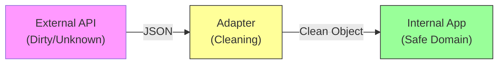

# 第36章：Adapter ① 外部APIの形が合わない問題🔌

## 1) 今日のゴール🎯✨


* 外部API（受け取るJSON）の「形」と、アプリ内部で使いたい「形」がズレたときに、**汚れを1か所に閉じ込める**方法を覚えるよ🧼🧹
* 「変換（マッピング）」がコード全体に散らばる地獄😇を、**Adapterで止める**のが狙い！

---

## 2) あるあるの困りごと😵‍💫


外部APIが返してくるJSONって、こんな感じが多い👇

* `snake_case`（例：`order_id`）
* 金額が文字列（例：`"1200"`）
* `null` や欠損が混じる
* 仕様がちょいちょい変わる（フィールド追加/名前変更）

でもアプリ内部では、こう使いたい👇

* `camelCase`
* 金額は `number`
* 型安全に、取り回しよく！

---

## 3) Adapterってなに？🧩

**Adapter = 外の世界のデータ（DTO）を、内側の世界（ドメイン）に“合わせて変換する係”**だよ✨


ポイントはこれ👇

* 外部のクセ（命名、単位、欠損）を **Adapterが全部吸収**する
* アプリ本体は **綺麗な型だけを信じて動く**
* 変換が散らばらないから、変更に強い💪



---

## 4) まず「散らばる地獄」を見よう😇（やらない例）


たとえば、画面やロジックのあちこちで変換し始めると…

```ts
// 悪い例：あちこちで snake_case を触りはじめる😵
function showOrder(dto: any) {
  const id = dto.order_id;
  const total = Number(dto.total_amount);
  // ...さらに別の画面でも同じ変換...
}
```

これ、外部仕様が変わった瞬間に…

* 直す場所が無限に増える♾️
* 直し漏れでバグる🐛
* どこが境界か分からなくなる🌀

---

## 5) Adapterの基本形🧼✨（DTO → ドメイン）


### 今日の作戦📌

* 外部から来た値は **いったん `unknown` 扱い**（←ここ超大事！）
* Adapterで **検査して**（最低限でOK🙆‍♀️）
* ドメイン型に **変換して返す**

> TypeScriptの型は「コンパイル時の約束」なので、実行時に外部が嘘つくのは防げないよ⚠️
> だから Adapter で “正しく失敗” させるのが安全✨

---

## 6) ハンズオン🛠️：外部注文DTOを内部Orderへ変換する

### 6-1) 内部で使いたい「綺麗な型」（ドメイン）🧡


```ts
export type OrderItem = {
  productId: string;
  qty: number;
};

export type Order = {
  orderId: string;
  totalYen: number;
  items: OrderItem[];
  createdAt: Date;
};
```

---

### 6-2) 外部から来る「そのままの形」（DTOっぽい）📦

たとえば外部APIがこう返すとするね👇

```ts
// 外部の都合（例）
export type OrderDto = {
  order_id: string;
  total_amount: string;         // 数字だけど文字列😵
  line_items: Array<{
    product_id: string;
    qty: number;
  }>;
  created_at: string;           // ISO文字列
};
```

---

### 6-3) Adapter：DTOをチェックしてOrderに変換する🔁✨

ここでは「例外を投げない」流れにして、**成功/失敗を戻り値で返す**よ（第15章の流れ🧯）

```ts
type Ok<T> = { ok: true; value: T };
type Err<E> = { ok: false; error: E };
type Result<T, E> = Ok<T> | Err<E>;

type AdaptError =
  | { type: "invalid_shape"; message: string }
  | { type: "invalid_value"; message: string };

function isObject(value: unknown): value is Record<string, unknown> {
  return typeof value === "object" && value !== null;
}

function isOrderDto(value: unknown): value is OrderDto {
  if (!isObject(value)) return false;

  // 必要最低限だけチェック（最初はこれで十分🙆‍♀️）
  return (
    typeof value.order_id === "string" &&
    typeof value.total_amount === "string" &&
    typeof value.created_at === "string" &&
    Array.isArray(value.line_items)
  );
}

export function adaptOrderDto(input: unknown): Result<Order, AdaptError> {
  if (!isOrderDto(input)) {
    return { ok: false, error: { type: "invalid_shape", message: "OrderDtoの形が違うよ" } };
  }

  const total = Number(input.total_amount);
  if (!Number.isFinite(total)) {
    return { ok: false, error: { type: "invalid_value", message: "total_amount が数値に変換できないよ" } };
  }

  const createdAt = new Date(input.created_at);
  if (Number.isNaN(createdAt.getTime())) {
    return { ok: false, error: { type: "invalid_value", message: "created_at が日時として不正だよ" } };
  }

  const items: OrderItem[] = input.line_items.map((li) => ({
    productId: String((li as any).product_id),
    qty: Number((li as any).qty),
  }));

  // qtyの最低チェック（0以下は弾く等、ルールは必要に応じて育ててね🌱）
  if (items.some((x) => !Number.isInteger(x.qty) || x.qty <= 0)) {
    return { ok: false, error: { type: "invalid_value", message: "qty が不正だよ" } };
  }

  return {
    ok: true,
    value: {
      orderId: input.order_id,
      totalYen: total,
      items,
      createdAt,
    },
  };
}
```

✅ ここで大事なのは

* 外部のクセ（`order_id`, `total_amount`）を **この1ファイルに隔離**すること！🧊

---

### 6-4) 使う側（アプリ本体）は綺麗になる🎉

```ts
import { adaptOrderDto } from "./adapters/adaptOrderDto";

async function fetchOrder(orderId: string) {
  const res = await fetch(`/api/orders/${orderId}`);
  const raw: unknown = await res.json(); // ← ここは unknown で受けるのが安全✨

  const adapted = adaptOrderDto(raw);
  if (!adapted.ok) {
    // UI表示やログはここで（本体にDTOを漏らさない🧼）
    console.error(adapted.error);
    return;
  }

  const order = adapted.value; // ← ここから先は Order だけ信じてOK🧡
  console.log(order.totalYen, order.createdAt.toISOString());
}
```

---

## 7) テストで「境界の安心」を作ろう🧪✅


Adapterは**テストしやすい**のが最高ポイント✨（純粋関数に近いからね）

```ts
import { describe, it, expect } from "vitest";
import { adaptOrderDto } from "./adaptOrderDto";

describe("adaptOrderDto", () => {
  it("正しいDTOならOrderへ変換できる", () => {
    const dto = {
      order_id: "A001",
      total_amount: "1200",
      created_at: "2026-02-01T10:00:00.000Z",
      line_items: [{ product_id: "coffee", qty: 2 }],
    };

    const r = adaptOrderDto(dto);
    expect(r.ok).toBe(true);
    if (r.ok) {
      expect(r.value.orderId).toBe("A001");
      expect(r.value.totalYen).toBe(1200);
      expect(r.value.items[0].productId).toBe("coffee");
    }
  });

  it("形が違えば失敗する（正しく失敗）", () => {
    const bad = { orderId: "A001" }; // snake_caseじゃない
    const r = adaptOrderDto(bad);
    expect(r.ok).toBe(false);
  });
});
```

---

## 8) つまずきポイント集💡😺

### ✅ つまずき①：DTO型を書いたのに安心しちゃう

`const raw: OrderDto = await res.json()` ← これは **危ない**⚠️
外部は平気で嘘をつくから、**unknown→Adapterで検査**が安全✨

### ✅ つまずき②：変換が画面/サービスに散る

散った瞬間に「Adapterの意味」が消えるよ😇
👉 **変換は1か所に集める**（Adapterの仕事！）

### ✅ つまずき③：Adapterで業務判断までやっちゃう

Adapterは「形・単位・欠損」を整える係🧹
「割引条件」みたいな業務ルールは別の場所へ🏠（責務分離）

---

## 9) AIに頼むときのコツ🤖✨（コピペOK）

```text
外部APIのDTOを内部ドメイン型に変換するAdapterを書きたいです。
- 余計な独自クラスは作らず、関数中心で
- inputは unknown で受け、型ガード/最低限のバリデーションを入れる
- 変換責務を1ファイルに閉じ込めたい
- 失敗は例外ではなく Result で返す
題材: 注文DTO（snake_case、金額はstring、日時はstring）
出力: 1) 型定義 2) adapt関数 3) テスト案（代表ケース＋異常系）
```

---

## 10) 2026メモ🗓️✨（設計に関係する“今どき事情”）

* Node.js は v24 が Active LTS、v25 が Current として更新が続いているよ📌（LTSを使うのが無難になりやすい）([nodejs.org][1])
* TypeScriptの公式リリースノートは継続的に更新されていて、5.5のページも 2026-01-26 に更新が入ってるよ📝([TypeScript][2])
* ちなみに `structuredClone()` は主要ブラウザで広く使えて、Node.js 側でも対応がある（深いコピー用途で便利）🧬([MDN Web Docs][3])

---

## まとめ🎀


Adapterは一言でいうと…

**「外の世界の汚れを、境界で全部ふき取る係」🧼✨**

この章の勝ち筋はこれだよ👇

* 外部は `unknown` で受ける
* Adapterで検査＆変換
* アプリ本体はドメイン型だけを見る

次の章（第37章）で、ここに **型ガードをもう少し丁寧に**入れて「欠損/型違い」に強くしていこうね🧩💪

[1]: https://nodejs.org/en/about/previous-releases?utm_source=chatgpt.com "Node.js Releases"
[2]: https://www.typescriptlang.org/docs/handbook/release-notes/typescript-5-5.html?utm_source=chatgpt.com "Documentation - TypeScript 5.5"
[3]: https://developer.mozilla.org/en-US/docs/Web/API/Window/structuredClone?utm_source=chatgpt.com "Window: structuredClone() method - Web APIs | MDN"
