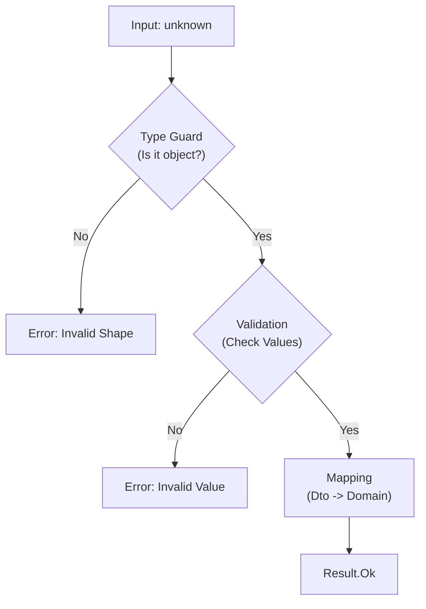

# 第37章：Adapter ② TypeScriptの王道：マッピング関数＋型ガード🧩

外部APIのレスポンスって、だいたい「そのままでは使いづらい形」になりがちです😵‍💫
この章では、**マッピング関数（変換）＋型ガード（安全確認）**で、外部データを“安心して使える”形に整えるやり方を身につけます💪🌸

---

## 1. 今日のゴール🎯

* 外部から来た `unknown` データを、**安全にドメイン型へ変換**できる🛡️
* 欠損・型違い・変な値を **「正しく失敗」**させられる🚫✅
* 変換ロジックを **1か所に集約**して、アプリの中を汚さない🧼✨

型ガードの基本は TypeScript 公式でも「実行時チェックで型を保証して、スコープ内を安全にする」と説明されています。([TypeScript][1])

---

## 2. まず前提：外部データは `unknown` から始める🧊📦

`fetch().json()` の戻りは「何が来るかわからない」ので、気持ちとしては `unknown` です😇
ここを雑に `as` で決め打ちすると、事故りやすいです💥（欠損や型違いがそのまま通る）


---

## 3. 題材：外部DTO → 内部ドメインへ変換☕➡️☕

## 外部DTO（例：外部APIから来る注文）

* `snake_case`
* 金額が `"1200"` みたいに **文字列**
* 日付が **ISO文字列**

## 内部ドメイン（アプリ内で使いたい注文）

* `camelCase`
* 金額は **number**
* 日付は **Date**
* ついでに **正規化**（空文字、null、範囲外など）

---

## 4. 実装の全体像🗺️✨

やることはシンプルにこの3段階です！

1. **型ガード**で「最低限この形っぽい」をチェック🧷
2. **変換（マッピング）**してドメイン型を作る🧩
3. 失敗は **Result** で返す（例外にしない）🧯



---

## 5. 最小コード：型・Result・型ガード・マッピング関数🧁

```ts
// ===== Result（Chapter15の流れを使う想定の最小版） =====
type Ok<T> = { ok: true; value: T };
type Err<E> = { ok: false; error: E };
type Result<T, E> = Ok<T> | Err<E>;

const ok = <T>(value: T): Ok<T> => ({ ok: true, value });
const err = <E>(error: E): Err<E> => ({ ok: false, error });

// ===== ドメイン（内部で使いたい型） =====
type OrderId = string;

type OrderLine = {
  sku: string;
  qty: number;        // 1以上
  unitPrice: number;  // 0以上（円）
};

type DomainOrder = {
  id: OrderId;
  lines: OrderLine[];
  createdAt: Date;
  total: number; // linesから計算してもOK（ここでは受け取らず計算する例）
};

// ===== 外部DTO（来るかもしれない形） =====
type ExternalOrderDto = {
  order_id: unknown;
  items: unknown;
  created_at: unknown;
};

// 外部エラー（Adapterの責務：原因が分かる形にする）
type AdapterError =
  | { type: "invalid_shape"; message: string }
  | { type: "invalid_value"; message: string; path?: string };

// ===== 小さなユーティリティ（オレオレクラスじゃなく関数で） =====
const isRecord = (v: unknown): v is Record<string, unknown> =>
  typeof v === "object" && v !== null;

const isString = (v: unknown): v is string => typeof v === "string";
const isNumber = (v: unknown): v is number => typeof v === "number" && Number.isFinite(v);

const toNonEmptyString = (v: unknown): Result<string, AdapterError> => {
  if (!isString(v)) return err({ type: "invalid_value", message: "string expected" });
  const s = v.trim();
  if (!s) return err({ type: "invalid_value", message: "non-empty string expected" });
  return ok(s);
};

const toNonNegativeInt = (v: unknown, path: string): Result<number, AdapterError> => {
  if (!isNumber(v)) return err({ type: "invalid_value", message: "number expected", path });
  const n = Math.trunc(v);
  if (n !== v) return err({ type: "invalid_value", message: "integer expected", path });
  if (n < 0) return err({ type: "invalid_value", message: "non-negative expected", path });
  return ok(n);
};

const toNonNegativeNumberFromString = (v: unknown, path: string): Result<number, AdapterError> => {
  if (!isString(v)) return err({ type: "invalid_value", message: "string price expected", path });
  const n = Number(v);
  if (!Number.isFinite(n)) return err({ type: "invalid_value", message: "price not a number", path });
  if (n < 0) return err({ type: "invalid_value", message: "price must be >= 0", path });
  return ok(n);
};

const toDateFromIsoString = (v: unknown, path: string): Result<Date, AdapterError> => {
  if (!isString(v)) return err({ type: "invalid_value", message: "date string expected", path });
  const d = new Date(v);
  if (Number.isNaN(d.getTime())) return err({ type: "invalid_value", message: "invalid date", path });
  return ok(d);
};

// ===== 型ガード（形だけチェック）=====
// 「外部DTOっぽい」ことだけをチェック。細かい値チェックは変換側でやるのがコツ👍
const isExternalOrderDto = (v: unknown): v is ExternalOrderDto => {
  if (!isRecord(v)) return false;
  return "order_id" in v && "items" in v && "created_at" in v;
};

// ===== マッピング関数（Adapter本体）=====
// 外部DTO（unknown） -> DomainOrder（安全）
// 失敗は Result で返す（adapterで曖昧に通さない！）
export const toDomainOrder = (input: unknown): Result<DomainOrder, AdapterError> => {
  if (!isExternalOrderDto(input)) {
    return err({ type: "invalid_shape", message: "order dto shape is invalid" });
  }

  // id
  const idR = toNonEmptyString(input.order_id);
  if (!idR.ok) return err({ ...idR.error, path: "order_id" });

  // createdAt
  const createdAtR = toDateFromIsoString(input.created_at, "created_at");
  if (!createdAtR.ok) return createdAtR;

  // items
  if (!Array.isArray(input.items)) {
    return err({ type: "invalid_value", message: "items must be array", path: "items" });
  }

  const lines: OrderLine[] = [];
  for (let i = 0; i < input.items.length; i++) {
    const it = input.items[i];
    if (!isRecord(it)) {
      return err({ type: "invalid_value", message: "item must be object", path: `items[${i}]` });
    }

    const skuR = toNonEmptyString(it["sku"]);
    if (!skuR.ok) return err({ ...skuR.error, path: `items[${i}].sku` });

    const qtyR = toNonNegativeInt(it["qty"], `items[${i}].qty`);
    if (!qtyR.ok) return qtyR;
    if (qtyR.value < 1) {
      return err({ type: "invalid_value", message: "qty must be >= 1", path: `items[${i}].qty` });
    }

    const unitPriceR = toNonNegativeNumberFromString(it["unit_price"], `items[${i}].unit_price`);
    if (!unitPriceR.ok) return unitPriceR;

    lines.push({ sku: skuR.value, qty: qtyR.value, unitPrice: unitPriceR.value });
  }

  // totalは「ドメイン側のルール」で計算（外部のtotalを信用しないのが安全☺️）
  const total = lines.reduce((sum, l) => sum + l.qty * l.unitPrice, 0);

  return ok({
    id: idR.value,
    lines,
    createdAt: createdAtR.value,
    total,
  });
};
```

---

## 6. ここが“TypeScript流の王道”ポイント💡✨

## ✅ (1) 型ガードは「形」まで（値は変換で見る）🧩

TypeScriptの型ガード（type predicate）は、**true/falseで型を絞り込む**仕組みです。([TypeScript][1])
だから `isExternalOrderDto` は「キーがある」程度に留めて、**値の正規化や検証は `toDomainOrder` 側**へ寄せると、読みやすくなります📚✨

## ✅ (2) `as` は最終手段（なるべく使わない）🚫

`as ExternalOrderDto` は「確認してないのにOK扱い」になりやすいので、Adapter章では封印が安定です🙅‍♀️

## ✅ (3) “正しく失敗”させる（曖昧に通さない）🧯

Adapterは「外の汚れを中へ持ち込まない掃除係🧼」
だから「ちょっと変だけど通しちゃえ😇」が一番ダメです💥

## ✅ (4) 最近のTypeScriptは絞り込みが賢い（でも `unknown` は別）🧠

TypeScriptは近年、型の絞り込みや型述語の推論が強化されています。([Microsoft for Developers][2])
ただし `unknown` を相手にするときは、**自分で実行時チェックが必要**なのは変わりません🙌

---

## 7. ハンズオン🛠️：変な入力を投げてみよう🎯

## (A) 正常データ✅

```ts
const dtoOk = {
  order_id: "A-100",
  created_at: "2026-02-04T12:34:56.000Z",
  items: [
    { sku: "coffee", qty: 2, unit_price: "480" },
    { sku: "cake", qty: 1, unit_price: "650" },
  ],
};

const r1 = toDomainOrder(dtoOk);
if (r1.ok) {
  console.log(r1.value.total); // 1610
}
```

## (B) ありがち事故：`unit_price` が `"free"`😇

```ts
const dtoBad = {
  order_id: "A-101",
  created_at: "2026-02-04T12:34:56.000Z",
  items: [{ sku: "coffee", qty: 1, unit_price: "free" }],
};

const r2 = toDomainOrder(dtoBad);
if (!r2.ok) {
  console.log(r2.error.type, r2.error.message, r2.error.path);
  // invalid_value price not a number items[0].unit_price
}
```

---

## 8. テスト（最小）🧪✨

「Adapterはテストが超やりやすい」です💖（入力→出力がはっきりしてるから）

```ts
import { describe, it, expect } from "vitest";
import { toDomainOrder } from "./adapter";

describe("toDomainOrder", () => {
  it("valid dto -> ok", () => {
    const dto = {
      order_id: "A-100",
      created_at: "2026-02-04T12:34:56.000Z",
      items: [{ sku: "coffee", qty: 2, unit_price: "480" }],
    };

    const r = toDomainOrder(dto);
    expect(r.ok).toBe(true);
    if (r.ok) {
      expect(r.value.total).toBe(960);
      expect(r.value.createdAt).toBeInstanceOf(Date);
    }
  });

  it("invalid price -> err with path", () => {
    const dto = {
      order_id: "A-101",
      created_at: "2026-02-04T12:34:56.000Z",
      items: [{ sku: "coffee", qty: 1, unit_price: "free" }],
    };

    const r = toDomainOrder(dto);
    expect(r.ok).toBe(false);
    if (!r.ok) {
      expect(r.error.type).toBe("invalid_value");
      expect(r.error.path).toBe("items[0].unit_price");
    }
  });
});
```

---

## 9. よくある落とし穴まとめ⚠️🧠

## ❌ 落とし穴1：`typeof v === "object"` だけで安心しない

`null` も object 判定です😇
なので `v !== null` は必須！

## ❌ 落とし穴2：外部の `total` を信用する

改ざん・仕様変更・小数・通貨…いろんな地雷があるので、**ドメインで再計算**が安全です🧨

## ❌ 落とし穴3：Adapterが業務判断までやり始める

Adapterは「変換・正規化・検証」まで。
「会員なら割引」みたいな判断はドメインの責務です✋😌

---

## 10. もっと堅牢にしたい人へ：スキーマ検証（Zod/Valibot）🧾✨

手書き型ガードは小規模なら十分ですが、項目が増えるとしんどくなりがちです😵‍💫
そのときは **スキーマ検証ライブラリ**が定番です。

* **Zod**：TypeScript-first の検証ライブラリ。`parse` で検証＋型が手に入ります。([Zod][3])
* **Valibot**：軽量・モジュラー志向のスキーマ検証。([Valibot][4])

「DTOの形チェック」をスキーマに寄せると、Adapterがさらに読みやすくなります📚✨
（ただし学習の最初は、まず手書きで仕組みを理解するのが◎です🧠💖）

---

## 11. AIプロンプト例🤖💬（コピペOK）

```text
次の「外部DTO → 内部ドメイン」変換を、TypeScriptでマッピング関数＋型ガードで実装して。
条件:
- 入力は unknown
- 失敗は Result で返す（例外にしない）
- Adapterの責務は「変換・正規化・検証」まで（業務判断は入れない）
- 変な値のときは error.path を付ける
DTO:
{ order_id, created_at, items: [{ sku, qty, unit_price }] }
ドメイン:
{ id, createdAt: Date, lines, total }
```

---

## 12. まとめ✅🎉

* Adapter ②は **「マッピング関数＋型ガード」** が王道🧩✨
* 外部入力は `unknown` から始めて、**実行時チェック**で守る🛡️
* Adapterは境界の掃除係🧼：**中のコードを綺麗に保つ**のが勝ち🌸

次の章（第38章）では、Adapterを「境界を守る掃除係」として運用していく時のチェックリスト化（命名・単位・欠損・正規化）をまとめます🧼✨

[1]: https://www.typescriptlang.org/docs/handbook/advanced-types.html?utm_source=chatgpt.com "Documentation - Advanced Types"
[2]: https://devblogs.microsoft.com/typescript/announcing-typescript-5-5/?utm_source=chatgpt.com "Announcing TypeScript 5.5"
[3]: https://zod.dev/?utm_source=chatgpt.com "Zod: Intro"
[4]: https://valibot.dev/?utm_source=chatgpt.com "Valibot: The modular and type safe schema library"
